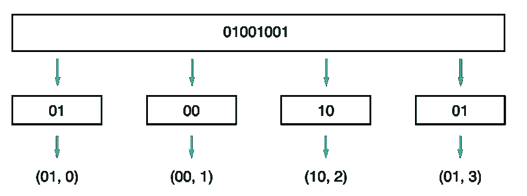
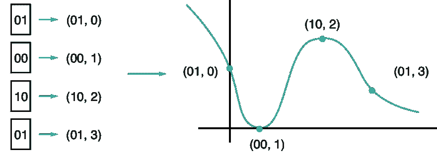

# 纠错码和里德-所罗门

> 原文:[https://dev . to/roper zh/error-correcting-codes-and-reed-Solomon-2nk](https://dev.to/roperzh/error-correcting-codes-and-reed-solomon-2nk)

*本帖最初发表于[monades.roperzh.com](https://monades.roperzh.com/error-correction-reed-solomon/)T3】*

传输数字数据会有丢失部分数据的风险，就像图片容易被划伤或声音容易受到噪声影响一样，数字信息容易出错，尽管这种风险可以任意降低，但它始终存在。

本文探讨了纠错码(用于减少数据丢失的方法之一)以及一种用于纠错的特定算法(称为 Reed-Solomon)。

解释只集中在高层次的概念上，把大部分的数学知识放在一边。

## 纠错码

纠错码帮助消息的接收者检测和纠正损坏的数据。但是怎么做呢？

基本思想是在原始数据中添加额外的比特(称为冗余或奇偶校验)，这有助于接收器检测错误并从中恢复。对数据进行纠错编码并不意味着可以*总是*恢复，而是增加了一层额外的安全保障。

[T2】](https://res.cloudinary.com/practicaldev/image/fetch/s--k2A1fVhb--/c_limit%2Cf_auto%2Cfl_progressive%2Cq_auto%2Cw_880/https://user-images.githubusercontent.com/4419992/31954501-274e22aa-b8bc-11e7-8e7d-e6c89fb18c72.png)

最简单的方法之一就是重复:将原始数据追加三次或更多次。接收器可以比较这些数据并纠正错误。在这种特殊情况下，重复的数据越多，发现和纠正错误的机会就越多。

重复数据的方法虽然简单，但效率不高。在处理这类问题时要记住的一点是，在计算中(就像在生活中一样)，一切都是关于妥协，你需要找到一种代码，在你发送的数据量、你可以检测/纠正的错误数和生成奇偶校验位所需的计算能力之间取得平衡。正如您所看到的，虽然基本思想并不复杂，但是当定义要添加的额外数据时，问题就变得棘手了。

## 输入里德-所罗门

这种在数据中增加冗余的想法打开了一扇大门，让人们可以用不同的方法来计算数据。Reed-Solomon(简称 RS)是一种特别流行的纠错码:CD、DVD、蓝光光盘、QR 码，甚至卫星都使用它。

RS 码变得流行是因为它们相对容易编码/解码，并且功能强大。让您大致了解一下，与上述三路复制相比，典型的 RS 配置提供了更好的数据持久性和更高的存储效率，并且*的开销要少得多。*

### 里德-所罗门背后的理念

*注意:生成 RS 码的过程中涉及到大量的数学运算，但本文只关注概念，读者可以从[建议的资源](#suggested-resources)中扩展实现细节。*

RS 的基本原理是数字数据用二进制数表示，因此你可以用算术方法处理它。

把要传输的数据想象成一个很长的二进制数，想象把这个数拆分成许多任意大小的数。比如你可以把数字`01001001`，拆分成四个组块:`01`、`00`、`10`、`01`。

现在，如果你给每个组块分配一个数字，代表它们在原始数字中出现的顺序，你会得到成对的:

[T2】](https://res.cloudinary.com/practicaldev/image/fetch/s--ZglxUfB_--/c_limit%2Cf_auto%2Cfl_progressive%2Cq_auto%2Cw_880/https://user-images.githubusercontent.com/4419992/31843564-2471342c-b5ca-11e7-91a2-8091209a31a8.png)

此时，重要的是你要完全理解刚刚发生了什么。数据被分割成小块，每一块都有一个索引。

神奇的事情就发生在这里:把这组配对想象成一个多项式的点，事实上，你可以用数学方法找到一个包含这些点的多项式！

[T2】](https://res.cloudinary.com/practicaldev/image/fetch/s--YCSA04xf--/c_limit%2Cf_auto%2Cfl_progressive%2Cq_auto%2Cw_880/https://user-images.githubusercontent.com/4419992/31843565-25a3f1e0-b5ca-11e7-967a-eed6075a2149.png)

因为您有一个多项式，所以您能够计算它的任意数量的点，并将这些点存储为冗余数据。然后，如果原始数据点丢失/损坏，客户端可以使用这些额外的数据点来重建多项式，并获得原始数据！

当在实际代码中实现它们时，事情会变得复杂得多，但这是基本概念。

基于此，您可以考虑两个影响恢复/检测错误能力的变量。

**分割原始数据的区块数**

随着数据块数量的增加，您会得到一个更好地表示数据的多项式，这需要更多的计算来编码/解码数据。

**您储存的额外点数**

存储的点数越多，可以纠正的错误就越多，但这也带来了传输大量数据的成本。

## 建议的资源

如果你感兴趣，还有很多关于错误代码和 Reed-Solomon 的知识需要学习，这里有一些我认为有用的资源:

*   代码:如何保护你的数据
*   里德-所罗门公司简介 -杰夫·温德林
*   里德-所罗门码 -马丁·赖利和伊恩·理查森
*   工程 CS144 第 7-4 单元 -斯坦福大学
*   里德-所罗门码简介