# 更少的重复，更多的动态编程

> 原文:[https://dev . to/vaidehijoshi/less-repetition-more-dynamic-programming-fl](https://dev.to/vaidehijoshi/less-repetition-more-dynamic-programming-fl)

<figure>[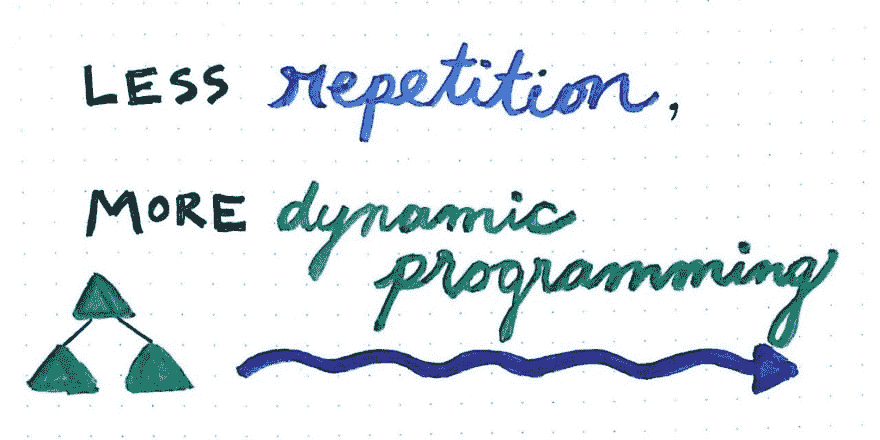](https://res.cloudinary.com/practicaldev/image/fetch/s--zeAaBJEn--/c_limit%2Cf_auto%2Cfl_progressive%2Cq_auto%2Cw_880/https://cdn-images-1.medium.com/max/1024/1%2AY1IuqrkoDWLlfz_BSaesGQ.jpeg) 

<figcaption>少重复，多动态编程！</figcaption>

</figure>

贯穿本系列的一个主题是让大型复杂的问题变得更加容易解决，这些问题起初看起来可能非常可怕。如果我们真的想了解它，这就是整个系列的使命，真的:让计算机科学的复杂性看起来有趣、友好，从而更加平易近人！

但是，即使在微观层面上，我们已经用许多方法为我们所涉及的每个主题做了这件事。我们剖析了复杂的数据结构，如[栈](https://medium.com/basecs/stacks-and-overflows-dbcf7854dc67)和[队列](https://medium.com/basecs/to-queue-or-not-to-queue-2653bcde5b04)，并把它们分解成它们的[更小的活动部分](https://medium.com/basecs/whats-a-linked-list-anyway-part-1-d8b7e6508b9d)。我们通过理解并缓慢而系统地构建这些大算法所基于的小部分,逐步发展到复杂的算法。

你猜怎么着？这种技术远非独一无二。事实上，这可能是计算机科学领域中最常用的解决问题的方法之一！将一个问题分解成更小、更容易理解的部分是计算机科学家和程序员几十年来一直在做的事情。这种方法屡试不爽，被反复证明是正确的。它是如此的平凡以至于它有了自己的名字:*动态编程*。即使您以前从未听说过这个术语，您也很有可能使用过动态编程，或者已经对其核心概念有所了解。

就我们的目的而言，在算法设计的背景下理解动态编程特别有用。在这个系列的过程中，我们已经处理了大量的算法，从[排序算法](https://medium.com/basecs/sorting-out-the-basics-behind-sorting-algorithms-b0a032873add)，到[遍历算法](https://dev.to/vaidehijoshi/going-broad-in-a-graph-bfs-traversal)，到[寻路算法](https://dev.to/vaidehijoshi/finding-the-shortest-path-with-a-little-help-from-dijkstra-cmi)。然而，我们还没有真正讨论这些算法是如何被*构造*的。不要担心——今天一切都变了。现在是时候让我们戴上设计师的帽子，利用动态编程的原理，深入到设计算法的微妙复杂性中去了。

我们开始吧！

### 算法设计的范式

术语动态编程(缩写为“DP”)听起来比实际情况更吓人。我认为这很大程度上与它的名字有关，至少对我来说,*听起来真的很复杂。但是我们稍后会回到这个名字。让我们从一个定义开始，以便让我们理解“动态编程”到底是什么意思。*

思考动态编程的一个有用的方法是记住它总是与 ***优化*** 联系在一起，这是一个算法应该在任何给定时间选择最佳可能元素的想法，不管它是排序、搜索、遍历结构还是寻找路径。因为动态编程植根于优化，所以这个术语可以与术语 ***动态优化*** 互换。

<figure>[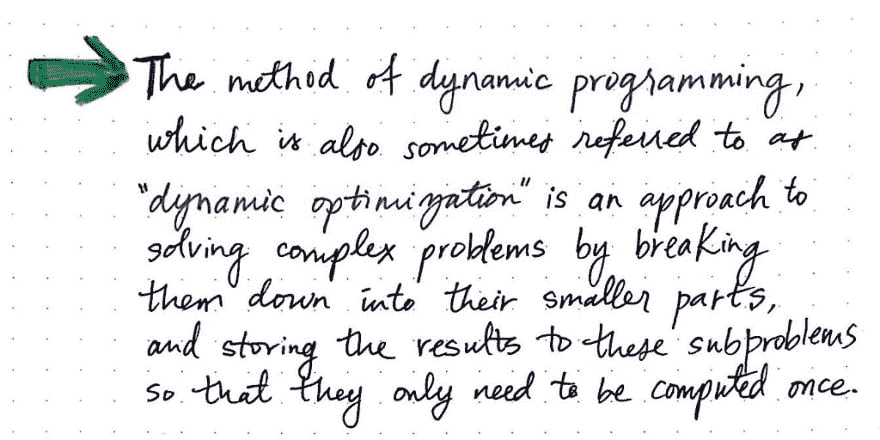](https://res.cloudinary.com/practicaldev/image/fetch/s--uZFE2fBC--/c_limit%2Cf_auto%2Cfl_progressive%2Cq_auto%2Cw_880/https://cdn-images-1.medium.com/max/1024/1%2AJNku-HwwDHeeh4GFrSIjRA.jpeg) 

<figcaption>动态编程:一个定义</figcaption>

</figure>

但是动态编程或动态优化与优化算法到底有什么联系呢？换句话说，这种形式的算法设计对优化一个算法有什么作用？

嗯，在一天结束的时候，一个 ***动态编程算法*** 通过把一个复杂的问题分解成更小的部分来解决它。在 DP 算法将一个问题分解成更小的部分后，它在计算一次后将结果存储到这些子问题中。

这个定义可能一开始听起来非常模糊不清，但是我保证如果我们将它与其他算法设计范例进行比较，它将变得更有意义！

在本系列中，我们已经看到了两种设计算法的方法。其中一个我们知道名字的:分治算法***。当我们第一次被介绍到[合并排序算法](https://medium.com/basecs/making-sense-of-merge-sort-part-1-49649a143478)的时候，我们已经学习了分治法。我们还记得，divide&convert 算法将一个问题分成更简单的版本，然后将它在更小的子问题上使用的解决方案应用到更大的问题上。如果我们回想一下我们学习[合并排序](https://medium.com/basecs/making-sense-of-merge-sort-part-2-be8706453209)的时候，我们会记得该算法是如何将子问题的答案组合在一起，并在排序时使用递归将元素合并在一起的。这也是 d & c 算法的一个特点。***

但是我们对算法设计的了解并不仅限于分治法。上周，我们学习了 [Dijkstra 的算法](https://dev.to/vaidehijoshi/finding-the-shortest-path-with-a-little-help-from-dijkstra-cmi)，它在搜索两个顶点之间的最佳最短路径时选择最佳顶点进行访问。事实证明，Dijkstra 的算法是一个不同算法设计范例的例子:*贪婪算法*。

像 Dijkstra 算法这样的算法被认为是 ***贪婪算法*** 因为它们选择了当下可能的最佳选项，也就是通常所说的“贪婪选择”。贪婪算法在局部水平上做出最佳选择——也就是说，在每个阶段做出最有效的选择，乐观地希望，如果他们在每个点都选择了最佳选项，最终，他们会到达“全局最佳选择”。

> 贪婪算法在这一时刻做出最佳选择，然后解决由他们做出的选择而产生的任何子问题。将“贪婪选择”作为算法的一个后果是，算法选择了它能选择的最佳选项，并且永远不会回头重新考虑它的选择。最终，这意味着贪婪算法可以很好地找到一个实际上不是最优选择的解决方案！

Dijkstra 算法是贪婪算法的一个典型例子，因为它根据每一步存储的结果选择下一个要访问的顶点。我们将从上周深入 Dijkstra 算法的[中回忆起，该算法基于每个顶点的边权重来查看哪个顶点具有最短的*当前已知的*路径，然后接下来访问该顶点。](https://dev.to/vaidehijoshi/finding-the-shortest-path-with-a-little-help-from-dijkstra-cmi)

<figure>[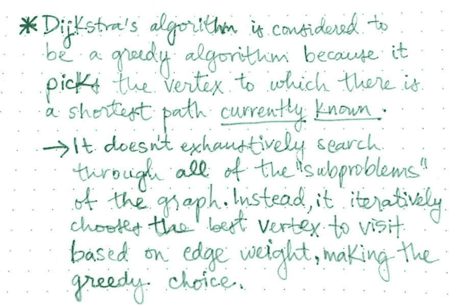](https://res.cloudinary.com/practicaldev/image/fetch/s--RiQ0oGdZ--/c_limit%2Cf_auto%2Cfl_progressive%2Cq_auto%2Cw_880/https://cdn-images-1.medium.com/max/1024/1%2A7CqabkxWsGCTx0O-dT19Lg.jpeg) 

<figcaption>Dijkstra 的算法被认为是——贪心！</figcaption>

</figure>

Dijkstra 的算法从不搜索所有的路径。它的搜索并不详尽；一旦做出选择，它不会重新考虑它的选择，这意味着它不会搜索所有“它选择不访问的顶点的子问题”。这有时会导致问题，因为如果算法在早期阶段找到具有最短路径的顶点，然后继续沿着访问其邻居的路径前进，则很可能找不到最佳路径。

<figure>[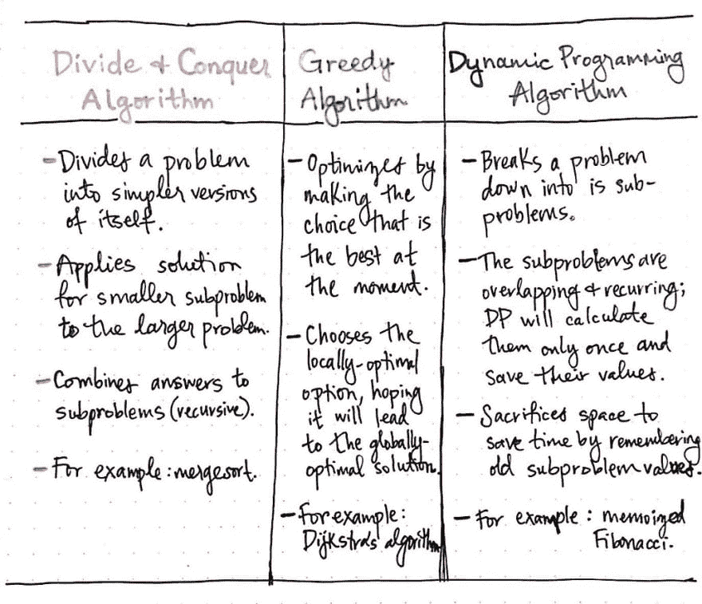](https://res.cloudinary.com/practicaldev/image/fetch/s--9vXUxbML--/c_limit%2Cf_auto%2Cfl_progressive%2Cq_auto%2Cw_880/https://cdn-images-1.medium.com/max/1024/1%2A7K58T11lmYsr1lCbWZwAxw.jpeg) 

<figcaption>算法设计的不同范式和方法。</figcaption>

</figure>

好的，我们有*分治*算法，我们有*贪婪*算法。但是，让我们回到手头的问题:理解*动态编程*算法与这两个相比如何！

如果我们将这三种形式的算法设计相互比较，我们将开始看到 DP 算法和它的两个对应物之间有一些明显的相似之处(以及一些明显的不同之处)。

看一下上面的表格，我们可以看到 DP 算法在一个明显的方面类似于分治法:它们都涉及到将一个大问题分解成更小、更简单的子问题。

<figure>[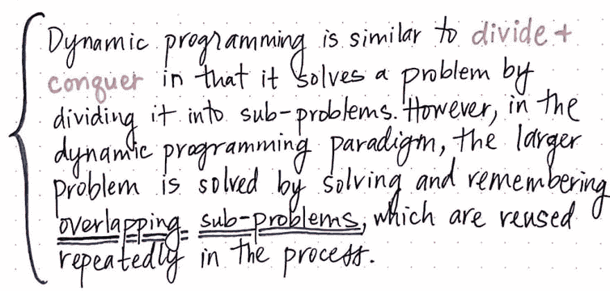](https://res.cloudinary.com/practicaldev/image/fetch/s--kn3wCDEL--/c_limit%2Cf_auto%2Cfl_progressive%2Cq_auto%2Cw_880/https://cdn-images-1.medium.com/max/1024/1%2An1OiJAzmWqC_Rh-S_LT5Bw.jpeg) 

<figcaption>动态编程比喻分而治之。</figcaption>

</figure>

然而，我们也将看到动态编程方法和分治法之间的一个主要区别。在 DP 范式中，当我们将较大的问题分解成较小的部分时，这些子问题实际上是重叠的。

这是另一种思考方式:动态编程算法中的子问题是循环出现的，并且会重复出现。在动态规划方法中，通过解决和记住重叠的子问题来解决较大的问题。相反，重叠的子问题并不是分治法的必要条件。

那么，动态编程与贪婪算法范式相比如何呢？

<figure>[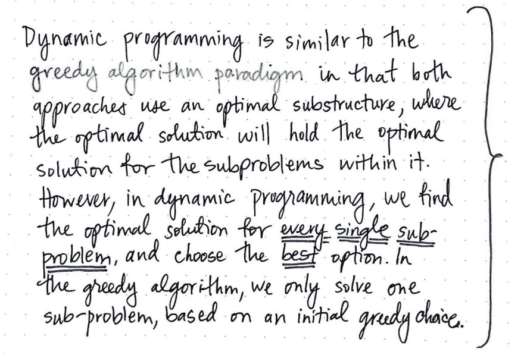](https://res.cloudinary.com/practicaldev/image/fetch/s--ikoEGzR4--/c_limit%2Cf_auto%2Cfl_progressive%2Cq_auto%2Cw_880/https://cdn-images-1.medium.com/max/1024/1%2Ae4oXyRfOtSA8xzpfN4yD4A.jpeg) 

<figcaption>将动态规划比喻为贪婪的算法范式。</figcaption>

</figure>

首先，两种方法都必须在两种算法运行的每个阶段做出选择(理想情况下是最优选择)。这通常被称为使用 ***最优子结构*** ，这是指算法找到的最优解将通过代理包含其中每个子问题的最优解。

然而，这两种范式都以截然不同的方式处理“做出最佳选择”的问题。

正如我们已经了解到的，贪婪算法首先做出贪婪的选择，然后在每个阶段继续做出最佳选择，设定自己只解决更大、更复杂问题中的一个子问题。动态编程非常不同；DP 范式为每个子问题找到最优解*，并从所有子问题中选择最佳选项。*

考虑动态编程算法与贪婪算法相比的一个更简单的方法是:

> DP 算法将彻底搜索所有可能的子问题，然后在此基础上选择最佳解决方案。贪婪算法只搜索一个子问题，这意味着它们的搜索不够彻底。

这给我们带来了一个重要的问题:动态编程算法究竟是如何完成如此广泛的搜索工作的？DP 算法如何准确地跟踪所有重叠的子问题？

该是我们调查的时候了。

### 记住记住

我们已经知道，动态编程类似于分而治之，因为它涉及子问题并将事情分解成更容易计算的部分。但是，我们也知道，DP 算法可以计算出现的每一个重叠的子问题——换句话说，如果存在许多子问题，它可以计算所有子问题，然后从一堆子问题中选出最好的一个作为最终解决方案。

> 计算各种子问题的所有解决方案(然后选择最佳方案)的诀窍是*记住以前的解决方案。*

让我们用一个简单的例子来说明我的意思。想象一下，我们必须解决 5 + 5 + 5 + 5 的问题。我们如何解决这个问题？嗯，我们只是把它们加起来，对吧？我们知道 5 + 5 + 5 + 5 = 20。完成了。

但是，如果我们在最后再加上 5 美元呢？5 + 5 + 5 + 5 + 5 = ?。精神上，我们会怎么做？我们会一个接一个，一次又一次地把每一个 5 相加吗？

<figure>[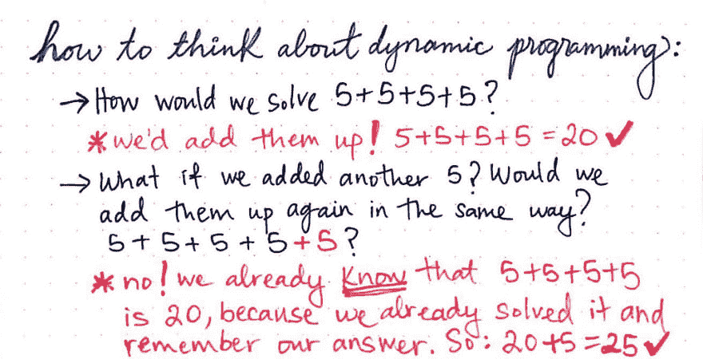](https://res.cloudinary.com/practicaldev/image/fetch/s--D0tzOSZh--/c_limit%2Cf_auto%2Cfl_progressive%2Cq_auto%2Cw_880/https://cdn-images-1.medium.com/max/1024/1%2AZ-7LZACVp_O9HcU0fYWnzA.jpeg) 

<figcaption>如何看待动态编程！</figcaption>

</figure>

不会吧！我们可能会对自己说，“哦，我刚刚算过了。我知道之前是 20，现在又多了 5，所以答案一定是 25！”。我们记得以前解决过的问题的解决方案，当我们不得不解决基于它的问题时，我们会再次使用它。

动态编程做的事情类似于我们刚刚在那个简单的数学问题中所做的。它 ***记得*** 它以前见过并解决过的子问题。当它再次看到相同的子问题——我们称之为 ***重叠子问题***——它知道它不需要多次重新计算工作。它只是从之前算出的解决方案中抽出来的！

<figure>[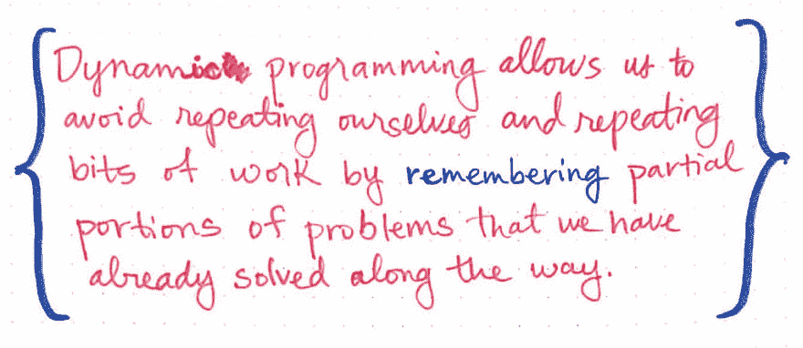](https://res.cloudinary.com/practicaldev/image/fetch/s--KDek6sST--/c_limit%2Cf_auto%2Cfl_progressive%2Cq_auto%2Cw_880/https://cdn-images-1.medium.com/max/1024/1%2AUiv1z3FSKhH0H46HPKqriA.jpeg) 

<figcaption>动态编程让我们避免重复自己。</figcaption>

</figure>

动态编程的力量在于它允许我们避免重复自己，从而通过记住我们已经解决的部分问题来避免重复工作。不重复自己的能力听起来很好，但实际操作起来真的很有帮助。有一个广为人知的例子，这个例子被反复使用来说明 DP 算法是多么强大，我们接下来就来看看这个例子。好消息是我们已经熟悉了这个著名的例子:它是我们亲爱的老朋友，[斐波那契数列](https://dev.to/vaidehijoshi/finding-fibonacci-in-golden-trees)！

我们将回忆起斐波那契数列，它与黄金分割率密切相关，是以 0 和 1 开始的数字序列。为了得到斐波纳契数列中的任何一个数字，我们需要找到这个数字前面的两个数字并求和。

<figure>[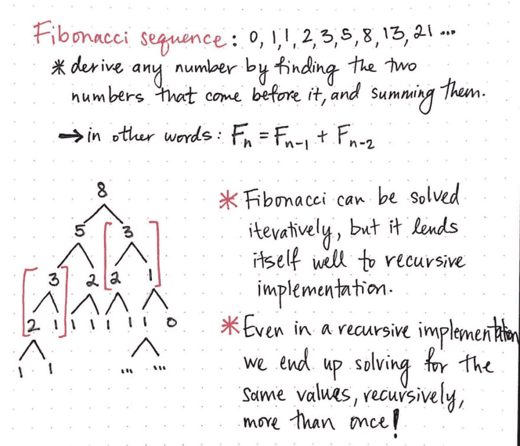](https://res.cloudinary.com/practicaldev/image/fetch/s--lgTRmM9P--/c_limit%2Cf_auto%2Cfl_progressive%2Cq_auto%2Cw_880/https://cdn-images-1.medium.com/max/1024/1%2AvQNNf_dvx5bvtG_4b5uMsA.jpeg) 

<figcaption>返回解决斐波那契问题</figcaption>

</figure>

例如，要找出 0，1，2，3，5 后面的数字，我们将对 3 + 5 求和，并知道下一个数字将是 8。定义在斐波纳契数列中寻找数字的公式的一种更抽象的方式是:F[n] = F[n-1] + F[n-2]，其中 n 表示斐波纳契数列的索引。基于这个公式，我们还知道斐波纳契数列可以递归求解，因为我们不可避免地会发现自己需要使用递归来找到斐波纳契数列中的前一个数字，如果我们还不知道它的话。

然而，看看上面举例说明的递归“值树”的例子，我们会注意到我们在重复自己。当递归求解斐波那契数 F[6]或第七个斐波那契数时，我们必须计算 F[5]和 F[4]。但是，为了计算 F[5]，我们需要再次求解 F[4]，再一次！

这里有一个同样的递归重复问题的例子，抽象出来。

<figure>[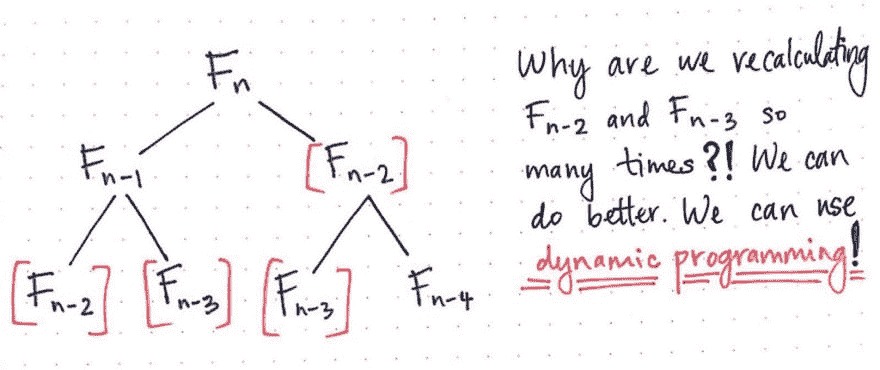](https://res.cloudinary.com/practicaldev/image/fetch/s--ScSTYhmA--/c_limit%2Cf_auto%2Cfl_progressive%2Cq_auto%2Cw_880/https://cdn-images-1.medium.com/max/1024/1%2Aco5kIv5ds-det9Px_8aW8A.jpeg) 

<figcaption>为什么我们要多次重新计算相同的值？</figcaption>

</figure>

当求解 F[n]时，n 是什么并不重要；如果我们使用递归，我们将不得不不止一次地重新计算斐波纳契数列的一部分。例如，在上面的树中，我们计算 F[n-3]两次，我们也计算 F[n-2]两次。这看起来超级低效，我们应该可以做得更好。

好消息是:我们可以！当然是使用动态编程。

我们知道动态编程让我们能够*记住*我们以前见过并解决过的问题的解决方案。斐波纳契数列的例子是一个很好的例子，当我们想要记住斐波纳契数列的解时，我们已经解决了！DP 算法如何记住它已经解决的问题的方法被称为 ***记忆*** 。

<figure>[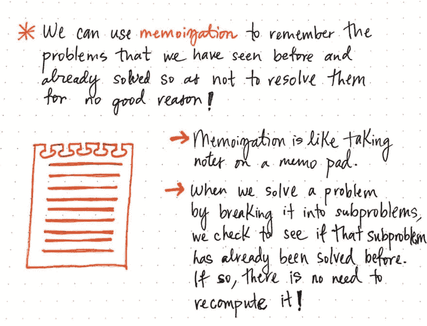](https://res.cloudinary.com/practicaldev/image/fetch/s--8spgjxD5--/c_limit%2Cf_auto%2Cfl_progressive%2Cq_auto%2Cw_880/https://cdn-images-1.medium.com/max/1024/1%2AG_hKjr5V1dX5GN0lyLTmDQ.jpeg) 

<figcaption>利用记忆来记住我们已经解决的问题！</figcaption>

</figure>

记忆很像在记事簿上记笔记:当我们遇到一个看起来很重要的问题时(即使它不重要)，我们写下它的答案并记下来，记住它。就像之前的 5 + 5 + 5 + 5 + 5 问题一样，如果我们以后遇到同样的问题，我们不需要重新计算所有的心算。我们已经解决了 80%的问题，因为我们可以重用我们以前的解决方案，并在此基础上构建，这比从头开始解决要容易得多！

> 记忆化允许我们只运行一次计算，然后不需要重新计算就可以重用它。

<figure>[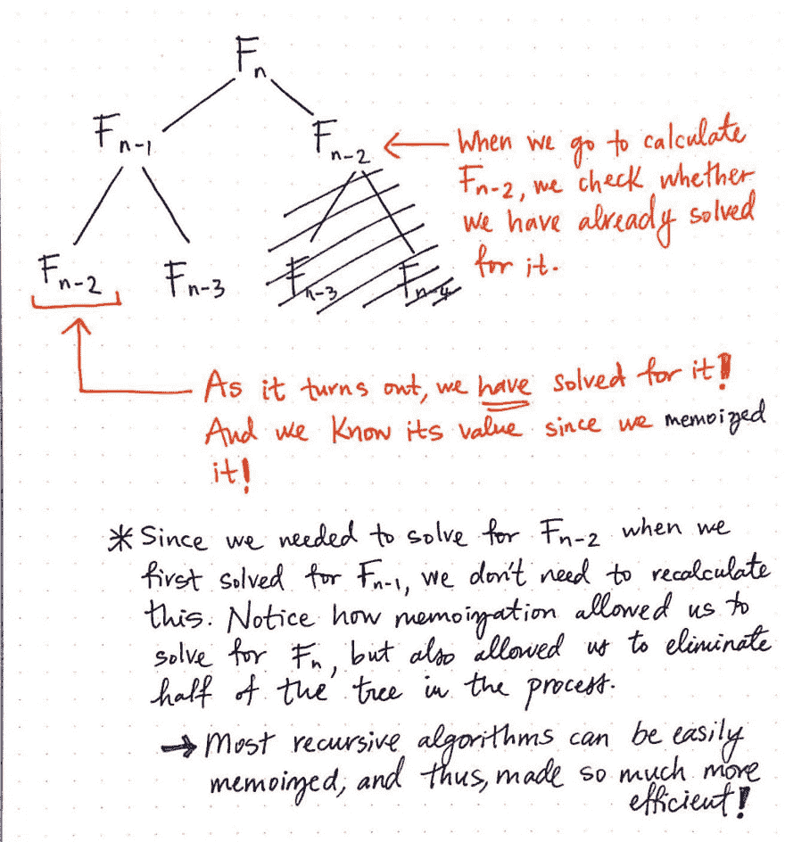](https://res.cloudinary.com/practicaldev/image/fetch/s--AKfaer7R--/c_limit%2Cf_auto%2Cfl_progressive%2Cq_auto%2Cw_880/https://cdn-images-1.medium.com/max/1024/1%2AkLRo_yTxgPLSEs4V4ILPYQ.jpeg) 

<figcaption>大多数递归算法很容易记忆。</figcaption>

</figure>

早先，在我们使用记忆化之前，我们需要一次又一次地计算多个子问题。然而，通过使用记忆化，我们可以完全消除不必要的工作。此处显示的插图举例说明了这一点。

现在，当求解 F[n]时，我们首先计算 F[n-1]。作为递归计算 F[n-1]的解的一部分，我们最终求解 F[n-2]和 F[n-3]。每次我们第一次为他们解答时，我们 ***记住*** 他们的解答。

接下来，我们需要求解出 F[n]的第二部分:F[n-2]。当我们去计算 F[n-2]的值时，我们会在实际算出它之前，检查一下我们是否已经求解过了。当我们第二次看到它的时候，我们知道我们已经解决了它，并且我们知道我们已经有了它的价值，因为我们在记忆它的解的时候记住了它。

记忆化允许我们消除一半的递归斐波纳契树，仅仅是因为我们记住了我们已经看到的子问题的解决方案！通常，递归算法，包括斐波那契算法，可以变成动态编程算法，使用记忆来提高优化和速度。

好了，现在我们知道了*动态规划算法如何设法找到最好的、最优的解决方案:它们解决了所有潜在的子问题。我们也知道*他们如何设法解决所有子问题:他们记住重叠的解决方案，并使用记忆来避免不必要的计算。但是使用记忆化的动态编程算法的效率有多高呢？**

让我们通过研究空间和时间的复杂性来回答这个问题。

### 记住所有的事情

在没有记忆的情况下，求解斐波那契数列中第 n 个值的算法的运行时间复杂度是……不是很好。

对于我们需要求解的索引为 n 的任何斐波那契数，我们需要对 n-1 和 n-2 的值递归调用相同的斐波那契算法。我们已经知道了一些数学知识。我们知道，如果两个量之间的比率，与两个量中较大的一个相比，与两个元素相加的比率相同，那么这两个量就有黄金比例。这两个内部算法时间 T(n-1)和时间 T(n-2)的组合运行时间最终总计为*φ*(*T5 或*T7)的任意 n 次方。**

<figure>[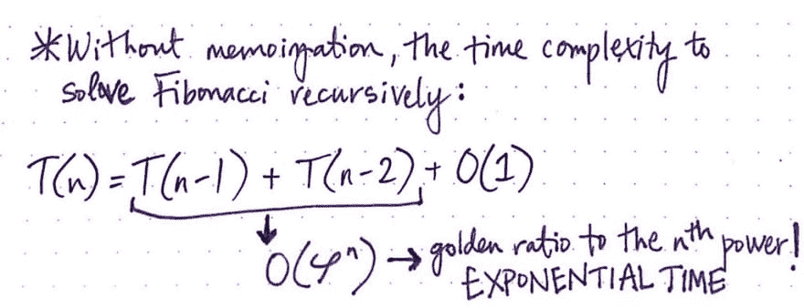](https://res.cloudinary.com/practicaldev/image/fetch/s--_THFSrnU--/c_limit%2Cf_auto%2Cfl_progressive%2Cq_auto%2Cw_880/https://cdn-images-1.medium.com/max/1024/1%2AM576x89Qyq3xQBWzh2yVZA.jpeg) 

<figcaption>递归求解斐波那契的时间复杂度，无需记忆。</figcaption>

</figure>

还有一些常数时间 O(1 ),涉及数字求和并返回正确的值，但这可以忽略不计。重要的是——响亮的红色警报应该在我们的脑海中响起——这里涉及到一个指数！我们运行时间的 n 次方黄金比例*不好。*实际上导致 ***指数运行时间*** ，或者 O(2^n)！我们总是想避免这种情况。

<figure>[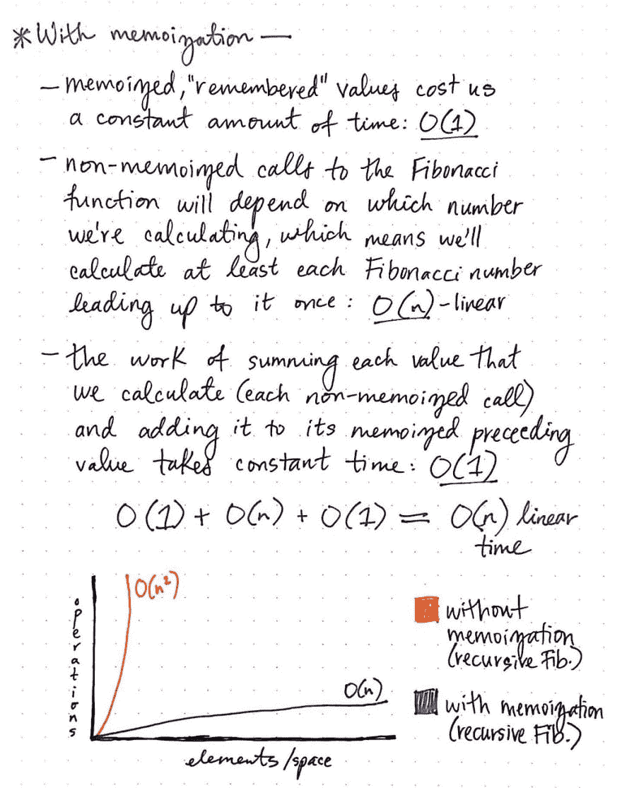](https://res.cloudinary.com/practicaldev/image/fetch/s--y6Tpl9ot--/c_limit%2Cf_auto%2Cfl_progressive%2Cq_auto%2Cw_880/https://cdn-images-1.medium.com/max/1024/1%2A0qBx2NAsplMp7lRZZwundQ.jpeg) 

<figcaption>记忆化求解斐波那契的时间复杂度。</figcaption>

</figure>

好的，如果没有记忆化，斐波那契的递归形式并不太好。

但是有了记忆的*呢？好吧，关于“记住”的、记忆的值的好处是，它们几乎不需要我们花费时间去实际查找我们可能存储的字典/散列/数组。换句话说，查找记忆值的实际成本花费我们 O(1)， ***常数*** 时间。*

然而，当我们第一次遇到子问题时，我们仍然需要先解决它，然后才能记住它。对斐波那契算法的非记忆调用将取决于 n 是多少。如果我们在寻找第 10 个元素，那么与寻找第 100 个元素相比，我们计算斐波那契数列的调用次数会少得多。因此，对每个非记忆元素第一次运行斐波那契算法的工作花费了 ***线性*** 、O(n)时间。

与该算法的非记忆版本类似，这里也有一些常数时间 O(1 ),涉及数字求和并返回正确的值，但这可以忽略不计。这导致 O(n) + O(1) + O(1)的运行时间，仍然等于 ***线性*** ，O(n)时间。

线性时间比指数时间好得多！对于一个小的动态编程算法来说还不错，是吧？

那么，就空间而言，记忆化版本的斐波那契与非记忆化版本相比如何呢？

> 鉴于斐波那契的记忆版本需要记住旧的子问题解决方案，为了节省时间，DP 范式牺牲了一些空间。

这是使用动态编程方法的权衡的一部分，取决于我们需要解决的子问题的数量以及我们用来*存储*这些子问题解决方案的数据结构的智能程度，牺牲空间换取时间通常会更好——特别是如果我们知道我们将需要查找许多斐波纳契值，并且知道我们以后会一次又一次地重复使用我们的旧解决方案。

<figure>[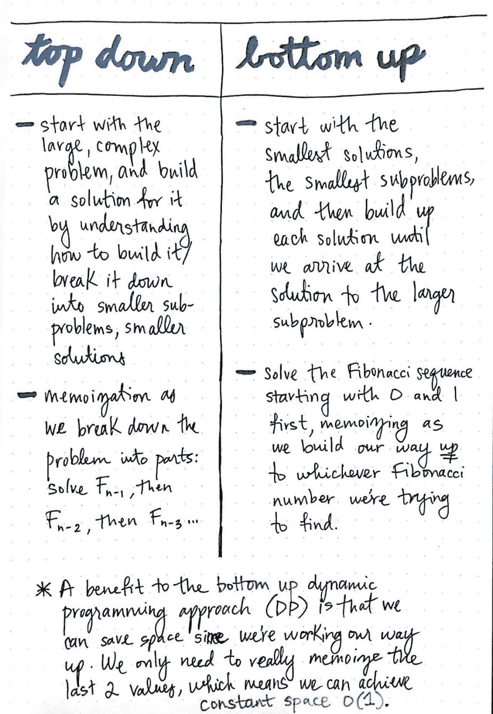](https://res.cloudinary.com/practicaldev/image/fetch/s---R5RHxc---/c_limit%2Cf_auto%2Cfl_progressive%2Cq_auto%2Cw_880/https://cdn-images-1.medium.com/max/1024/1%2AbaaFGzuQ88kx8b9EpNKoPA.jpeg) 

<figcaption>动态编程的两种方法。</figcaption>

</figure>

动态编程范式的强大之处不仅在于其效率，还在于其运行时的复杂性。然而，值得一提的是，有两种主要的动态规划算法；在这篇文章中，我们只讨论了其中的一个，但是很重要的一点是，要能舒服地识别和使用两者。

***自上而下的动态编程*** 范例是我们在斐波那契实验中使用的范例。在自顶向下的方法中，我们从复杂的大问题开始，并理解如何将它分解成更小的子问题，将问题记忆成各个部分。

另一种方法是 ***自下而上的动态规划*** 方法，这种方法从最小的可能子问题开始，找出它们的解决方案，然后慢慢建立自己来解决更大、更复杂的子问题。

在求解斐波那契数列的例子中，自底向上的技术包括我们求解斐波那契数列中的第一个元素，然后逐步向上，最终得到我们试图确定的第 n 个值的解。我们仍然会使用记忆化来帮助我们存储值——可以说，我们只是从“相反的一端”来解决问题。当我们第一次学习斐波那契时，自下而上的方法可能是对我们大多数人来说更舒服的方法。如果我们想一想，我们都从 0 开始计数斐波纳契，然后 1，1，然后 2，直到我们计数到我们想要的数字。

自底向上的动态编程算法有一个很大的好处，那就是:我们只需要记住最后两个值。因为我们知道我们是从上往下做，而不是从上往下做，所以我们不需要存储所有以前的值。在得到 n 的值之前，我们实际上只关心最后两个，这使得我们不再需要占用存储值空间的更大的数据结构。相反，我们可以只记住前两个值，这允许我们实现**_constant **，或 O(1)空间。

动态编程，即使有它所有的特质，一旦我们把它分解成可移动的部分，就不会太可怕了！

<figure> 

<figcaption>【理查德·贝尔曼】[维基媒体基金会](https://en.wikipedia.org/wiki/Richard_E._Bellman)</figcaption>

</figure>

我之前提到过“动态编程”这个名字让我感觉比实际情况更吓人。DP 的名字背后有一个有趣的事实:它实际上并不代表什么。

动态编程是由计算机科学家理查德·贝尔曼在 20 世纪 40 年代发明的，当时他正在一家名为兰德的公司从事数学研究。事实证明，兰德受雇于美国空军，这意味着他们经常要向国防部长查尔斯·欧文·威尔逊汇报。

在贝尔曼的自传*飓风之眼:自传*中，他解释了他是如何为这种算法设计范式命名的:

> [威尔逊]实际上对研究这个词有一种病态的恐惧和憎恨。我不会轻易使用这个术语；我正在精确地使用它。如果有人当着他的面用“研究”这个词，他的脸会涨红，会变得暴跳如雷……因此，我觉得我必须做点什么，不让威尔逊和空军知道我确实在兰德公司内部做数学研究。我能选择什么头衔，什么名字？首先，我对计划、决策和思考感兴趣。但是规划，由于种种原因，并不是一个好词。因此，我决定使用“编程”一词。我想让大家明白这是动态的，是多阶段的，是时变的。我想，一石二鸟吧。让我们用一个在经典物理意义上有绝对精确含义的词，即动态。作为一个形容词，它还有一个非常有趣的特性，那就是不能用贬义的方式来使用动态这个词。试着想出一些可能赋予它贬义的组合。不可能的。因此，我认为动态编程是一个好名字。这是连国会议员都不会反对的事情。所以我把它当成了我活动的雨伞。

这个故事的寓意是，如果真的有这样的东西，有时名字很恐怖的东西实际上可能只是因为名字好听才被命名的。所以，在我看来，听起来吓人的东西没什么可怕的！一定不要告诉查尔斯·欧文·威尔逊。

### 资源

动态编程是计算机科学中以难题形式出现的一个主题。一些计算机科学课程在早期介绍了它，然后再也没有真正回来讨论这种形式的算法设计。然而，动态编程背后的理论一次又一次地出现，通常是以最复杂的形式——有时甚至是无解的形式！“问题”。如果你有兴趣了解更多，这里有一些很好的资源可以帮助你开始学习。

1.  [动态规划——斐波那契，最短路径](https://www.youtube.com/watch?v=OQ5jsbhAv_M)，MITOpenCourseWare
2.  [算法:记忆化和动态编程](https://www.youtube.com/watch?v=P8Xa2BitN3I)，HackerRank
3.  [动态编程介绍](https://www.hackerearth.com/practice/algorithms/dynamic-programming/introduction-to-dynamic-programming-1/tutorial/)，黑客地球
4.  [动态编程](http://interactivepython.org/courselib/static/pythonds/Recursion/DynamicProgramming.html)，交互式 Python
5.  [动态规划(重叠子问题属性)](http://www.geeksforgeeks.org/dynamic-programming-set-1/)，GeeksForGeeks

* * *