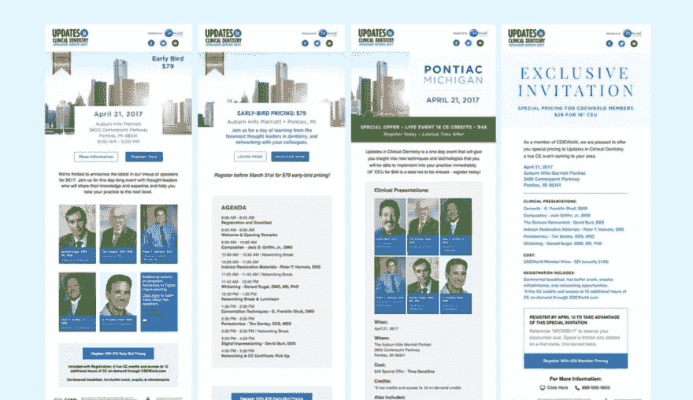
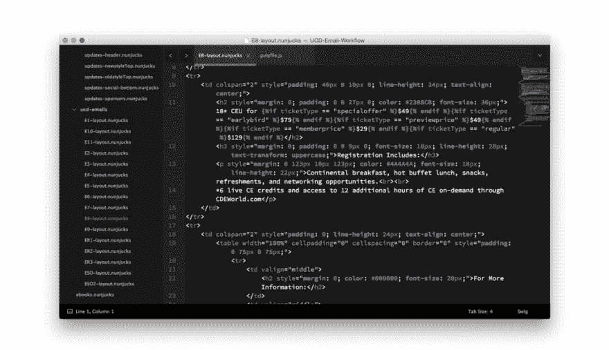
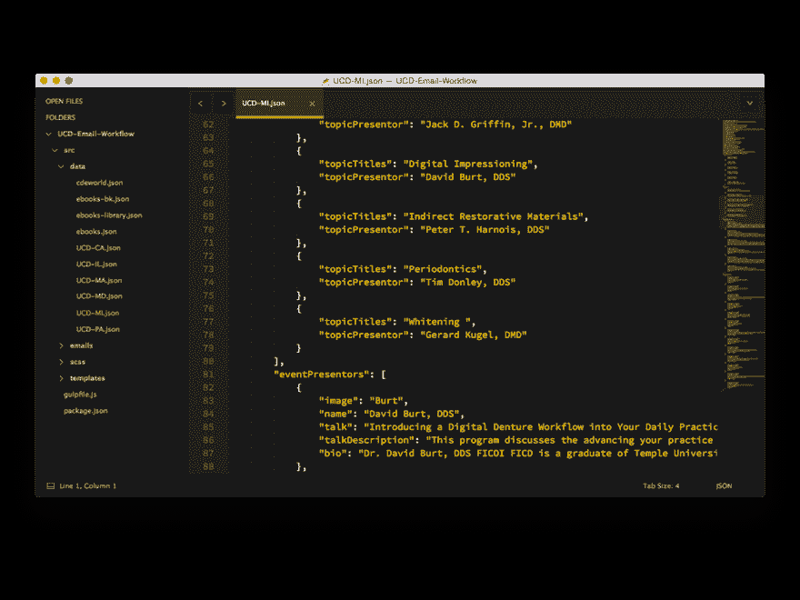

# 创建我自己的基于 Gulp 的电子邮件工作流系统

> 原文:[https://dev . to/tee katwo/creating-my-own-gulp-based-email-workflow-system-1h 22](https://dev.to/teekatwo/creating-my-own-gulp-based-email-workflow-system-1h22)

#### 我太想要模块化+动态内容了，所以我做了自己的系统。

[T2】](https://res.cloudinary.com/practicaldev/image/fetch/s--Qb9ZKvea--/c_limit%2Cf_auto%2Cfl_progressive%2Cq_auto%2Cw_880/https://cdn-images-1.medium.com/max/1024/1%2Af94McgIqNUwognsge7EXtg%402x.jpeg)

我是一个电子邮件狂热者，如果你愿意的话，可以称之为#电子邮件极客。我参加了 Litmus Live Boston 2016，听到人们发誓要通过模块化和使用数据驱动设计来拯救我们所有人。想要成为改变的一部分而不是问题，这让我想知道是否有一种基于吞咽的解决方案可以帮助我工作。大多数人在 Litmus 之类的东西中或者在他们自己的 ESP 中使用模块化功能。我的公司两者都没有，我们的 ESP 很糟糕，而且我们不用石蕊。为了保持电子邮件的可维护性、品牌性、无错误性和尽可能的可定制性，我需要让这个工作流程运行起来。

#### 寻找起点

我的想法是找到一些可以让我模板化我们的电子邮件的东西，为模板创建模块，使它们易于维护，帮助减少错误和增加一致性。我偶然发现了由 [ireade](https://github.com/ireade) 开发的用于构建 HTML 电子邮件的 Gulp 工作流，并发现这是一个完美的起点。删除 PostCSS 选项，忽略内联 CSS 的能力(由于时间限制，我不得不硬连接所有的模板)。它做了我想要它做的一切。

#### 使用模板系统

工作流使用 [Nunjucks](https://mozilla.github.io/nunjucks/) 进行模板化，这类似于 Swig/Twig/Dwoo，一种简单但功能强大的模板化语言。在此之前，我从未真正使用过，因为它需要使用 PHP，而我的知识又很匮乏。Nunjucks 使用一种简单的语言，没有 PHP，它很容易学习，如果你忘记的话，它是一个强大的文档。有了模板系统，为电子邮件创建模块变得更加容易、可控和干净。

它极大地帮助了变化，这是我们电子邮件的最大问题之一。当我复制粘贴过去的电子邮件，并不得不不断地从一组电子邮件到另一组电子邮件进行修改。我会忘记对哪封邮件做了什么更改，这就成了一个巨大的一致性问题。有些邮件没有“新”的变化，有些甚至有更多的变化。模板系统极大地减少了这些错误和不一致，并有助于记录各种变化。

[T2】](https://res.cloudinary.com/practicaldev/image/fetch/s--SMJ60zO8--/c_limit%2Cf_auto%2Cfl_progressive%2Cq_auto%2Cw_880/https://cdn-images-1.medium.com/max/1024/1%2AKI8oBsXL4SvwefYCyRO_5g%402x.jpeg)

#### 利用数据是真正的游戏规则改变者

这个系统最好的部分是使用 Gulp-data 合并数据文件。他们是。json 文件，可以在模板文件中命名和引用。就我个人而言，我专门为网站的主要内容创建了一个数据文件:徽标、主页链接、社交链接等。如果在所有的电子邮件中都可以找到，那就在这个文件里。现在，我再也不用编写页眉或页脚链接了，这增加了一致性，减少了错误。

在我的具体使用案例中，事件跨越不同的城市，使用相似但不同的信息。这对于减少错误、繁琐的任务和加快生产至关重要。我为每个城市创建了一个数据文件，其中包含演讲者主题、演讲者、他们的简历、演讲信息、议程时间、城市赞助商、酒店信息、城市信息以及活动的所有链接(不同的门票包)。这个文件将在需要时被调用到模板中，并帮助创建动态数据。当城市从一个模板改变到另一个模板时，所有引入这些数据的变量都会改变。没有不断地写入相同的数据，也没有可能看到它从一封电子邮件变成另一封电子邮件。当有一系列广泛的变化，如人事或议程，我在数据库中，不再担心它。像取消订阅这样的事情，它是数据文件的一部分，一旦被设置，就再也不需要被重新访问。

这种数据系统的唯一缺点是它的手工性质。这要求我也要维护数据以防变化。由于我无法控制变化，我不得不依靠人们更新我的变化或增加。由于需要某些东西，并且没有为它设置电子邮件，这确实需要对系统进行一些大的重写。如果对电子邮件的未来需求进行良好的规划和讨论，所有这些都是可以避免的。

[T2】](https://res.cloudinary.com/practicaldev/image/fetch/s--7ZQu2SkQ--/c_limit%2Cf_auto%2Cfl_progressive%2Cq_auto%2Cw_880/https://cdn-images-1.medium.com/max/1000/1%2AWoJ_9r5pnmlZ5RxdzGSMGg.png)

#### 创建变量以利用数据

使用数据文件，您可以获取信息并将它们作为变量保存在模板中。变量可以是任何东西，从酒店名称，有不同的变化，从短版本到长版本，到引用议程发言者、事件日期或位置。能够创建变量导致能够创建动态数据，这是基于根据变量验证信息。

您还可以在模板中构建条件，并将所有选项放入每个模板中。使用可变函数，您可以根据当前变量改变显示的数据。例如，价格和标签会根据正在进行的销售类型、早期或预览价格而变化。这包括不同价格的所有链接，并使用任何必要的措辞变化。

您还可以创建一些自定义变量，比如一个在一起编译时会在浏览器链接中创建视图的变量。它将从主电子邮件文件的变量中获取编译所需的所有信息。

#### 为下一步计划

对于第一次创作的试运行来说，它做得很好！当风格需要改变时，我需要在每个数据文件中进行更改以保持一致，这是一些值得注意的痛点。此外，在我不知情的情况下，我不得不更改我的数据以匹配当前事件。很多时候，我在没有数据的情况下运行，不得不将区域留空。这些不一定是系统故障，而是沟通错误和计划不周。最大的问题之一似乎围绕着创建、更改和维护数据。

为了真正一致和更容易的使用，下一步将是制作一个 GUI，并集成一个服务器系统和一个数据库。有了数据库和另一个人维护数据的方法，数据处理的责任就不会落到我身上。有了这些改变，我相信它们会缓解这些问题。从技术角度来看，要解决的主要问题是在不重启服务器的情况下刷新数据。目前我更改了数据，需要重启服务器。当对数据进行简单的修改并且不得不重启服务器时，这是很烦人的。对于非编码人员来说，这可能是一个潜在的障碍，问题多于帮助。

[Gulp 电子邮件工作流 Github](https://github.com/vpugh/Gulp-Email-Workflow)

还在更新回购协议。我让它在那里生根发芽了。

这对我来说还是新的，我正在努力养成多写的习惯。请在下面的评论或我的推特上分享你的想法。