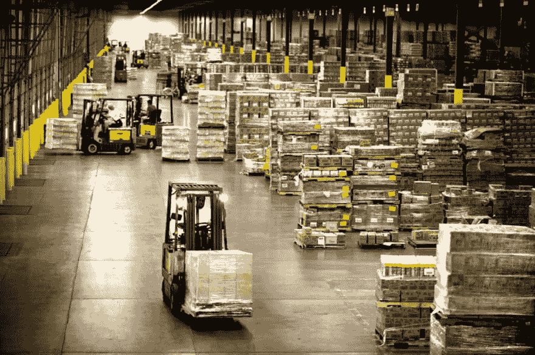
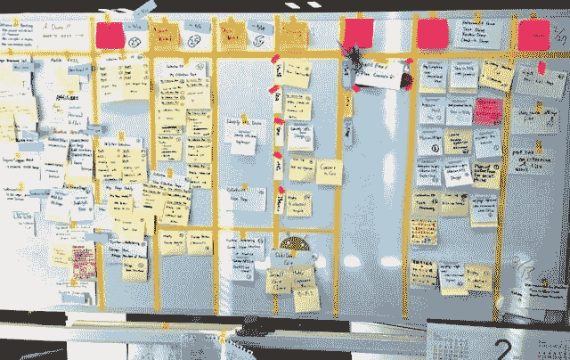

# 七大致命浪费:库存

> 原文:[https://dev.to/jezhalford/seven-deadly-wastes-inventory-296](https://dev.to/jezhalford/seven-deadly-wastes-inventory-296)

#### 走得更快:第 12 期

[T2】](https://res.cloudinary.com/practicaldev/image/fetch/s--T6sVoeDe--/c_limit%2Cf_auto%2Cfl_progressive%2Cq_auto%2Cw_880/https://cdn-images-1.medium.com/max/1024/0%2ApYF69d1HtrV3Gzoq.jpg)

七种浪费是精益制造的一个想法，我正在探索它们与软件开发的关系。上周是[运输](https://dev.to/jezhalford/seven-deadly-wastes-transport-1g2-temp-slug-8253735)，本周是*库存*。

库存是尚未交付的任何产品，因此在制造业中，它包括组件、材料和半成品。

在软件中，与这类库存最接近的是*在制品*。简而言之，这是我们已经开始但尚未完成的工作。

正在进行的工作被认为是浪费，因为它没有价值。在一个特性发布并呈现在客户面前之前，它还不如不存在的好。这对我们没有任何好处。因此，精益制造告诉我们，我们应该尽可能地减少在制品。实际上，这意味着，理想情况下，团队中的每个人一次只能做一件事。最大限度地提高我们的生产力，同时最大限度地减少浪费。

但这有什么关系呢？

未完成的软件比它初看起来更有害。你多久遇到一次这样的情况—

*   你不能发布紧急功能 X，因为半成品功能 Y 已经合并进来了，你还没有发货。
*   你知道重要的东西在你的饭桶里，但却不记得在哪里。
*   有人要求你以不同于开发顺序的顺序发布特性，你最终会陷入合并地狱。
*   在其他紧急的事情出现之前，你似乎不能在一个问题上专注超过一个小时。

这些都是正在进行的工作让我们慢下来的例子。

对此的简单回答是，在完成当前工作之前，不要开始任何新的事情。当然，生活很少那么容易。

使用物理看板来可视化您的工作进展可能会有所帮助。看到一个团队正在处理的大量票证确实可以帮助经理们理解复杂性。

[T2】](https://res.cloudinary.com/practicaldev/image/fetch/s--qMcETAzM--/c_limit%2Cf_auto%2Cfl_progressive%2Cq_auto%2Cw_880/https://cdn-images-1.medium.com/max/640/0%2AkPM5yysjIOmDPHS7.jpg)

看板也可以在其他方面帮助我们。简而言之，你将你的过程表示为板上的列——待办事项、开发、质量保证等——并在它们之间为每个工作项移动卡片。然后，您可以为每个列在任何给定时间允许容纳的工作量设置限制。通过坚持这些限制，我们可以强迫自己在引入更多东西之前把东西移走。如果你真的很擅长，你可以微调这些限制，以最大限度地提高你的流动效率，并提供真正快速的*。*

 *同样重要的是，尽可能频繁地运送物品，尽可能以最小的增量运送。对产品做一个小的改变比一次做一大堆改变要容易得多。然而，我们中的许多人仍然在发布之间走了几个星期，甚至几个月。这看起来总是很难，但是一旦你开始努力改变一些事情，那么工作就少多了。

根据我的经验，库存是各种规模的组织遇到的最常见的浪费之一。这很容易被忽视，而且会对你的工作效率产生巨大的影响。但幸运的是，一旦你认识到这一点，它也很容易减少。

记住:停止开始，开始结束！

* * **