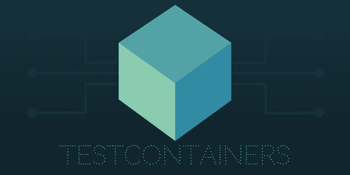

# JUnit 测试中的 Docker

> 原文:[https://dev.to/committedsw/docker-in-junit-tests-4p4i](https://dev.to/committedsw/docker-in-junit-tests-4p4i)

[T2】](///static/testcontainers-3635f36b0d79fb640fb39747456f5f9a-748a9.png)

像 [JUnit](http://junit.org/) 和 [Mockito](http://site.mockito.org/) 这样的库使得 Java 中的单元测试变得简单，但是对于集成测试来说并没有相同的灵丹妙药。除了模拟单元测试之外，集成测试对于确保软件在访问外部服务时的正确功能也很重要。以前，我们对这个问题采取了不同的方法，例如:

*   嵌入服务
*   运行服务
*   为服务运行 Docker 容器

嵌入服务可能很难(特别是如果它不是 Java 的话)。直接或远程运行它们，增加了配置、维护并提供给所有开发人员和您的持续集成服务的大量工作。为服务运行 Docker 容器是我们的首选方法，但是在本地设置它们并作为 CI 构建的一部分似乎与测试的基本方法不相符合。这对我们来说是一个常见且令人沮丧的痛点。

## 测试容器

我们最近转向使用[测试容器](https://www.testcontainers.org/)来解决这个问题。TestContainers 是一个 [MIT](https://github.com/testcontainers/testcontainers-java/blob/master/LICENSE) 许可的开源项目，用于运行 Docker 容器进行 JUnit 测试。

### 好处

这比我们以前的方法有许多好处。首先，我们针对服务的真实实例运行测试，而不是一些行为可能不同的模拟或嵌入版本。因为容器只是为了测试而运行，所以它们与其他测试隔离开来，并且变得更加可重复。设置和配置是在它们所属的测试类中完成的。它还允许您轻松地对不同版本的服务重复测试，从而允许您正确地确定兼容性，并检查新版本的服务不需要更改您自己的代码。

### 用例

这种集成测试技术可以很容易地应用于多个用例，其中一些有更专业的支持:

*   [数据库](https://www.testcontainers.org/usage/database_containers.html)
*   日志服务
*   网络服务
*   复杂的[多服务](https://www.testcontainers.org/usage/docker_compose.html)交互使用 [Docker 编写](https://docs.docker.com/compose/)
*   [UI 测试](https://www.testcontainers.org/usage/webdriver_containers.html)用[硒](https://github.com/SeleniumHQ/docker-selenium)

### 举例

以下示例显示了如何为 Redis 设置集成测试。

```
import org.junit.Rule;
import org.junit.Test;
import org.testcontainers.containers.GenericContainer;

import redis.clients.jedis.Jedis;

public class RedisIntegrationTest {

  private static final String DOCKER_IMAGE = "redis:3.2.9";

  private final Jedis jedis;

  @Rule // 1
  public static GenericContainer redis = new GenericContainer(DOCKER_IMAGE).withExposedPorts(6379); // 2, 3

    @Before
    public void setUp() throws Exception {
        Jedis jedis = new Jedis(redis.getContainerIpAddress(), redis.getMappedPort(6379)); // 4
    }

  @Test
  public void yourTest() {
    //Your test code here
  }

} 
```

1.  `@Rule`为每个测试运行一个新的容器，您可以将测试类的单个容器更改为`@ClassRule`。
2.  它还支持使用 [Dockerfiles](https://www.testcontainers.org/usage/dockerfile.html) 或 Docker Compose file for non-standard，of not published containers 通过使用`DockerComposeContainer`。
3.  其他标准 docker 配置如`.withVolume(), withEnv(), withCommand()`可用。
4.  从`GenericContainer`对象获得您需要的配置。

### 缺点

没有！好吧，也许有一些缺点，但我们认为它们是值得的:

*   你需要 docker 来运行测试。(即在您的本地设备和配置项服务器上)但谁不是呢？
*   您需要使 docker 可用(这可能需要公开 docker 套接字)
*   你必须下载图像，但只需要一次。
*   Windows 支持仅在 Alpha 中提供。

鸣谢:图片由 TestContainers 项目的理查德·诺斯(Richard North)提供。