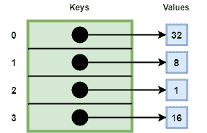
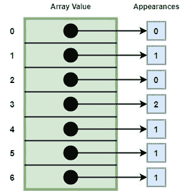

# 让我们来解决:代码挑战-挑选数字

> 原文：<https://dev.to/ryhenness/lets-solve-code-challenge---picking-numbers-a32>

嘿嘿，欢迎来到我的第一个咱们来解决！我们将解决一个叫做[挑选数字](https://www.hackerrank.com/challenges/picking-numbers)的算法代码挑战，这被归类为一个简单的问题——所以我们的目标不仅是解决问题，而且要让我们的解决方案更快。在这篇文章中，我将概述和应用我在解决这类问题时采取的一般步骤。当我遇到我感兴趣的问题和解决方案时，我希望把这变成一个系列。:)

我正在建立一个我个人黑客等级算法问题解决方案的作品集，可以在 [GitHub](https://github.com/henness17/HackerRank-Algorithms) 上找到。

* * *

# 问题

我解决这些问题的第一步是显而易见的，看看问题陈述:

> 给定一个整数数组，找出并打印可以从数组中选择的最大整数个数，使得任意两个所选整数的绝对差< = 1。

由此可以看出，我们将处理一个未排序的列表。

* * *

# 输入/约束&示例

下一步，无论我是亲自还是在线解决一个算法问题，我都要弄清楚输入/约束。对于在线问题，输入/约束很可能会列出来，而您可能需要亲自询问。

对于挑选数字，输入是:

> *   The first line contains a single integer, *n* , which indicates the size of the array.
> 
>  *n 个*
> 
> <sub>0</sub> 
> 
> <sub>1</sub> 
> 
> <sub>n-1</sub>

这些限制是:

> *   2<=*n*T2 = 100
> *   0 
> *   The answer will be > = 2.

给出的输入示例是:

```
6
4 6 5 3 3 1 
```

Enter fullscreen mode Exit fullscreen mode

这导致了输出`3`，因为我们可以通过选择`3, 3, 4`来满足这个问题。任何两个数字之间的最大差异是 1。

* * *

# 蛮力

在我理解了问题、约束和例子之后，我会寻找一种强力解决问题的方法。当我试图解决问题时，排序总是在我的脑海中:在这种情况下，排序能帮助我吗？对于蛮力解决这个问题，是的，它可以。我们可以首先对数组进行排序，然后遍历它，同时跟踪彼此之间最长的数字序列。我们排序后的数组如下所示:`1, 3, 3, 4, 5, 6`。

然后遍历排序后的数组，同时跟踪最长的序列，我们会发现最长的序列是:`3, 3, 4`。

* * *

# 优化&预排

因此，我们的强力解决方案适用于这个小数组输入。但是如果输入变得很大怎么办？开始时的排序将花费太多时间，可能是 O(n <sup>2</sup> )，这将很可能导致问题失败。我们如何优化这一点？我们知道我们可以寻找一个序列来解决这个问题。这让我想知道我是否能以一种不使用排序的方式创建一个序列。

现在，这让我想到了我的算法工具箱中手边的另一个东西:哈希映射。我发现散列图在解决顺序无关紧要的问题时特别有用，它们帮助我们摆脱重复、排序和各种各样的事情。哈希映射有助于解决这个问题吗？我觉得可以。这就是基本散列映射的样子，一个索引(称为键)映射到另一个值:

[T2】](https://res.cloudinary.com/practicaldev/image/fetch/s--A-x4uJoe--/c_limit%2Cf_auto%2Cfl_progressive%2Cq_auto%2Cw_880/https://thepracticaldev.s3.amazonaws.com/i/qax7m7p43aog269nyuug.png)

我们可以使用散列映射将输入数组中的数字映射到它们出现的次数。这意味着我们的输入数组值充当键，它们出现的次数充当值。然后我们可以循环遍历哈希映射，就好像它是排序后的数组一样，并找到我们最长的序列！示例输入的哈希映射如下所示:

[T2】](https://res.cloudinary.com/practicaldev/image/fetch/s--JAzufXd3--/c_limit%2Cf_auto%2Cfl_progressive%2Cq_auto%2Cw_880/https://thepracticaldev.s3.amazonaws.com/i/gukk7mqqh2jgtbi16cbk.jpg)

我们可以看到，我们的输出值是两个相邻关键值的最高和:

[T2】](https://res.cloudinary.com/practicaldev/image/fetch/s--GEQdIRIU--/c_limit%2Cf_auto%2Cfl_progressive%2Cq_auto%2Cw_880/https://thepracticaldev.s3.amazonaws.com/i/ayuz8prui4ijmlp98e97.png)

现在我已经画出了哈希表，我可以看到哈希表(0-6)的每个索引只需要一个输入值...所以我们可以用数组代替哈希映射。:)

* * *

# 实现

现在是时候弄清楚我想用哪种语言来解决这个问题了。因为我想更好地学习 JavaScript，所以我打算使用它！

我们要做的第一件事是从输入中读入我们的值，并用全 0 初始化我们的键值映射数组。我们知道数组值不能超过 100，数组值不能是大于 100 的整数，所以我们可以这样做:

```
function main() {
    // Read input
    var n = parseInt(readLine());
    a = readLine().split('  ');
    a = a.map(Number);

    // Construct our map
    var map = new Array(100);
    map.fill(0);
} 
```

Enter fullscreen mode Exit fullscreen mode

现在我们想用 for 循环填充`map`。`map`的键值将具有与该键在输入数组中出现的次数相对应的值。所以当我们遍历输入数组时，我们可以将每个键的值增加一个:

```
function main() {
    // Read input
    var n = parseInt(readLine());
    a = readLine().split('  ');
    a = a.map(Number);

    // Construct our map
    var map = new Array(100);
    map.fill(0);

    // Populate map
    for(var i = 0; i < a.length; i++){
        map[a[i]]++;
    }
    console.log(map);
} 
```

Enter fullscreen mode Exit fullscreen mode

运行后，我们用示例输入:

```
6
4 6 5 3 3 1 
```

Enter fullscreen mode Exit fullscreen mode

我们可以看到`map`是这样的:`[0, 1, 0, 2, 1, 1, 1]`。

我们需要做的最后一件事是找到两个值的最大和，这就是我们的结果。让我们创建一个跟踪最高总和的`max`值，然后循环通过`map`来更新我们的`max`值，每当在`map`中把每个键的值加到比当前`max` :
的总和高的键之前的值

```
function main() {
    // Read input
    var n = parseInt(readLine());
    a = readLine().split('  ');
    a = a.map(Number);

    // Construct our map
    var map = new Array(100);
    map.fill(0);

    // Populate map
    for(var i = 0; i < a.length; i++){
        map[a[i]]++;
    }

    // Find the max sum of two values with keys within one of each other
    var max = 0;
    for(var i = 1; i < map.length; i++){
        if(map[i] + map[i - 1] > max){
            max = map[i] + map[i - 1];
        }
    }
    console.log(max);
} 
```

Enter fullscreen mode Exit fullscreen mode

* * *

# 结果

让我们在黑客等级的所有测试案例上运行我们的代码...

*请击鼓！*

[T2】](https://res.cloudinary.com/practicaldev/image/fetch/s--8CSo0Ss5--/c_limit%2Cf_auto%2Cfl_progressive%2Cq_auto%2Cw_880/https://thepracticaldev.s3.amazonaws.com/i/uzz0wxwptgdxtqzmq9cv.png)

嘣！我们所有的测试用例都在 O(n)时间内通过。:)

* * *

# 外卖

我总是试着反思，思考我通过解决一个代码挑战学到了什么。对于这一点，我的观点是，在处理未排序的列表时，哈希映射非常有用。在这种情况下，我们可以使用哈希映射为数组的每个值创建一个外观“属性”——这很有用，比对整个输入数组进行排序要快得多。

请补充到下面的讨论中！你会如何解决这个问题？需要帮助吗？