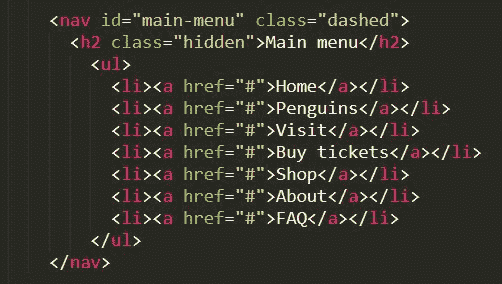
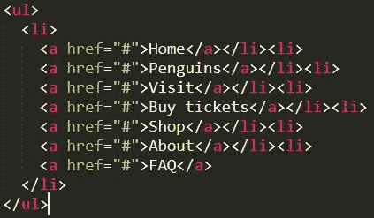
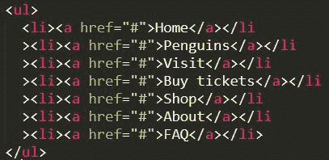
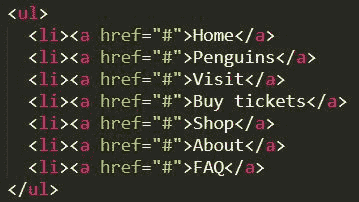
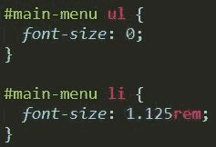
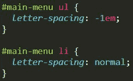
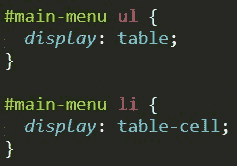

# 行内元素之间的默认 4px 间距

> 原文：<https://dev.to/tyzia/default-4px-spacing-between-inline-elements-dom>

## 问题陈述

如果您尝试创建一个导航元素(“nav”)，并通过未排序的列表项创建菜单，您会发现自己面临一个问题，即“li”元素之间的间距大约为 4px。

[T2】](https://res.cloudinary.com/practicaldev/image/fetch/s--vywImMGS--/c_limit%2Cf_auto%2Cfl_progressive%2Cq_auto%2Cw_880/https://thepracticaldev.s3.amazonaws.com/i/bs6pl6f502nsdna4nls3.JPG)

这不是保证金。HTML 代码看起来像这样:

[T2】](https://res.cloudinary.com/practicaldev/image/fetch/s--vpsffiSB--/c_limit%2Cf_auto%2Cfl_progressive%2Cq_auto%2Cw_880/https://thepracticaldev.s3.amazonaws.com/i/m52phv8ecxncx5ns2xg2.JPG)

## 原因

我先说这个问题的原因在于 html 标记。每当我们在代码编辑器中的单独一行上插入新的“li”元素时，我们都是在前面的“li”元素的末尾插入一个换行符。这个换行符被我们的代理(浏览器)解释为空白。浏览器呈现空白的默认行为是生成 4px 的空间。其实不完全是 4px。这取决于字体系列(衬线，无衬线)，字体大小和规模。但是这些都是小问题，可以忽略。我们假设，这个间距总是 4px。这在大多数情况下是正确的。

[T2】](https://res.cloudinary.com/practicaldev/image/fetch/s--_bFB2BBn--/c_limit%2Cf_auto%2Cfl_progressive%2Cq_auto%2Cw_880/https://thepracticaldev.s3.amazonaws.com/i/anm5dpyo71r6b1oo5gqv.JPG)

## 解决方法

有几种方法可以避免恼人的 4px 间距。每一个都有其利弊。用哪一个由你决定。它们可以通过“HTML”和“CSS”方法进行分组。

以下所有操作将产生相同的结果，如:

[T2】](https://res.cloudinary.com/practicaldev/image/fetch/s--TvlAUKIp--/c_limit%2Cf_auto%2Cfl_progressive%2Cq_auto%2Cw_880/https://thepracticaldev.s3.amazonaws.com/i/qrzg3ne4zu3nt7kaosee.JPG)

以下所有内容都有基本相同的利弊:

**Pro** :没有 css 的麻烦。

**Con** :不是常规的 html 标记，通常很难读懂。

### 1) [HTML 方法]将所有 li 元素写在一行中，不要换行

[T2】](https://res.cloudinary.com/practicaldev/image/fetch/s--fcbJFJhZ--/c_limit%2Cf_auto%2Cfl_progressive%2Cq_auto%2Cw_880/https://thepracticaldev.s3.amazonaws.com/i/ldfbl7c8ww4vk9rql6fg.JPG)

### 2) [HTML 方法]在结束和开始“li”标记之间没有换行符。代码的其余部分可以位于单独的行中。

[T2】](https://res.cloudinary.com/practicaldev/image/fetch/s--_0F6U5mX--/c_limit%2Cf_auto%2Cfl_progressive%2Cq_auto%2Cw_880/https://thepracticaldev.s3.amazonaws.com/i/p29il21itg1e1m0wt0tl.JPG)

### 3) [HTML 方法]插入 HTML 注释而不是换行符。

[T2】](https://res.cloudinary.com/practicaldev/image/fetch/s--baC0JccE--/c_limit%2Cf_auto%2Cfl_progressive%2Cq_auto%2Cw_880/https://thepracticaldev.s3.amazonaws.com/i/g1uun9rvklns4huybi2p.JPG)

### 4) [HTML 方法]在行与行之间断开右“li”标记。

[T2】](https://res.cloudinary.com/practicaldev/image/fetch/s--xxvSI4Rh--/c_limit%2Cf_auto%2Cfl_progressive%2Cq_auto%2Cw_880/https://thepracticaldev.s3.amazonaws.com/i/f63gzd5sfbvh1t088qni.JPG)

### 5) [HTML 方法]跳过结束' li '标记，其 HTML5 有效。

[T2】](https://res.cloudinary.com/practicaldev/image/fetch/s--KUWthurA--/c_limit%2Cf_auto%2Cfl_progressive%2Cq_auto%2Cw_880/https://thepracticaldev.s3.amazonaws.com/i/ddmm6y8pf20v2wqvkp30.JPG)

### 6) [CSS 方法]为“li”元素的内容分配负边距。

[T2】](https://res.cloudinary.com/practicaldev/image/fetch/s--U4GLCYwM--/c_limit%2Cf_auto%2Cfl_progressive%2Cq_auto%2Cw_880/https://thepracticaldev.s3.amazonaws.com/i/vicl3n6pkeuf84bjtp7k.JPG)

不过，在我的例子中，4px 不足以消除间距。查看屏幕:

[T2】](https://res.cloudinary.com/practicaldev/image/fetch/s--_RG3vIUY--/c_limit%2Cf_auto%2Cfl_progressive%2Cq_auto%2Cw_880/https://thepracticaldev.s3.amazonaws.com/i/mkmzod3nntum30lkngo8.JPG)

所以我应该将右边距设置为-5px。

### 7) [CSS 方法]将父元素的字体大小设置为零，并为“li”元素设置正确的字体大小。

[T2】](https://res.cloudinary.com/practicaldev/image/fetch/s--3Llt9qnJ--/c_limit%2Cf_auto%2Cfl_progressive%2Cq_auto%2Cw_880/https://thepracticaldev.s3.amazonaws.com/i/srqidgl7qnqjfc968lb1.JPG)

但是，在这种情况下，您不能对子元素使用' em '或' % '字体大小。此父级的所有子级的字体大小都为零，因此只能使用“rem”或“px”字体大小。

### 8) [CSS 方法]为' li '元素设置 float 'left'。

[T2】](https://res.cloudinary.com/practicaldev/image/fetch/s--6W8DfWkZ--/c_limit%2Cf_auto%2Cfl_progressive%2Cq_auto%2Cw_880/https://thepracticaldev.s3.amazonaws.com/i/spy2upr8d1f1vf2o7rqu.JPG)

但在这种情况下，需要额外的定位。

### 9) [CSS 方法]将父元素的字母间距设置为'-1em '，将' li '元素的字母间距设置为' normal '。

[T2】](https://res.cloudinary.com/practicaldev/image/fetch/s--QH8cFy4---/c_limit%2Cf_auto%2Cfl_progressive%2Cq_auto%2Cw_880/https://thepracticaldev.s3.amazonaws.com/i/c7z9jcriwnkq4axz8ljp.JPG)

### 10) [CSS 方法]对于父元素显示为“表格”,对于“li”元素显示为“表格单元格”。

[T2】](https://res.cloudinary.com/practicaldev/image/fetch/s--2reujY36--/c_limit%2Cf_auto%2Cfl_progressive%2Cq_auto%2Cw_880/https://thepracticaldev.s3.amazonaws.com/i/zwpg0uu6jdqezav9v0s5.JPG)

### 11) [CSS 方法]显示为父的' flex'。

[T2】](https://res.cloudinary.com/practicaldev/image/fetch/s--WLHkP4OG--/c_limit%2Cf_auto%2Cfl_progressive%2Cq_auto%2Cw_880/https://thepracticaldev.s3.amazonaws.com/i/w348chz9soni3wk0fzsz.JPG)

谢谢， [Cris Coyier post](https://css-tricks.com/fighting-the-space-between-inline-block-elements/) 和 [Kyle stackoverflow 回答](https://stackoverflow.com/questions/5256533/a-space-between-inline-block-list-items)，我从你的知识中获得了灵感。