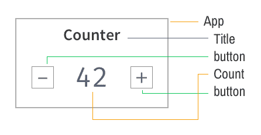
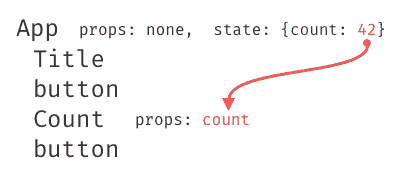
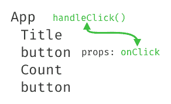
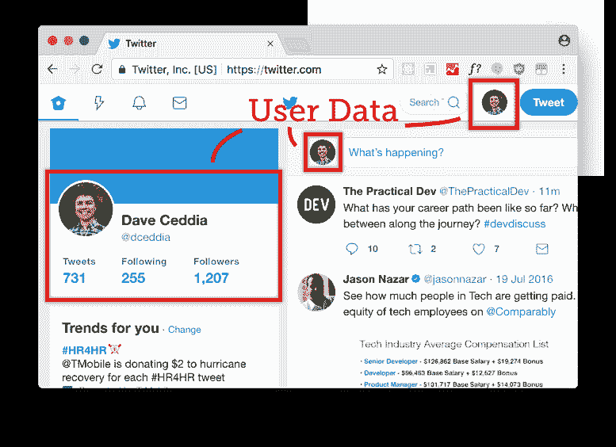
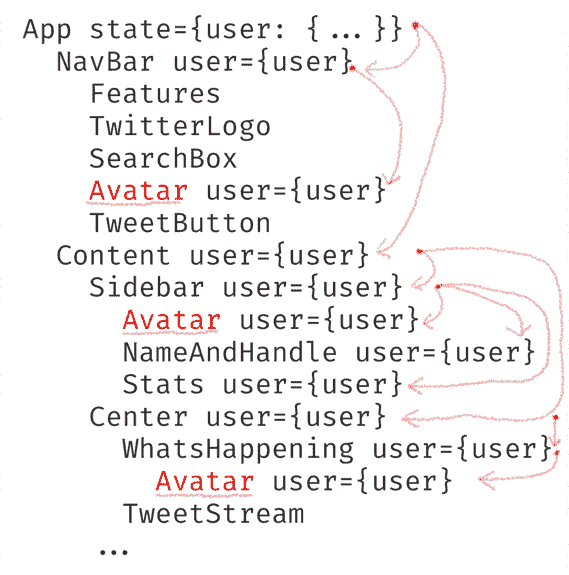
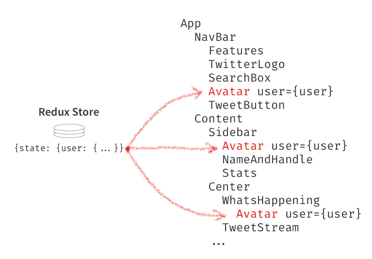

# Redux 是什么，应该在什么时候使用？

> 原文:[https://dev . to/dceddia/whats-redux-and-when-you-use-it-d7f](https://dev.to/dceddia/whats-redux-and-when-should-you-use-it-d7f)

纠结于 Redux 吗？别担心，你不是一个人。

我从很多很多人那里听说，Redux 是编写他们想要的 React 应用程序的最大障碍。

在这篇文章结束时，你会明白 Redux 是干什么的，以及如何知道什么时候把它添加到你自己的应用程序中。

## 为什么？

最好的问题是，我们为什么要使用 Redux？

答案不是“因为互联网上的其他人都在使用它。(我不怀疑这就是很多人在用它的原因，但让我们更深入地了解一下。)

Redux 有用的原因是它解决了一个问题。

不，它解决的问题不是“国家管理”。那是超级含糊的。见鬼，React 已经做了状态管理。Redux 确实有助于管理状态，但这不是它解决的问题。

## 关于数据流

如果你使用 React 超过几分钟，你可能知道道具和单向数据流。数据通过 props 向下*传递到*组件树。给定这样一个组件:

[T2】](https://res.cloudinary.com/practicaldev/image/fetch/s--7MXmzZX0--/c_limit%2Cf_auto%2Cfl_progressive%2Cq_auto%2Cw_880/https://daveceddia.cimg/counter-component.png)

存储在`App`状态中的`count`，将作为道具被传递下去:

[T2】](https://res.cloudinary.com/practicaldev/image/fetch/s--1-sB6HKh--/c_limit%2Cf_auto%2Cfl_progressive%2Cq_auto%2Cw_880/https://daveceddia.cimg/passing-props-down.png)

为了让数据返回到树的上一层(T1 ),它需要通过一个回调函数，因此回调函数必须通过下一层(T2)传递给任何想要向上传递数据的组件。

[T2】](https://res.cloudinary.com/practicaldev/image/fetch/s--V-q80MAZ--/c_limit%2Cf_auto%2Cfl_progressive%2Cq_auto%2Cw_880/https://daveceddia.cimg/passing-callbacks-down.png)

你可以想到像*电*这样的数据，通过彩色电线连接到关心它的组件。数据通过这些电线上下流动，但电线不能穿过稀薄的空气——它们必须连接在树中的每个组件之间。

希望这都是回顾。(如果没有，你就此打住，[去学 React](https://daveceddia.com/learning-react-start-small/) ，建个[情侣小 app](https://daveceddia.com/react-practice-projects/)，过几天再回来。说真的。Redux 是没有意义的，除非你明白 React 是如何工作的。).

## 层与层的数据流

迟早您会遇到这样的情况，顶层容器有一些数据，而 4 层以下的子容器需要这些数据。下面是 Twitter 的截图，突出显示了所有的头像:

[T2】](https://res.cloudinary.com/practicaldev/image/fetch/s--R2KqTAVj--/c_limit%2Cf_auto%2Cfl_progressive%2Cq_auto%2Cw_880/https://daveceddia.cimg/twitter-user-data.png)

假设用户的头像被存储为他们的个人资料数据的一部分，顶级的`App`组件持有用户。为了将`user`数据交付给所有 3 个`Avatar`组件，`user`需要通过一堆不需要数据的中间组件来编织。

[T2】](https://res.cloudinary.com/practicaldev/image/fetch/s--GgbxErbq--/c_limit%2Cf_auto%2Cfl_progressive%2Cq_auto%2Cw_880/https://daveceddia.cimg/twitter-hierarchy.png)

在那里获取数据就像在采矿探险中穿针引线一样困难。等等，这没有任何意义。反正就是个讨厌鬼。

不止如此，它不是很好的软件设计。链中的中间组件必须接受并传递它们不关心的道具。这意味着重构和重用该链中的组件将比它需要的更难。

如果不需要数据的组件根本不必看到它，那不是很好吗？

## 将任意数据插入任意组件

*这个*就是 Redux 解决的问题。它让组件*直接访问*他们需要的数据。

使用 Redux 自带的`connect`函数，可以将任何组件插入 Redux 的数据存储，组件可以拉出它需要的数据。

[T2】](https://res.cloudinary.com/practicaldev/image/fetch/s--QzKcH9lQ--/c_limit%2Cf_auto%2Cfl_progressive%2Cq_auto%2Cw_880/https://daveceddia.cimg/redux-connected-twitter.png)

这就是 Redux 的*存在的理由*。

是的，它还做了一些其他很酷的事情，比如使调试更容易(Redux DevTools 让你检查每一个状态变化)，时间旅行调试(你可以*回滚*状态变化，看看你的应用程序在过去是什么样子)，从长远来看，它可以使你的代码更容易维护。它还会教你更多关于函数式编程的知识。

但是这里的这个东西，“将任何数据插入任何组件，都是主要事件。如果不需要那个，大概也不需要 Redux。

## 何时添加 Redux

如果你有一个类似上面的组件结构——道具通过许多层向下传递——考虑使用 Redux。

如果您需要在视图之间缓存数据——例如，当用户点击一个细节页面时加载数据，并记住数据以便下次访问时快速进行——考虑将数据存储在 Redux 中。

如果你的应用程序很大，需要维护大量数据，相关的和不相关的——考虑使用 Redux。但是也要考虑在没有它的情况下开始，并且当你遇到它会有帮助的情况时添加它。

什么是 Redux，应该在什么时候使用？最初由[戴夫·塞德迪亚](https://daveceddia.com)于 2017 年 10 月 24 日发表。