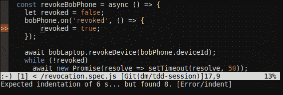
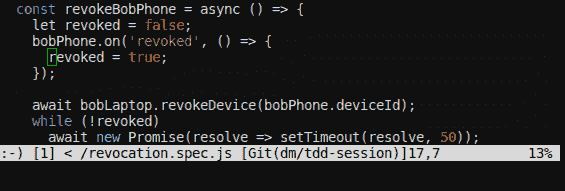

# 我的 Javascript 工作流

> 原文:[https://dev.to/dmerejkowsky/my-javascript-workflow-3po](https://dev.to/dmerejkowsky/my-javascript-workflow-3po)

继 [How I lint My Python](https://dmerej.info/blog/post/how-i-lint/) 的(相对)成功之后，今天我想谈谈我在工作中编写 Javascript 时使用的工具和技术。

# 循环往复

这个博客的老读者不会对我使用 <abbr title="Test Driven Development">TDD</abbr> 的事实感到惊讶，因此我已经有了一个“红色”、“绿色”、“重构”的循环。

我喜欢 TDD 的一点是，每个阶段都有非常精确的目标和思考代码的特定方式:

*   想想 API 和架构:产品代码会是什么样子
*   绿色:只要通过测试，尽可能简单快速地编写特性
*   *重构*:想想你制造的混乱，然后清理干净。

我开发 Javascript 时的周期封装了这个工作流:

1.  选择要实现的功能或错误修复
2.  编写测试或生产代码
3.  运行测试
4.  回到步骤 2，直到我完成了特性或错误
5.  添加`flow`注释
6.  重写历史
7.  创建合并请求
8.  如果需要，请返回步骤 6
9.  告诉 GitLab 在 CI 通过时合并更改

我在整个 TDD 周期的之后添加了`flow`注释*。这可能是因为我习惯于使用动态类型的语言，所以我仍然不习惯静态类型。因此，我在单独的阶段处理类型。如果您从 C++背景开始学习“流动的”Javascript，您可能更喜欢先添加类型。我还发现，当你没有任何测试时，`flow`在重构过程中会有很大的帮助。*

无论如何，让我们一个一个地经历这些步骤。您将看到我使用的工具是如何为每个特定任务量身定制的。

# 编写代码

我们使用 [eslint](https://eslint.org/) 来检查编码风格违规或有问题的代码模式。

例如:

```
import foo from 'barr';

function baz() {
  let bar = 42;
  if(bar) {
    // ...
  }
} 
```

<svg width="20px" height="20px" viewBox="0 0 24 24" class="highlight-action crayons-icon highlight-action--fullscreen-on"><title>Enter fullscreen mode</title></svg> <svg width="20px" height="20px" viewBox="0 0 24 24" class="highlight-action crayons-icon highlight-action--fullscreen-off"><title>Exit fullscreen mode</title></svg>

```
$ eslint foo.js
src/foo.js
  1:17 error Unable to resolve path to module 'barr'
  4:7 error 'bar' is never reassigned. Use 'const' instead
  5:3 error Expected space(s) after "if" 
```

<svg width="20px" height="20px" viewBox="0 0 24 24" class="highlight-action crayons-icon highlight-action--fullscreen-on"><title>Enter fullscreen mode</title></svg> <svg width="20px" height="20px" viewBox="0 0 24 24" class="highlight-action crayons-icon highlight-action--fullscreen-off"><title>Exit fullscreen mode</title></svg>

当我输入错误的导入或变量名时，我想立即知道，而`eslint`有助于捕捉许多这样的错误。

所以，我在 neovim 中使用了 [vim-ale](https://dmerej.info/blog/post/lets-have-a-pint-of-vim-ale/) ,让`eslint`在我保存后立即运行。

(我可以让它持续运行，但我发现它太分散注意力了)。

我使用 gutter，这样一旦它消失，我就知道所有 lint 错误都已修复，如这些截图所示:

带排水沟:

[T2】](https://res.cloudinary.com/practicaldev/image/fetch/s--5m-43pzz--/c_limit%2Cf_auto%2Cfl_progressive%2Cq_auto%2Cw_880/https://dmerej.info/blog/pics/lint-gutter.png)

不带:

[T2】](https://res.cloudinary.com/practicaldev/image/fetch/s--HhkE7yyY--/c_limit%2Cf_auto%2Cfl_progressive%2Cq_auto%2Cw_880/https://dmerej.info/blog/pics/lint-no-gutter.png)

# 运行测试

在测试中，我们使用[摩卡](https://mochajs.org/)和[柴](http://chaijs.com/)。

下面是测试的样子 <sup id="fnref:1">[1](#fn:1)</sup> :

```
// In Tanker.js

describe('Tanker', () => {
  it('can be instanciated', () {
    //...
  });

  it('can be opened', () => {
    // ...
  });
});

// In revocation.js

describe('revocation', () => {
  let bob;
  let bobLaptop;
  let bobPhone;
  function revokeBobPhone() {
    bob = helper.makeUser('Bob');
    bobLaptop = bob.makeDevice('laptop');
    bobPhone = bob.makeDevice('phone');
    bobLaptop.revokeDevice(bobPhone);
  }

  specify('revoking a device', () => {
    revokeBobPhone();
    expectWiped(bobPhone);
  });

  specify('can access encrypted resources even with a revoked device', () => {
    const message = 'now you see me';
    const encrypted = bobLaptop.encrypt(message);

    revokeBobPhone();
    const clear = bobLaptop.decrypt(message);
    expect(clear).to.eq(message);
  });

  specify('Alice can share with Bob who has a revoked device', () => {
    const alice = helper.makeUser('alice');
    const alicePhone = alice.makeDevice('phone');

    revokeBobPhone();

    const message = 'I love you';
    const encrypted = alicePhone.encrypt(message, { shareWith: [bob.userId] });

    const clear = bobLaptop.decrypt(encrypted);
    expect(clear).to.eq(message)

    expectFailWith(bobPhone.decrypt(encrypted), /Device is revoked/);
  });

}); 
```

<svg width="20px" height="20px" viewBox="0 0 24 24" class="highlight-action crayons-icon highlight-action--fullscreen-on"><title>Enter fullscreen mode</title></svg> <svg width="20px" height="20px" viewBox="0 0 24 24" class="highlight-action crayons-icon highlight-action--fullscreen-off"><title>Exit fullscreen mode</title></svg>

整个测试套件需要几分钟来运行(我们有一个相当大的集成测试套件)。

为了缩短 TDD 周期，假设我正在做一些与撤销相关的事情，我将从在`describe`后面添加一个`.only`开始，就像这样:

```
describe.only('revocation', () => {
  ...
}); 
```

<svg width="20px" height="20px" viewBox="0 0 24 24" class="highlight-action crayons-icon highlight-action--fullscreen-on"><title>Enter fullscreen mode</title></svg> <svg width="20px" height="20px" viewBox="0 0 24 24" class="highlight-action crayons-icon highlight-action--fullscreen-off"><title>Exit fullscreen mode</title></svg>

然后我将在“观察”模式下运行`mocha`:

```
$  yarn test:tanker --watch 
```

<svg width="20px" height="20px" viewBox="0 0 24 24" class="highlight-action crayons-icon highlight-action--fullscreen-on"><title>Enter fullscreen mode</title></svg> <svg width="20px" height="20px" viewBox="0 0 24 24" class="highlight-action crayons-icon highlight-action--fullscreen-off"><title>Exit fullscreen mode</title></svg>

因此，只要我保存了产品或测试代码，我感兴趣的测试就会运行。

好事情是我们有一个`eslint`规则，防止我们合并包含对`.only`的调用的代码，所以只要测试文件中有一个空白，我就知道我必须删除`.only`并运行整个测试套件。

# 运行流程

我们还使用[流](https://flow.org/)和类型注释来检查静态分析期间的一大堆错误(这意味着在代码没有运行的情况下进行的检查*:* 

```
import { fromBase64 } from './utils';

type OpenOptions = {
  userId: string,
  secret: string,
  ...
};

export class Tanker {
  userId: Uint8Array,
  userSecret: Uint8Array,

  open(userId: string, userSecret: string) {
    ...
  }
} 
```

<svg width="20px" height="20px" viewBox="0 0 24 24" class="highlight-action crayons-icon highlight-action--fullscreen-on"><title>Enter fullscreen mode</title></svg> <svg width="20px" height="20px" viewBox="0 0 24 24" class="highlight-action crayons-icon highlight-action--fullscreen-off"><title>Exit fullscreen mode</title></svg>

您可能想知道为什么用户密码在 Tanker 类中是一个`Uint8Array`，而在`OpenOptions`中是一个 base 64 字符串。

原因是几乎所有的加密操作都需要`Uint8Array`，但是为了方便我们 SDK 的用户，我们让他们使用 base 64 编码的字符串。

因此，如果你传递了一个不正确的类型:

```
import { randomBytes } from './utils';
import { createUserSecret } from './tanker';

const userId = randomBytes(32);
const secret = createUserSecret(userId);
tanker.open(userId, secret); 
```

<svg width="20px" height="20px" viewBox="0 0 24 24" class="highlight-action crayons-icon highlight-action--fullscreen-on"><title>Enter fullscreen mode</title></svg> <svg width="20px" height="20px" viewBox="0 0 24 24" class="highlight-action crayons-icon highlight-action--fullscreen-off"><title>Exit fullscreen mode</title></svg>

`flow`会发出这样的警告:

```
597: const tanker = new Tanker( { url: 42 });
                                ^^^^^^^^^^^ object literal. This type is incompatible with the expected param type of
 84: constructor(options: TankerOptions) {
                            ^^^^^^^^^^^^^ object type
  Property `url` is incompatible:
    597: const tanker = new Tanker( { url: 42 });
                                           ^^ number. This type is incompatible with
     36: url: string,
                ^^^^^^ string

Found 7 errors 
```

<svg width="20px" height="20px" viewBox="0 0 24 24" class="highlight-action crayons-icon highlight-action--fullscreen-on"><title>Enter fullscreen mode</title></svg> <svg width="20px" height="20px" viewBox="0 0 24 24" class="highlight-action crayons-icon highlight-action--fullscreen-off"><title>Exit fullscreen mode</title></svg>

正如你所看到的，消息产生在几行上，你经常需要所有的信息`flow`来让你理解哪里出了问题。

因此，让它作为一个`vim-ale` linter 运行是不太实际的(尽管它是可行的)。

还要注意，我希望运行`flow`的频率不要像测试或`eslint`那么高。考虑使用正确的注释需要相当长的时间，这是一个与编写新测试、重构代码或实现功能完全不同的思维过程。

考虑到这一点，我找到了解决方案。

首先，我打开另一个终端来运行这个简单的脚本:

```
import subprocess

import neovim

def main():
    nvim = neovim.attach("socket", path="/tmp/neovim")
    nvim.subscribe("refresh")
    try:
        while True:
            _ = nvim.next_message()
            subprocess.run(["yarn", "flow"])
    except:
        pass

if __name__ == " __main__":
    main() 
```

<svg width="20px" height="20px" viewBox="0 0 24 24" class="highlight-action crayons-icon highlight-action--fullscreen-on"><title>Enter fullscreen mode</title></svg> <svg width="20px" height="20px" viewBox="0 0 24 24" class="highlight-action crayons-icon highlight-action--fullscreen-off"><title>Exit fullscreen mode</title></svg>

它所做的是订阅一个名为“refresh”的 Neovim 事件，并在每次发出该事件时运行`yarn flow`。

从尼奥维姆，剩下的就是跑:

```
:nnoremap <cr> :wa\|call rpcnotify(0, "refresh")<cr> 
```

<svg width="20px" height="20px" viewBox="0 0 24 24" class="highlight-action crayons-icon highlight-action--fullscreen-on"><title>Enter fullscreen mode</title></svg> <svg width="20px" height="20px" viewBox="0 0 24 24" class="highlight-action crayons-icon highlight-action--fullscreen-off"><title>Exit fullscreen mode</title></svg>

让我们把这个命令分成几个部分:

*   `nnoremap <cr>`:告诉 Neovim 我们想要将正常模式下的“Enter”键映射到一个新的命令链。
*   第一个命令是`:wa`(全部写入)。
*   第二个命令(用转义符`\|`分隔)调用`rpcnotify`函数，该函数将触发`refresh`事件。
*   最后，我们用`<cr>`结束命令链，这样就不需要第二次按“Enter”。

因此，当我思考如何正确使用类型时，我所要做的就是进入`normal`模式，按 enter 键，查看`flow`输出的结尾，并检查错误数量是否在减少。

如果我得到一个我不理解的错误，我可以向上滚动一点点来得到与这个错误相关的完整消息。

# 改写历史

## 让 git 提交

一旦所有测试通过，并且`flow`不再发现错误，就该提交 git 了。

为此，我使用了`git gui`。它很丑，但是:

*   它在每个平台上都运行良好，并且与 git 捆绑在一起
*   您可以用鼠标选择要添加或删除到当前提交中的内容，按块或按行
*   它有一个提交消息的拼写检查器
*   你可以在菜单中创建自己的动作(我个人经常使用`clean`)。

我还喜欢这样一个事实:它没有语法高亮显示。它给了我一个机会以一种新的方式来看待我的代码，这允许我发现如果我只从编辑器来看我会错过的错误。

注意:添加自定义动作是在`~/.config/git/config` :
中完成的

```
[guitool "clean"]
    cmd = git clean -fd
    confirm = true 
```

<svg width="20px" height="20px" viewBox="0 0 24 24" class="highlight-action crayons-icon highlight-action--fullscreen-on"><title>Enter fullscreen mode</title></svg> <svg width="20px" height="20px" viewBox="0 0 24 24" class="highlight-action crayons-icon highlight-action--fullscreen-off"><title>Exit fullscreen mode</title></svg>

## 重置基础

我也几乎总是将我的工作放在`master`分支之上，以确保历史尽可能的干净。重新排序、压缩或拆分提交通常可以帮助审阅者。

为此，我使用我的自定义`git alias`和`neovim`(再次)编辑“rebase todo”

```
[alias]
  ro = rebase -i origin/master

$ git ro
pick 6558885f less babel cruft
pick 8c2b1c3f FIXME: revocation tests to be written
pick 1b36450f fix revocation bug 
```

<svg width="20px" height="20px" viewBox="0 0 24 24" class="highlight-action crayons-icon highlight-action--fullscreen-on"><title>Enter fullscreen mode</title></svg> <svg width="20px" height="20px" viewBox="0 0 24 24" class="highlight-action crayons-icon highlight-action--fullscreen-off"><title>Exit fullscreen mode</title></svg>

# 创建合并请求

最后，是时候创建合并请求了。为此我使用了 [tsrc](https://github.com/TankerApp/tsrc) ，它是我们用来帮助我们管理几个 git 库的工具，包含一些利用 GitLab API 的好特性:

```
$  tsrc push -a theo
=>  Running git push
... =>  Creating merge request
=>  Assigning to Théo
:: See merge request at http://gitlab.dev/Tanker/SDK/merge_requests/431 
```

<svg width="20px" height="20px" viewBox="0 0 24 24" class="highlight-action crayons-icon highlight-action--fullscreen-on"><title>Enter fullscreen mode</title></svg> <svg width="20px" height="20px" viewBox="0 0 24 24" class="highlight-action crayons-icon highlight-action--fullscreen-off"><title>Exit fullscreen mode</title></svg>

# 接受合并请求

我们的 GitLab 配置不允许任何人直接推送到 master，如果 CI 没有通过就阻止我们合并。

这确保 CI 故障得到应有的高优先级处理。

但是，由于 CI 失败很少发生，我们经常做的就是告诉 GitLab 只要 CI 通过就合并请求，当然我们使用`tsrc`来做这件事:

```
$  tsrc push --accept 
```

<svg width="20px" height="20px" viewBox="0 0 24 24" class="highlight-action crayons-icon highlight-action--fullscreen-on"><title>Enter fullscreen mode</title></svg> <svg width="20px" height="20px" viewBox="0 0 24 24" class="highlight-action crayons-icon highlight-action--fullscreen-off"><title>Exit fullscreen mode</title></svg>

# 结论

这就是我今天要说的。

我希望它能让你感受到用一堆小工具工作的感觉，所有的工具都集中在一个任务上，并且把它做好。

这也是对“为什么不使用 IDE”的长篇回答。正如我解释的那样，我实际上*很享受*必须根据上下文使用不同的工具，这极大地帮助我专注于手头的任务。

干杯！

* * *

1.  如果你想知道，这些测试取自我们在 [tanker.io](https://tanker.io) 制作的 SDK 的真实测试套件，只是为了本文的目的而简化了一点。<sup>【归来】</sup>