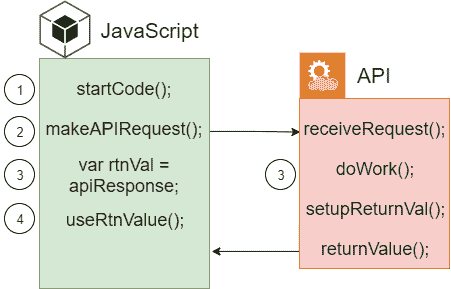
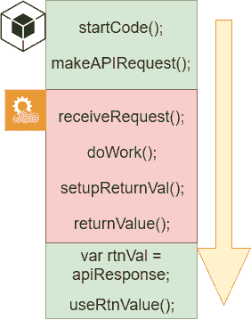

# 征服异步 JavaScript 的途径

> 原文:[https://dev . to/ryhenness/the-path-to-converting-async-JavaScript-1pl](https://dev.to/ryhenness/the-path-to-conquering-async-javascript-1pl)

我很高兴你在这里！我们将讨论如何征服异步 JavaScript！当我试图自学 Node.js 并构建一些东西时，我发现异步调用并不是最容易学会处理的。异步 JavaScript 实际上需要大量的思考才能完全理解。我希望铺平道路，使理解如何处理异步调用更快更容易。

你可以在 GitHub 上找到本文使用的所有代码。

* * *

# 有什么问题吗？

JavaScript 是一种同步语言，这意味着它是单线程的，所以它一次只运行一个代码块。当我们想要进行某种异步调用时，会出现一个问题，这是一个多线程调用。问题是当我们的 JavaScript 调用一个异步函数时——我们的 JavaScript 继续运行，尽管有一个代码块在别的地方运行。我在处理 API 请求时遇到这个问题最多。

这里有一个例子-

1.  JavaScript 块开始
2.  发出一个 API 请求
3.  JavaScript 代码继续运行，API 请求继续处理
4.  JavaScript 在响应返回之前使用请求的响应

[T2】](https://res.cloudinary.com/practicaldev/image/fetch/s--Kd3dHebQ--/c_limit%2Cf_auto%2Cfl_progressive%2Cq_auto%2Cw_880/https://thepracticaldev.s3.amazonaws.com/i/dxz7mmpnpz1e9ij6soe0.png)

注意到有两个数字 3 了吗？这就是问题所在。发出请求时，JavaScript 代码继续运行。这意味着 JavaScript 有可能在请求的响应值可用之前尝试使用它，我们将 l。

* * *

# 目标

目标是能够以同步方式调用异步函数——在执行之前，调用应该等待前一个函数完成:

[T2】](https://res.cloudinary.com/practicaldev/image/fetch/s--LcMIzhQE--/c_limit%2Cf_auto%2Cfl_progressive%2Cq_auto%2Cw_880/https://thepracticaldev.s3.amazonaws.com/i/6zuuyic6jeit3kwzk99c.png)

当有多个异步调用时，它看起来像这样:

```
var a = await asyncToGetA();
var b = await asyncToGetB(a);
alert(b); 
```

<svg width="20px" height="20px" viewBox="0 0 24 24" class="highlight-action crayons-icon highlight-action--fullscreen-on"><title>Enter fullscreen mode</title></svg> <svg width="20px" height="20px" viewBox="0 0 24 24" class="highlight-action crayons-icon highlight-action--fullscreen-off"><title>Exit fullscreen mode</title></svg>

* * *

# 使用回调

### 什么是回调？

那么，我们如何克服这个问题呢？好吧，让我们先来看看回调函数，这样我们就可以对潜在的修复有所了解。回调是告诉代码在另一个函数完成后运行另一个函数*的一种方式，如果你的代码没有进行太多的异步调用，那么这是一个可以使用的选项。这是通过将一个函数作为参数传递给另一个函数，然后在被传递函数的末尾调用参数函数来实现的。*

假设我们有一个函数`runThisFirst()`，我们想在另一个函数`runThisSecond()`之前运行它。`runThisFirst()`将使用`setTimeout()`模拟异步呼叫，并将`x`设置为 5。一旦完成，`runThisSecond()`就会运行。因为我们希望`runThisSecond()`在 `runThisFirst()`之后运行*，所以我们将把它作为回调函数传递:* 

```
// Define functions
var runThisFirst = function(callback){
    setTimeout(function(){ 
        x = 5;
        callback(); // runThisSecond is called
    }, 3000);
}

var runThisSecond = function(){
    alert(x);
}

// Run functions, pass runThisSecond as the callback argument 
var x;
runThisFirst(runThisSecond); 
```

<svg width="20px" height="20px" viewBox="0 0 24 24" class="highlight-action crayons-icon highlight-action--fullscreen-on"><title>Enter fullscreen mode</title></svg> <svg width="20px" height="20px" viewBox="0 0 24 24" class="highlight-action crayons-icon highlight-action--fullscreen-off"><title>Exit fullscreen mode</title></svg>

> 您可以在[jsdild](https://jsfiddle.net/jwt4y15w/)上运行这段代码。

### 回调链接

如果回调修复了我们的异步问题，那么我们不能把回调链接在一起吗？你可以，但是会很恐怖。有一个[回调地狱](http://callbackhell.com/)的概念，回调 JavaScript 代码变成一个金字塔形状，使它变得混乱和难以理解。

这里有一个简单的例子来展示回调地狱金字塔的骨架:

```
function one() {
  setTimeout(function() {
    console.log('1\. First thing setting up second thing');
    setTimeout(function() {
      console.log('2\. Second thing setting up third thing');
      setTimeout(function() {
        console.log('3\. Third thing setting up fourth thing');
        setTimeout(function() {
          console.log('4\. Fourth thing');
        }, 2000);
      }, 2000);
    }, 2000);
  }, 2000);
}; 
```

<svg width="20px" height="20px" viewBox="0 0 24 24" class="highlight-action crayons-icon highlight-action--fullscreen-on"><title>Enter fullscreen mode</title></svg> <svg width="20px" height="20px" viewBox="0 0 24 24" class="highlight-action crayons-icon highlight-action--fullscreen-off"><title>Exit fullscreen mode</title></svg>

最佳编程实践之一是编写可读的代码，当链接过多时，回调会使我们偏离这一点。为了避免这种情况，我们将研究 Promises 和 Async/Await。

* * *

# 承诺

一个`promise`函数是一个*承诺*返回值的函数。这允许您将代码与异步调用相关联，所有这一切都是通过将异步调用作为承诺的一部分来实现的。这是我们可以进行 API 调用的地方。:)它们是这样工作的:

```
var somePromise = new Promise((resolve, reject) => {
  var x = 5;
  // Now wait a bit for an "async" call
  setTimeout(function(){
    resolve(x); // Return your promise!
  }, 3000);
}); 
```

<svg width="20px" height="20px" viewBox="0 0 24 24" class="highlight-action crayons-icon highlight-action--fullscreen-on"><title>Enter fullscreen mode</title></svg> <svg width="20px" height="20px" viewBox="0 0 24 24" class="highlight-action crayons-icon highlight-action--fullscreen-off"><title>Exit fullscreen mode</title></svg>

你可以看到`Promise`构造函数有两个参数:`resolve`和`reject`。如果承诺中的一切都按计划进行(没有错误)，那么调用`resolve`，它返回承诺的一些值。如果出现错误，承诺者应该调用`reject`并返回错误。对于这个例子，`reject`没有被调用。

现在，让我们试着运行一些依赖于这个承诺的东西，看看它是否在执行之前等待`x`值被解析。我们可以通过使用`.then`函数:
来做到这一点

```
var somePromise = new Promise((resolve, reject) => {
  var x = 5;
  // Now wait a bit for an "async" call
  setTimeout(function(){
    resolve(x); // Return your promise!
  }, 3000);
});

somePromise.then((somePromisesReturnValue) => {
  alert("Check it out: " + somePromisesReturnValue);
}); 
```

<svg width="20px" height="20px" viewBox="0 0 24 24" class="highlight-action crayons-icon highlight-action--fullscreen-on"><title>Enter fullscreen mode</title></svg> <svg width="20px" height="20px" viewBox="0 0 24 24" class="highlight-action crayons-icon highlight-action--fullscreen-off"><title>Exit fullscreen mode</title></svg>

> 您可以在[jsdild](https://jsfiddle.net/nozqegb3/)上运行这段代码。

看看吧！事情已经看起来更清晰、更容易理解了。干得好。:)但是现在，如果一个承诺依赖于另一个承诺呢？我们将不得不把承诺连在一起。

为了将值从一个承诺传递到另一个承诺，我们将把承诺包装在一个函数中，如下所示:

```
function somePromise() {
  var promise = new Promise((resolve, reject) => {
    var x = 5;
    // Now wait a bit for an "async" call
    setTimeout(function() {
      resolve(x); // Return your promise!
    }, 3000);
  });
  return promise;
} 
```

<svg width="20px" height="20px" viewBox="0 0 24 24" class="highlight-action crayons-icon highlight-action--fullscreen-on"><title>Enter fullscreen mode</title></svg> <svg width="20px" height="20px" viewBox="0 0 24 24" class="highlight-action crayons-icon highlight-action--fullscreen-off"><title>Exit fullscreen mode</title></svg>

### 许诺链接

现在我们可以写另一个承诺，`anotherPromise()`，它将接受`somePromise()`的返回值并加 1。这个函数将有一个更短的`setTimeout()`，所以我们可以知道它在运行之前等待`somePromise()`解析。注意我们如何传递`somePromisesReturnValue`作为参数:

```
function anotherPromise(somePromisesReturnValue) {
  var promise = new Promise((resolve, reject) => {
    var y = somePromisesReturnValue + 1; // 6
    // Now wait a bit for an "async" call
    setTimeout(function() {
      alert("Resolving: " + y);
      resolve(y); // Return your promise!
    }, 1000);
  });
  return promise;
} 
```

<svg width="20px" height="20px" viewBox="0 0 24 24" class="highlight-action crayons-icon highlight-action--fullscreen-on"><title>Enter fullscreen mode</title></svg> <svg width="20px" height="20px" viewBox="0 0 24 24" class="highlight-action crayons-icon highlight-action--fullscreen-off"><title>Exit fullscreen mode</title></svg>

现在，我们所要做的就是使用`.then`函数来同步调用这些承诺:

```
function somePromise() {
  var promise = new Promise((resolve, reject) => {
    var x = 5;
    // Now wait a bit for an "async" call
    setTimeout(function() {
      resolve(x); // Return your promise!
    }, 3000);
  });
  return promise;
}

function anotherPromise(somePromisesReturnValue) {
  var promise = new Promise((resolve, reject) => {
    var y = somePromisesReturnValue + 1; // 6
    // Now wait a bit for an "async" call
    setTimeout(function() {
      alert("Resolving: " + y);
      resolve(y); // Return your promise!
    }, 1000);
  });
  return promise;
}

somePromise().then(anotherPromise); 
```

<svg width="20px" height="20px" viewBox="0 0 24 24" class="highlight-action crayons-icon highlight-action--fullscreen-on"><title>Enter fullscreen mode</title></svg> <svg width="20px" height="20px" viewBox="0 0 24 24" class="highlight-action crayons-icon highlight-action--fullscreen-off"><title>Exit fullscreen mode</title></svg>

> 你可以在[jsdild](https://jsfiddle.net/ycc8qLpt/)上运行这段代码。

真见鬼。您可以看到，`anotherPromise()`在执行代码之前等待了`somePromise()`的返回值 5。事情确实在好转。:)

* * *

# 异步/等待

厉害！所以我们结束了，对吗？不，但我们很接近了！如果我们从上一节中取出代码，并尝试分配来自承诺链的返回值，我们可以看到代码的其余部分没有等待整个承诺链的解析。【对象承诺】“先报警。

```
function somePromise() {
  var promise = new Promise((resolve, reject) => {
    var x = 5;
    // Now wait a bit for an "async" call
    setTimeout(function() {
      resolve(x); // Return your promise!
    }, 3000);
  });
  return promise;
}

function anotherPromise(somePromisesReturnValue) {
  var promise = new Promise((resolve, reject) => {
    var y = somePromisesReturnValue + 1; // 6
    // Now wait a bit for an "async" call
    setTimeout(function() {
      alert("Resolving: " + y);
      resolve(y); // Return your promise!
    }, 1000);
  });
  return promise;
}

var chainValue = somePromise().then(anotherPromise);
alert(chainValue); // This is executing before chainValue is resolved 
```

<svg width="20px" height="20px" viewBox="0 0 24 24" class="highlight-action crayons-icon highlight-action--fullscreen-on"><title>Enter fullscreen mode</title></svg> <svg width="20px" height="20px" viewBox="0 0 24 24" class="highlight-action crayons-icon highlight-action--fullscreen-off"><title>Exit fullscreen mode</title></svg>

> 您可以在[jsdild](https://jsfiddle.net/v88qen55/)上运行这段代码。

我们如何让剩下的代码等待呢？！这就是`async`和`await`的用武之地。`async`函数声明定义了一个异步函数，一个可以进行异步调用的函数。`await`操作符用于等待承诺的解析，它只能在`async`函数中使用。

### 任务完成

让我们创建一个`main()`函数，而不是使用`.then`，这样我们就可以像本文开头的目标一样进行调用:

```
function somePromise() {
  var promise = new Promise((resolve, reject) => {
    var x = 5;
    // Now wait a bit for an "async" call
    setTimeout(function() {
      resolve(x); // Return your promise!
    }, 3000);
  });
  return promise;
}

function anotherPromise(somePromisesReturnValue) {
  var promise = new Promise((resolve, reject) => {
    var y = somePromisesReturnValue + 1; // 6
    // Now wait a bit for an "async" call
    setTimeout(function() {
      resolve(y); // Return your promise!
    }, 1000);
  });
  return promise;
}

const main = async () => {
  var a = await somePromise();
  var b = await anotherPromise(a);
  alert(b);
}
main(); 
```

<svg width="20px" height="20px" viewBox="0 0 24 24" class="highlight-action crayons-icon highlight-action--fullscreen-on"><title>Enter fullscreen mode</title></svg> <svg width="20px" height="20px" viewBox="0 0 24 24" class="highlight-action crayons-icon highlight-action--fullscreen-off"><title>Exit fullscreen mode</title></svg>

> 您可以在[jsdild](https://jsfiddle.net/54kug9Lz/1/)上运行这段代码。

看那个主函数多好看:’)漂亮。这就是了，一个好看的主函数，不是金字塔。恭喜你！

* * *

# 添加宽泛的错误处理

您可能希望在使用`reject`回调时在承诺本身中添加一些错误处理，但是您也可以在`main()`函数中使用 *try/catch* 来添加整体错误处理，它将捕捉在`main()`函数:
中使用的所有代码中抛出的任何错误

```
const main = async () => {
  try{
    var a = await somePromise();
    var b = await anotherPromise(a);
    alert(b);
  }
  catch(err){
    alert('Oh no! Something went wrong! ERROR: ' + err);
  }
} 
```

<svg width="20px" height="20px" viewBox="0 0 24 24" class="highlight-action crayons-icon highlight-action--fullscreen-on"><title>Enter fullscreen mode</title></svg> <svg width="20px" height="20px" viewBox="0 0 24 24" class="highlight-action crayons-icon highlight-action--fullscreen-off"><title>Exit fullscreen mode</title></svg>

我们可以通过在`anotherPromise()` :
中抛出一个错误来检查这一点

```
function somePromise() {
  var promise = new Promise((resolve, reject) => {
    var x = 5;
    // Now wait a bit for an "async" call
    setTimeout(function() {
      resolve(x); // Return your promise!
    }, 3000);
  });
  return promise;
}

function anotherPromise(somePromisesReturnValue) {
  var promise = new Promise((resolve, reject) => {
    var y = somePromisesReturnValue + 1; // 6
    throw 3292; // ERROR CODE BEING THROWN HERE
    setTimeout(function() {
      resolve(y);
    }, 1000);
  });
  return promise;
}

const main = async () => {
  try{
    var a = await somePromise();
    var b = await anotherPromise(a);
    alert(b);
  }
  catch(err){
    alert('Oh no! Something went wrong! ERROR: ' + err);
  }
}
main(); 
```

<svg width="20px" height="20px" viewBox="0 0 24 24" class="highlight-action crayons-icon highlight-action--fullscreen-on"><title>Enter fullscreen mode</title></svg> <svg width="20px" height="20px" viewBox="0 0 24 24" class="highlight-action crayons-icon highlight-action--fullscreen-off"><title>Exit fullscreen mode</title></svg>

> 您可以在[jsdild](https://jsfiddle.net/sn7wLzb4/1/)上运行这段代码。

* * *

# 回顾

我很高兴我们能够走到这一步，并为克服 JavaScript 异步问题提供了一个非常基本的途径！我们看了一下用回调修复异步问题，如果不太复杂的话，回调是可行的。然后我们结合承诺和异步/等待来解决这个问题！最后，我们讨论了如何广泛地处理错误。如果你想了解更多关于 Promises 和 Async/Await 的错误处理，我建议你查阅一些文档:[promise . prototype . catch()](https://developer.mozilla.org/en-US/docs/Web/JavaScript/Reference/Global_Objects/Promise/catch)和 [await](https://developer.mozilla.org/en-US/docs/Web/JavaScript/Reference/Operators/await) 。
如果你想从事这种异步功能有用的工作，可以考虑看看我写的关于如何[用 Node.js](https://dev.to/ryhenness/nodejs-twitter-bot-bogus-definition-dmm) 制作 Twitter 机器人的文章。:)