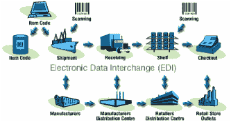

# 老派 API 的新方法

> 原文：<https://dev.to/gwintrob/a-new-approach-to-an-old-school-api-60o>

> 欢迎来到 [GET PUT POST](https://tinyletter.com/getputpost) ，这是一份关于 API 的时事通讯。每个版本都有一个 API 优先业务和杀手级应用理念的采访，供开发者在他们的平台上构建。想在收件箱里看到最新的采访吗？

本期节目中，我采访了 T2 Stedi 公司的创始人 T4 首席执行官扎克·坎特。他们正在对一个支持数百万笔交易的过时协议进行现代化改造，但你可能从未听说过它 EDI。我们谈论这位创始人从与零售商互动的痛点到设计现代 API 优先策略的旅程。我们还深入探讨了他们的无服务器架构，以及如何在发布前收集反馈。尽情享受吧！

### 你是怎么入门 Stedi 的？

我创立了一个由 2200 种在台湾和中国大陆制造的汽车零部件组成的品牌。我自己经营业务，当需要向零售商销售产品时，我不想一个接一个地手工输入订单。

[T2】](https://res.cloudinary.com/practicaldev/image/fetch/s--hrULE9v9--/c_limit%2Cf_auto%2Cfl_progressive%2Cq_auto%2Cw_880/https://cdn-images-1.medium.com/max/1024/1%2Ay48M3PmAuAf_xwWGdq8aZw.png)

我联系了所有的零售商，说:“你能把你的 API 规格发给我吗？他们都回答:“什么是 API？我解释说，“我正在尝试自动化所有的订单。他们告诉我，“你在找艾迪。"

EDI 是一种技术和分类法，用于思考公司之间如何相互沟通。它处理 [~300 种不同的交易类型](https://en.wikipedia.org/wiki/X12_Document_List)，包括从采购订单和确认到如何将货物装载到远洋运输工具上的指令。这也是一种文件格式和传输协议。

分类法是优雅的，但是文件格式和传输协议是可怕的。如果有人今天想注册 EDI，这是一个神秘的过程，包括在我们竞争对手的网站上安排一个销售演示。他们伸出手，进行 WebEx 演示，收到合同，协商价格，打印出来，扫描，传真回来，等等。六个月后，在与实施专家进行了十几次屏幕共享会议后，他们可以开始使用 EDI 了。

我们的短期愿景是为 EDI 打造一种类似 Shopify 或 Stripe 的自助式体验。任何非技术、有商业头脑的用户都可以注册 EDI，在几个小时内实现交易自动化，或者从沃尔玛、亚马逊或百思买等公司接收订单，而不是几周或几个月。

### 为什么有一个定制的商业协议，而不是像 XML feed 这样的东西？

EDI 是在 60 年代开发的。它最初是主机对主机的通信。这种形式在 80 年代被沃尔玛采用并推广开来。沃尔玛是普及 EDI 的领导者之一，它使与供应商的交易自动化，并向供应商提供显示销售速度的数据，以便他们可以进行上游规划。

[T2】](https://res.cloudinary.com/practicaldev/image/fetch/s--x1ECRQYX--/c_limit%2Cf_auto%2Cfl_progressive%2Cq_auto%2Cw_880/https://cdn-images-1.medium.com/max/333/1%2Ahnf_85zZ3IWSBdt37AlTzw.png)

这是在 XML 和 JSON 出现之前。由于当时数据非常昂贵(沃尔玛是第一批拥有自己的卫星系统来共享这种数据的公司之一，这样做很昂贵)，它针对 EDI 行业中所谓的千字符(一千字符是 1000 个字符，大约是一千字节)进行了优化。他们试图优化以保持尽可能低的千字符数。这是一个复杂的、分层的平面文件。这很奇怪，但这都是为了最小化数据使用而设计的。

然后，当亚马逊在 90 年代和 21 世纪初出现时，他们希望与所有为沃尔玛供货的公司做生意。接纳这些供应商的最快方法是采用沃尔玛使用的相同标准。快进到今天，每个人都使用 EDI。

在美国流行的 EDI 的具体类型被称为 X12 标准。令人惊讶的是，整个零售商业行业基本上采用了相同的标准，这意味着人们可以根据一个标准进行编码，而不是必须为每个零售商做 500 个不同的一次性集成。

我对事情的是非曲直有分歧，艾迪。如果我们今天从头再做一遍，我绝不会说，“让我们用同样的方式做同样的文件格式，优化千字符，等等。然而，如果每个零售商都出去设计他们自己的令人敬畏的 API，而我们必须用他们自己的随时间变化的 API 与数以千计的不同贸易伙伴集成，那将是一场噩梦。

即使它是一个标准，每个人对它都有不同的实现或解释。如果我在 EDI 文档中查看给定字段，我知道它将是 3000 个可能的度量单位值中的一个。每个公司可能使用五种不同的度量单位，因此每个 EDI 映射都涉及到一定程度的配置和定制。

### 而 Stedi 的作用就是抽象掉那些特质差异？

没错。我们的客户永远不必考虑 EDI。我们处理所有的复杂性，只给他们我们内部的、规范的 JSON 格式。

### 你会单独与零售商整合还是向所有人开放？

我们必须与每个零售商单独集成，但是因为每个零售商都基于相同的标准，所以我们能够构建一个通用的翻译引擎，为每个零售商进行不同的配置。您可以向我们提供来自沃尔玛、塔吉特百货、亚马逊的采购订单，我们会将每一个订单映射到我们的内部格式。

两者之间有相当多的重叠。一旦我们完成了前 50 个零售商，我们可能会接近需要完成的映射的 98%。

### 零售商的反馈是什么？

EDI 是一个无权限的框架。只要人们能够进行 EDI 握手并以 EDI 格式创建有效的响应文档，他们一般不需要获得零售商的许可。例如，如果有人想通过 EDI 与亚马逊集成，亚马逊不必批准处理 EDI 集成的公司。

例如，假设一个水瓶品牌在 Kickstarter 上销售价值 500 万美元的水瓶。如果亚马逊想开始在他们的仓库里储存这些水瓶，亚马逊将与该品牌建立供应商关系，并开始发出订单。如果制造商希望自动化这些订单，他们将通过亚马逊的 EDI 入职流程。亚马逊会问，“你的 EDI 服务器地址是什么？这个地址可能是 Stedi 的 edi 服务器，竞争对手的 EDI 服务器，或者是你车库里运行的服务器。

随着时间的推移，我们有办法改变这种状况。因为很多 EDI 公司需要很长时间来完成集成，而且他们的流程非常困难，我们认为，随着时间的推移，如果我们为一家零售商完成 50 个出色的供应商集成，零售商可能会说，“嘿，这真的很好。这是我们标准集成所需时间的十分之一。一旦发生这种情况，我们可以与零售商达成某种协议。

但在短期内，这是一个看不见的过程——零售商可能甚至不知道 Stedi 的存在。

### 你能给出其他一些想与 Stedi 合作的公司的例子吗？

任何向大型零售商出售实物产品的人都可能是我们的客户。

每个 EDI 交易都有一个编号，例如 850(采购订单)或 855(采购订单确认)或 810(发票)。没有汽车零部件的订单，也没有电子产品的订单；它是一个单一的采购订单规范，包含可能订购的任何类型的产品。借助我们构建的集成，我们可以实现从食品杂货到消费电子产品等任何类型产品的自动化交易。

### 你的目标市场是什么？

六个月前，我会说，“我们将从与还没有使用 EDI 的人签约开始，因为让人们转换是相当困难的。这是我们的第一个假设。

<figure> 

<figcaption>来源:[扎克的 ted Talk](https://www.youtube.com/watch?v=flinVCFYUjA)</figcaption>

</figure>

但是我们已经做了一些内容营销，我为 TechCrunch 写了一篇关于[亚马逊的文章，这篇文章迅速走红。我们有很多测试版注册。疯狂的是，10 个测试版注册用户中有 9 个是我们竞争对手的现有客户。](https://techcrunch.com/2017/05/14/why-amazon-is-eating-the-world/)

我们认为它会是相反的，但是 Stedi 与那些经历过或者正在经历 edi 实现的痛苦的人产生了共鸣。除非你尝试过，否则很难想象它有多糟糕。

我以前掉进过的陷阱是“如果你建造了它，他们就会来假设。构建一个漂亮的 API，然后假设人们会使用它——但事实并非如此。

我不能详细介绍我们的战略，但我们已经找到了如何利用 EDI 特有的一些特质。

### 向前看 10 年，当每个需要与零售商整合的人都在通过 Stedi 进行整合时。

EDI 有两种类型:“网络表单”和“集成”。"

Webforms 实际上只是一个基于浏览器的界面，用于手动处理 EDI 事务。信不信由你，如今绝大多数 EDI 用户都在使用这种手工 webforms 流程，他们实际上是在为每一笔交易复制和粘贴数据。

Webforms 基本上是一个门户，它汇集了来自不同零售商的订单，允许用户创建响应文档。例如，一家公司收到一份采购订单，将其下载为 PDF 或 CSV 格式，手动创建采购订单确认，然后创建发货通知和发票。

我们认为这整个过程是疯狂的。EDI 最初的梦想是使两个贸易伙伴之间的所有交易自动化。Webforms 不是自动化——它只是手动处理事务的一种稍微快一点的方式。我们专注于“集成 EDI ”,在这方面，我们实现了端到端交易流程的完全自动化。我们正在通过我们的 API 以及与 ERP 和 Flexport 等其他平台的预构建集成来实现这一目标。

[Flexport API 如何支持全球贸易](https://getputpost.co/how-the-flexport-api-enables-global-trade-92b9131d4bd4)

一旦我们处理了所有这些结构化数据，并且每个人都是 Stedi 的客户，我们的计划是建立一个开发者市场或应用程序商店，允许人们在我们的管道上构建业务应用程序。

### 请详细介绍一下您的堆栈以及您使用的不同技术。

我非常相信无服务器的想法。我们正在大量利用 AWS Lambda 和 API Gateway、SQS 和 RDS Aurora 等服务。我们已经进行了几个月的建设，但仍然没有服务器，我们认为这将在开发运维开销方面给我们带来很大的优势。

对我们来说，使用像 AWS Lambda 这样的东西，我们得到了 100 万个 20 美分的请求，这让我们比竞争对手有一些优势。你可以想象，对于一家传统的 EDI 公司来说，黑色星期五和网络星期一之前的几周是什么样的。无服务器使我们能够针对峰值需求进行大规模扩展，而无需为任何未使用的容量付费。

这也意味着我们可以对我们的交易进行精细的成本核算。如果我们想成为一家大型零售商的客户，我们就必须在价格上具有竞争力。我们标记了所有的 Lambda 和 API 网关调用，并且知道它的成本是多少。我们可以精确地计算出处理一个 EDI 文档的交易成本。对于自动扩展的服务器来说，这要困难得多。

### 你在用 Java？

我们是。我们从一开始就没有打算使用 Java。我说，“我们将努力做到语言不可知，挑选我们能找到的最好的后端工程师。”我们采访了很多人，我们找到的最佳人选是一名 Java 工程师。

使用 AWS Lambda 的好处是，如果我们愿意，我们可以在 Python 中有一个函数，在 Java 中有一个函数，在其他语言中有一个函数。很容易把一切都拆散。

显然，这将产生其他组织问题；我们试图在很大程度上坚持使用 Java，或者至少是 JVM 语言。在某个时候，我们可能会用类似 Scala 的东西重写我们的 EDI 解析引擎，但是现在，我们使用 Java。Java 并不酷，但无服务器很酷，我们认为这可以平衡它。

### 在开始之前，你是如何收集顾客反馈的？

有一句名言，“没有一家餐馆会因为太小而倒闭。这是我们经常思考的问题。

然而，EDI 的问题是，我们不能说，“好吧，我们将推出一个 MVP，人们可以接收采购订单，但他们不能发送确认或发票。为了使它有用，所有这些事情都必须做。

我们不能一起破解它，只有 99%的信息成功通过。我们处理的是人们的钱和在现实世界中运送真实产品的实际订单，所以必须 100%准确。

最重要的是，很少有品牌只卖给一家零售商，所以我们必须为大多数主要零售商建立整合，以便对我们的客户有用。

因此，这是一个很大的发展障碍，这就是为什么我们必须是一个资金充足的公司，以建立一个功能齐全的电子数据交换平台，即使我们专注于建立一个小的，因为我们可以服务于早期客户..

我们遇到的问题是我们不想在真空中建造。我们需要一种方法来经常发货，避免在没有任何验证的情况下工作几个月，但是我们不能搞砸真实客户的交易。

我们在这方面有独特的优势。我仍然拥有我以前创建的汽车零部件公司(尽管现在有人在经营它)，所以我们能够为“真正的阿尔法客户”一点一点地推出功能，而不用担心真的惹恼任何人。这个封闭的反馈回路使我们能够非常快速地建立——我们能够快速开始处理实时交易，而没有任何潜在的信誉风险。

为了找到错误并找出 EDI 带来的所有边缘案例，我们有一群试点用户，他们在我们开始接纳付费用户之前，正在使用 Stedi 自动化他们的零售商关系。最终，我们将与拥有真实业务的测试用户合作，他们可以给我们残酷的反馈，因为这给了我们使平台变得伟大所需的信息。一旦我们为第一批早期用户做好了一切准备，我们就可以公开发布了。

*如果你喜欢这篇文章，我会非常感谢你在* [*推特*](https://ctt.ec/Qtbmn) *上分享它。*

*想在收件箱里看到更多 API 访谈吗？*

[T2】](https://tinyletter.com/getputpost)

* * *