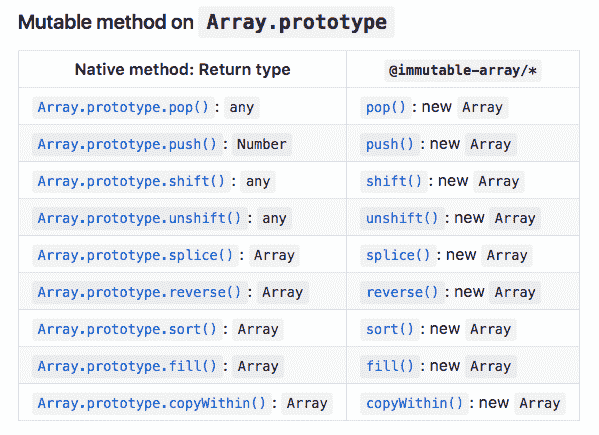

# 获取数组方法的不可变版本

> 原文：<https://dev.to/azu/get-immutable-version-of-array-methods-1nd>

你有没有想过不可变版本的`Array.prototype`方法？
例如，`Array.prototype.push`返回一个新的`Array`而不是项目数。

我已经创建了[不可变数组原型](https://github.com/azu/immutable-array-prototype)包。

## 为什么不可改变？

ECMAScript 数组有一些可变的方法。

*   [数组- JavaScript | MDN](https://developer.mozilla.org/en-US/docs/Web/JavaScript/Reference/Global_Objects/Array)

<figure>[](https://res.cloudinary.com/practicaldev/image/fetch/s--DN-mWuTY--/c_limit%2Cf_auto%2Cfl_progressive%2Cq_auto%2Cw_880/https://cdn-images-1.medium.com/max/599/1%2ADOwBN5p5bCJ5ZKKRiKQCgg.png) 

<figcaption>可变 vs 不可变</figcaption>

</figure>

例如，Redux 要求在您的存储实现上有[不可变的更新](http://redux.js.org/docs/recipes/reducers/ImmutableUpdatePatterns.html)。

`Object.assign`或 object spread( `{ ...object }`)可以实现对象的不可变更新。但是，对数组的永久更新是困难的。

*   [不可变更新模式——Redux](http://redux.js.org/docs/recipes/reducers/ImmutableUpdatePatterns.html)

当然， [Immutable.js](https://facebook.github.io/immutable-js/) 是有用的。但是[不可变. js](https://facebook.github.io/immutable-js/) 是非常大的库。

所以，我想得到最小的和易于使用的库。

## [`@immutable-array/prototype`T4】](https://github.com/azu/immutable-array-prototype)

[`@immutable-array/prototype`](https://github.com/azu/immutable-array-prototype) 包括`Array.prototype`方法的不可变版本。

```
npm install @immutable-array/prototype 
```

Enter fullscreen mode Exit fullscreen mode

或者，如果你想要一个单独的方法，你可以使用一个方法作为独立的包。

```
npm install @immutable-array/pop
npm install @immutable-array/push
npm install @immutable-array/shift
npm install @immutable-array/unshift
npm install @immutable-array/sort
npm install @immutable-array/reverse
npm install @immutable-array/fill
npm install @immutable-array/splice
npm install @immutable-array/copy-within 
```

Enter fullscreen mode Exit fullscreen mode

#### 举例

这个库提供了相同的 API 和行为，没有第一个参数。

```
import {
  sort,
  unshift,
  push,
  fill,
  splice,
  pop,
  reverse,
  copyWithin,
  shift
} from '@immutable-array/prototype';
describe('prototype', () => {
  it('shift', () => {
    assert.deepStrictEqual(shift(['a', 'b', 'c', 'd', 'e']), [
      'b',
      'c',
      'd',
      'e'
    ]);
  });
  it('unshift', () => {
    assert.deepStrictEqual(unshift(['a', 'b', 'c', 'd', 'e'], 'x'), [
      'x',
      'a',
      'b',
      'c',
      'd',
      'e'
    ]);
  });
  it('pop', () => {
    assert.deepStrictEqual(pop(['a', 'b', 'c', 'd', 'e']), [
      'a',
      'b',
      'c',
      'd'
    ]);
  });
  it('push', () => {
    assert.deepStrictEqual(push(['a', 'b', 'c', 'd', 'e'], 'x'), [
      'a',
      'b',
      'c',
      'd',
      'e',
      'x'
    ]);
  });
  it('splice', () => {
    assert.deepStrictEqual(splice(['a', 'b', 'c', 'd', 'e'], 0, 1, 'x'), [
      'x',
      'b',
      'c',
      'd',
      'e'
    ]);
  });
  it('sort', () => {
    assert.deepStrictEqual(sort(['e', 'a', 'c', 'b', 'd']), [
      'a',
      'b',
      'c',
      'd',
      'e'
    ]);
  });
  it('reverse', () => {
    assert.deepStrictEqual(reverse(['a', 'b', 'c', 'd', 'e']), [
      'e',
      'd',
      'c',
      'b',
      'a'
    ]);
  });
  it('fill', () => {
    assert.deepStrictEqual(fill(new Array(5), 'x'), ['x', 'x', 'x', 'x', 'x']);
  });
  it('copyWithin', () => {
    assert.deepStrictEqual(copyWithin(['a', 'b', 'c', 'd', 'e'], 0, 3, 4), [
      'd',
      'b',
      'c',
      'd',
      'e'
    ]);
  });
}); 
```

Enter fullscreen mode Exit fullscreen mode

## 用例

[Faao](https://github.com/azu/faao) 即 GitHub 发布应用使用 [`@immutable-array/prototype`](https://github.com/azu/immutable-array-prototype) 创建领域模型。
Faao 使用 [Almin](https://github.com/almin/almin) 应用 DDD/CQRS 模式。不可变域模型有助于应用程序安全工作。

## 政策

[`@immutable-array/prototype`](https://github.com/azu/immutable-array-prototype) 有扶持政策。

### 做什么

*   提供不可变版本的`Array.prototype`方法
*   将每个方法作为一个模块提供
    *   例如，`import push from "@immutable-array/push"`
    *   所有原型方法:`import { push } from "@immutable-array/prototype"`
*   没有第一个参数的 ECMAScript 兼容 API

例如，`@immutable-array/*`方法应该返回与原生 API 相同的结果。

```
import { splice } from '@immutable-array/splice';
var array = [1, 2, 3];
// immutable
var resultArray = splice(array, -1, 1, 'x');
// native
array.splice(-1, 1, 'x');
assert.deepStrictEqual(array, resultArray); 
```

Enter fullscreen mode Exit fullscreen mode

### 不做

*   不应在 ECMAScript 中添加非标准方法
    *   例如，它不提供`update`、`delete`、`merge`方法。
*   每种方法不应该依赖于其他方法

## 终于

拉请求和明星随时欢迎:)

*   [https://github.com/azu/immutable-array-prototype](https://github.com/azu/immutable-array-prototype)