# 在 7 分钟内将 Firebase 身份验证添加到您的应用中

> 原文:[https://dev . to/ekeneeze/add-firebase-authentic ation-to-your-app-in-7 minutes-b25](https://dev.to/ekeneeze/add-firebase-authentication-to-your-app-in-7minutes-b25)

 
基于希望在 firebase 上构建自己的东西的开发人员的普遍需求，我将本教程放在一起，以帮助了解 firebase 认证的基础知识。首先，你需要创建一个谷歌账户“如果你没有的话”，然后用它在 console.firebase.google.com 创建一个 firebase 账户。当你的 firebase 帐户准备好了，然后连接到你的应用程序。
我想了不同的方法来处理这个话题，以展示它的全部本质，并确保你清楚地理解它，所以我创建了一个小型的 firebase 应用程序，让用户使用他们的注册凭证注册，使用这些凭证登录，并检索他们想要的尽可能多的信息。
希望通过构建这个应用程序，你将学会如何无缝地处理认证，所以要么和我一起构建，要么只是跟着读，无论哪种方式，你都会学会。对于我的网友，我将在下一个版本中继续这篇文章；现在，我将继续从 android studio 构建。
所以创建一个新的 android studio 项目，名为“FreeStyle”(如果你不能或者仍然想学习如何在 AS 中创建新项目，参见我的文章解析远程 JSON，我详细解释了如何做)。
接下来是将您的应用程序连接到 firebase，有多种方法可以做到这一点，但我将坚持使用我在其他方法中更喜欢的方法，即在您的 android studio 中
点击工具选项卡
点击 firebase
点击身份验证
点击连接到 firebase
创建 firebase 项目后，
单击“将 firebase 身份验证添加到您的项目中”
注意:对于这一部分，您的系统必须在线，如果您之前没有这样做，它可能会要求您提供 firebase 凭据，因此只需提供凭据并继续。 一旦你的项目连接到 firebase，你会得到一个允许 firebase 修改你的 gradle 文件的提示，一旦你允许，它会自动添加 firebase 依赖到你的 build.gradle 文件中。！你的 firebase 应用程序已经准备好了，恭喜！！ðÿ˜€ðÿ˜€ðÿ˜€
你知道，当你在代码中完成一些事情时，微笑和开心是很好的练习，我的意思是，我们还看不到它，所以如果你偶尔欣赏一下自己，这是非常酷的。
现在你已经玩得很开心了，让我们开始创建必要的布局，首先我们将创建注册布局。它将有 2 个输入字段；比如一个电子邮件字段和一个密码字段。这一部分对每个人来说都应该相当简单，但是为了完整起见，我将带您了解如何做到这一点。因为您已经有了 activity_main.xml，所以让我们只处理它，而不是为注册创建一个单独的布局文件。因此，打开 activity_main.xml 文件，输入以下代码

[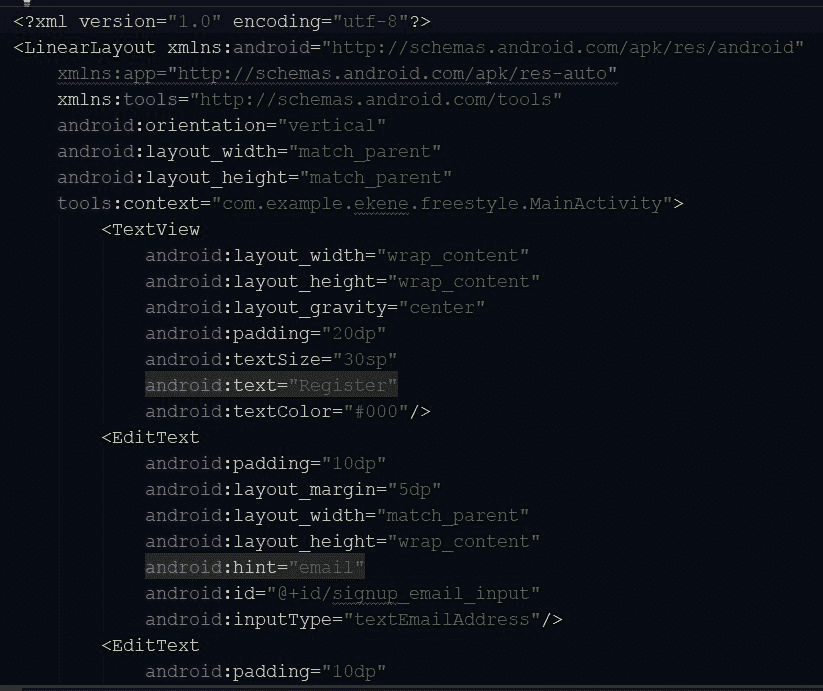](https://res.cloudinary.com/practicaldev/image/fetch/s--TCHDuZFL--/c_limit%2Cf_auto%2Cfl_progressive%2Cq_auto%2Cw_880/http://res.cloudinary.com/kennyy/image/upload/v1508241582/Reg1_1st_aqmfqx.jpg) 
[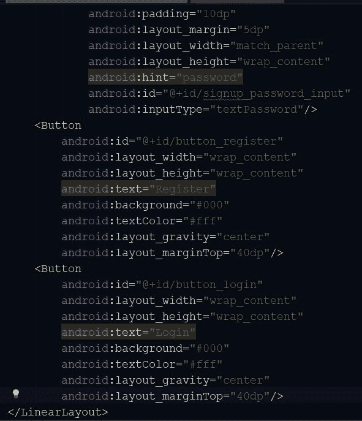](https://res.cloudinary.com/practicaldev/image/fetch/s--raBQAyai--/c_limit%2Cf_auto%2Cfl_progressive%2Cq_auto%2Cw_880/http://res.cloudinary.com/kennyy/image/upload/v1508241566/Reg2_2nd_h2s96x.jpg) 
您应该更加注意您分配给视图对象的 id，因为您将在其他活动中使用它们作为参考，但是如果您使用了与我在上面的代码片段中使用的完全相同的 id，那就没问题了。

[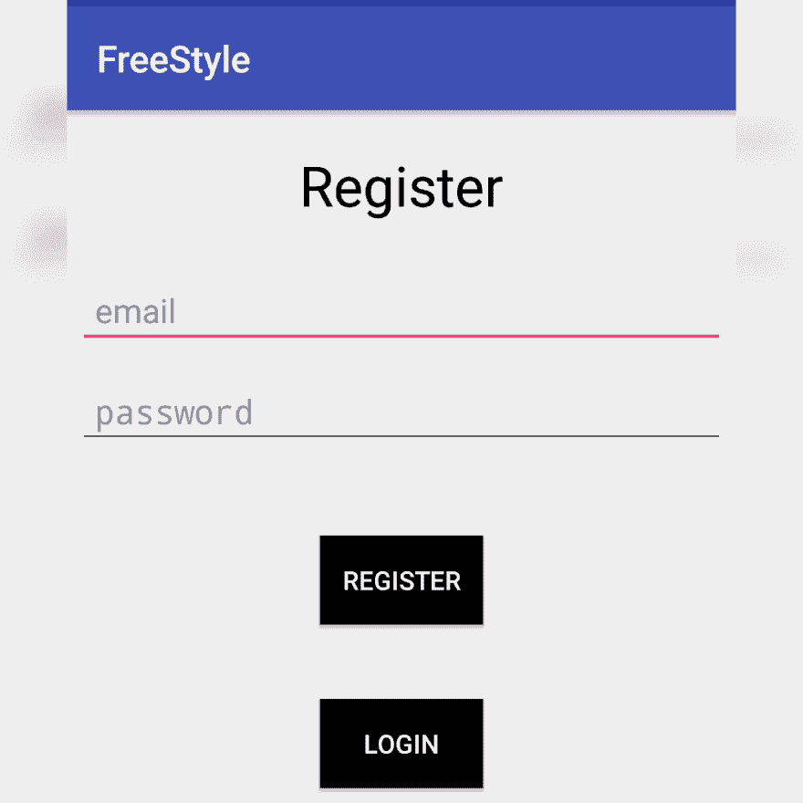](https://res.cloudinary.com/practicaldev/image/fetch/s--SIwENH0S--/c_limit%2Cf_auto%2Cfl_progressive%2Cq_auto%2Cw_880/http://res.cloudinary.com/kennyy/image/upload/v1508241579/reg_3rd_hgm29s.jpg) 
现在，当用户填写字段并单击注册按钮时，他们的凭据将存储在 firebase 中，注册成功后，将启动 ProfileActivity，这样他们就可以查看他们的详细信息，因为这些信息将显示在个人资料页面中。因此，在 MainActivity.java 文件中，我们声明了视图对象的实例和 FirebaseAuth 的实例；

[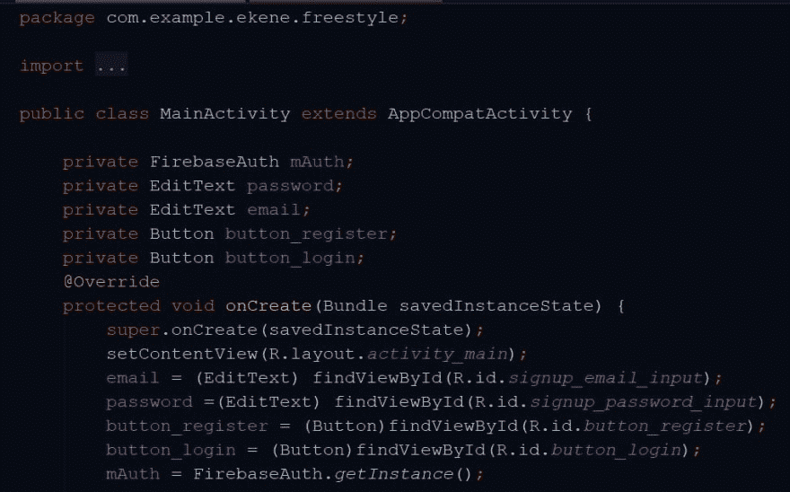](https://res.cloudinary.com/practicaldev/image/fetch/s--2evWoZrR--/c_limit%2Cf_auto%2Cfl_progressive%2Cq_auto%2Cw_880/http://res.cloudinary.com/kennyy/image/upload/v1508241583/4th_lmetu8.jpg) 
现在让我们创建一个注册用户的方法。首先，我们将获取()输入字段的值，并将它们存储在字符串变量中，这样我们就可以使用它们作为字符串在 firebase createUserWithEmailAndPassword()方法中创建用户。
接下来，我们设置条件来检查空的或格式错误的输入字段，这样用户就不能使用格式错误的电子邮件地址或空的密码/电子邮件输入字段进行注册。
最后，为了在 firebase 上创建用户，我们在 FirebaseAuth 实例上调用 createUserWithEmailAndPassword()方法，并实现 onComplete()方法。在 onComplete()方法中，我们将决定当用户成功注册或注册失败时会发生什么。在我的例子中，如果用户注册成功，那么我将制作一个 Toast(注册成功)并启动用户配置文件，如果失败，我将制作一个 Toast(注册失败)。然而，我将用“try and catch”将 onComplete()方法中的所有内容括起来，因为它将执行网络功能。
[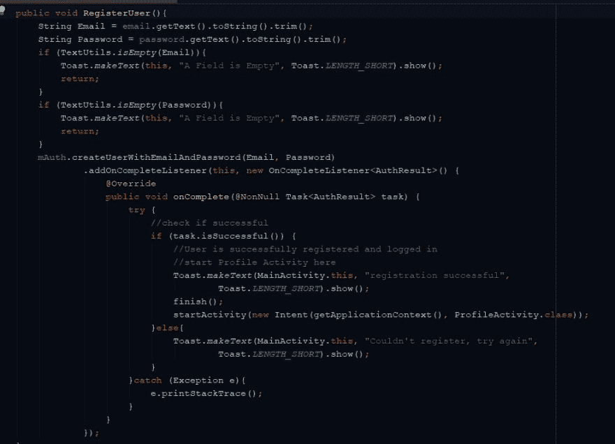](https://res.cloudinary.com/practicaldev/image/fetch/s--1axOkqxE--/c_limit%2Cf_auto%2Cfl_progressive%2Cq_auto%2Cw_880/http://res.cloudinary.com/kennyy/image/upload/v1508241569/RegUserMain_5th_idkfls.jpg) 
然后在 register 按钮上，我们设置一个 OnClickListener 来调用 registerUser()方法。如果用户已经注册，我们还在 login 按钮上设置一个 OnClickListener，以便在单击按钮时启动 LoginActivity。
[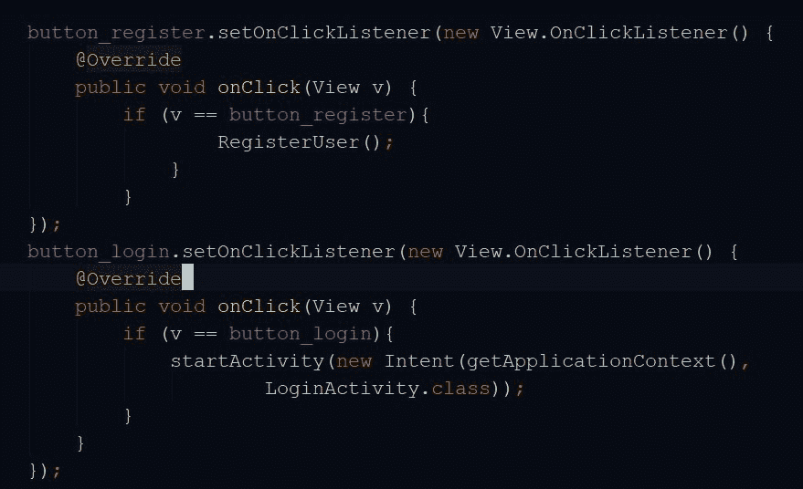](https://res.cloudinary.com/practicaldev/image/fetch/s--I21ziW1E--/c_limit%2Cf_auto%2Cfl_progressive%2Cq_auto%2Cw_880/http://res.cloudinary.com/kennyy/image/upload/v1508241566/ButtonReg_6th_ophpid.jpg) 
现在让我们创建 ProfileActivity 类，右键单击 java 并选择 New>Activity>Empty Activity 并将其命名为 ProfileActivity。
在 activity_profile.xml 文件中，创建视图对象，这些对象将保存您希望在 ProfileActivity 中显示的数据。在我的例子中，我想显示他们的电子邮件和用户 id。因此，我将有 2 个 TextViews 及其相应的 id。
[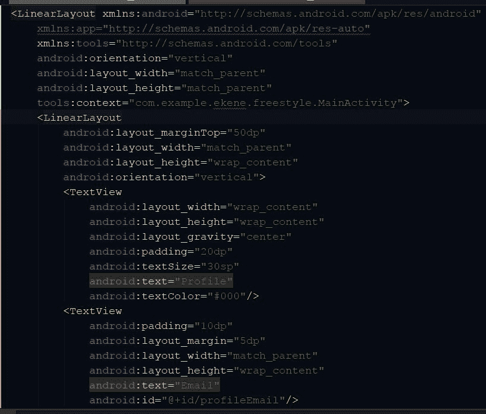](https://res.cloudinary.com/practicaldev/image/fetch/s--vI82KUbq--/c_limit%2Cf_auto%2Cfl_progressive%2Cq_auto%2Cw_880/http://res.cloudinary.com/kennyy/image/upload/v1508241583/ProfileLay1_7th_hulr4p.jpg)
[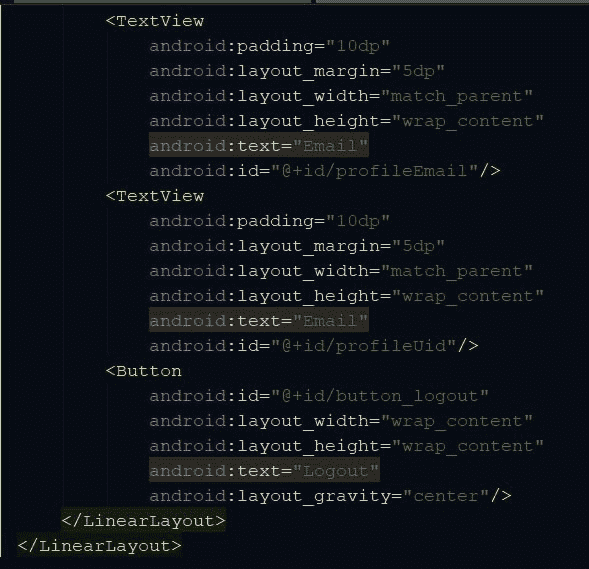](https://res.cloudinary.com/practicaldev/image/fetch/s--UOyx8N_4--/c_limit%2Cf_auto%2Cfl_progressive%2Cq_auto%2Cw_880/http://res.cloudinary.com/kennyy/image/upload/v1508241584/ProfileLay2_8th_g2cvl0.jpg)
在 ProfileActivity.java 文件中，声明 FirebaseAuth 实例并在 onCreate()方法中初始化它，就像我们对 MainActivity 类所做的那样。由于我们将显示用户信息，我们还需要声明 FirebaseUser 并实例化它以及视图对象的实例。然后，我们在布局文件上创建的视图对象上显示用户的详细信息。
由此:
firebase user user = mauth . getinstance()。getCurrentUser()；
如果(用户！= null){
String email = user . getemail()；
String Uid = user . getuid()；
}
[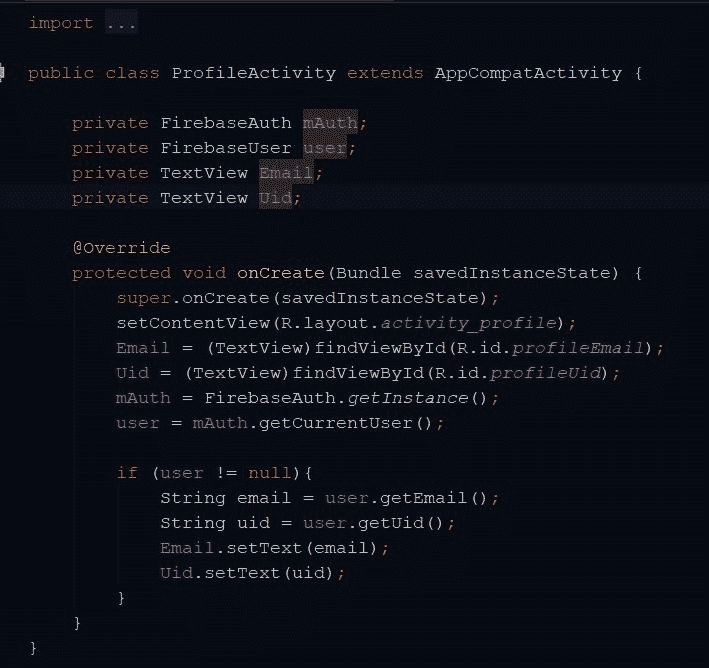](https://res.cloudinary.com/practicaldev/image/fetch/s--2ZCD5mGM--/c_limit%2Cf_auto%2Cfl_progressive%2Cq_auto%2Cw_880/http://res.cloudinary.com/kennyy/image/upload/v1508241578/ProfileMain_9th_iald8x.jpg)
[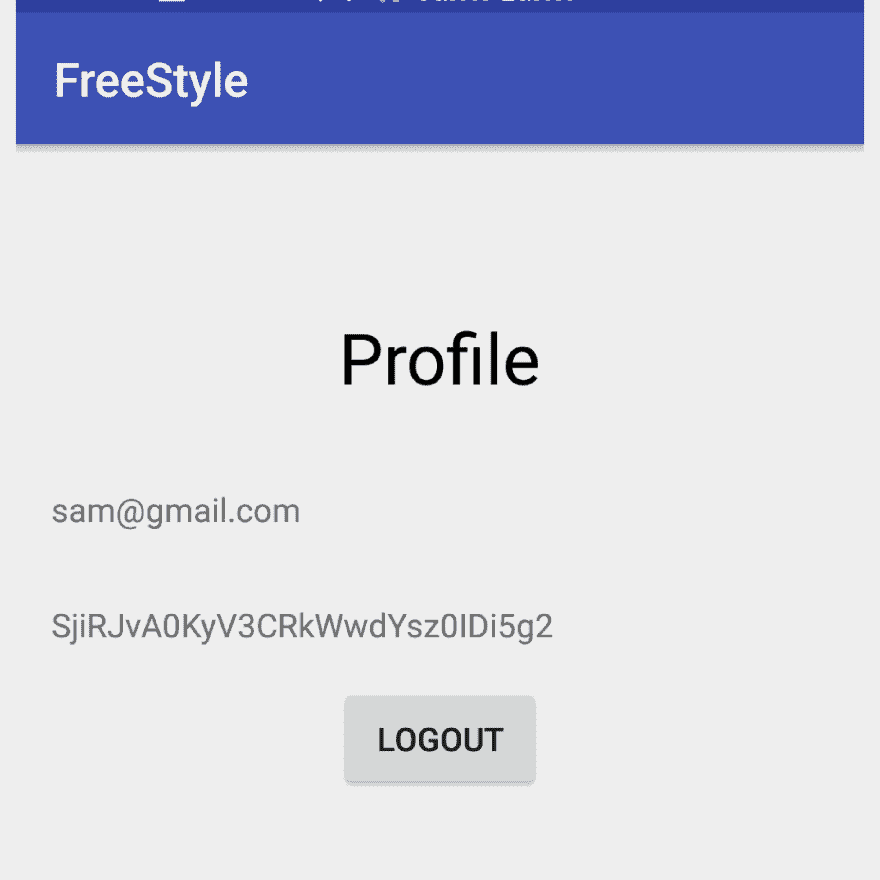](https://res.cloudinary.com/practicaldev/image/fetch/s--L0iArRDl--/c_limit%2Cf_auto%2Cfl_progressive%2Cq_auto%2Cw_880/http://res.cloudinary.com/kennyy/image/upload/v1508241584/profile_10th_jg36nt.jpg)
我还在这里添加了一个注销按钮，这样用户可以在查看完个人资料后注销并返回到登录状态。这很简单，只需在布局文件上添加一个按钮，给它一个 id，比如 button_logout。在 ProfileActivity 类中，只需初始化它并在其上设置一个 OnClickListener。onClick 方法应该做 if(user！= null){
mauth . sign out
}
LoginActivity
创建另一个名为 log in Activity 的活动(使用与我们创建 ProfileACtivity()相同的方法来完成)。打开 activity_login.xml 文件，为登录名和密码创建输入字段。

[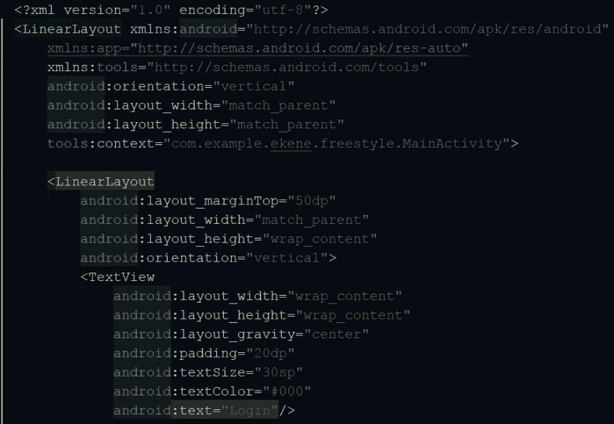](https://res.cloudinary.com/practicaldev/image/fetch/s--trv65Ydy--/c_limit%2Cf_auto%2Cfl_progressive%2Cq_auto%2Cw_880/http://res.cloudinary.com/kennyy/image/upload/v1508241573/LoginLay1_11th_fv9tcy.jpg) 
[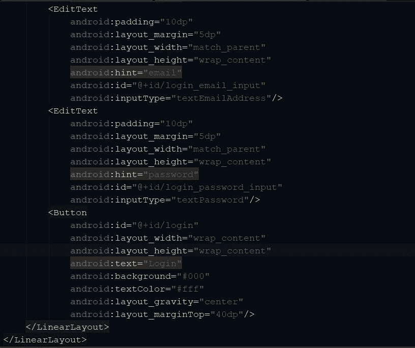](https://res.cloudinary.com/practicaldev/image/fetch/s--Od4b_zX_--/c_limit%2Cf_auto%2Cfl_progressive%2Cq_auto%2Cw_880/http://res.cloudinary.com/kennyy/image/upload/v1508241575/LoginLay2_12th_uod2up.jpg) 
接下来我们打开 LoginActivity.java 文件并声明 view objects 和 FirebaseAuth 的实例。然后在 oncreate()方法中初始化它们，就像我们对 ProfileActivity 所做的那样。
[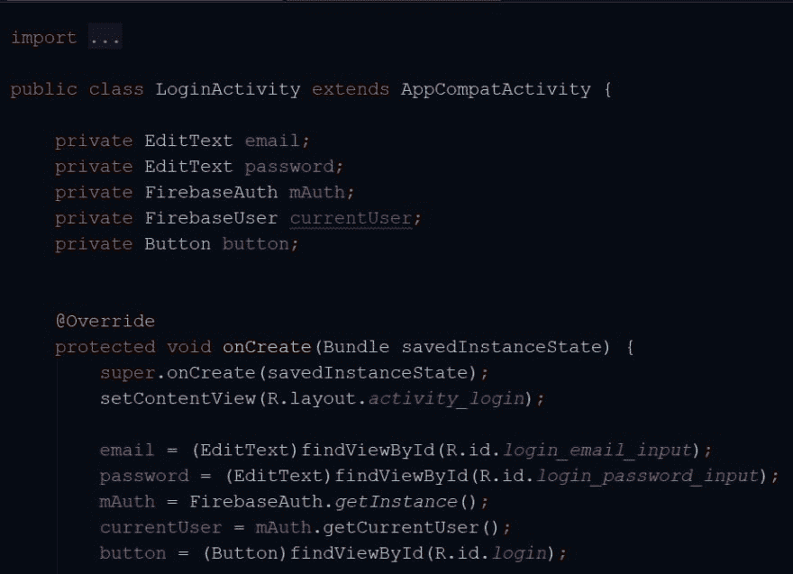](https://res.cloudinary.com/practicaldev/image/fetch/s--XmhQmx_1--/c_limit%2Cf_auto%2Cfl_progressive%2Cq_auto%2Cw_880/http://res.cloudinary.com/kennyy/image/upload/v1508241575/LoginMain1_13th_jj60sh.jpg) 
现在让我们创建一个让用户登录的方法。首先，我们将获取()输入字段的值，并将它们存储在字符串变量中，这样我们就可以使用它们作为字符串，通过 signInWithEmailAndPassword()方法让用户登录 firebase。
接下来，我们在 FirebaseAuth 实例上设置 signInWithEmailAndPassword()方法，并实现 onComplete()方法。在 onComplete()方法中，我们将决定当用户成功登录或登录失败时会发生什么。在我的例子中，如果用户成功登录，那么我将验证用户并启动 profileActivity，如果失败，我将只做一个 Toast(无法登录)。
[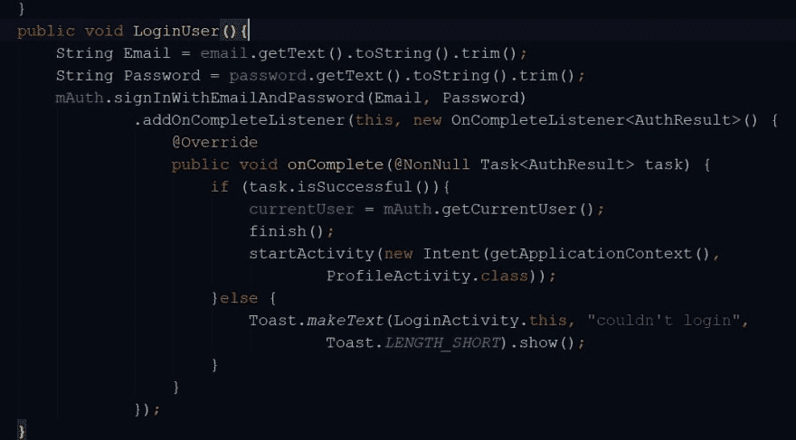](https://res.cloudinary.com/practicaldev/image/fetch/s--DWsWGNm5--/c_limit%2Cf_auto%2Cfl_progressive%2Cq_auto%2Cw_880/http://res.cloudinary.com/kennyy/image/upload/v1508241574/LoginMain5_14th_tcsqf8.jpg) 
然后在登录按钮上，我们设置一个 OnClickListener 来调用 loginUser()方法。
[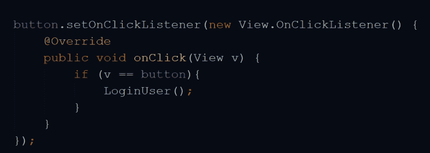](https://res.cloudinary.com/practicaldev/image/fetch/s--VewqXjuC--/c_limit%2Cf_auto%2Cfl_progressive%2Cq_auto%2Cw_880/http://res.cloudinary.com/kennyy/image/upload/v1508241568/LoginButton_15th_jstbsp.jpg)
[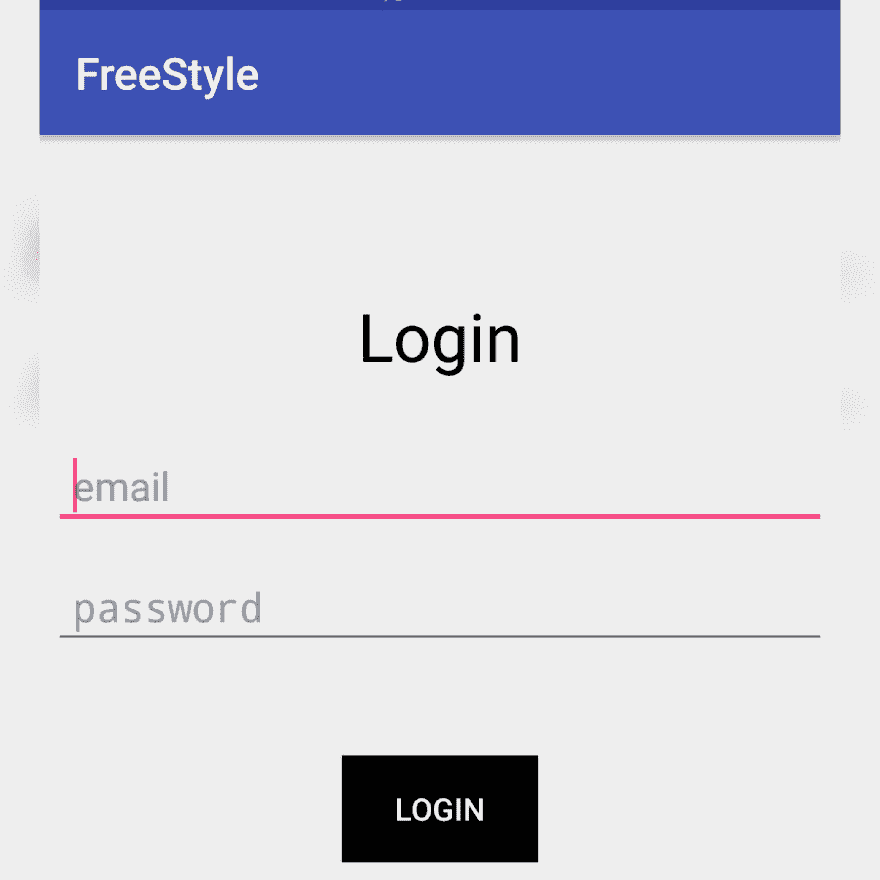](https://res.cloudinary.com/practicaldev/image/fetch/s--5gAPmQ_K--/c_limit%2Cf_auto%2Cfl_progressive%2Cq_auto%2Cw_880/http://res.cloudinary.com/kennyy/image/upload/v1508241569/login_16th_noegyb.jpg)
注意:在运行应用程序之前，您需要在 AndroidManifest.xml 文件中设置互联网权限，并在 firebase 控制台中启用电子邮件/密码作为登录方式。
其次，要查看在您的应用程序上成功注册的用户，请登录到您的 firebase 控制台，单击“身份验证”,然后单击“用户”选项卡。
[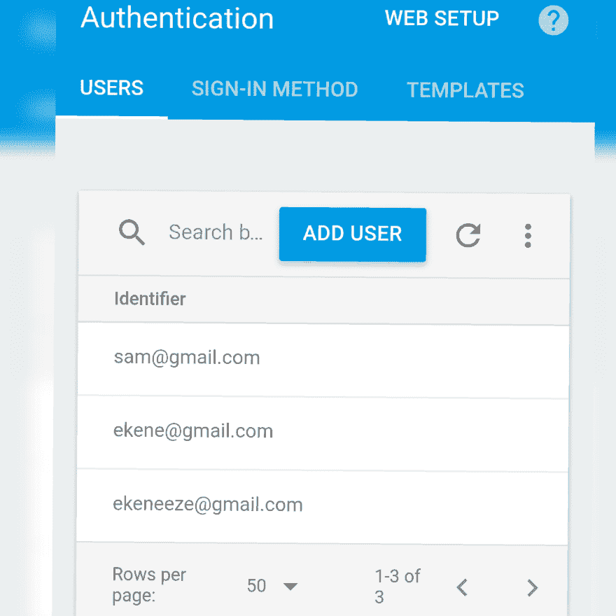](https://res.cloudinary.com/practicaldev/image/fetch/s--vYo-3eP2--/c_limit%2Cf_auto%2Cfl_progressive%2Cq_auto%2Cw_880/http://res.cloudinary.com/kennyy/image/upload/v1508241568/add_user_17th_gyjkl2.jpg) 
你可以实现更多的特性，比如在 firebase 数据库中存储数据、检索数据、向注册输入字段添加更多的字段并检索它们等等。本教程仅用于身份验证目的，使您的用户能够注册并使用其凭据登录到您的应用程序。你同样可以扩展它，添加电子邮件验证，Twitter，脸书或谷歌登录方法等。和往常一样，如果你有任何问题，我可以(twitter @kenny_io)提供更多说明并回答你的问题。
如果需要，github 上也有源代码。