# 在 Dijkstra 的帮助下找到最短的路径

> 原文:[https://dev . to/vaidehijoshi/finding-a-little-help-from-Dijkstra-CMI](https://dev.to/vaidehijoshi/finding-the-shortest-path-with-a-little-help-from-dijkstra-cmi)

如果你花足够的时间阅读编程或计算机科学，你很可能会一次又一次地遇到相同的想法、术语、概念和名称。他们中的一些人开始变得更加熟悉时间。自然地，有机地，有时不需要你太多的努力，你就开始学习所有这些事情的含义。发生这种情况是因为要么你已经慢慢开始理解这个概念，要么你已经读了足够多的时间，你开始真正理解它的意思。

然而，有一些想法和定义更难理解。这些是你觉得你应该知道的，但是你还没有遇到足够多的机会去真正理解它。

我们觉得自己*应该*知道——但从未真正抽出时间去学习——的话题是所有话题中最令人生畏的。进入的门槛是如此之高，理解一些你几乎没有背景的东西会感觉难以置信。对我来说，这个令人生畏的话题就是 Dijkstra 的算法。我总是听到有人顺便提到它，但从来没有遇到过，所以我从来没有试图理解它的背景或工具。

谢天谢地，在写这个系列的过程中，这一切都改变了。经过多年对 Dijkstra 算法的恐惧和焦虑，我终于理解了它。希望在这篇文章结束时，你也能明白！

### 让你心情沉重的图表

在我们真正进入 Dijkstra 超级著名的算法之前，我们首先需要挑选一些我们在这个过程中需要的重要信息。

在本系列中，我们慢慢地建立了不同数据结构的知识库。我们不仅学习了各种图形遍历算法，而且还自学了[图论](https://medium.com/basecs/a-gentle-introduction-to-graph-theory-77969829ead8)的基础知识，以及在我们的代码中用[表示图形](https://dev.to/vaidehijoshi/from-theory-to-practice-representing-graphs)的实际方面。我们已经知道，图可以是有向的，也可以是无向的，甚至可能[包含圈](https://dev.to/vaidehijoshi/spinning-around-in-cycles-with-directed-acyclic-graphs-4p7)。我们还学习了如何使用[广度优先搜索](https://dev.to/vaidehijoshi/going-broad-in-a-graph-bfs-traversal)和[深度优先搜索](https://dev.to/vaidehijoshi/deep-dive-through-a-graph-dfs-traversal)来遍历它们，使用两种非常不同的策略。

在我们理解图形和现有的不同类型的图形结构的过程中，有一种类型的图形我们已经设法跳过——直到现在，那就是。是时候让我们最终面对加权图了！

<figure> 

<figcaption>加权图:一个定义</figcaption>

</figure>

加权图很有趣，因为它与图是有向的、无向的还是包含圈没有多大关系。从本质上来说，**加权图**是一个图，它的边具有某种与之相关的值。赋予一条边的价值就是这条边的“权重”。

<figure>[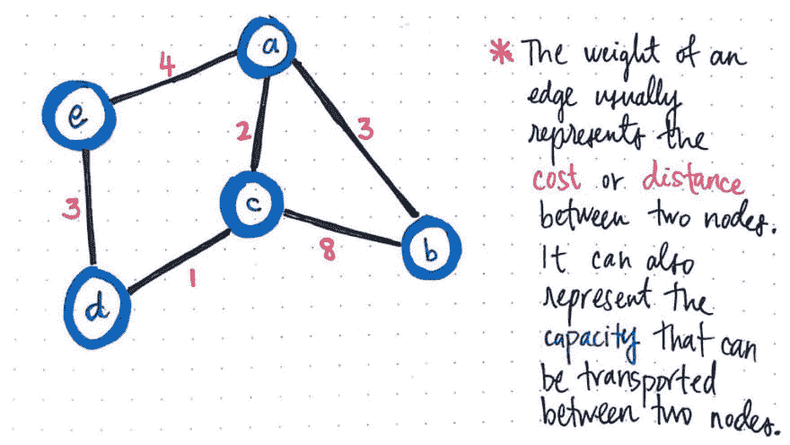](https://res.cloudinary.com/practicaldev/image/fetch/s--bSau-4dA--/c_limit%2Cf_auto%2Cfl_progressive%2Cq_auto%2Cw_880/https://cdn-images-1.medium.com/max/1024/1%2AbsmfwBs6adgzZao_3QNdgw.jpeg) 

<figcaption>一条边的权重代表两个节点之间的成本或距离。</figcaption>

</figure>

提及单条边的“权重”的一种常见方式是将其视为两个节点之间的*或 ***距离*** 。换句话说，从节点 a 到节点 b 是有成本的。*

 *或者，如果我们将节点想象成地图上的位置，那么权重可以改为节点 a 和 b 之间的距离。继续使用地图比喻，边的“权重”也可以表示可以运输的内容的*容量，或者可以在两个节点 a 和 b 之间移动的内容*

 *例如，在上面的示例中，我们可以确定节点 c 和 b 之间的成本、距离或容量的权重为 8。

<figure>[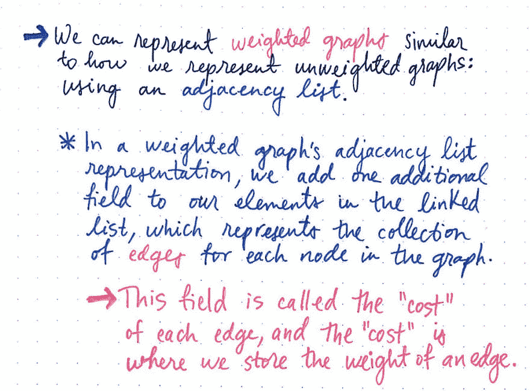](https://res.cloudinary.com/practicaldev/image/fetch/s--AOW8M4yB--/c_limit%2Cf_auto%2Cfl_progressive%2Cq_auto%2Cw_880/https://cdn-images-1.medium.com/max/1024/1%2ApuMy8EU5aCj4mv960M8v_Q.jpeg) 

<figcaption>我们可以用邻接表来表示加权图。</figcaption>

</figure>

边的加权度是将加权图与我们在本系列中到目前为止处理过的未加权图区别开来的唯一因素。

事实上，我们可能已经可以想象如何表示这些加权图了！一个加权图可以用一个邻接表来表示，增加了一个属性:一个存储图中每条边的成本/权重/距离的字段。基于我们之前对[图表示](https://dev.to/vaidehijoshi/from-theory-to-practice-representing-graphs)的研究，我们将回忆起邻接表中的图的边位于“列表”部分。

对于图中的每一条边，我们将调整链表的定义，使*保存*边，这样链表中的每个元素都可以包含两个值，而不是一个。这两个值将是相对节点的索引，这就是我们如何知道这条边连接到哪里，以及与这条边相关联的*权重*。

以下是邻接表格式的相同示例加权图的外观。

<figure>[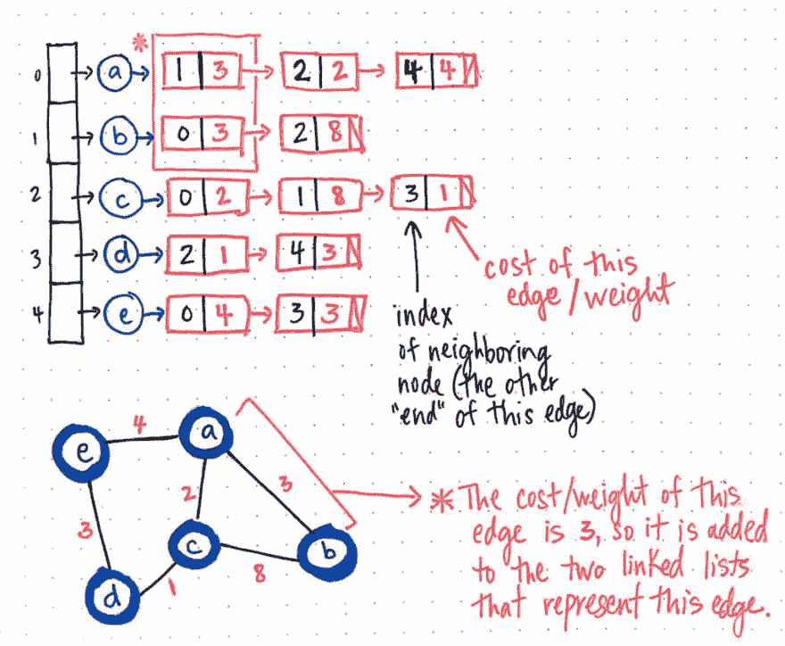](https://res.cloudinary.com/practicaldev/image/fetch/s--O-6GM9lQ--/c_limit%2Cf_auto%2Cfl_progressive%2Cq_auto%2Cw_880/https://cdn-images-1.medium.com/max/1024/1%2Ac1myQEwNTF8crkwIEmnAsg.jpeg) 

<figcaption>加权图作为邻接表。</figcaption>

</figure>

马上，我们将注意到关于这个图形表示的两件事情:首先，由于它是一个无向图，节点 a 和 b 之间的边将出现两次——一次在节点 a 的边列表中，一次在节点 b 的边列表中。其次，在任一节点各自的边列表中表示这个边的两个实例中，都有一个成本/权重存储在包含对相邻节点(在这种情况下，是 a 或 b)的引用的链表元素中。

好了，现在还没有什么太疯狂的事情需要我们去思考，对吗？

这就是图的权重开始使事情变得稍微复杂的地方:

> 当我们不得不考虑我们穿过的边的权重时，寻找两个节点之间的最短路径变得更加棘手。

让我们看一个例子，这将开始变得更加清晰。在下面简单的有向加权图中，我们有一个有三个节点(a、b 和 c)的图，有三条有向加权边。

<figure>[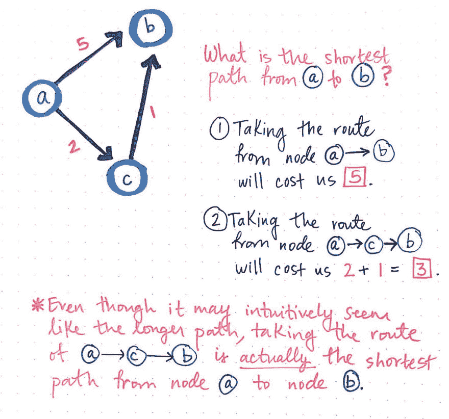](https://res.cloudinary.com/practicaldev/image/fetch/s--HmtqXsYi--/c_limit%2Cf_auto%2Cfl_progressive%2Cq_auto%2Cw_880/https://cdn-images-1.medium.com/max/1024/1%2APUQiFFYPVIkdbjBFH3o2RA.jpeg) 

<figcaption>节点 A 和 B 之间的最短路径是什么？</figcaption>

</figure>

查看此图，我们可能能够毫不犹豫地快速确定从节点 a 到节点 b 的最快路径。a 和 b 之间有一条边，因此这一定是最快的路径，对吗？

不完全是。考虑到这些边的权重，让我们更深入地看一看。如果我们走从节点 a 到节点 b 的路线，它将“花费我们”5。然而，如果我们走从节点 a 到节点 c 再到节点 b 的路线，那么我们只需要花费 3 英镑。

但是为什么是 3 呢？尽管从直觉上看，这可能是一条更长的路径，但如果我们总结从节点 a 到 c，然后从节点 c 到 b 的边，我们会发现总成本最终为 2 + 1，即 3。这可能意味着我们正在穿越两条边，但是成本 3 肯定比成本 5 更好！

在我们的三节点示例图中，我们可以很容易地看到起点和终点节点之间的两条可能路径。但是，如果我们的图表更大——比如说 20 个节点，会怎么样呢？考虑到我们的加权图的权重，对于我们来说，找到最短路径几乎不会那么容易。如果我们谈论的是一个更大的图表呢？事实上，我们处理的大多数图都远远大于 20 个节点。对于我们来说，用一种蛮力的方法来解决这个问题有多大的可行性、可扩展性和效率呢？

答案是*不是*那么可行。也不是真的好玩！这就是迪克斯特拉来救援的地方。

### 迪杰斯特拉的游戏规则

Dijkstra 的算法是独一无二的，原因有很多，当我们开始理解它如何工作时，我们很快就会看到这一点。但是有一点总是让人有点吃惊，那就是这个算法不仅仅是用来寻找图形数据结构中两个特定节点之间的最短路径。 ***Dijkstra 算法*** 可用于确定从图中的一个节点到同一图数据结构中的*每隔一个节点*的最短路径，前提是这些节点从起始节点可达。

<figure>[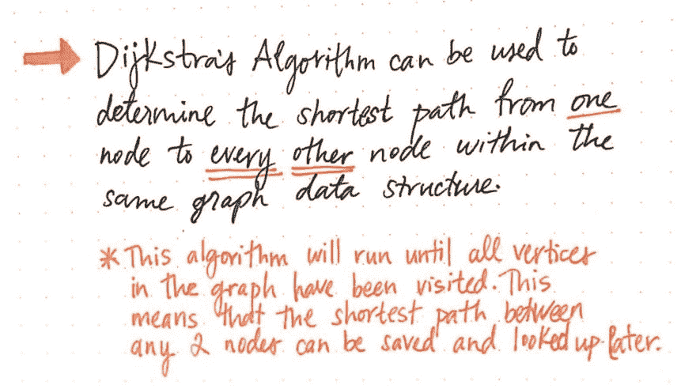](https://res.cloudinary.com/practicaldev/image/fetch/s--7bKBJD3O--/c_limit%2Cf_auto%2Cfl_progressive%2Cq_auto%2Cw_880/https://cdn-images-1.medium.com/max/1024/1%2AlGU6Eh6s7RL23_LZlzb5yg.jpeg) 

<figcaption>迪杰斯特拉的算法可以用来寻找最短路径。</figcaption>

</figure>

该算法将继续运行，直到访问了图中的所有可达顶点，这意味着我们可以运行 Dijkstra 算法，找到任意两个可达节点之间的最短路径，然后将结果保存在某个地方。一旦我们运行 Dijkstra 的算法仅仅*一次*，我们就可以一次又一次地从我们的算法中查找我们的结果——而不需要实际*运行*算法本身！我们唯一一次*需要*重新运行 Dijkstra 算法是在我们的图形数据结构发生变化的情况下，在这种情况下，我们会重新运行算法，以确保我们仍然拥有特定数据结构的最新最短路径。

那么，Dijkstra 的算法实际上是如何工作的呢？是时候最终一探究竟了！

<figure>[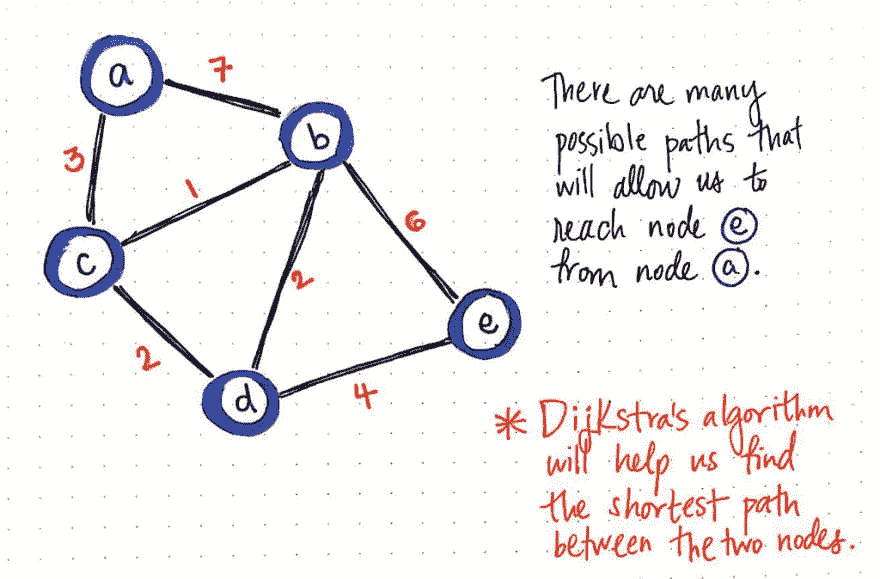](https://res.cloudinary.com/practicaldev/image/fetch/s--uNDc9U8e--/c_limit%2Cf_auto%2Cfl_progressive%2Cq_auto%2Cw_880/https://cdn-images-1.medium.com/max/1024/1%2ADcCsQRtkOCusXQFodZ7IhA.jpeg) 

<figcaption>在节点 A 和节点 e 之间有许多可能的路径</figcaption>

</figure>

考虑上面的加权无向图。假设我们想找到从节点 a 到节点 e 的最短路径。我们知道我们将从节点 a 开始，但我们不知道是否有路径到达它，或者是否有*多*条路径到达它！无论如何，我们不知道哪条路径是到达节点 e 的最短路径，如果这样的路径存在的话。

Dijkstra 的算法确实需要一些初始设置。但是，在我们开始之前，让我们快速看一下运行 Dijkstra 算法的步骤和规则。在我们的示例图中，我们将从节点 a 开始作为我们的起始节点。然而，运行 Dijkstra 的规则可以抽象出来，这样它们就可以应用于我们为了找到最短路径而遍历和访问的每一个节点。

<figure>[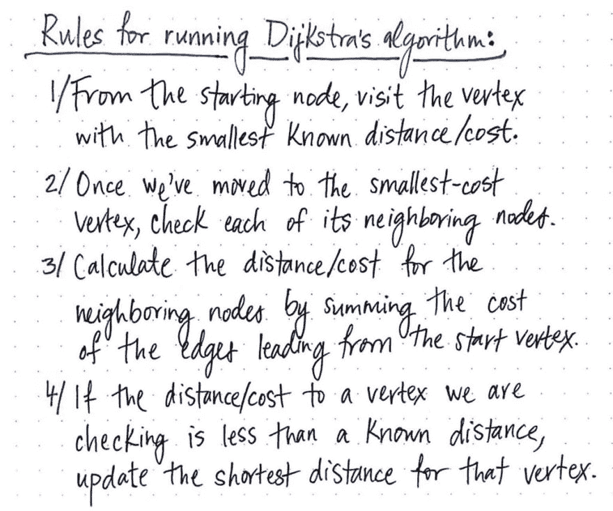](https://res.cloudinary.com/practicaldev/image/fetch/s--MuirC0iH--/c_limit%2Cf_auto%2Cfl_progressive%2Cq_auto%2Cw_880/https://cdn-images-1.medium.com/max/1024/1%2AXLP7wmt3mCdb-d0fS0VTbQ.jpeg) 

<figcaption>运行迪杰斯特拉算法的步骤和规则。</figcaption>

</figure>

抽象的规则如下:

1.  每当我们开始访问一个新的节点时，我们会选择已知距离/成本最小的节点首先访问。
2.  一旦我们移动到要访问的节点，我们将检查它的每个相邻节点。
3.  对于每个相邻节点，我们将计算相邻节点的距离/成本，方法是将导致我们正在检查的节点从 *到起始顶点*的边的成本相加。
4.  最后，如果到一个节点的距离/成本小于已知距离，我们将更新文件中该顶点的最短距离。

这些指令是我们将永远遵循的黄金法则，直到我们的算法运行完毕。所以，让我们开始吧！

首先，我们需要初始化一些东西，以便在算法运行时跟踪一些重要的信息。

<figure>[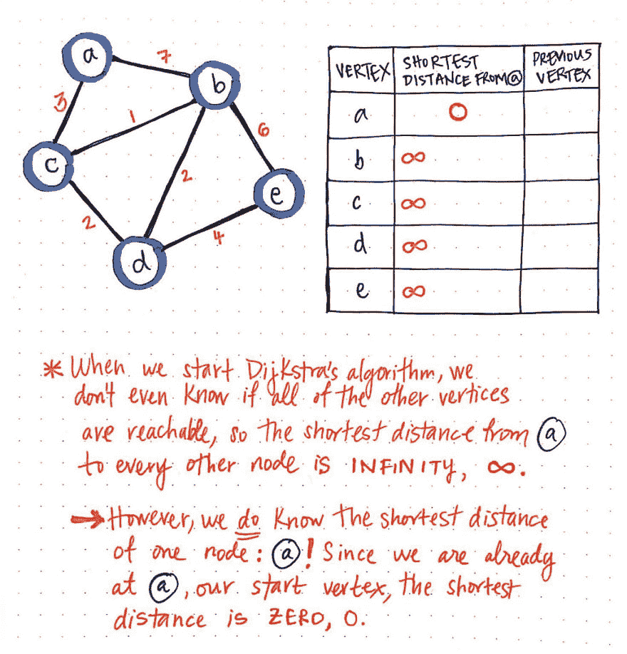](https://res.cloudinary.com/practicaldev/image/fetch/s--32L7qxJH--/c_limit%2Cf_auto%2Cfl_progressive%2Cq_auto%2Cw_880/https://cdn-images-1.medium.com/max/1024/1%2AnXlEmHAnu3dVBOnJAfPaAg.jpeg) 

<figcaption>迪杰斯特拉算法，part 1</figcaption>

</figure>

我们将创建一个表来记录到图中每个顶点的最短已知距离。在我们“检查”当前正在查看的顶点之前，我们还将跟踪我们从来的前一个顶点。

一旦我们设置好我们的表，我们需要给它一些值。当我们开始 Dijkstra 的算法时，我们什么都不知道！我们甚至不知道我们列出的所有其他顶点(b、c、d 和 e)是否都是从我们的起始节点 a 可以到达的(T3)

这意味着，当我们最初开始时，“从节点 a 开始的最短路径”将是 ***无穷大*** 。然而，当我们出发时，我们*确实*知道一个节点的最短路径，而且只知道一个节点:为什么，节点 a，当然是我们的出发节点！因为我们从节点 a 开始，我们已经在那里开始了。所以，从节点 a 到节点 a 的最短距离实际上正好是 0！

现在我们已经初始化了我们的表，在我们运行这个算法之前，我们还需要一个东西:一种跟踪我们访问过或没有访问过的节点的方法！我们可以用两个数组结构非常简单地做到这一点:一个已访问的数组和一个未访问的数组。

<figure>[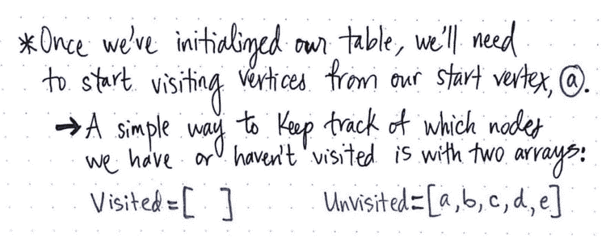](https://res.cloudinary.com/practicaldev/image/fetch/s--Ig_SBhwL--/c_limit%2Cf_auto%2Cfl_progressive%2Cq_auto%2Cw_880/https://cdn-images-1.medium.com/max/1024/1%2A4uv6Kq3hga8RLSUQWpQLAQ.jpeg) 

<figcaption>迪杰斯特拉算法:setting things up。</figcaption>

</figure>

当我们开始时，我们实际上还没有访问过任何节点，所以我们所有的节点都在未访问的数组中。

<figure>[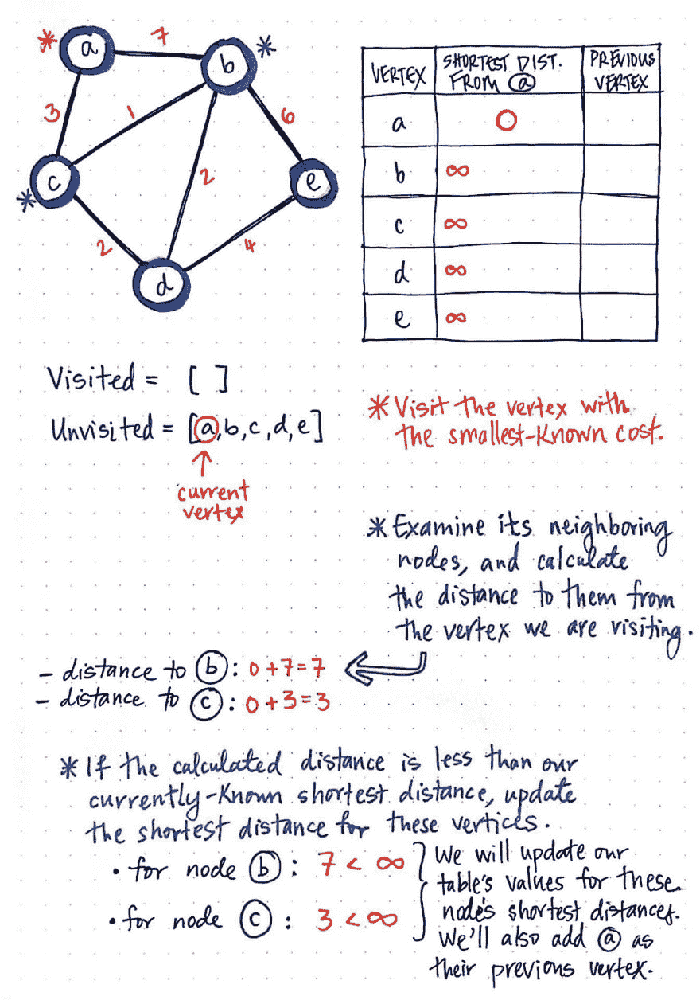](https://res.cloudinary.com/practicaldev/image/fetch/s--39WPoK-2--/c_limit%2Cf_auto%2Cfl_progressive%2Cq_auto%2Cw_880/https://cdn-images-1.medium.com/max/1024/1%2A1lrE19y01X5a16cfz8tXBA.jpeg) 

<figcaption>迪杰斯特拉算法，part 2</figcaption>

</figure>

好了，现在我们状态很好！让我们开始吧。还记得我们之前的四条规则吗？我们将一步一步地跟随它们，通过图中的每个顶点。

首先，我们将访问已知成本/距离最小的顶点。我们可以看看告诉我们到 a 的最短距离的列。现在，除了 a 本身，每个顶点的距离都是无穷大！因此，我们将访问节点 a。

接下来，我们将检查它的相邻节点，并计算从我们当前查看的顶点(即 a)到它们的距离。到节点 b 的距离是 a 的成本*加上到达节点 b 的成本*:在本例中是 7。类似地，到节点 c 的距离是*的开销加上*到节点 c 的开销:在本例中是 3。

最后，如果计算出的距离小于我们当前已知的这些相邻节点的最短距离，我们将使用新的“最短距离”更新我们的表值。目前，我们的表显示从 a 到 b 的最短距离是\\,从 a 到 c 的最短距离也是如此。由于 7 小于无穷大，3 小于无穷大，我们将节点 b 的最短距离更新为 7，节点 c 的最短距离更新为 3。我们还需要更新 b 和 c 的前一个顶点，因为我们需要记录我们是从哪里得到这些路径的！我们将把 b 和 c 的前一个顶点更新为 a，因为那是我们刚刚来的地方。

现在，我们已经检查完了节点 a 的邻居，这意味着我们可以将它标记为已访问！到下一个节点。

<figure> 

<figcaption>迪杰斯特拉算法，第三部分</figcaption>

</figure>

同样，我们将查看尚未访问的具有最小成本的节点。在这种情况下，节点 c 的成本为 3，这是所有未访问节点中最小的成本。因此，节点 c 成为我们当前的顶点。

我们将重复与之前相同的过程:检查节点 c 的未被访问的邻居，并计算它们从我们的原始节点节点 a 到的最短路径。节点 c 的两个尚未被访问的邻居是节点 b 和节点 d。到节点 b 的距离是 a 的成本*加上*从节点 c 到 b 的成本:在本例中为 4。到节点 d 的距离是*的开销加上*从节点 c 到节点 d 的开销:在本例中是 5。

现在，让我们将这两个“最短距离”与表中的值进行比较。现在，到 d 的距离是无穷大，所以我们在这里找到了一条更短的路径，值为 5。但是到节点 b 的距离呢？在我们的表中，到节点 b 的距离目前标记为 7。但是，我们发现了一条到 b 的更短的路径，这条路径经过 c，开销只有 4。因此，我们将用较短的路径更新我们的表！

我们还需要添加顶点 c 作为节点 d 的前一个顶点。请注意，节点 b 已经有了前一个顶点，因为我们之前找到了一条路径，现在我们知道这条路径实际上不是最短的。不用担心——我们将删除节点 b 的前一个顶点，用我们现在知道的路径更短的顶点来替换它:节点 c。

<figure>[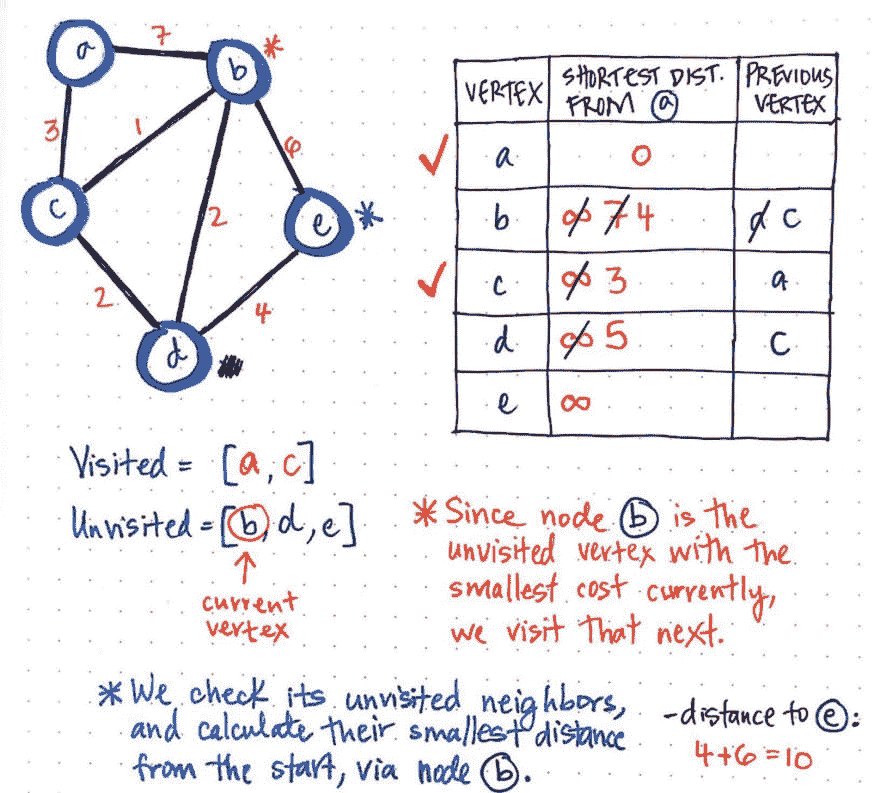](https://res.cloudinary.com/practicaldev/image/fetch/s--y7JS-OnY--/c_limit%2Cf_auto%2Cfl_progressive%2Cq_auto%2Cw_880/https://cdn-images-1.medium.com/max/1024/1%2AK3yWhgjshcexOQMh_LTWDg.jpeg) 

<figcaption>迪杰斯特拉算法，part 4</figcaption>

</figure>

好了，现在我们已经访问了节点 a 和 c，那么，我们接下来访问哪个节点呢？

同样，我们将访问具有最小成本的节点；在这种情况下，这看起来是节点 b，成本为 4。

我们将检查它的未访问邻居(它只有一个，节点 e)，并计算从原点节点*经过*我们当前的顶点 b 到 e 的距离。

如果我们将 b 的成本(4)与从 *b 到* *e* 的*成本相加，我们会看到这花费了我们 6。因此，我们最终得到的总成本是 10，这是从起始顶点到 e 的最短已知距离，经过我们当前的节点。*

<figure>[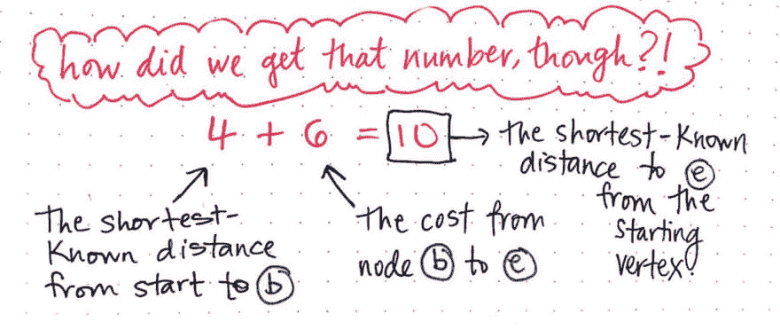](https://res.cloudinary.com/practicaldev/image/fetch/s--IrkUzCI2--/c_limit%2Cf_auto%2Cfl_progressive%2Cq_auto%2Cw_880/https://cdn-images-1.medium.com/max/1024/1%2AXg1OVLT9sXnP_AsYngXnAg.jpeg) 

<figcaption>但是，我们是怎么得到这个数字的呢？</figcaption>

</figure>

那么，我们是怎么得到这个数字的呢？一开始可能看起来很混乱，但是我们可以把它分解成几个部分。请记住，无论我们在看哪个顶点，我们总是想要求和从起点到当前顶点的最短已知距离。更简单地说，我们将查看表中的“最短距离”值，在本例中，该值为 4。然后，我们将查看从当前顶点到我们正在检查的邻居的成本。在这种情况下，从 b 到 e 的成本是 6，所以我们将把它加到 4。

因此，6 + 4 = 10 是我们从起点到节点 e 的已知最短距离。

### 迪杰斯特拉魔术的幕后

我们将继续对每个未被访问的顶点执行相同的步骤。在这个图中，我们要检查的下一个节点是 d，因为它是未访问节点中距离最短的。节点 d 的邻居中只有*一个*未被访问，即节点 e，因此这是我们需要检查的唯一一个节点。

<figure>[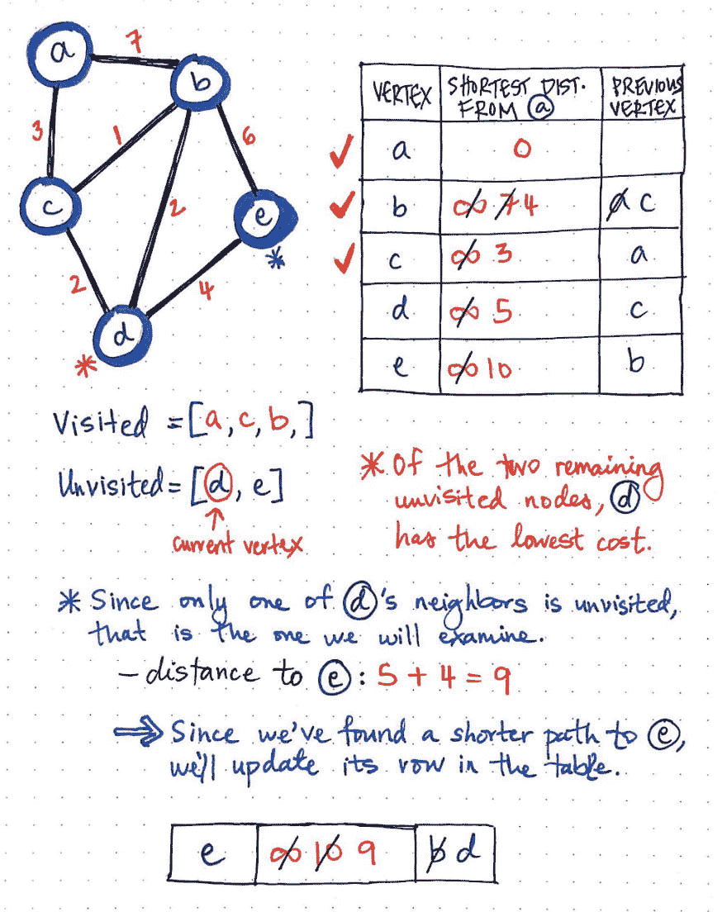](https://res.cloudinary.com/practicaldev/image/fetch/s--TBY2zWYu--/c_limit%2Cf_auto%2Cfl_progressive%2Cq_auto%2Cw_880/https://cdn-images-1.medium.com/max/1024/1%2AaJfwaqVN6vKvObqFDLE0ig.jpeg) 

<figcaption>迪杰斯特拉算法，第五部分</figcaption>

</figure>

当我们对节点 d 的距离和从节点 d 到 e 的成本求和时，我们会看到最终的值为 9，小于 10，这是到节点 e 的当前最短路径。我们将更新表中节点 e 的最短路径值和先前的顶点值。

<figure>[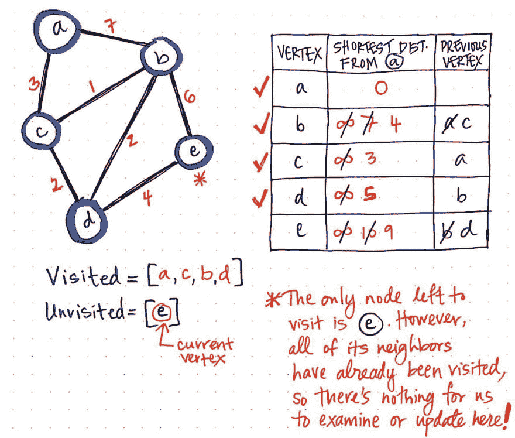](https://res.cloudinary.com/practicaldev/image/fetch/s--ILu8_TCf--/c_limit%2Cf_auto%2Cfl_progressive%2Cq_auto%2Cw_880/https://cdn-images-1.medium.com/max/1024/1%2AXfpj5ABWEnTs4JSqjQ7GNw.jpeg) 

<figcaption>迪杰斯特拉算法，part 6</figcaption>

</figure>

最后，我们只剩下一个要访问的节点:节点 e。

然而，显而易见的是，我们在这里没有什么可以真正做的事情！不需要检查节点 e 的邻居，因为已经访问了所有其他的顶点。

我们需要做的就是将节点 e 标记为已访问。现在，我们实际上已经完全*完成了*在这个图上运行 Dijkstra 算法！

在更新和更改表中的值时，我们删除了很多信息。让我们来看看这个表的一个更好、更干净的版本，只有这个算法的最终结果。

<figure>[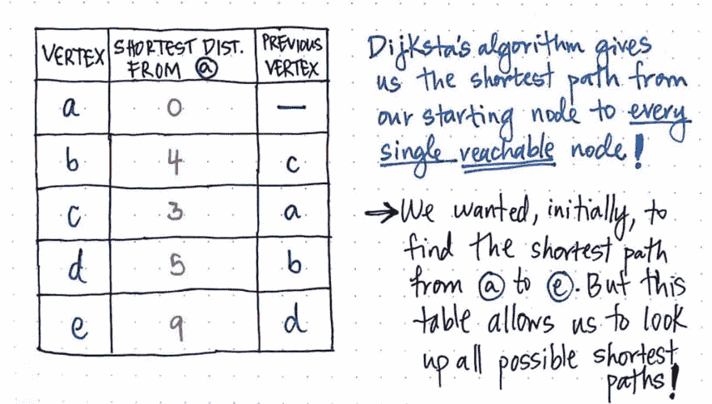](https://res.cloudinary.com/practicaldev/image/fetch/s--c8l63GqN--/c_limit%2Cf_auto%2Cfl_progressive%2Cq_auto%2Cw_880/https://cdn-images-1.medium.com/max/1024/1%2A5aDxt3Hi1jrhx-sy9JvKkA.jpeg) 

<figcaption>最终值来自于迪杰斯特拉算法。</figcaption>

</figure>

看这张表，可能不太明显，但是我们实际上已经得到了从我们的起始节点 a 开始的所有最短路径，就在我们的指尖。我们会记得，在前面，我们了解到 Dijkstra 的算法可以运行一次，我们可以一次又一次地重复使用所有的值——前提是我们的图表没有变化。这正是这种特性变得非常强大的原因。我们*出发*想要找到从 a 到 e 的最短路径。但是，这个表将允许我们查找*所有的*最短路径！

<figure>[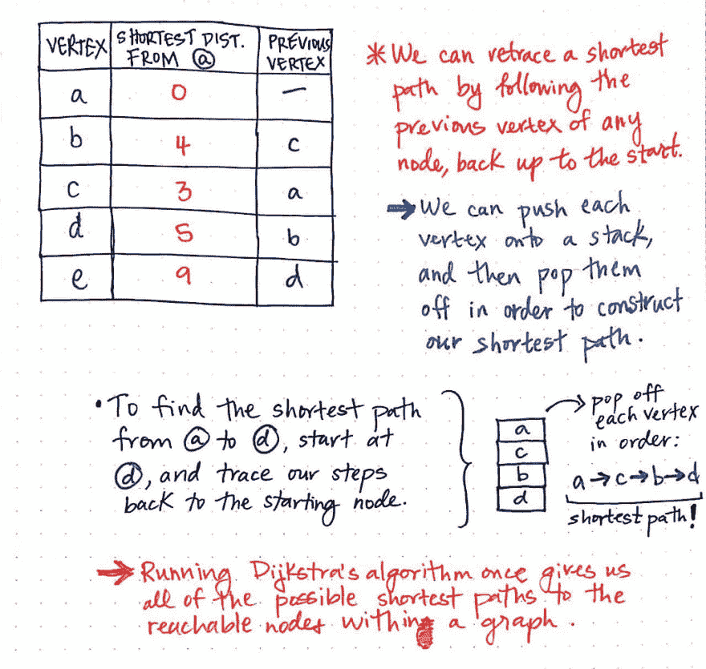](https://res.cloudinary.com/practicaldev/image/fetch/s--xTHncHCn--/c_limit%2Cf_auto%2Cfl_progressive%2Cq_auto%2Cw_880/https://cdn-images-1.medium.com/max/1024/1%2AmbzCf5z7_6ajsOC7BfxsXg.jpeg) 

<figcaption>回溯我们的脚步，寻找最短的路径。</figcaption>

</figure>

在这个表中查找任何最短路径的方法是，回溯我们的步骤，沿着任何节点的“前一个顶点”，回到起始节点。

例如，假设我们突然决定要寻找从 a 到 d 的最短路径，无需再次运行 Dijkstra 算法——我们已经有了所有需要的信息，就在这里！

使用一个[栈数据结构](https://medium.com/basecs/stacks-and-overflows-dbcf7854dc67)，我们将从节点 d 开始，并将它推()到我们的栈上。然后，我们将查看节点 d 的前一个顶点，恰好是节点 b。我们将把()节点 b 推送到堆栈上。同样，我们将查看节点 b 的前一个顶点(节点 c)，并将其添加到我们的堆栈中，然后查看节点 c 的前一个顶点，即节点 a，我们的起始顶点！

一旦我们将我们的步骤一路追溯到起始顶点，我们就可以从堆栈中弹出()每个顶点，结果是这样的顺序:a ----------------------------------------------- b ----------- d -----------事实证明，这正是从节点 a 到节点 d 的成本/距离最低的路径！很棒，对吧？

<figure>[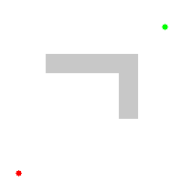](https://res.cloudinary.com/practicaldev/image/fetch/s--lBgiF3Lq--/c_limit%2Cf_auto%2Cfl_progressive%2Cq_66%2Cw_880/https://cdn-images-1.medium.com/max/210/1%2A2jRCHqAbTCY7W7oG5ntMOQ.gif) 

<figcaption>迪杰斯特拉算法可视化，[维基媒体基金会](https://en.wikipedia.org/wiki/Dijkstra%27s_algorithm#/media/File:Dijkstras_progress_animation.gif)</figcaption>

</figure>

在许多方面，Dijkstra 的算法是对我们已经熟悉的[广度优先图遍历](https://dev.to/vaidehijoshi/going-broad-in-a-graph-bfs-traversal)的典型形式的一种完善。主要的区别在于它更智能，可以很好地处理加权图。但是，如果我们看一下 Dijkstra 的可视化算法，就像这里显示的动画，我们会看到它基本上像 BFS 搜索一样工作，广泛传播，而不是深入追求一个特定的路径。

Dijkstra 算法在野外最常见的例子是在路径寻找问题中，比如确定方向或在谷歌地图上寻找路线。

<figure>[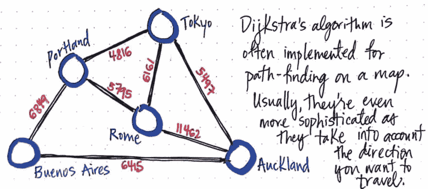](https://res.cloudinary.com/practicaldev/image/fetch/s--ESpy5uH7--/c_limit%2Cf_auto%2Cfl_progressive%2Cq_auto%2Cw_880/https://cdn-images-1.medium.com/max/1024/1%2AXiDkY_1HQzWQAtwquz7M9g.jpeg) 

<figcaption>Dijkstra 算法在地图上的寻路实现。</figcaption>

</figure>

然而，要在 GoogleMaps 中找到一条路径，Dijkstra 算法的实现甚至需要比我们今天创建的更智能。我们在这里实现的 Dijkstra 算法的版本仍然不像在实际层面上使用的大多数形式那样智能。想象一下，不仅仅是一个加权图，还必须计算诸如交通、路况、道路封闭和施工之类的事情。

如果你觉得这一切太难接受，不要担心——这是很复杂的事情！事实上，这是一个困难的问题，即使是 Dijkstra 也很难很好地举例说明。事实证明，当 Edsger W. Dijkstra 在 1956 年第一次考虑寻找最短路径的问题时，他很难找到一个问题(及其解决方案),这个问题对于不是来自计算世界的人来说很容易理解！他最终确实想出了一个很好的示例问题来展示能够找到最短路径的重要性。他选择了——你猜对了！“以地图为例。事实上，当他最初设计他的算法时，他是在一台叫做 ARMAC 的计算机上实现的。为了展示他的算法是如何工作的，他使用了一个交通地图的例子，其中包含了荷兰各地的城市。

在他生命的最后，Dijkstra 坐下来接受了一次采访，并透露了他是如何想出现在著名的算法的全部背景故事:

> 从鹿特丹到格罗宁根的最短路线是什么？这是我在大约 20 分钟内设计的最短路径算法。一天早上，我和我年轻的未婚妻在购物，累了，我们坐在咖啡馆的露台上喝咖啡，我在想我是否可以这样做，然后我设计了最短路径的算法。

那么这个故事的寓意是什么呢？我很确定就是这么简单:没有什么问题是一杯好咖啡解决不了的。

### 资源

无论好坏，Dijkstra 算法是计算机科学领域中最著名的图遍历方法之一。坏消息是，有时试图理解它是如何工作的会感到害怕，因为有太多的参考资料。好消息是有大量的资源——你只需要知道从哪些开始！以下是我最喜欢的一些。

1.  [图形数据结构 Dijkstra 最短路径算法](https://www.youtube.com/watch?v=pVfj6mxhdMw)，Kevin Drumm
2.  [迪杰斯特拉算法](https://www.youtube.com/watch?v=GazC3A4OQTE)，计算机爱好者
3.  [Dijkstra 的图的最短路径算法](https://www.youtube.com/watch?v=zXfDYaahsNA)，Sesh Venugopal
4.  [计算最短路径的单源最短路径算法](http://cs.smith.edu/~streinu/Teaching/Courses/274/Spring98/Projects/Philip/fp/dijkstra.htm)，Ileana Streinu 教授
5.  关于图的两个问题的注记

* * ***