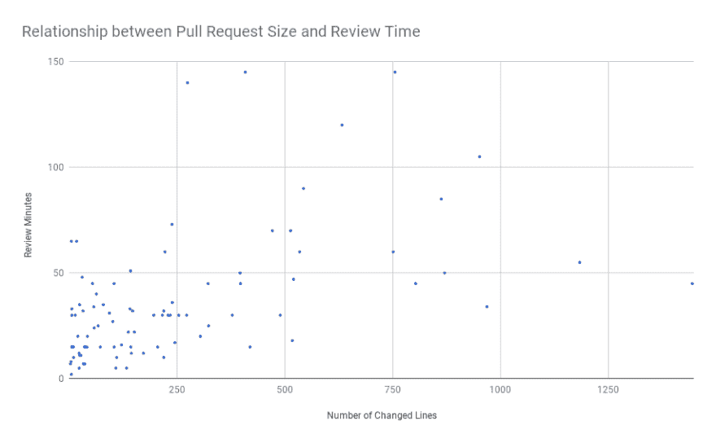
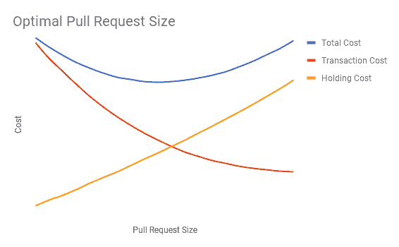

# 最佳拉取请求大小

> 原文:[https://dev.to/bosepchuk/optimal-pull-request-size-600](https://dev.to/bosepchuk/optimal-pull-request-size-600)

每个团队都有一个最佳的拉请求大小，它可能比你想象的要小得多，让你的拉请求达到最佳大小将会提高你的团队的绩效。我将在这篇文章结束时让你相信这三个说法是正确的。

### 研究怎么说？

大量的研究表明，代码审查是发现代码中缺陷的最具成本效益的方式。但是一个代码评审的大部分价值来自于第一个小时 [2](#fn2) 的第一个评审者。

### 我的团队一小时能评审多少代码？

我的团队跟踪我们在每次代码审查上花费的时间。我将这些时间与我们的拉请求中更改的行数进行了比较，以生成这个散点图 [3](#fn3) 。

[T2】](https://res.cloudinary.com/practicaldev/image/fetch/s--7bLoufpj--/c_limit%2Cf_auto%2Cfl_progressive%2Cq_auto%2Cw_880/https://thepracticaldev.s3.amazonaws.com/i/5v86jw3gj41v58fx2u08.png)

数据相当混乱，但是如果我们想要 90%的机会在一小时内完成代码审查，我们可能需要将我们的拉取请求限制在 200 行代码左右。

### 寻找您的最佳拉取请求大小

这真的只是一个优化问题。创建、审查、管理和合并一个拉式请求会产生成本，我们可以把它看作是一种交易成本。但是你也有一个与让拉请求保持在工作进程中相关的成本，我们可以把它想象成一个持有成本。稍后我将更详细地定义这些成本。我只想确定，您正在尝试找到使您的成本总和最小化的拉动式请求规模(下面蓝线的最低点)。

[T2】](https://res.cloudinary.com/practicaldev/image/fetch/s--dwY5hZCh--/c_limit%2Cf_auto%2Cfl_progressive%2Cq_auto%2Cw_880/https://thepracticaldev.s3.amazonaws.com/i/q6jtqtgtci5cqvjav8gt.png)

#### 拉式请求交易费用

需要时间和努力来:

*   将故事分成小块
*   使它们独立或安排它们，使它们不会互相阻塞
*   然后真正做出必要的改变
*   创建测试计划
*   测试更改
*   创建拉式请求
*   复习一下
*   合并它
*   将其部署到生产中(我们持续交付)

如果你对你改变的每一行都这样做，你会在上面图的最左边。不太好。但是提出更大的拉取请求会产生自己的成本。

#### 拉式请求持有成本

拉取请求越大，则:

*   评审者找到足够多的时间来解决这个问题花费的时间越长(评审者评审的积极性就越低)
*   第一次尝试通过代码审查的机会更小，因此需要多次审查
*   复习的时间会更长
*   更有可能审查会超过一个小时(或者你个人对有效代码审查的限制)并变得无效
*   它更有可能变得更大，甚至需要更多的审查
*   更大的风险是作者做了一个糟糕的假设，将不得不重做更多的工作
*   在代码发布之前，需求变更的风险越大
*   对这段代码的工作会变得更加令人沮丧(对每个人来说，对同一段代码的多次审查是很糟糕的)
*   更糟糕的是，如果其中的一小部分失败了，就不得不重新检查和测试整个拉请求
*   我们不太确定代码何时会被合并
*   合并冲突的可能性更大
*   更有可能的是，它会阻碍 sprint 中的其他故事，并打乱计划
*   将代码投入生产并开始交付商业价值需要更长的时间

如果有人在我们的项目中提交了 10，000 行拉动请求，我可以保证所有这些点都会发挥作用。但是我们的数据和经验表明，小得多的拉取请求仍然会导致巨大的持有成本。

### 为什么拉请求越小越好？

根据唐纳德·赖纳森在他的书《产品开发的原则》中所说，更小的批量会增加流量

具体来说:

*   减少批量减少周期时间
*   缩短周期时间可以减少流量的可变性
*   减少批量会加快反馈
*   减少批量会降低风险
*   减少批量可以减少开销
*   批量过大会降低效率
*   大批量本来就降低了积极性和紧迫性
*   大批量生产导致成本和进度呈指数级增长
*   大批量导致更大的批量
*   整批受其最差元素的限制

#### 将精益制造理念应用于拉动式请求

丰田公司一些非常聪明的人发明了[丰田生产系统](https://en.wikipedia.org/wiki/Toyota_Production_System)，其中包括[单件流](https://en.wikipedia.org/wiki/Lean_manufacturing)。他们用这个系统接管了汽车工业。这是一个类似的想法，但 Reinertsen 将其用于产品开发。真正做到这一点的关键是降低你的交易成本。如果你在处理拉动式需求方面变得非常高效，你的总成本曲线将会下移。你的最佳批量将会向左移动(变小)。这是一个良性循环。

你想让故事在你的 sprint 板上快速移动。并且您希望尽快将新代码投入生产。您不希望拉取请求在审查中一次拖延几天。您真的不希望失败的拉取请求以及随之而来的所有返工。

### 还不确信优拉的请求规模小吗？

让我们做一些数学。您的拉请求中的代码越多，您引入缺陷的机会就越大。我知道软件缺陷率变化很大，但是让我们用经常被引用的 10-50 缺陷/kloc 来衡量发布的商业软件。但是，我们正在讨论一个代码审查——不是发布的软件——所以让我们假设你的缺陷率是 50 个缺陷/kloc。平均每 20 行代码就有一个缺陷 [4](#fn4) 。

好的代码评审能捕捉到代码中 60-90%的缺陷，比如说你能捕捉到 75%的缺陷。这意味着**你应该平均每 27 行代码发现一个缺陷**。

#### 较小的拉取请求包含较少的缺陷

一个 200 行的拉取请求应该包含 10 个缺陷，你应该可以找到其中的 7.5 个。这意味着在您的第一次尝试中，它极不可能通过代码审查。现在，让我们用一个 50 行的拉取请求重做计算。在这个拉取请求中应该有 2.5 个缺陷，你应该期望找到其中的 1.9 个。对于较小的拉取请求，你有更好的机会在第一次尝试时通过代码审查。

当您的大拉请求未通过代码审查时，您必须修复整个拉请求，重新审查整个拉请求，重新测试整个拉请求，并希望没有人在此过程中引入了新的错误。当您的小型 pull 请求没有通过代码审查时，您仍然需要执行所有相同的步骤。但是它会快得多，因为你处理的代码要少得多。

### 我的团队处理拉取请求的方式有什么问题？

我的团队正在努力处理我们的拉动式请求，我们的问题都与我所说的“大型拉动式请求”有关。大型拉取请求是已经失去控制并且变得难以审查和部署的拉取请求。我们通过他们巨大的差异、众多的评论、多重评论、花在评论上的许多天，以及花在试图让他们进入“完成”栏上的许多小时来识别他们。

#### 一个兆拉请求是如何诞生的

假设我的同事创建了一个 200 行的拉取请求。我在吉拉看到了它，仅仅从标题上我就知道它需要我的全部注意力。所以我把它安排在明天的一大块时间里，计划一次性解决它。我检查了一下，发现了几个问题。我在 BitBucket 中写下我的评论，并将其返回给作者。他已经转移到其他事情上了，所以他直到第二天早上才审查我的评论，更改代码，更新测试计划，重新测试分支，并把它放回审查中。

当我们处理其他故事、会议、计划外的工作和其他干扰时，我们重复这个循环一到两次。到目前为止，这个拉请求已经被审查了大半个星期，现在它可能有合并冲突。如果是这样，作者修改它们，重新测试，然后发回重审。在某一点上，我最终通过了测试计划中的所有测试，我批准了拉请求，合并到 master 中，并继续下一个故事。

每个 sprint [5](#fn5) 我们可能有一个这样的拉请求。但在极少数情况下，我们会在几周内多次收到拉取请求。我没开玩笑。大量的拉取请求会扼杀我们的生产力。

#### 有什么帮助

我们已经尝试了各种方法来防止大量拉取请求的形成，但是我们的想法大多是无效的。唯一有点帮助的是:

*   使用提交挂钩自动化我们的代码样式和格式，这样就不会有问题了
*   在主故事前面做一个重构故事
*   无论代码有多难看，都要避免主要故事中的零星变化——我们只是把它放在 backlog 中，并用吉拉故事 ID 在代码中做一个注释

我们认为我们仍有改进的空间，因此我们有兴趣找到我们的最佳拉取请求大小。

#### 我们如何找到我们的最佳拉取请求大小？

我们进行实验。我们当前的策略是只创建一个不到一小时即可完成审核的拉式请求。但是我们怀疑如果我们创建更小的拉取请求，我们的速度将会提高。因此，我们将在两个月内尝试 45 分钟的限制，检查数据，设置新的目标，并重复实验，直到找到最佳的拉请求大小。

### 包装完毕

每个团队都有一个最佳的拉请求大小，它可能比你想象的要小得多，让你的拉请求达到最佳大小将会提高你的团队的绩效。您可以通过做实验和测量速度的变化来找到您的最佳拉取请求大小。

我认为对于较小的拉取请求，我已经提出了一个很强的理由。但我很想听听什么对你的团队有效。你试验过你的拉取请求的大小吗？你找到你的最佳拉取请求大小了吗？它们有多大？自从你发现它后，你的速度有什么变化？

* * *

1.  法甘·梅(1976)用设计和代码检查来减少程序开发中的错误。IBM 系统期刊 15: 182-211。 [↩](#fnref1)

2.  科恩 J (2010)现代代码审查。奥兰姆 A，威尔逊 G，编辑。制作软件:什么真正有效，以及我们为什么相信它。Sepastopol(加州):奥赖利。第 329-336 页。 [↩](#fnref2)

3.  我删除了虚假数据，如文件重命名、自动生成的文件，以及对代码运行格式化工具所导致的更改。我还删除了未通过审查的拉式请求。 [↩](#fnref3)

4.  这只是一个简单的数学计算。您可以使用各种各样的缺陷和检测率，并且仍然可以得出这样的结论:大的代码更改应该包含导致您的代码评审失败的可检测的错误。请不要在评论中抨击我在这里使用的确切数字。 [↩](#fnref4)

5.  我们有一个“零已知缺陷”的政策，所以代码在代码审查中反复进行，直到我们认为它没有缺陷并满足我们的其他质量目标。我们正在努力提高我们代码库的质量，偿还我们的技术债务。这将改变我们的最佳拉式请求规模，相比之下，一个团队有一个“发货，我们将在维护中解决它”的政策。 [↩](#fnref5)