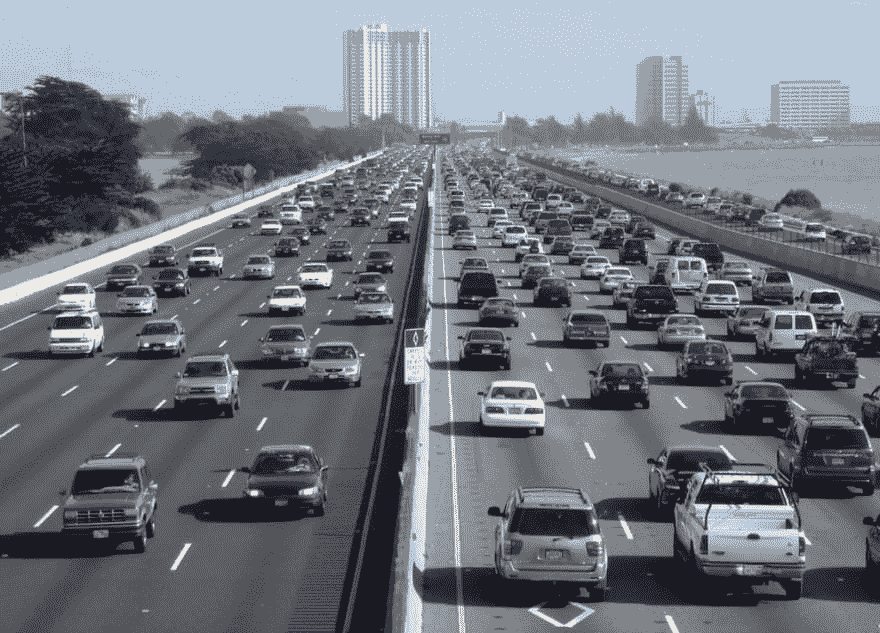

# 七大致命浪费:交通

> 原文:[https://dev.to/jezhalford/seven-deadly-wastes-transport-9ml](https://dev.to/jezhalford/seven-deadly-wastes-transport-9ml)

#### 走得更快:第 11 期

[T2】](https://res.cloudinary.com/practicaldev/image/fetch/s--wb8nzryp--/c_limit%2Cf_auto%2Cfl_progressive%2Cq_auto%2Cw_880/https://cdn-images-1.medium.com/max/1024/0%2AzVLZhb7BXF41Cnik.jpg)

本周，我想重温一下我不久前在博客上发表的一个观点，也是我最近在一些会议上谈到的观点:七种致命的浪费。

有七件事会让你的软件团队慢下来，学会克服每一件事是更快交付的关键。

这七种浪费来自精益制造的原则，这一理念起源于 20 世纪中叶的日本汽车工业。这似乎离今天的软件行业还有很长的路要走，但是这些经验同样适用于现代软件开发。通过消除流程中的七种浪费，你很快就会发现你的交货时间缩短了。

七者之首是*运*。

这是材料从一个地方到另一个地方的移动。不难看出这是如何降低制造速度的——一个分设在两个地点的工厂显然难以运营——但在软件运输中，浪费通常更难发现。

考虑团队之间的交接。如果您的开发人员必须将工作传递给一个测试团队(或者个人)，然后它转移到另一个人的责任上来接受或者签署，然后再次发布，您就有了运输浪费。如果你曾经参与过“功能网球”——一个项目在开发和 QA 之间来回多次，那么你就经历了严重的运输浪费。

减少此类交接的一个方法是培养协作精神。鼓励开发人员和测试人员一起解决问题，并建立对解决方案的共同理解。

另一种形式的传输浪费来自移动代码。部署、分支和合并都是传输的形式。显然，有些是必要的——您需要能够部署一些东西——但是降低部署成本至关重要。如果花费的时间超过几分钟，那么将会对你的工作效率产生重大影响。

识别和减少流程中的传输实例是提高速度的重要一步。下周，我将看看下一个浪费:库存。

软件开发顾问 Jez Halford 帮助团队更快地交付更好的软件。

*还有更多来自 Jez 上的* [*碎碎念*](https://twitter.com/jezhalford)*[*中的*](https://medium.com/@jezhalford) *和*[*jezhalford.com*](https://jezhalford.com/)*

 ** * **