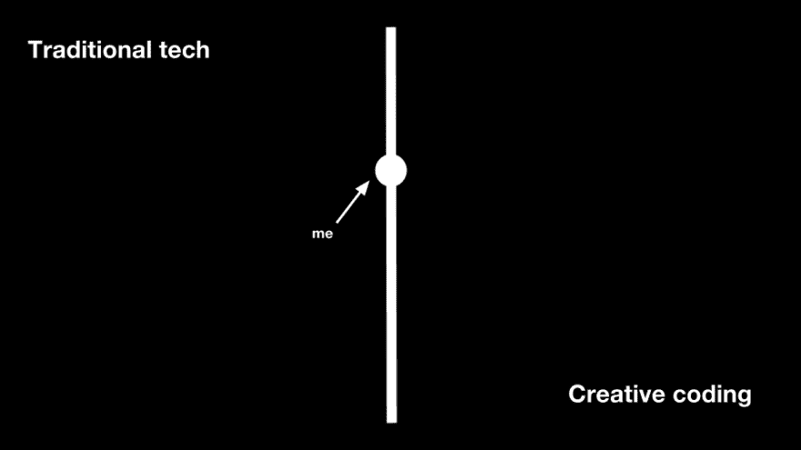
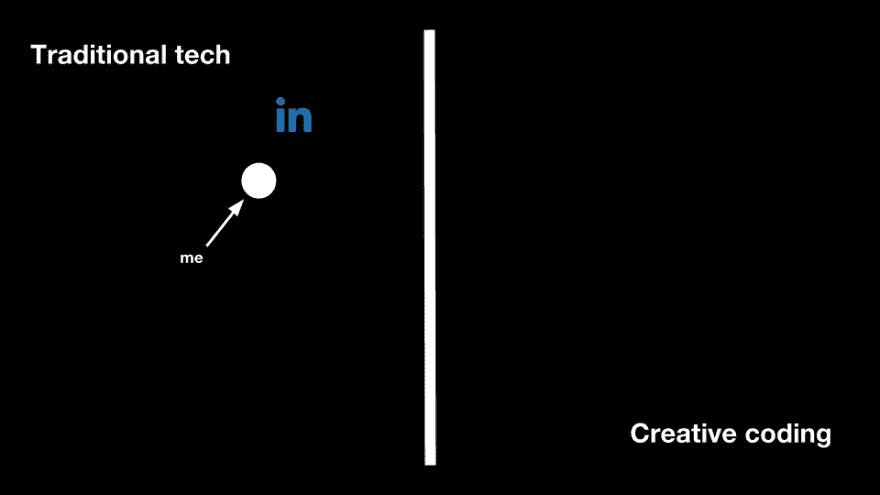
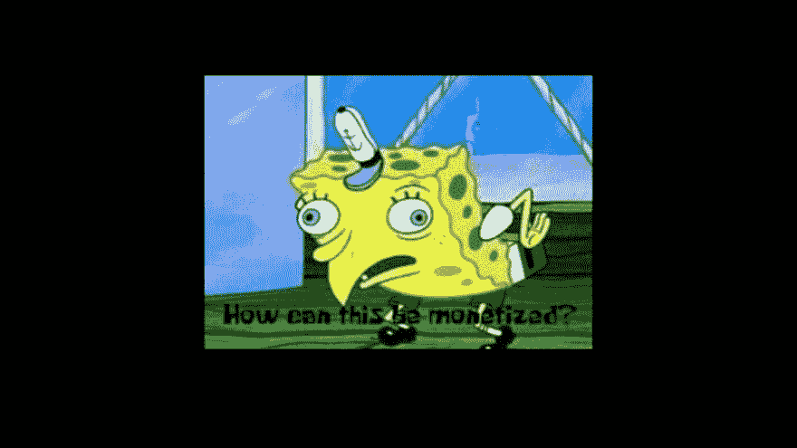

# 艺术能教会你什么

> 原文:[https://dev.to/yellzheard/what-art-can-teach-you-e8c](https://dev.to/yellzheard/what-art-can-teach-you-e8c)

你好！我是绿的。

白天，我是 LinkedIn 的软件工程师，负责设计系统。我每天的大部分工作就是找出人们的痛点并为他们解决问题。但我不是来谈这个的。

在*晚上*，我是人们喜欢称之为创意程序员的人。

[T2】](https://res.cloudinary.com/practicaldev/image/fetch/s--dKoA1CwT--/c_limit%2Cf_auto%2Cfl_progressive%2Cq_auto%2Cw_880/https://thepracticaldev.s3.amazonaws.com/i/4dht544fygim31jpsxps.png)

这是一个术语，用来描述那些使用代码作为创造性工具的人——创造艺术。我第一次接触这个是在大学。在我的一堂课上，我被介绍到了 [Processing](https://processing.org/) :一种基于 Java 的开源语言，用于学习在视觉艺术的背景下编码。从那时起，我决定创建一个名为“艺术和代码”的集中

在学校，我一直在创造性编程和传统技术之间徘徊。
[T3】](https://res.cloudinary.com/practicaldev/image/fetch/s--0HiPHY1p--/c_limit%2Cf_auto%2Cfl_progressive%2Cq_auto%2Cw_880/https://thepracticaldev.s3.amazonaws.com/i/8bo2f8o2r2x39eb9ez18.png)

看看我目前的职位，很容易想象我最终会在哪里。

虽然我不为工作而创作，但我在业余时间做了很多艺术项目。我认为作为一名程序员，我从我作为一名艺术家的经历中受益匪浅，所以我写了一篇关于艺术能教会我们程序员群体什么的文章，并做了一次演讲。

**1。拥抱我们作为人类的工作**

虽然艺术有它的天才，但它通常是由普通人创造的。“很难想象蝙蝠侠扔罐子的场景。完美的生物不需要创造艺术。”

所以艺术本来就是人的。关于代码我们能说些什么？

虽然代码和艺术需要许多相同的内在人类特征(解决问题、沟通)，但当我们谈论程序员时，我们会说“编码忍者”或“摇滚明星”或“黑客”或“上帝”这似乎让编程变得遥不可及&超人，事实并非如此。

* * *

> “公司可能会说，他们正在寻找摇滚明星或忍者加入他们的团队，白人男性更可能认同或渴望这样的描述。”

基兰·斯奈德

* * *

拥抱我们作为人类的工作让我们能够:

1.  让编码对所有人更友好。
2.  既然错误是人之常情:绕过完美。
3.  绕过完美让我们创造更多。

我最喜欢的互联网艺术家之一大流士·卡泽米在一次关于小项目的演讲中说:

> “2009 年，我发布了两个创意项目，这是大约 200 个小时的研究、工作、漏洞修复和合作的结晶。它出现在一些博客上，他估计大约有 10，000 人看过这些项目中的任何一个。
> 
> “2013 年，我发布了 73 个项目。他总共花了大约 350 个小时。他接触了 50 万到 100 万人，接受了各种主要新闻媒体的报道。”

他所做的与众不同的是，他开始“在 3-6 个小时内制作短小、愚蠢的游戏。”虽然他说这些游戏“有点糟糕”，但他“必须完成一些事情，而不是盯着一份设计文档，不知道从哪里开始。”

而这里的关键是，对他来说完蛋了！==完美。他继续说道，“我不是说”不要完成你的工作，只是从根本上改变你对“完成”的理解。"

我们做的项目，不管是蹩脚的、错误百出的还是失败的，都有额外的好处，教会我们如何让我们工作中的一小部分飞速发展。你通过制作作品来学习如何制作作品。

**2。事情不必这么复杂**

你不必为每一个边缘情况做准备。我最喜欢的艺术家大流士·卡泽米的另一句名言是:“我喜欢让事情在计算上尽可能简单。很简单，因为我在这个世界上只有这么多时间，我宁愿每周推出一个项目，而不是每年。我没有时间去编写不必要的高性能代码。”

这里的关键词是不必要的时候。我最近读了一篇名为《你不是谷歌》的文章，作者是奥赞·欧奈，文章写道:“软件工程师为最荒谬的事情而疯狂。当我们不得不选择一项技术时，我们最终会陷入一种疯狂——从一个人的黑客新闻评论跳到另一个人的博客帖子，直到在昏迷中，我们无助地飘向最亮的光线，趴在它面前，忘记了我们最初在寻找什么。这不是理性人做决定的方式，而是软件工程师决定使用 MapReduce 的方式。”

艺术家不会在不需要的地方寻找复杂性，我们也不应该这样做。

**3。工具服务于功能/重要的是想法**

用代码和艺术:最重要的是把一个想法变成现实。工具并不比你做了什么更重要，但我认为在技术领域，我们陷入了这个对这个对那个的讨论中(太频繁了)。这种竞争导致了等级制度。Python 开发者> Ruby 开发者，诸如此类的比较是愚蠢的。别人拥有的任何技能都是他们做自己想做的工作所需要的。即使你有它，它也不会对你的工作有所帮助。就像在艺术中一样，我们应该尝试重新构建对话，使其更多地与想法和需要创造的东西有关。

* * *

> 如何>什么+为什么如何如何
> 如何<什么+为什么应该如何

[Catt Small](https://twitter.com/cattsmall)

* * *

**4。如何让一些没用的东西**

当我在技术展览会上展示我的项目时，我会被问到一些问题“这怎么才能赚钱？”以及“这有什么商业应用？”尽管我经常做一些没有这些答案的项目。

[T2】](https://res.cloudinary.com/practicaldev/image/fetch/s--_o_-d2Dr--/c_limit%2Cf_auto%2Cfl_progressive%2Cq_auto%2Cw_880/https://thepracticaldev.s3.amazonaws.com/i/vm1ayovtzkx3lsmfbpxz.png)

艺术家创作很多东西仅仅是因为他们想在世界上看到它。他们并不总是“解决”真正的问题。作为开发者，我们有同样的创造力，但是我们很少制造无用的东西。相反，硅谷的潮流是将其商业利益重新定义为“改变世界”和/或在相同的前提下破坏不需要破坏的东西。

这种创造方法引发了[没人需要的愚蠢狗屎和可怕想法黑客马拉松](http://www.stupidhackathon.com/)，这是一个“为期一天的活动，参与者概念化并创造没有任何价值的项目。”

一些项目包括一个名为 NonAd Blocker 的 Chrome 扩展，它可以阻止除广告之外的所有网站。Shakie，“一款相机应用程序，只有当你用力摇晃手机时，它才会拍摄照片。”解除贫穷者的好友关系可以帮助你找到并解除 facebook 上贫穷朋友的好友关系。Outcognito Mode 是一个 Chrome 扩展，可以公开发布你访问的每个网站和你键入的所有内容。

你可能会问为什么有才华的人会浪费时间去做那件事？其中一位创始人分享了一个故事，讲述了他们如何被邀请参加“24 小时黑客马拉松，目标是结束水危机。”大量的时间和精力被花费在创造声称改变世界的解决方案上，但实际上并没有这样做。而不是“当你故意生产一些没有价值的东西时，你真正创造的是一种批判。”

如果我们花更多的时间探索空间和评论，我们会更接近于知道如何做出解决方案。此外，在一个度量和货币化最重要的地方，能够制造无用的狗屎实际上可以相当授权和颠覆。

**5。拥抱不确定性**

在编程和艺术中，我们经常从一张白纸开始。但通常，在我们到达终点之前，我们对它的样子有一个清晰的概念。我们有一个规格表，如果你正在做测试驱动的开发，也许你已经写了你的测试。

但是关于艺术有这样一句话:“艺术就像在你知道它的结尾之前开始一个句子。”例如,“许多小说作家很早就发现，制定详细情节大纲是徒劳的；随着实际写作的进展，人物越来越多地呈现出他们自己的生活，有时作家会像最终读者一样对他们创作的内容和行为感到惊讶。”

当然，艺术给你的自由是危险的。“你可能永远也看不到句子的结尾，或者即使你看到了，你也没有说任何有意义的话。”

但是它给了你行动的自由，给了你惊喜。

代码，就像艺术一样，发生在你和某种东西之间——一个主题，一个想法，一种技术——你和那种东西都需要自由移动——对主题和工具做出真实的反应。

在很多情况下，成功所必需的是对你试图解决的问题的了解、解决问题的策略以及接受错误和意外的意愿。

感谢/灵感总是来自~

1.  [！！主题演讲:Catt Small 的创意程序员](https://www.youtube.com/watch?v=WBOA2MI4u7w)
2.  工程师/艺术家 Jenn Schiffer-XOXO 艺术节
3.  大流士卡泽米
4.  山姆·拉维尼&的愚蠢黑客马拉松
5.  [你不是谷歌](https://blog.bradfieldcs.com/you-are-not-google-84912cf44afb)
6.  [处理](http://processing.org)
7.  艺术与恐惧:对艺术创作的危险(和回报)的观察:大卫·贝勒斯&泰德·奥兰德
8.  基兰·斯奈德
9.  [努力做好播客](https://soundcloud.com/trytobegood)