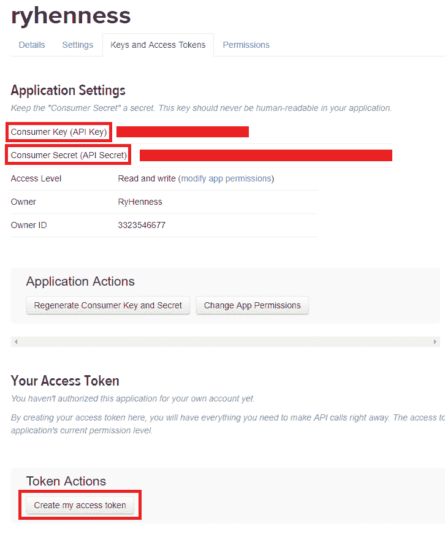
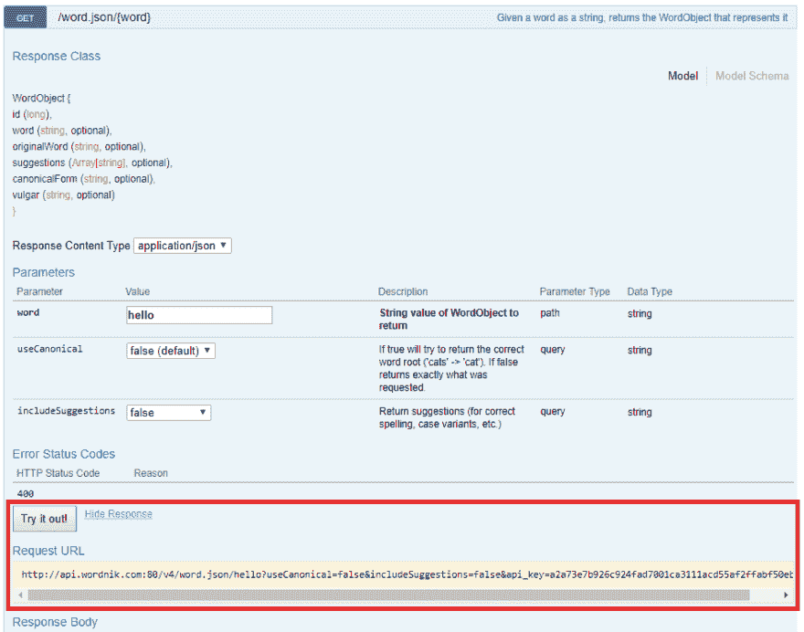
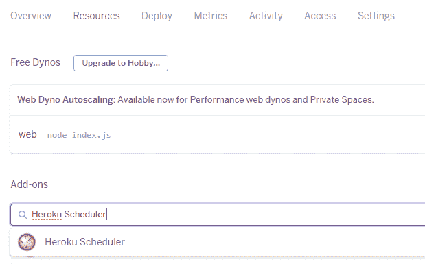

# 制作 Node.js Twitter Bot:虚假定义

> 原文:[https://dev . to/ryhenness/nodejs-Twitter-bot-bogus-definition-DMM](https://dev.to/ryhenness/nodejs-twitter-bot-bogus-definition-dmm)

怎么了，怎么了，很高兴你来了！我们将讨论如何创建一个 Twitter 机器人。Twitter 机器人是一个连接到托管应用程序的帐户，该应用程序使用 [Twitter API](https://developer.twitter.com/en/docs/tweets/post-and-engage/overview) 来请求该 Twitter 机器人，如发推、转发、点赞等。机器人是一种通过创造力提高你的编码技能的有趣方式，有一堆不同的[API](https://en.wikipedia.org/wiki/Application_programming_interface)可供你使用，让你的机器人做各种各样的事情。在整篇文章中，我将引用我的一个机器人的设置， [@BogusDefinition](https://twitter.com/bogusdefinition) 。这个机器人在推特上发布随机单词，这些单词的定义似乎是正确的，但实际上不是。

你可以在 [GitHub](https://github.com/henness17/SweetCode/tree/master/004-Node-Twitter-Bot) 上找到本文使用的所有代码。

* * *

# 目录

这篇文章有三个主要部分。本文将带您了解 Twitter bot 的整个设置过程——从使用 Twitter 设置您的 bot 应用程序，到在实时服务器上托管具有升级功能的 bot:

*   你好，推特机器人
*   让机器人更聪明
*   部署机器人

* * *

# 你好，推特机器人

### 创建应用程序

您要做的第一件事是为您的机器人创建 Twitter 帐户。在你设置好账户后，你可以进入 Twitter 的[应用管理](https://apps.twitter.com/)页面。您应该会看到类似这样的内容，单击“创建新应用程序”。

[T2】](https://res.cloudinary.com/practicaldev/image/fetch/s--cn-FYK0e--/c_limit%2Cf_auto%2Cfl_progressive%2Cq_auto%2Cw_880/https://thepracticaldev.s3.amazonaws.com/i/u13o1nqgup7bd8iqovpn.PNG)

它会提示您输入一些信息，如名称、描述和网站。对于网站，你可以使用你的 GitHub 账户的网址——或者其他你认为有效的网址。选中“开发者协议”复选框，然后点击“创建您的 Twitter 应用程序”。

### 你的钥匙&访问令牌

为了让 Node.js 应用程序在从 Twitter API 请求时得到身份验证，必须包含密钥和访问令牌。这些密钥和访问令牌很像用户名和密码，它们允许 Node.js 应用程序“登录”Twitter 帐户。在你的 Twitter 应用程序页面上，你应该会看到一个“应用程序设置”标签，还有一个“消费者密钥”部分。

[T2】](https://res.cloudinary.com/practicaldev/image/fetch/s--PqrZ4wSy--/c_limit%2Cf_auto%2Cfl_progressive%2Cq_auto%2Cw_880/https://thepracticaldev.s3.amazonaws.com/i/kchlk9vlwfo5f483946b.PNG)

单击突出显示的链接“管理密钥和访问令牌”。您将看到以下页面。复制消费者密钥(API 密钥)和消费者秘密(API 秘密)。然后点击底部的“创建我的访问令牌”。复制访问令牌和访问令牌密码。

[T2】](https://res.cloudinary.com/practicaldev/image/fetch/s--32WFfukY--/c_limit%2Cf_auto%2Cfl_progressive%2Cq_auto%2Cw_880/https://thepracticaldev.s3.amazonaws.com/i/0vg21ld3ywvdw5cs2h9e.PNG)

### 机器人的第一条推文

现在您已经有了密钥和访问令牌，您可以开始为您的 bot 开发代码了。在您的计算机上为您的机器人代码创建一个新文件夹。在文件夹内部，创建一个名为 *env.js* 的文件。该文件应该位于项目的根目录下，并且将包含您的环境变量，其中将包括您刚刚创建的密钥和访问令牌。:) *env.js* 应该是这样的:

```
 process.env['TWITTER_CONSUMER_KEY'] = '1mFxGkYQPEuxqbtHd55cb89';
    process.env['TWITTER_CONSUMER_SECRET'] = 'IK1ytDHhtzF4AUvh5fkmoaBC1mTvmWT18WjAhl3Y9bQv5y8o';
    process.env['TWITTER_ACCESS_TOKEN'] = '2057253019-IpiUHS9FuJqPQSQbaChVHvEza1J08QZlJYY3Z';
    process.env['TWITTER_ACCESS_TOKEN_SECRET'] = 'jHj81H3qYUOrOSXNg6RMVAPaKgMv6pz0ogs1YWeJ7pa'; 
```

<svg width="20px" height="20px" viewBox="0 0 24 24" class="highlight-action crayons-icon highlight-action--fullscreen-on"><title>Enter fullscreen mode</title></svg> <svg width="20px" height="20px" viewBox="0 0 24 24" class="highlight-action crayons-icon highlight-action--fullscreen-off"><title>Exit fullscreen mode</title></svg>

> 确保使用您自己的密钥和访问令牌！

接下来您需要做的是创建一个名为 *index.js* 的文件。这个文件将成为你的机器人的主文件，它将启动你的机器人。首先，我将这个文件按每个部分进行分解，然后展示它的全部内容。

您希望在文件的顶部设置所需的节点包。我们正在使用的软件包是 [Express](https://www.npmjs.com/package/express) 、 [Request](https://www.npmjs.com/package/request) 和 [Twit](https://www.npmjs.com/package/twit) 。Express 允许我们建立一个极简的网络框架。Request 将使我们能够发出简单的 HTTP 请求，以便进行一些 API 调用。最后但同样重要的是，Twit 将使我们更容易访问 Twitter API:

```
var express = require('express');
var twit = require('twit');
var request = require('request'); 
```

<svg width="20px" height="20px" viewBox="0 0 24 24" class="highlight-action crayons-icon highlight-action--fullscreen-on"><title>Enter fullscreen mode</title></svg> <svg width="20px" height="20px" viewBox="0 0 24 24" class="highlight-action crayons-icon highlight-action--fullscreen-off"><title>Exit fullscreen mode</title></svg>

下一步非常简单，创建 Express 应用程序并设置端口:

```
var app = express();
app.set('port', process.env.PORT || 5000); 
```

<svg width="20px" height="20px" viewBox="0 0 24 24" class="highlight-action crayons-icon highlight-action--fullscreen-on"><title>Enter fullscreen mode</title></svg> <svg width="20px" height="20px" viewBox="0 0 24 24" class="highlight-action crayons-icon highlight-action--fullscreen-off"><title>Exit fullscreen mode</title></svg>

下一部分是您将要使用的 *env.js* 变量，这些变量让我们的应用程序在连接到 Twitter 时接收身份验证。当用 Twit 包初始化你的机器人时，你必须像这样传递你的密钥和令牌:

```
if(process.env.TWITTER_CONSUMER_KEY == undefined){
  require('./env.js');
}
var bot = new twit({
  consumer_key:         process.env.TWITTER_CONSUMER_KEY,
  consumer_secret:      process.env.TWITTER_CONSUMER_SECRET,
  access_token:         process.env.TWITTER_ACCESS_TOKEN,
  access_token_secret:  process.env.TWITTER_ACCESS_TOKEN_SECRET,
  timeout_ms:           60*1000,  // optional HTTP request timeout to apply to all requests. 
}); 
```

<svg width="20px" height="20px" viewBox="0 0 24 24" class="highlight-action crayons-icon highlight-action--fullscreen-on"><title>Enter fullscreen mode</title></svg> <svg width="20px" height="20px" viewBox="0 0 24 24" class="highlight-action crayons-icon highlight-action--fullscreen-off"><title>Exit fullscreen mode</title></svg>

> if 语句用于判断应用程序是在本地运行还是在服务器上运行。如果定义了 TWITTER_CONSUMER_KEY，应用程序知道它运行在一个已经有定义的服务器上。如果没有定义，那么应用程序知道它需要包含本地的 *env.js* 文件。这个 *env.js* 文件不会成为 GitHub repo 的一部分。

看一下 [Twit 文档](https://www.npmjs.com/package/twit)你会发现你可以很容易地发布一条推文。您可以调用一个`.post`函数。让你的机器人发微博“哔哔哔！”有了这个块:

```
bot.post('statuses/update', { status: 'Beep boop bop!' }, function(err, data, response) {
  console.log('Success!');
}); 
```

<svg width="20px" height="20px" viewBox="0 0 24 24" class="highlight-action crayons-icon highlight-action--fullscreen-on"><title>Enter fullscreen mode</title></svg> <svg width="20px" height="20px" viewBox="0 0 24 24" class="highlight-action crayons-icon highlight-action--fullscreen-off"><title>Exit fullscreen mode</title></svg>

快到了！你只需要告诉你的 app 监听哪个端口:

```
app.listen(app.get('port'), function() {
  console.log('Bot is running on port', app.get('port'));
}); 
```

<svg width="20px" height="20px" viewBox="0 0 24 24" class="highlight-action crayons-icon highlight-action--fullscreen-on"><title>Enter fullscreen mode</title></svg> <svg width="20px" height="20px" viewBox="0 0 24 24" class="highlight-action crayons-icon highlight-action--fullscreen-off"><title>Exit fullscreen mode</title></svg>

您的整个 *index.js* 文件应该是这样的:

```
var express = require('express');
var twit = require('twit');
var request = require('request');

var app = express();
app.set('port', process.env.PORT || 5000);

if(process.env.TWITTER_CONSUMER_KEY == undefined){
  require('./env.js');
}
var bot = new twit({
  consumer_key:         process.env.TWITTER_CONSUMER_KEY,
  consumer_secret:      process.env.TWITTER_CONSUMER_SECRET,
  access_token:         process.env.TWITTER_ACCESS_TOKEN,
  access_token_secret:  process.env.TWITTER_ACCESS_TOKEN_SECRET,
  timeout_ms:           60*1000,  // optional HTTP request timeout to apply to all requests. 
});

bot.post('statuses/update', { status: 'Beep boop bop!' }, function(err, data, response) {
  console.log('Success!');
});

app.listen(app.get('port'), function() {
  console.log('Bot is running on port', app.get('port'));
}); 
```

<svg width="20px" height="20px" viewBox="0 0 24 24" class="highlight-action crayons-icon highlight-action--fullscreen-on"><title>Enter fullscreen mode</title></svg> <svg width="20px" height="20px" viewBox="0 0 24 24" class="highlight-action crayons-icon highlight-action--fullscreen-off"><title>Exit fullscreen mode</title></svg>

### 运行你的机器人

在您能够本地运行您的 bot 之前，您必须`install --save`正在使用的每个节点包。因此，从你的应用程序的根文件夹中，运行命令`npm install --save express`、`npm install --save request`、`npm install --save twit`。如果你以前没有在本地运行过 Node.js 应用程序，你可以看一下我的文章[node . js+Express Server Setup](https://dev.to/ryhenness/nodejs--express-server-setup-6ch)。

好吧，酷！你的机器人已经准备好发送第一条推文了！用`node index.js`启动你的机器人，你应该看到“成功！”在命令行上。查看你的机器人的推特资料，你会看到它在推特上写着“哔哔哔！”

* * *

# 让机器人更聪明

你已经有了机器人 tweeting，这很好，但现在还有更多事情要做！这是有趣的部分开始。你的机器人实际上不能变得更聪明，但我们可以通过一些简单的 API 调用让人们相信它是。；)假定义是一个在推特上发布随机单词的机器人，其定义听起来有点正确，但不是。这是通过从 [Wordnik](http://www.wordnik.com/) 请求一个随机单词，然后是该随机单词的一个押韵单词，然后是该押韵单词的定义，最后将该随机单词与该押韵单词的定义相结合来实现的。

> 推特-“随机词:押韵词的定义”

在本节中，我将向您展示我是如何做到这一点的。

### API 调用

请求包也将使我们的工作变得简单！让我们从推特上随便发布一个词开始吧。你可能会问，我们如何得到一个随机的单词？好吧，看看这个 [Wordnik API](http://developer.wordnik.com/docs.html) 。在*单词*下，有一个*随机单词*端点，我们可以用 HTTP 请求访问它，它会给我们一个随机单词。为此，我们需要使用*请求*。您可以通过单击“尝试一下！”来获得请求 URLWordnik 端点部分下的按钮。

[T2】](https://res.cloudinary.com/practicaldev/image/fetch/s--liow6Nyr--/c_limit%2Cf_auto%2Cfl_progressive%2Cq_auto%2Cw_880/https://thepracticaldev.s3.amazonaws.com/i/kcnpai8k5wqpqoeddmlg.png)

下面是一个随机的请求:

```
randomWord = 'http://api.wordnik.com:80/v4/words.json/randomWord?hasDictionaryDef=true&minCorpusCount=0&maxCorpusCount=-1&minDictionaryCount=1&maxDictionaryCount=-1&minLength=5&maxLength=-1&api_key=' + process.env.WORDNIK_KEY;
  request(randomWord, function (error, response, body) {
    randomWord = JSON.parse(body).word;
  }); 
```

<svg width="20px" height="20px" viewBox="0 0 24 24" class="highlight-action crayons-icon highlight-action--fullscreen-on"><title>Enter fullscreen mode</title></svg> <svg width="20px" height="20px" viewBox="0 0 24 24" class="highlight-action crayons-icon highlight-action--fullscreen-off"><title>Exit fullscreen mode</title></svg>

> 我已经注册了一个 Wordnik 帐户，并将我的 Wordnik API 密钥添加到我的 *env.js* 文件中，作为 WORDNIK_KEY。你也可以这样做[这里](http://developer.wordnik.com/)。注册后，你可以在页面底部的[账户设置](http://www.wordnik.com/users/edit)下找到你的 API 密匙。

现在，在这个电话中，我们可以用推特发布我们收到的信息。你会注意到这条线`JSON.parse(body).word`。我们正在接收作为 JSON 格式文本响应的`body`,并将其解析为 JSON 对象。这个`body`是来自服务器的响应，在`.word`属性下包含我们的随机词。如果你没有听说过 JSON，或者解析它，你可以在这里了解更多[。很有用，一定要看懂！解析完随机单词后，您可以通过在请求回调函数(请求函数调用的第二个参数)中放入一个`.post`调用来发布它](https://www.w3schools.com/js/js_json.asp)

```
request(randomWord, function (error, response, body) {
    // When the request finishes, this post will be called
    bot.post('statuses/update', { status: randomWord}, function(err, data, response) {
        console.log("Success!");
    });
}); 
```

<svg width="20px" height="20px" viewBox="0 0 24 24" class="highlight-action crayons-icon highlight-action--fullscreen-on"><title>Enter fullscreen mode</title></svg> <svg width="20px" height="20px" viewBox="0 0 24 24" class="highlight-action crayons-icon highlight-action--fullscreen-off"><title>Exit fullscreen mode</title></svg>

继续用命令行运行您的机器人。你的 *index.js* 现在应该是这样的:

```
var express = require('express');
var twit = require('twit');
var request = require('request');

var app = express();
app.set('port', process.env.PORT || 5000);

var bot = new twit({
  consumer_key:         process.env.TWITTER_CONSUMER_KEY,
  consumer_secret:      process.env.TWITTER_CONSUMER_SECRET,
  access_token:         process.env.TWITTER_ACCESS_TOKEN,
  access_token_secret:  process.env.TWITTER_ACCESS_TOKEN_SECRET,
  timeout_ms:           60*1000,  // optional HTTP request timeout to apply to all requests. 
});

randomWord = 'http://api.wordnik.com:80/v4/words.json/randomWord?hasDictionaryDef=true&minCorpusCount=0&maxCorpusCount=-1&minDictionaryCount=1&maxDictionaryCount=-1&minLength=5&maxLength=-1&api_key=' + process.env.WORDNIK_KEY;
request(randomWord, function (error, response, body) {
    // When the request finishes, this post will be called
    bot.post('statuses/update', { status: randomWord}, function(err, data, response) {
        console.log("Success!");
    });
});

app.listen(app.get('port'), function() {
  console.log('Bot is running on port', app.get('port'));
}); 
```

<svg width="20px" height="20px" viewBox="0 0 24 24" class="highlight-action crayons-icon highlight-action--fullscreen-on"><title>Enter fullscreen mode</title></svg> <svg width="20px" height="20px" viewBox="0 0 24 24" class="highlight-action crayons-icon highlight-action--fullscreen-off"><title>Exit fullscreen mode</title></svg>

### 异步问题

好的，你有一个随机的单词，现在想要一个押韵的单词。所以，你需要做的就是用`randomWord`变量发出另一个请求，对吗？有点，但是有个问题。发出请求是一个[异步调用](https://en.wikipedia.org/wiki/Asynchrony_(computer_programming))。这意味着当我们发出请求时，我们的请求被发送到 API，同时我们的代码继续运行。这样做的问题是，我们的代码在继续之前没有等待 API 响应。因此，我们的代码可能会在随机单词返回之前尝试对押韵单词进行第二次 API 请求，这将导致一个未定义的返回值。我们如何解决这个问题？如果你想要一个比回调更好的解决方案，看看[征服异步 JavaScript](https://dev.to/ryhenness/the-path-to-conquering-async-javascript-1pl) 的途径。

### 回调

有多种方法可以解决异步问题，具体取决于你在做什么，你可以看看[异步函数](https://developer.mozilla.org/en-US/docs/Web/JavaScript/Reference/Statements/async_function)，以及[承诺](https://developers.google.com/web/fundamentals/primers/promises)。我将使用[回调](https://developer.mozilla.org/en-US/docs/Glossary/Callback_function)来解决这个问题。回调函数是作为参数传递给另一个函数的函数，一旦外部函数执行完毕，就调用这个函数。

这里有一个例子，首先调用`runThisFunctionFirst`，它作为参数`callback`传递给`runThisFunctionSecond`。所以，`runThisFunctionFirst`会给`number`参数加 2，一旦完成，它就会调用`callback`也就是`runThisFunctionSecond`并传递给`plusTwo`。然后，`runThisFunctionSecond`将在`runThisFunctionFirst`完成其工作后记录该值。

```
function runThisFunctionSecond(plusTwo) {
  console.log('The input number + 2 is: ' + plusTwo);
}

function runThisFunctionFirst(number, callback) {
  var plusTwo = number + 2;
  callback(plusTwo); // this runs theCallbackFunction because it was passed as an arguement
}

runThisFunctionFirst(number, runThisFunctionSecond); 
```

<svg width="20px" height="20px" viewBox="0 0 24 24" class="highlight-action crayons-icon highlight-action--fullscreen-on"><title>Enter fullscreen mode</title></svg> <svg width="20px" height="20px" viewBox="0 0 24 24" class="highlight-action crayons-icon highlight-action--fullscreen-off"><title>Exit fullscreen mode</title></svg>

### 伪造定义链

那么这将如何解决我们的问题呢？嗯，我们可以用三个函数做一个类似这样的回调链:`getWord`、`getRhymingWord`、`getRhymingDef`。这些将被称为`runThisFunctionFirst`和`runThisFunctionSecond`，但是我们将有第三个功能，相当于`runThisFunctionThird`。

让我们继续创建一些保存内容的全局变量，并创建我们的第一个函数:

```
// Global variables needed to create the tweet
var randomWord;
var rhymingWord;
var rhymingDef;

function getWord(callback){
  randomWord = 'http://api.wordnik.com:80/v4/words.json/randomWord?hasDictionaryDef=true&minCorpusCount=0&maxCorpusCount=-1&minDictionaryCount=1&maxDictionaryCount=-1&minLength=5&maxLength=-1&api_key=' + process.env.WORDNIK_KEY;
  request(randomWord, function (error, response, body) {
    randomWord = JSON.parse(body).word;
    callback(randomWord);
  });
}; 
```

<svg width="20px" height="20px" viewBox="0 0 24 24" class="highlight-action crayons-icon highlight-action--fullscreen-on"><title>Enter fullscreen mode</title></svg> <svg width="20px" height="20px" viewBox="0 0 24 24" class="highlight-action crayons-icon highlight-action--fullscreen-off"><title>Exit fullscreen mode</title></svg>

现在，`getWord`需要被传递一个函数`getRhymingWord`,这样一旦它完成请求，就可以调用它。

> 注意，`callback`是在`request`调用的第二个参数中被调用的，它需要在那里，因为一旦 API 返回值，第二个参数就会被调用。

你可以看到`getRhymingWord`需要两个参数:一个用于由`request`返回的`randomWord`，另一个用于回调函数，将是`getRhymingDef`。

```
function getRhymingWord(randomWord, callback){
  rhymingWord = 'http://api.wordnik.com:80/v4/word.json/' + randomWord + '/relatedWords?useCanonical=false&relationshipTypes=rhyme&limitPerRelationshipType=10&api_key=' + process.env.WORDNIK_KEY;
    request(rhymingWord, function (error, response, body) {
    try{
      rhymingWord = JSON.parse(body)[0].words[0];
      callback(rhymingWord);
    }catch(err){
      sendTweet(); // The word didn't rhyme with anything... restart
    }
  });
}; 
```

<svg width="20px" height="20px" viewBox="0 0 24 24" class="highlight-action crayons-icon highlight-action--fullscreen-on"><title>Enter fullscreen mode</title></svg> <svg width="20px" height="20px" viewBox="0 0 24 24" class="highlight-action crayons-icon highlight-action--fullscreen-off"><title>Exit fullscreen mode</title></svg>

现在我们可以添加第三个函数:

```
function getRhymingDef(rhymingWord, callback){
  rhymingDef = 'http://api.wordnik.com:80/v4/word.json/' + rhymingWord + '/definitions?limit=200&includeRelated=true&useCanonical=false&includeTags=false&api_key=' + process.env.WORDNIK_KEY;
  request(rhymingDef, function (error, response, body) {
    rhymingDef = JSON.parse(body)[0].text;
    callback(rhymingDef);
  });  
}; 
```

<svg width="20px" height="20px" viewBox="0 0 24 24" class="highlight-action crayons-icon highlight-action--fullscreen-on"><title>Enter fullscreen mode</title></svg> <svg width="20px" height="20px" viewBox="0 0 24 24" class="highlight-action crayons-icon highlight-action--fullscreen-off"><title>Exit fullscreen mode</title></svg>

我们还没有调用这些函数，所以让我们创建一个名为`sendTweet`的函数，一旦我们的机器人启动，这个函数就会被调用。这个函数将实现回调链。它将像我们使用的例子一样工作。首先，它调用`getWord`并将`nowGetRhymingWord`作为回调函数传递。然后在`getWord`内部调用`callback`，也就是`nowGetRhymingWord`，并传递给`nowGetRhymingDef`，以此类推:

```
var sendTweet = function(){
  getWord(nowGetRhymingWord);
  function nowGetRhymingWord(randomWord){
    getRhymingWord(randomWord, nowGetRhymingDef);
    function nowGetRhymingDef(rhymingWord){
      getRhymingDef(rhymingWord, nowReturnTweet);
      function nowReturnTweet(definition){
        var wordAndDef = capitalizeFirstLetter(randomWord) + ": " + rhymingDef;
        bot.post('statuses/update', { status: wordAndDef }, function(err, data, response) {
          console.log("Success!");
        });
      }
    }
  }
} 
```

<svg width="20px" height="20px" viewBox="0 0 24 24" class="highlight-action crayons-icon highlight-action--fullscreen-on"><title>Enter fullscreen mode</title></svg> <svg width="20px" height="20px" viewBox="0 0 24 24" class="highlight-action crayons-icon highlight-action--fullscreen-off"><title>Exit fullscreen mode</title></svg>

> 注意这里有一个助手函数`capitalizeFirstLetter`。我添加这个是因为 Wordnik 的响应在获取一个单词时不是大写的。函数看起来是这样的:

```
function capitalizeFirstLetter(string) {
    return string.charAt(0).toUpperCase() + string.slice(1);
} 
```

<svg width="20px" height="20px" viewBox="0 0 24 24" class="highlight-action crayons-icon highlight-action--fullscreen-on"><title>Enter fullscreen mode</title></svg> <svg width="20px" height="20px" viewBox="0 0 24 24" class="highlight-action crayons-icon highlight-action--fullscreen-off"><title>Exit fullscreen mode</title></svg>

行...但是仍然没有被呼叫！我们来调用它，给它设置一个被调用的区间:

```
// Send tweet every 28 minutes, and on start
setInterval(function() {
  sendTweet();
}, 1700000);
sendTweet(); 
```

<svg width="20px" height="20px" viewBox="0 0 24 24" class="highlight-action crayons-icon highlight-action--fullscreen-on"><title>Enter fullscreen mode</title></svg> <svg width="20px" height="20px" viewBox="0 0 24 24" class="highlight-action crayons-icon highlight-action--fullscreen-off"><title>Exit fullscreen mode</title></svg>

所以你的整个 *index.js* 文件现在应该是这样的:

```
var express = require('express');
var twit = require('twit');
var request = require('request');

var app = express();
app.set('port', process.env.PORT || 5000);

if(process.env.TWITTER_CONSUMER_KEY == undefined){
  require('./env.js');
}

var bot = new twit({
  consumer_key:         process.env.TWITTER_CONSUMER_KEY,
  consumer_secret:      process.env.TWITTER_CONSUMER_SECRET,
  access_token:         process.env.TWITTER_ACCESS_TOKEN,
  access_token_secret:  process.env.TWITTER_ACCESS_TOKEN_SECRET,
  timeout_ms:           60*1000,  // optional HTTP request timeout to apply to all requests. 
})
///////////////////////////////////

// Global variables needed to create the tweet
var randomWord;
var rhymingWord;
var rhymingDef;

// Callback chain
var sendTweet = function(){
  getWord(nowGetRhymingWord);
  function nowGetRhymingWord(randomWord){
    getRhymingWord(randomWord, nowGetRhymingDef);
    function nowGetRhymingDef(rhymingWord){
      getRhymingDef(rhymingWord, nowReturnTweet);
      function nowReturnTweet(definition){
        var wordAndDef = capitalizeFirstLetter(randomWord) + ": " + rhymingDef;
        bot.post('statuses/update', { status: wordAndDef }, function(err, data, response) {
          console.log("Success!");
        });
      }
    }
  }
}

// Send tweet every 28 minutes, and on start
setInterval(function() {
  sendTweet();
}, 1700000);
sendTweet();

function getWord(callback){
  randomWord = 'http://api.wordnik.com:80/v4/words.json/randomWord?hasDictionaryDef=true&minCorpusCount=0&maxCorpusCount=-1&minDictionaryCount=1&maxDictionaryCount=-1&minLength=5&maxLength=-1&api_key=' + process.env.WORDNIK_KEY;
  request(randomWord, function (error, response, body) {
    randomWord = JSON.parse(body).word;
    callback(randomWord);
  });
};

function getRhymingWord(randomWord, callback){
  rhymingWord = 'http://api.wordnik.com:80/v4/word.json/' + randomWord + '/relatedWords?useCanonical=false&relationshipTypes=rhyme&limitPerRelationshipType=10&api_key=' + process.env.WORDNIK_KEY;
    request(rhymingWord, function (error, response, body) {
    try{
      rhymingWord = JSON.parse(body)[0].words[0];
      callback(rhymingWord);
    }catch(err){
      sendTweet(); // The word didn't rhyme with anything... restart
    }
  });
};

function getRhymingDef(rhymingWord, callback){
  rhymingDef = 'http://api.wordnik.com:80/v4/word.json/' + rhymingWord + '/definitions?limit=200&includeRelated=true&useCanonical=false&includeTags=false&api_key=' + process.env.WORDNIK_KEY;
  request(rhymingDef, function (error, response, body) {
    rhymingDef = JSON.parse(body)[0].text;
    callback(rhymingDef);
  });  
};

// Helper function for to capitalize the random word
function capitalizeFirstLetter(string) {
    return string.charAt(0).toUpperCase() + string.slice(1);
}

// Tells the Express app to listen to a port
app.listen(app.get('port'), function() {
  console.log('Node app is running on port', app.get('port'));
}); 
```

<svg width="20px" height="20px" viewBox="0 0 24 24" class="highlight-action crayons-icon highlight-action--fullscreen-on"><title>Enter fullscreen mode</title></svg> <svg width="20px" height="20px" viewBox="0 0 24 24" class="highlight-action crayons-icon highlight-action--fullscreen-off"><title>Exit fullscreen mode</title></svg>

* * *

# 部署 Bot

嘿嘿！你的机器人现在可以从命令行运行。但是您不希望它在整个生命周期中都必须在命令行上运行，所以让我们将它部署到 Heroku。如果你之前没有部署过 Heroku app，可以看看我的文章[自动部署 Node.js 服务器:Heroku + GitHub](https://dev.to/ryhenness/auto-deploy-a-nodejs-server-heroku--github-em) 。它将为你提供连接代码所需的所有步骤，但你仍然需要在 Heroku 应用上安装*配置变量*。接下来我会谈到这一点。

> 部署应用时，不要在 GitHub repo 中包含 *env.js* 。

### Heroku 配置变量

还记得制作 *env.js* 文件吗？Heroku 没有它，因为它不包含在你的 GitHub 回购中。我们这样做是因为我们不想让整个互联网都知道你的 Twitter 应用的认证信息！如果有人找到了这些密钥和令牌，他们就可以开始为自己的目的使用你的机器人。但是有一个好消息，在你的 Heroku 应用程序的“设置”标签下，有一个“配置变量”部分。点击“显示配置变量”，在这里你可以添加你的 *env.js* 文件中的所有信息，它将隐藏在 Heroku 中，远离互联网。:)

### 瞌睡机器人问题

如果你的应用有一段时间没有被 ping 通，Heroku 会让它进入睡眠状态。这意味着，如果你的 Heroku 应用程序的地址没有被访问，你的机器人将不再工作。不过你很幸运，在 Heroku 应用程序的“资源”标签下，有一个“附加组件”部分。在这里，您可以搜索并添加“Heroku Scheduler”到您的应用程序。

[T2】](https://res.cloudinary.com/practicaldev/image/fetch/s--pJLkXvMv--/c_limit%2Cf_auto%2Cfl_progressive%2Cq_auto%2Cw_880/https://thepracticaldev.s3.amazonaws.com/i/e9syv7337f3qoq37zqsy.png)

这允许您安排自己选择的命令行调用。有了这个，你可以让调度程序每天、每小时或 10 分钟调用`node index.js`来让你的机器人保持清醒并发出鸣叫！

* * *

# 回顾

恭喜你！您已经成功构建并部署了 Node.js Twitter bot！您通过使用多个节点包、使用回调链进行多个 API 调用并部署到 Heroku 来实现这一点。现在是时候用一些其他的 API 来让你的机器人做不同的事情了。这里有一个有趣的 API 列表,你可以看看，以激发你的机器人的下一个功能。:)如果您有任何意见、问题或顾虑，请在下面评论！我很乐意回复。

* * *

# 其他推特机器人

我创建了一些其他的机器人，你可以在以下网址找到它们:

*   [虚假定义](https://twitter.com/bogusdefinition):在推特上发布虚假定义。
*   [只是在做垃圾](https://twitter.com/justdoingjunk):转发只是在做事的人。
*   午夜景点:在推特上发布世界各地的午夜景点。