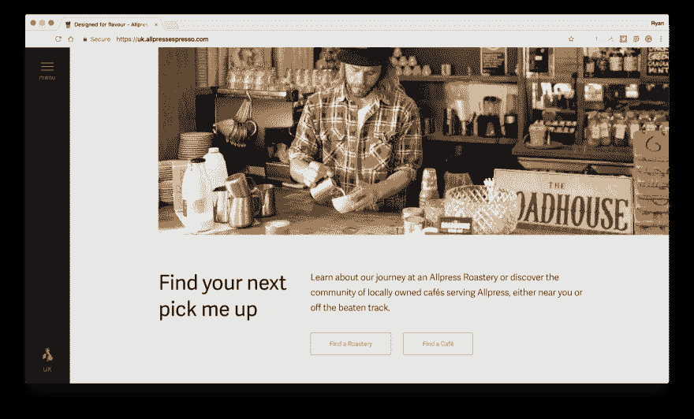
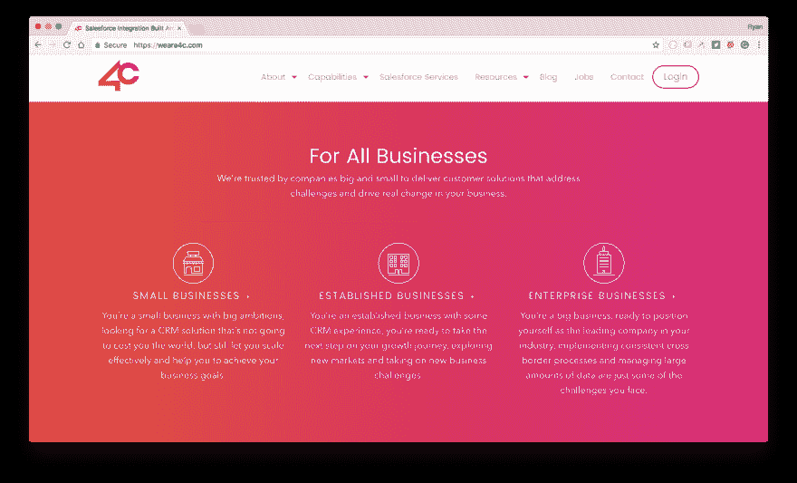
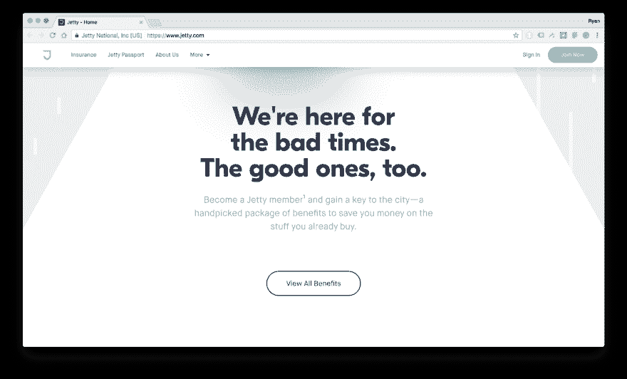
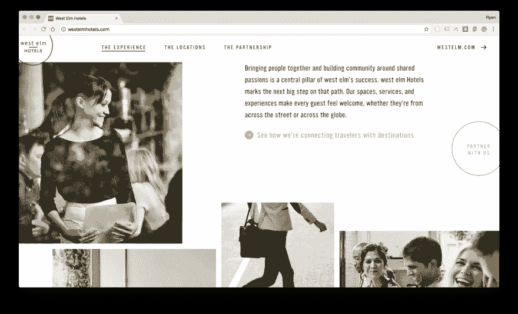
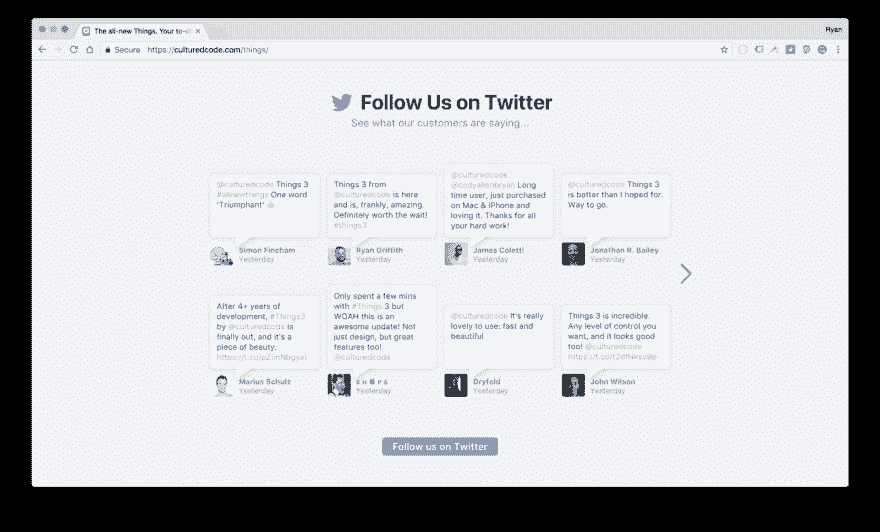
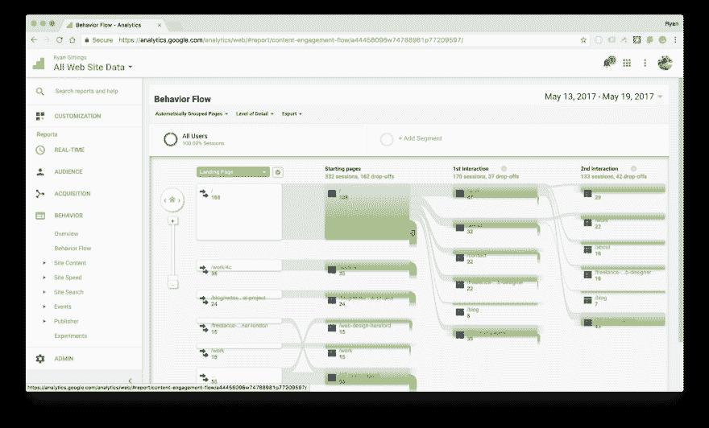

# 如何构建一个成功的主页

> 原文:[https://dev . to/ryangittings/how-to-structure-a-successful-home page-58j](https://dev.to/ryangittings/how-to-structure-a-successful-homepage-58j)

在一个每个人都相互联系和参与的时代；每个人都想立刻拥有一切。因此，确保你的设计结构良好，围绕用户构建是必须的。

在这篇文章中，我想看看组成一个主页的所有方面。一个网页的设计年复一年地进化，不断地发展以符合原创的需要。作为设计师，我们挑战自己，利用现代技术提出革命性的设计，以展示我们最好的能力。然而，对于典型的网站主页来说，有些东西是不变的，在这篇文章中，我将和你一起浏览一些关键的原则。

首先，我们将看看主页的架构；一个好的主页的例子，最后是我自己的一些例子来展示我是如何建立主页的。

## 信息架构

信息架构本质上是内容的结构。这是一个需要设计师平衡网站关键元素的过程，从图像、视频到文本内容。

这个过程的主要目标是通知用户，但是防止用户对页面感到不知所措。这是通过确保内容简洁、描述性和交流性来实现的。引入一个概述内容各部分之间关系的结构也很重要。这使得网站访问者的导航变得简单而有效。

对于一个网页设计师来说，执行信息架构任务的能力是无价的。这不仅意味着设计在美学上看起来很好，也意味着设计将在其关键目的和目标方面取得成功。

## 规划是关键。

正如智者本杰明·富兰克林曾经说过的，不做准备，就做好失败的准备。甚至在你选择的设计软件开始设计之前，确保你已经完全掌握了网站的内容，它的用户和用户的需求是你能够有效设计的关键。

在 IA 流程中，您开始问自己的问题是:

*   我了解所有不同的用户群吗？对于一个学校网站，公众，学生，家长
*   你知道网站上到底有什么内容吗？你知道不同类型的用户优先考虑什么内容吗？

一旦以上两个问题的答案都是肯定的，你就可以开始规划主页的内容了。通过使用收集到的信息，你应该能够给出一个内容优先级的列表，以便能够计算出什么在主页上效果最好，这样你的用户就可以快速、高效、有效地到达他们想去的地方。

我倾向于将每类用户的每个页面按照对每个用户群的重要性从低到高进行分类。这让我可以快速地从每个组中找出共同的元素，这让我知道在规划主页的架构时需要优先考虑哪些元素。

处理信息架构的方法没有对错之分。每个网站都有独特的挑战和问题需要你去克服，有时这确实需要以一种创造性的方式来完成。尝试创建一个可以复制的过程是一个向前推进的好主意，这样你就可以确保将你在前进的过程中学到的东西应用到每个项目中。

## 规划导航

IA 与导航携手并进。确保内容有适当的后续行动，无论是链接到其他页面以阅读更多内容，还是直接采取行动。

[T2】](https://res.cloudinary.com/practicaldev/image/fetch/s--9aedE59g--/c_limit%2Cf_auto%2Cfl_progressive%2Cq_auto%2Cw_880/https://cdn-images-1.medium.com/max/1600/1%2Abv8QCDYOrIuSO1TkRxJigg.png)

Allpress Espresso 有一个非常干净和简约的主页，每个主要部分都有后续行动。这是迎合所有不同类型用户的一个很好的例子。

当你根据用户类型对内容进行优先排序后，规划导航是创建一个成功网站主页的关键步骤。在我看来，网站应该介绍网站的关键领域，并确保“高重要性排名”的每个方面都可以通过理想的一次点击获得，或者在最糟糕的情况下，最多两次。

### 4C

4C 站点将业务确定为非常高的优先级。在主页上实现一个部分，让用户选择他们的业务类型，使他们能够非常快速地获得相关内容。

### 码头

 这是一个很好的信息架构的例子，并且重申了我在本文中提到的所有观点。清晰的标题和简洁的描述让用户很容易理解 Jetty 的主要卖点，清晰的行动文本让用户可以很快获得更多信息。

### 斯特劳瓦

Strava 拥有一个交互式的独特主页，同时仍然保持良好的信息架构和非常好的独特用户体验。它们很好地概述了平台功能，并提供了点播内容。

## 实现内容点播

为了能够在主页上获得所有需要的内容，保持内容简洁和相关是关键。内容点播是一种非常好的方式，可以让你在主页上简洁、高效、有效地介绍内容。

我个人使用一种特殊的设计模式来实现内容点播，这种模式利用了主页上的几个“部分”。这使得主页成为网站内容的简要概述，几乎就像一种“小册子”，为每个关键部分引入一个段落，并号召用户继续阅读。这引入了一个允许用户毫不费力地浏览站点的流程。它还允许更受控制的流程，创建一个漏斗来确保您的用户浏览您希望他们浏览的页面，无论是购买产品、打电话，甚至是联系表单查询。

 
西榆树酒店有效而简洁地分解内容，通过跟进行动号召，让用户按需获取更多内容。这个设计非常大胆，但是也确实做得很好，坚持一个成功网站所需要的核心原则。

## 建立信任

建立信任是一个成功主页的另一个非常重要的因素。包含建立信任的元素是一个很好的补充，这可以通过多种方式实现。一些成功的例子包括推荐、社交媒体整合以及利用与网站相关的知名品牌。

当你纯粹为了建立信任而在主页上展示某些区域时，我倾向于将这些类型的元素放在底部，因为就优先级而言，这不是用户必须看到的。然而，重要的是建立信任，强化你在网站上提到的一切，建立权威。

Milanote 设立了一个大品牌和媒体推荐专区，这确实增加了产品的权威性并建立了信任。它还包括一个声誉好的名字的证明，让用户相信产品的声誉。

 
有教养的代码利用 Twitter 来加强产品的质量，同时也给用户在 Twitter 上关注他们的选择。利用社交媒体可以与你的用户群建立信任。这是一个在网站上以自然的方式获得推荐的好方法，同时让经过验证的用户重申并建立对产品的信任。

## 值好的内容

确保网站在设计方面具有吸引力只是故事的一半。好的内容允许一个网站以任何他们想要的方式与它的用户交流。能够准确简洁地分解内容，让用户保持兴趣，同时确保用户不会不知所措。这将允许你创建一个有效的网页，服务于其目的。

内容以各种形式出现，无论是视频、照片还是文本。确保你包含的每一个元素都细致到一个很高的水平，这有助于强化所有艰难的结构性工作。如果内容达不到要求，那么创建一个完美的信息架构又有什么意义呢？这一切就像拼图游戏一样组合在一起，创造一个和谐的体验，这就是良好的项目管理和沟通的来源。

在我们所处的数字时代，作为一名网页设计师，冷酷无情的生活是，你只有一次第一印象，很可能是通过你的主页。让用户感受到一种情感是我创建的每一个主页的目标。这将有助于给你永久的第一印象，并获得所有重要的转换。

好的内容对于让用户感受到一种情感是至关重要的，无论是通过表达核心品牌理念的视频，还是从你所寻找的用户那里获得回应的描述性和情绪化的文本。使用我们在文章前面讨论过的结构可以帮助你在主页上创造一个故事，传达你在第一印象中所需要的一切，所以如果用户不同意，你知道你已经尽了最大努力来传达你想说的一切。

## 开机自检

在我看来，一旦网站上线，确保你查看了所有的数据和图表是这个过程的另一个重要部分。谷歌分析等工具允许开发者查看用户正在做什么，用户来自哪里，他们将访问哪些页面，这是非常强大的。

如果你想从这篇文章中得到什么，我的建议是**不要害怕改变和尝试。每个项目都是不同的，有时一些项目比其他项目需要更多的改进，也许更新一个标题，或者改变一个图像来建立信任并与用户进行更多的交流。**

[T2】](https://res.cloudinary.com/practicaldev/image/fetch/s--Qavr-wca--/c_limit%2Cf_auto%2Cfl_progressive%2Cq_auto%2Cw_880/https://cdn-images-1.medium.com/max/1600/1%2AQrSOFBOp26ic2i2xy1v1eg.png)

通过行为流工具来分析你的用户在做什么，有助于跟踪你实施的 ia 是否有效。对于我建立的大多数网站，我的目标是跳出率低于 40%。我试图确保我的用户从我的主页进入一个信息页面，这样他们可以了解我的服务，我做什么，我能提供什么业务。

## 结论

对于新设计师来说，信息架构可能要花很多时间。网络在不断发展，事物总是在变化。因此，作为网页设计师，我们总是在学习、改进和适应，以提高我们的技能。确保你做的每一个设计都考虑到用户是网页设计的一个很好的开始，确保他们到达他们需要去的地方是网页设计中最重要的事情之一。它应该介绍品牌，并给用户一个关于网站上有什么的信息，以便用户群可以在两次点击之内到达他们需要的地方。

我喜欢获得新的想法，并与其他设计师讨论意识形态，这让我喜欢上了网页设计社区。请随时给我留言，在 [Twitter](https://twitter.com/ryangittings) 上告诉我，或者在我的[网站](https://ryangittings.co.uk)上给我留言。

原帖:[中](https://medium.com/@ryangittings/how-to-structure-a-successful-homepage-61af8bc5cfcf)