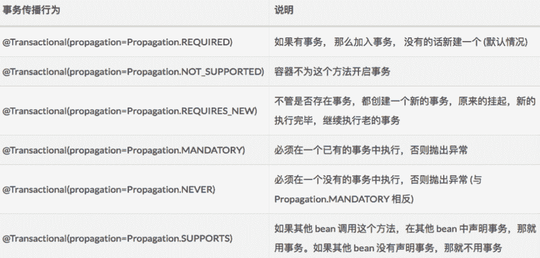
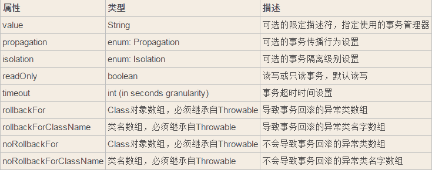

# Java gadget

> 原文:[https://dev.to/fangdajiang/java-7na](https://dev.to/fangdajiang/java--7na)

### [JMH](http://blog.dyngr.com/blog/2016/10/29/introduction-of-jmh/)

Other Tutorial: [JMH-Java Microbenchmark Harkness](http://tutorials.jenkov.com/java-performance/jmh.html) See: [Java Samples](http://hg.openjdk.java.net/code-tools/jmh/file/tip/jmh-samples/src/main/java/org/openjdk/jmh/samples/)
JMH is a Micro Benchmark Framework developed by the big cattle who developed Java compilers in OpenJDK/Oracle. What is a Micro Benchmark? Simply put, it is the benchmark on the level of method, and the accuracy can be as accurate as microseconds. It can be seen that JMH is mainly used when you have found out the hotspot function and need to further optimize it, you can use JMH to quantitatively analyze the optimization effect.

Typical usage scenarios include:

*   I want to know quantitatively how long a function needs to be executed, and the correlation between the execution time and the input N.
*   There are two different implementations of a function (for example, implementation A uses FixedThreadPool and implementation B uses ForkJoinPool). I don't know which implementation has better performance.

### [Logback configuration analysis](http://tengj.top/2017/04/05/springboot7/)

*   How to introduce logs?
*   How to configure the log format and output mode?
*   How to use it in the code?

### 验证

*   @NotNull // Cannot be empty
*   @Size // Length or size range

    `@Size(min = 1, max = 20)
    private String name;`

*   @ not null (groups = validationservice.save.class)//When saving, it is not allowed to be empty; when updating, it is allowed to be empty, which means that the field will not be updated.

*   @花样

    `@Pattern(regexp = "^\\s*\\w+(?:\\.{0,1}[\\w-]+)*@[a-zA-Z0-9]+(?:[-.][a-zA-Z0-9]+)*\\.[a-zA-Z]+\\s*$")
    private String email;`

*   @Min(18) // Minimum value

*   @Max // Maximum value

    `@Max(100) private int age;`

*   @Past // It must be a past time

    `@Past private Date loginDate;`

*   @Future // It must be a future time

    `@Future private Date expiryDate;`

### 事务性(来源:[春天@事务性原理及使用](http://tech.lede.com/2017/02/06/rd/server/SpringTransactional/))

*   Transaction propagation behavior 
*   Transaction level 
    *   Dirty read: one transaction reads the uncommitted update data of another transaction.
    *   Non-repeatable reading: in the same transaction, the results of reading the same data many times are different. In other words, the subsequent reading can read the updated data submitted by another transaction. On the contrary, when "repeatable read" reads data multiple times in the same transaction, it can ensure that the read data is the same, that is, subsequent reads cannot read the updated data submitted by another transaction.
    *   Magic read: one transaction reads the insert data submitted by another transaction.
*   Attribute 