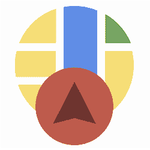

# 为您的应用程序创建 Google Maps URLs 的快速指南

> 原文:[https://dev . to/pgood John/a-quick-guide-to-creating-Google-maps-URLs-for-your-applications-353](https://dev.to/pgoodjohn/a-quick-guide-to-creating-google-maps-urls-for-your-applications-353)

 
不得不在一个应用程序中找到一个地址的方向可能是相当痛苦的。不是所有的应用程序都允许复制粘贴文本，也许它不是文本格式，但已经被添加到图像中，没有人想过让它成为一个简单的可选屏幕，有很多原因可以解释为什么这很难。
因此，我们在开发应用程序和网站时，必须考虑那些可能发现自己处于与我们相同情况的用户，试图找出去那家人人都在谈论的怪异咖啡店的方向，但其网站似乎是一个静态图像，不允许您选择任何东西。解决方案非常简单:只要确保在你的地址字符串下放置一个带有谷歌地图 URL 的标签就可以了！这比你想象的要简单，而且可能会解决你所有的用户问题。
怎么做？我们只需获取您希望用户到达的地址，并简单地创建一个如下形式的链接:
`'https://www.google.com/maps/dir/?api=1&destination=' . $address`
该 URL 将简单地将用户重定向到一个谷歌地图页面，该页面显示从他们当前位置到存储在变量`$address`中的地址的方向，或者，如果他们使用移动设备，则启动谷歌地图应用程序，该应用程序会将他们的用户从他们当前位置导航到您指定的地址。
注意，你不仅仅局限于地址！你可以使用谷歌地图上的几乎每一个查询作为`destination`值:让它成为经纬度、邮政编码或任何你喜欢的值，你的用户将能够到达他们的目的地，而不必挣扎着复制和粘贴地址！

另外，在将地址附加到 Google Maps api 基本 URL 之前，记得对其进行编码( [`urlencode()`](http://php.net/manual/en/function.urlencode.php) )。

这里的连接和变量语法是 PHP，但这个概念对每种编程语言都有效；)