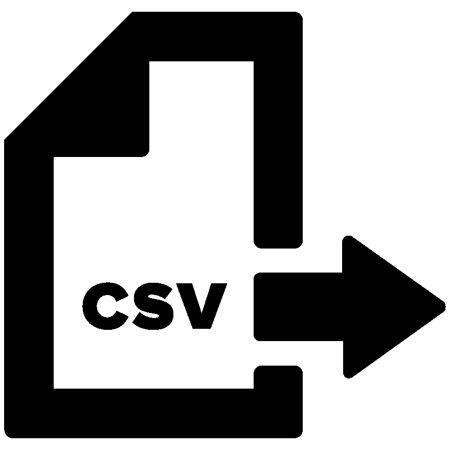

# 使用 Python 轻松导出 CSV 数据

> 原文：<https://dev.to/scriptingwithpy/easy-exporting-csv-data-with--python-94h>

[T2】](https://res.cloudinary.com/practicaldev/image/fetch/s--N415UR2b--/c_limit%2Cf_auto%2Cfl_progressive%2Cq_auto%2Cw_880/http://scriptingwithpython.com/conteimg/2017/10/5aa2510fc2dc493a66983ce82d63cce1.svg)

本文是[用 Python](http://scriptingwithpython.com/processing-csv-data-with-python) 读取 CSV 数据的后续文章。

在那篇文章中，我描述了什么是 CSV 文件以及如何读取 CSV 数据。读取数据的另一面是将数据写出到文件中。我将再次总结什么是 CSV 文件，然后进入如何写这种格式的数据。

CSV 文件非常常见。我在工作中传输数据时经常会碰到它们。在家里，从银行或 Google Sheets 导出文件时，CSV 文件几乎总是一个选项。

# 什么是 CSV？

**CSV**=**C**omma**S**单独的 **V** 值

[](https://res.cloudinary.com/practicaldev/image/fetch/s--OezDWew6--/c_limit%2Cf_auto%2Cfl_progressive%2Cq_auto%2Cw_880/https://images.unsplash.com/photo-1485167729757-d0c4103392dc%3Fixlib%3Drb-0.3.5%26q%3D80%26fm%3Djpg%26crop%3Dentropy%26cs%3Dtinysrgb%26w%3D1080%26fit%3Dmax%26s%3Dab2f7cc21dba01f8e8cb96132d63c7a6) 

<small>照片由[安德鲁·弗尔兰](https://unsplash.com/@andrewfurlan?utm_source=ghost&utm_medium=referral&utm_campaign=api-credit) / [Unsplash](https://unsplash.com/?utm_source=ghost&utm_medium=referral&utm_campaign=api-credit)</small>

我们总是看到它们，但是对于 CSV 文件到底是什么，似乎有些混淆。当我和人们谈论 CSV 文件时，我意识到我们大多数人都把它们等同于 Microsoft Excel 文档。这可能是因为 Excel 通常是打开 CSV 文件的默认程序。

事情是这样的。CSV 文件只是一个文本文件。就这样，没别的了。文件扩展名通常是`.csv`,但这不是必须的。任何文件扩展名只是对文件中包含的内容的暗示，并不实际决定或控制内容类型。关于 CSV 文件的[维基百科文章](https://en.wikipedia.org/wiki/Comma-separated_values)指出:

> “CSV”不是一种单一的、定义明确的格式。
> 
> 因此，在实践中,“CSV”一词可能指任何符合以下条件的文件:
> 
> *   是使用字符集(如 ASCII、各种 Unicode 字符集)的纯文本
> *   由记录组成(通常每行一条记录)，记录被划分为由分隔符分隔的字段
> *   其中每个记录都有相同的字段序列

这里有一个例子。我的桌面上有一个名为`users.csv`的文件。在电子表格程序(Excel、Google Sheets、LibreOffice、Numbers 等)中，该文件看起来像这样。

[T2】](https://res.cloudinary.com/practicaldev/image/fetch/s--XIAdfv73--/c_limit%2Cf_auto%2Cfl_progressive%2Cq_auto%2Cw_880/http://scriptingwithpython.com/conteimg/2017/10/csv_file_1.1.png)

那些列和行很漂亮，很别致。我们认为会有神奇的事情发生，但事实并非如此。这个文件的内容真的只是:

```
user_id,first_name,last_name,email
234,Kevin,Crommer,example@example.com
235,Carl,Marx,cmarx@example.com 
```

Enter fullscreen mode Exit fullscreen mode

您可以用纯文本编辑器打开 CSV 文件来查看真实内容。这非常类似于查看网页的源代码并查看底层的 HTML。

一个电子表格程序读取 CSV 文件，并向用户(你和我)显示一个漂亮的版本，使其易于查看列和行。

正如您在我的示例中看到的，CSV 文件通常每条记录占一行。在这种情况下，有 4 列。栏目标题为`user_id`、`first_name`、`last_name`和`email`。记录将有一列或多列，通常(但不总是)用逗号分隔。

## 已经复习够了，赶紧去写资料好东西吧

好吧，好吧。让我们了解一下如何将 CSV 数据写入文件或类似文件的对象。

写出 CSV 数据时，您需要记住几个要点。

### 没有库不要尝试写 CSV。

比起弄清楚如何处理每一个可能的 CSV 变体，您有更好的事情要做。相信我，这是我的经验之谈。我将承认在我发现内置(是的内置)`csv`模块之前浪费了几天时间。你最好把精力花在完成工作上。

### `csv`模块牛逼

每个现代版本的 Python 中都内置了 CSV 模块。<sup>[【1】](http://scriptingwithpython.com/easy-exporting-data-as-a-csv-in-python/#fn1)</sup>

该模块处理读取和写入 CSV 数据的所有复杂问题。这是疯狂的快速和公正的工作。

引用 [Python 文档](https://docs.python.org/3/library/csv.html):

> csv 模块实现了读取和写入 CSV 格式的表格数据的类。它允许程序员在不知道 Excel 使用的 CSV 格式的具体细节的情况下，说“以 Excel 喜欢的格式写数据”或“从 Excel 生成的文件中读取数据”。程序员还可以描述其他应用程序理解的 CSV 格式，或者定义自己的专用 CSV 格式。
> 
> ### 已经够了...举个例子

好吧好吧。先说个例子。

在[http://scripting with python . com/easy-exporting-data-as-a-CSV-in-python/](http://scriptingwithpython.com/easy-exporting-data-as-a-csv-in-python/)完成这篇文章