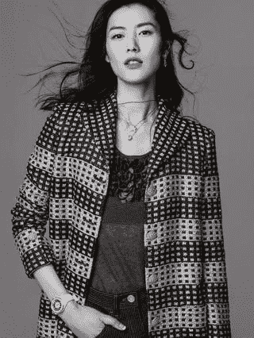

# 构建一个仅支持 CSS 的图片库(带后备)

> 原文：<https://dev.to/huijing/building-a-css-only-image-gallery-with-fallbacks-1pm6>

在网站上，这篇文章已经被翻译成了日文。

有时，我们被交给一个项目，在这个项目中，我们几乎拥有完全的创造性控制和自由支配去做几乎任何事情。我认为自己非常幸运，自从我开始 web 开发生涯以来，已经有了两个这样的项目。最新的一个是威斯敏斯特实验室的网站。

如果你感兴趣的话，[我谈了网站本身是如何建立的，从品牌，到设计和实际代码。对我来说，像这样的项目就像去度假，因为一个典型的项目涉及更多的利益相关者，更多的考虑和更多的妥协(在无数的事情上)。](https://www.wismutlabs.com/blog/whats-in-a-name/)

但是我跑题了。今天的重点是讨论如何建立一个实验性的仅支持 CSS 的图库，即使在旧的浏览器上也不会破坏体验。图片库的目的是浏览图片。所述图像在每个浏览器上的显示方式不必完全相同。TLDR 是我为 Wismut 实验室的一篇博客文章建立的一个小图库。

## CSS 专用图片库

这个实验的背景故事。我有一个设计师朋友，她问我对她设计的网站的看法，其中一个功能是一个带滑块的图库。这个网站是为一家出售二手数控机床的公司准备的。

拥有一个带滑盖的图片库的目的是让潜在买家尽可能多地从多个角度近距离观看机器。如果你问我，我觉得很合理。但是我也想知道我是否可以在不使用 Javascript 的情况下构建它，经过一点点研究，我发现这是完全可能的。

首先，让我们来分解对带有滑块的图片库的要求。我们需要一个始终以合理的大尺寸显示的图像，以及图库中所有其他图像的一组缩略图。显示的图像应该与被点击的缩略图相对应，使缩略图成为图库的导航。

请记住，这只是一种带有滑块的图片库，这种组件有无数种行为，需要不同的技术来构建。但是对于我刚才描述的那个，实现所需行为的相关 CSS 属性如下:

*   [柔性盒](https://www.w3.org/TR/css-flexbox-1/)
*   [视口百分比单位](https://www.w3.org/TR/css-values-3/#viewport-relative-lengths)
*   [物体拟合](https://www.w3.org/TR/css3-images/#the-object-fit)
*   [变换](https://www.w3.org/TR/css-transforms-1/)
*   [动画](https://www.w3.org/TR/css3-animations/)
*   [:目标](https://www.w3.org/TR/css3-selectors/#target-pseudo)
*   [:not()](https://www.w3.org/TR/css3-selectors/#negation)

我喜欢独立完成我的演示，这样我就可以准确地掌握需要什么样的代码，而不用担心如何将组件集成到更大的网站环境中。我们可以以后再担心这个问题。

我想尝试的一件事是保持原始图像的纵横比，不管视窗大小如何变化。以及图像库是否可能永远不超出视口的边界。

<figcaption>这是中国超级名模刘雯，她在这次展示中扮演</figcaption>

[](https://res.cloudinary.com/practicaldev/image/fetch/s--jVJqiN0u--/c_limit%2Cf_auto%2Cfl_progressive%2Cq_auto%2Cw_880/https://www.chenhuijing.cimg/posts/responsive-slider/liuwen.jpg)

图库的标记包括两个图像列表，显示图像和缩略图:

```
<div class="container">
  <ul class="slides">
    <li id="slide1"></li>
    <li id="slide2"></li>
    <li id="slide3"></li>
    <li id="slide4"></li>
    <li id="slide5"></li>
  </ul>

  <ul class="thumbnails">
    <li><a href="#slide1"></a></li>
    <li><a href="#slide2"></a></li>
    <li><a href="#slide3"></a></li>
    <li><a href="#slide4"></a></li>
    <li><a href="#slide5"></a></li>
  </ul>
</div> 
```

Enter fullscreen mode Exit fullscreen mode

缩略图和显示图像是相同的，我想既然我无论如何都要加载显示图像，还不如将它们用于缩略图并相应地对它们进行样式化。这样我就不必为缩略图准备第二组图像并加载它们。

您会注意到所有显示图像都有一个 ID，并且每个对应的缩略图都有一个指向这些 ID 的`href`。这对于`:target`伪类选择器的工作是必要的，它允许我们将样式应用于包含片段标识符的 URI 的目标元素。

因为我选择用于此演示的图像是纵向的，所以我决定将缩略图显示在显示图像右侧的一列中。`object-fit`允许我将肖像图像裁剪为横向，并调整它们的位置，使图像的焦点仍然在关键内容上(例如模特的脸)。

```
.thumbnails {
  display: flex;
  flex-direction: column;
  line-height: 0;

  li {
    flex: auto; 
  }

  a {
    display: block;
  }

  img {
    width: 30vmin;
    height: 20vmin;
    object-fit: cover;
    object-position: top;
  }
} 
```

Enter fullscreen mode Exit fullscreen mode

保持图片库始终在视窗范围内的诀窍是`vmin`单元。它指的是视口宽度或高度的 1%,此时以较小者为准。通过将图库的高度设置为`100vmin`，我们可以确保图库永远不会溢出视口。

```
.slides {
  overflow: hidden;
  width: 75vmin;
  height: 100vmin;

  li {
    width: 75vmin;
    height: 100vmin;
    position: absolute;
    z-index: 1;
  }

  img {
    height: 100vmin;
    object-fit: cover;
    object-position: top;
  }
} 
```

Enter fullscreen mode Exit fullscreen mode

滑块的另一部分，不可避免的是滑动效果，这可以通过 CSS 转换和动画的帮助来实现。这种技术的前提是将所有显示图像向上平移 100%的高度，并在单击它们各自的缩略图时将它们恢复到原始位置。

关键帧非常简单(我没有用任何复杂的计时功能，你可以随意改进)并且是线性的。这些动画由`:target`选择器触发。

```
.slides li:target {
  z-index: 3;
  -webkit-animation: slide 1s 1;
}

.slides li:not(:target) {
  -webkit-animation: hidden 1s 1;
}

@keyframes slide {
  0% {
    transform: translateY(-100%);
  }
  100% {
    transform: translateY(0%);
  }
}

@keyframes hidden {
  0% {
    z-index: 2;
  }
  100% {
    z-index: 2;
  }
} 
```

Enter fullscreen mode Exit fullscreen mode

最终结果可以在下面的代码栏中看到。没有太多代码，甚至在 IE11 也能工作，因为从 IE9 开始就支持`:target`选择器。只是 IE11 不支持`object-fit`所以缩略图长宽比很歪斜。

[https://codepen.io/huijing/embed/GvNLJm?height=600&default-tab=result&embed-version=2](https://codepen.io/huijing/embed/GvNLJm?height=600&default-tab=result&embed-version=2)

这就引出了下一个相关的讨论点:**特性查询**。

## 功能查询…又来了？

是的，我的朋友。功能查询，全天，每天。我将一直谈论特性查询，直到母牛回家。至少在有更好的解决方案之前(但我认为这已经是一个相当不错的解决方案了)。

老实说，功能查询的存在改变了我对网页设计的想法，并在我的大脑中打开了一个开关，开始接受不同的浏览器有时会以不同的方式呈现事物的事实，所以为什么不利用它呢？

对于这个只有 CSS 的图片库，最不支持的属性是`object-fit`，后面是视口百分比长度。这种方法背后的逻辑是评估对您试图构建的功能至关重要的属性，然后确定如何分解支持层。

我试图将图片库整合到一个现有的站点中，使用一个现有的代码库，以及页面上除图片库之外的许多其他元素，这意味着必须对`vmin`方法进行一些修改。

### 基本先回退

尽管我开始时考虑的是最终结果，但我总是考虑光谱的另一端，即没有任何特性的组件的基本级别显示。对于像这样的图片库，它将是一个图像列表(尽管有一点点样式)。

随着视窗尺寸的增大，我使用最基本的布局技术`inline-block`，选择以列的形式显示图像。鉴于这根本不是一个滑块，缩略图变得没有必要。

```
.container {
  text-align: center;
  margin-bottom: 1em;

  ul,
  li,
  img {
    margin: 0;
  }

  li {
    list-style: none;
  }

  .slides {
    display: inline-block;

    li {
      width: 10em;
      display: inline-block;
      vertical-align: top;
      margin-bottom: 0.25em;
    }

    img {
      width: 100%;
    }
  }

  .thumbnails {
    display: none;
  }
} 
```

Enter fullscreen mode Exit fullscreen mode

### 层上去

在狭窄的屏幕上也没有足够的空间来显示图片库，所以图片库的代码超出了最小屏幕宽度 540 像素。少于该值的任何内容都将获得列表中的图像。权衡取舍🤷。

快速浏览滑块工作所需的 CSS 属性可以发现，最不受支持的属性是`object-fit`。对于在要素查询中使用什么没有硬性规定，因为每个上下文都是不同的。对于这个特殊的例子，我选择了`object-fit`作为我的特性查询的基础，因为它是最不受支持的。

```
@media screen and (min-width: 540px) {
  @supports (object-fit:cover) {
    .container {
      display: flex;
      justify-content: center;
      margin-bottom: 1em;

      .slides {
        overflow: hidden;
        width: 50vmax;

        li {
          position: absolute;
          z-index: 1;
          width: initial;
          display: block;
        }

        li:target {
          z-index: 3;
          -webkit-animation: fade 0.6s 1;
        }

        li:not(:target) {
          -webkit-animation: hidden 0.6s 1;
        }

        img {
          width: auto;
          object-fit: cover;
          object-position: top;
          height: 37.5vmax;
        }
      }

      .thumbnails {
        display: flex;
        flex-direction: column;
        line-height: 0;
        width: 13.75vmax;

        li {
          flex: auto;
        }

        a {
          display: block;
          border: 0;
        }

        img {
          object-fit: cover;
          object-position: top;
          width: 100%;
          height: calc(37.5vmax / 7);
        }
      }
    }
  }
} 
```

Enter fullscreen mode Exit fullscreen mode

最终结果看起来像下面的视频(我不擅长做屏幕录制 tbh)。这是有史以来最好的图像滑块吗？肯定不是。但它适用于它被使用的环境。

<figcaption>对不起，这是一段可怕的屏幕录音</figcaption>

[](https://res.cloudinary.com/practicaldev/image/fetch/s--b5CTzxUh--/c_limit%2Cf_auto%2Cfl_progressive%2Cq_66%2Cw_880/https://cdn.rawgit.com/huijing/filerepo/gh-pages/devto/css-slider.gif)

可能会有这样的情况，您尝试构建的组件会针对所需的 CSS 属性进行增量工作。在这种情况下，您可能会有多个特性查询，从而提供更细微的特性支持。

同样，这些决定可能是也可能不是无关紧要的，这取决于项目的范围和环境，但是特性查询是我们武库中非常有用的工具，我们应该足够熟练地熟练运用它们，不管它们是否在每个项目中使用。

## 旁注:复制和粘贴不是集成

在网上找到各种功能的代码片段是很常见的，比如传送带、标签、加载器等等。其中很多都写得很好，但是简单地将它们复制并粘贴到您自己的项目中，而不了解底层代码是如何工作的，这往往会导致问题。

将他人的代码无缝集成到您自己的项目中是一项被低估的技能，IMHO，因为它要求您与原作者一样精通，如果不是更精通的话，以便辨别代码的哪些部分与您需要的功能相关，哪些部分可以被丢弃。

## 包装完毕

随着我继续研究和试验各种 CSS 属性，特性查询将仍然是我的代码中的一个关键成分。我不能强迫任何人使用特性查询，但是我确实希望一些阅读这篇文章或者看到我的一些演示的人有足够的好奇心去尝试它们。

我不是专家，所以我不断地调整、构建和破坏东西，因为我试图编码任何我此刻感兴趣的东西。你知道有人曾经说过，在 CSS 方面做得更好的唯一方法是更多的 CSS(实际上不，他是在说跑步，但是跑步…CSS…一样的区别，不是吗？😛)直到下一个！

*最初发布于[www.chenhuijing.com](https://www.chenhuijing.com/blog/building-a-css-only-image-gallery/)2017 年 10 月 08 日。*