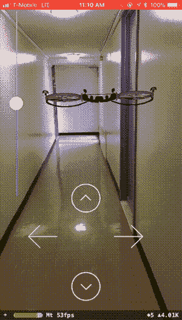
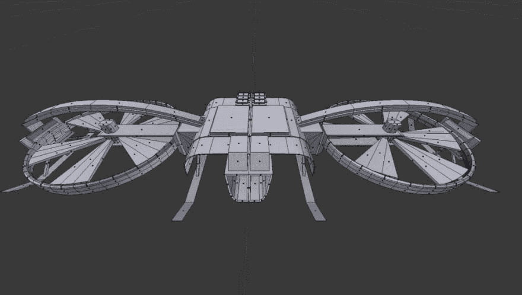
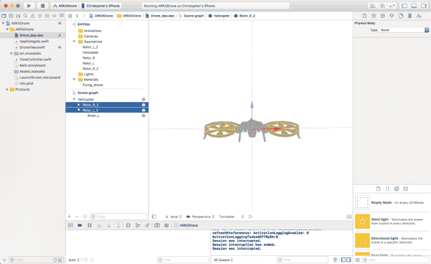
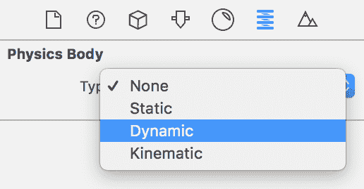

# 阿尔基特冒险

> 原文：<https://dev.to/chriswebb09/arkit-adventures-278n>

#### 制作遥控无人机

[T2】](https://res.cloudinary.com/practicaldev/image/fetch/s--8WKP1zSf--/c_limit%2Cf_auto%2Cfl_progressive%2Cq_66%2Cw_880/https://cdn-images-1.medium.com/max/300/1%2ALpNpWVlYHaa00I_66QAfAg.gif)

```
Demo Code 
```

在 ARKit 上的最后几个帖子中，我们放置的大部分内容都非常静态。对于这个例子，我想改变一下思路，在 ARKit 中做一些更具交互性的东西。

#### **派出雄蜂！**

如果你曾经想玩遥控无人机，但从来没有机会这样做，这个教程是给你的。我知道这些控件目前看起来有点愚蠢，但这篇文章的重点不是创建一个真正令人印象深刻的界面，而是让你开始与增强世界互动。

### 入门

[T2】](https://res.cloudinary.com/practicaldev/image/fetch/s--2lVBUsFw--/c_limit%2Cf_auto%2Cfl_progressive%2Cq_auto%2Cw_880/https://cdn-images-1.medium.com/max/1024/1%2AzCcFVio1j-FzFhXGzVUPfA.jpeg)

鉴于渲染无人机的复杂性，我们最好从找到一个好的 3D 无人机模型开始。我发现 COLLADA 文件是最容易与苹果的 SceneKit 接口的，也是最容易转换成的文件类型。scn 文件。COLLADA 文件使用文件扩展名。dae，可以在 Apple 的预览应用程序中查看。

> 具有 DAE [文件扩展名](https://www.lifewire.com/what-is-a-file-extension-2625879)的文件是数字资产交换文件。顾名思义，它被各种图形程序用来在相同的格式下交换数字资产。它们可以是图像、纹理、3D 模型等。——[来源](https://www.lifewire.com/dae-file-2620544)

对于这个例子，我们将使用在[free3d.com](http://free3d.com)发现的一架无人机的 3D 模型。如果你不想注册，你可以下载。dae 文件，或者你可以得到我转换成的文件。已完成项目文件中的 scn。

这里有一个链接。dae 文件:

[DropBox](https://www.dropbox.com/s/ba7c2ha18cy6uwa/Drone_dae.dae)

#### 转换而来。dae To。视交叉上核（Suprachiasmatic Nucleus 的缩写）

[T2】](https://res.cloudinary.com/practicaldev/image/fetch/s--ZPc3s0Pz--/c_limit%2Cf_auto%2Cfl_progressive%2Cq_auto%2Cw_880/https://cdn-images-1.medium.com/max/1024/1%2AtIRXN3MaY3uRsCrFFrAOgA.png)

而 SceneKit 可以处理。dae 文件就可以了，为了简单起见，我们直接将其转换为. scn 文件。可能有更好的方法来做到这一点，我在摆弄 SceneKit 的设置时偶然发现了这个功能。若要转换为. scn 文件，请选择。dae 文件，在屏幕右侧的检查器中，应该有一个物理检查器选项卡，如下所示:

[T2】](https://res.cloudinary.com/practicaldev/image/fetch/s--b5nFS3hd--/c_limit%2Cf_auto%2Cfl_progressive%2Cq_auto%2Cw_880/https://cdn-images-1.medium.com/max/516/1%2At0v0USS2M_rf2JsgiIg1OQ.png)

一旦你选择了一个物理实体，XCode 会弹出一个提示，询问你是否要将文档转换成 SCN 格式。

[T2】](https://res.cloudinary.com/practicaldev/image/fetch/s--ZsT7YEyf--/c_limit%2Cf_auto%2Cfl_progressive%2Cq_auto%2Cw_880/https://cdn-images-1.medium.com/max/904/1%2ALPVrqLe7dR2vuQ2b9dbkFw.png)

### DroneSceneView

现在我们有了模型，可以开始编写无人机代码了。首先，我想创建一个名为 DroneSceneView 的 ARSCNView 的子类。在这个视图中，我们将尝试封装无人机的行为和属性。我们将使用控制器将这些行为连接到 UI。

#### 设置

我们应该给我们的 DroneSceneView 五个属于 SCNNodes 类型的性质。helicopterNode 为我们提供了一个进入无人机主体的钩子，blade1 和 blade2 节点将我们钩入无人机左侧或右侧旋翼周围的框架，而 rotorR 和 rotorL 节点则钩入叶片本身。