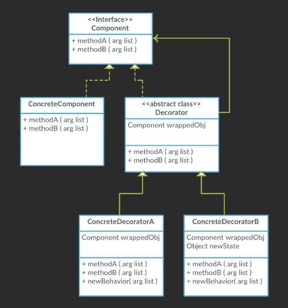
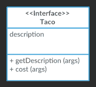
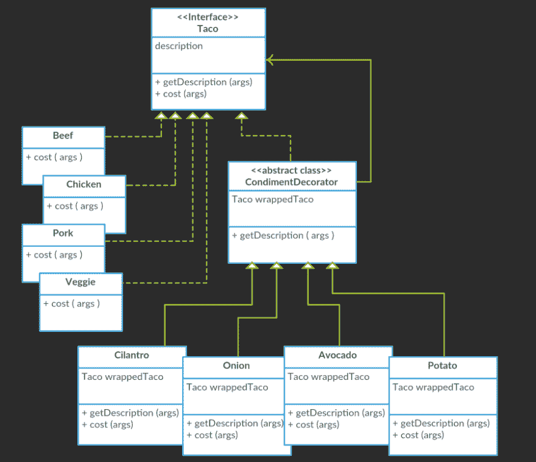
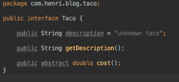
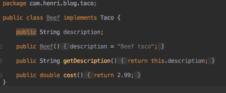
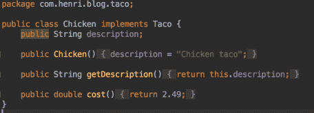
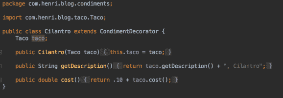
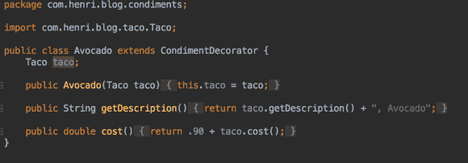
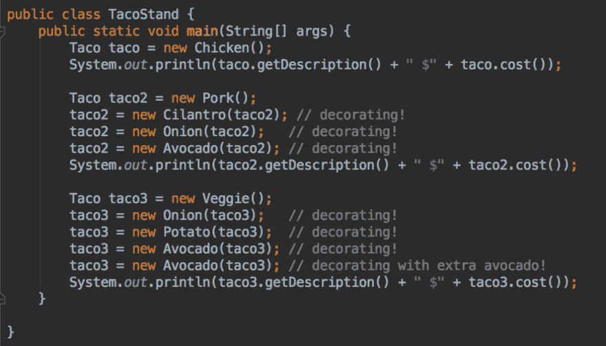

# 设计模式:装饰模式

> 原文:[https://dev . to/Henri AVO/design-patterns-decorator-pattern-5in](https://dev.to/henriavo/design-patterns-decorator-pattern-5in)

*最初发布于我的博客[henricodesjava . blog](https://henricodesjava.blog/)T3】*

大家好！第三章[头先设计模式:一个大脑友好的指南](https://www.amazon.com/Head-First-Design-Patterns-Brain-Friendly/dp/0596007124/ref=sr_1_1?ie=UTF8&qid=1505068308&sr=8-1&keywords=head+first+design+patterns)向我们介绍了装饰模式。这种模式在 JDK 的 java.io 包中被大量使用。尽管并不完美，但它可以与工厂和构建者模式(尚未涉及)相结合，使它们更加有用和干净。我们来谈谈装饰者模式。

本章介绍了一种新的设计原则。类应该对扩展开放，但对修改关闭。它帮助我们理解继承只是扩展的一种形式，但不一定是在我们的设计中实现灵活性的最佳方式。该模式支持在运行时而不是编译时组合和委托来添加新的行为。在我们的设计中，我们应该允许在不需要修改现有代码的情况下扩展行为。让我们给这个模式一个正式的定义。

装饰模式:这种模式动态地给一个对象附加额外的责任。Decorators 为扩展功能提供了子类化的灵活替代方案。

这个定义并没有真正告诉我们*这个模式是如何实现的，所以让我们来看看一个类图的定义。我不会在文中复制类图，我会给出另一个稍微不同的图。在下图中,“组件”是一个接口，而不是一个抽象类，但总体思路仍然是一样的。*

[T2】](https://res.cloudinary.com/practicaldev/image/fetch/s--vp3mqxPM--/c_limit%2Cf_auto%2Cfl_progressive%2Cq_auto%2Cw_880/https://henricodesjava.files.wordpress.com/2017/10/screen-shot-2017-10-06-at-11-28-57-am.png%3Fw%3D574%26h%3D613)

现在让我举一个具体的例子，这个例子和课文有点不同。假设我们开始经营自己的玉米卷摊餐厅，我们需要为我们的玉米卷摊订购系统编写一些代码。假设我们的起点是一个“Taco”界面。

[T2】](https://res.cloudinary.com/practicaldev/image/fetch/s--F-fENM4h--/c_limit%2Cf_auto%2Cfl_progressive%2Cq_auto%2Cw_880/https://henricodesjava.files.wordpress.com/2017/10/screen-shot-2017-10-05-at-9-59-22-pm.png%3Fw%3D194%26h%3D175)

我们想提供四种玉米卷:牛肉、鸡肉、猪肉和蔬菜。然后有四种调味品可以加到玉米卷里:芫荽叶、洋葱、鳄梨和土豆(我们不在玉米卷上放生菜或西红柿)。现在让我们展示一个实现 decorator patten 设计的 taco stand 订购系统的类图。

[T2】](https://res.cloudinary.com/practicaldev/image/fetch/s--jDZJExoL--/c_limit%2Cf_auto%2Cfl_progressive%2Cq_auto%2Cw_880/https://henricodesjava.files.wordpress.com/2017/10/screen-shot-2017-10-06-at-11-22-11-am.png%3Fw%3D900)

现在让我们看看实现这种设计的一些实际代码。首先是 Taco 接口(组件)。

[T2】](https://res.cloudinary.com/practicaldev/image/fetch/s--oCPy0VC5--/c_limit%2Cf_auto%2Cfl_progressive%2Cq_auto%2Cw_880/https://henricodesjava.files.wordpress.com/2017/10/screen-shot-2017-10-06-at-11-03-02-am1.png%3Fw%3D353%26h%3D162)

接下来是一些 Taco 实现(具体组件)。

[T2】](https://res.cloudinary.com/practicaldev/image/fetch/s--eH8p3DoU--/c_limit%2Cf_auto%2Cfl_progressive%2Cq_auto%2Cw_880/https://henricodesjava.files.wordpress.com/2017/10/screen-shot-2017-10-06-at-11-05-43-am.png%3Fw%3D452%26h%3D187)

[T2】](https://res.cloudinary.com/practicaldev/image/fetch/s--l1QaPvES--/c_limit%2Cf_auto%2Cfl_progressive%2Cq_auto%2Cw_880/https://henricodesjava.files.wordpress.com/2017/10/screen-shot-2017-10-06-at-11-07-28-am.png%3Fw%3D456%26h%3D165)

接下来让我们看看调味品装饰工(装饰工)。

[T2】](https://res.cloudinary.com/practicaldev/image/fetch/s--cG4BKWoP--/c_limit%2Cf_auto%2Cfl_progressive%2Cq_auto%2Cw_880/https://henricodesjava.files.wordpress.com/2017/10/screen-shot-2017-10-06-at-11-09-13-am.png%3Fw%3D431%26h%3D137)

现在是一些调味品实现(具体的装饰器)。

[T2】](https://res.cloudinary.com/practicaldev/image/fetch/s--HJtz9TZV--/c_limit%2Cf_auto%2Cfl_progressive%2Cq_auto%2Cw_880/https://henricodesjava.files.wordpress.com/2017/10/screen-shot-2017-10-06-at-11-11-31-am.png%3Fw%3D578%26h%3D201)

[T2】](https://res.cloudinary.com/practicaldev/image/fetch/s--2h7OG5ct--/c_limit%2Cf_auto%2Cfl_progressive%2Cq_auto%2Cw_880/https://henricodesjava.files.wordpress.com/2017/10/screen-shot-2017-10-06-at-11-12-05-am.png%3Fw%3D580%26h%3D203)

装饰模式包括一组装饰类(芫荽叶、洋葱、鳄梨、土豆)，用于包装具体的组件(牛肉、鸡肉、猪肉、蔬菜)。因此，让我们来看一些代码，把这一切粘在一起。请注意，当我们讨论工厂和构建器设计模式时，我们将了解创建装饰对象的更好方法。

[T2】](https://res.cloudinary.com/practicaldev/image/fetch/s--Ac1DfoG_--/c_limit%2Cf_auto%2Cfl_progressive%2Cq_auto%2Cw_880/https://henricodesjava.files.wordpress.com/2017/10/screen-shot-2017-10-06-at-11-25-27-am.png%3Fw%3D1076)

好消息。我检查了所有这些代码，并验证了它的正常工作。如果你好奇，你可以在 GitHub [这里](https://github.com/henriguy1210/DecoratorPattern)查看。

就是这样！这就是装饰模式的作用，感谢阅读！ðŸ'‹ðŸ

 