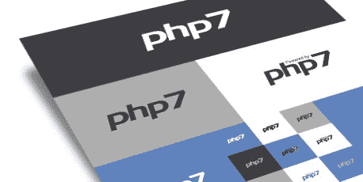

# 停止痛苦，升级到 PHP 7

> 原文：<https://dev.to/adamculp/stop-the-pain-upgrade-to-php-7-c40>

当我年轻的时候，我在当地的中学踢足球……踢得很糟糕。我不喜欢在炎热的天气里背着沉重的垫子跑步，我也不喜欢撞上和撞到其他孩子，他们中的大多数都比我大。但是到了高中，一切都变了。为什么？因为在中学足球是痛苦的。与此同时，在高中，嗯，它仍然是痛苦的，但有一些更愉快的事情来抵消痛苦。是教练的赞扬和人们欢呼我名字的声音让一切变得不同。

你看，在中学，教练似乎更关注那些可能欺负别人的大孩子，或者那些受欢迎的孩子，他们的父母是我们这个小社区的基石。然而，在九年级，情况发生了一点变化，因为教练非常善于将注意力分散到整个团队。他会告诉我“做得好”，或者“你可以做得更好”，他甚至让我在技能赶上来的时候玩一个游戏。这些是我以前没有的东西，它产生了巨大的影响。我开始喜欢上了比赛，并且比以往任何时候都更加努力，整个赛季都是首发，而不是满足于坐在场边看别人比赛。

所以，现在你可能会问，“这和升级到 PHP 版本 7 有什么关系？”答案是，因为许多人让迁移到 PHP 7 的痛苦阻止了他们体验快乐和回报。

[T2】](http://www.geekyboy.com/wp-content/uploads/2017/10/php7-elroubio.jpg)

PHP 7.0 版本发布已经快两年了。(确切的说是 1 年 10 个月。)而且很多还在运行 PHP 第 5 版。*有事*。事实上，PHP 7.0 版本已经在仅仅一个月内就将耗尽活跃的社区支持，并且在那之后的一年内只能获得安全修复。

你可以在[http://php.net/supported-versions.php](http://php.net/supported-versions.php)看到 PHP 支持的版本

**阵痛**

我明白了。升级到新的主要版本是痛苦的。有向后兼容的问题，导致它是一个新的主要版本，开始，现在我们需要跳过一些箍没有任何好的理由。我的意思是，应用程序已经工作了，对不对？

除此之外，可能还有与 PHP 无关的兼容性问题，而是我们过去使用的单个库和包还没有更新。依赖地狱只有一步之遥。

还有，我们怎么可能忍受向管理层解释为什么要升级到 PHP 版本 7+的痛苦！？！

所以我们应该放弃。也许继续使用 PHP 5.4、5.5 或 5.6 并没有那么糟糕。

不会吧！请继续阅读！

**适应环境**

除了这些痛苦，随着时间的推移，我们已经适应了更多的痛苦。我们避免升级，因为我们已经习惯了每天面对现有产品的痛苦。它已经成为我们的舒适水平。也就是说，我们逃避进步的乐趣，因为我们满足于已知的东西。

**快感**

如果你还没听说，PHP 7 带来了一个全新水平的*快速*。一些公司甚至记录了一些应用程序的速度翻倍。你没看错，“某些应用程序的速度翻倍。”这意味着顾客只需一半的时间就能得到网页。内部员工能够用一半的时间浏览内部网、会计软件和其他内部应用程序。想象一下，让员工坐在屏幕前等待下一页出现，需要提高生产力和降低工资。想象一下，客户不会因为我们的产品加载速度加快而不点击它！

此外，许多公司还注意到，他们运行 PHP 7 的 PHP 应用程序的资源(服务器)急剧下降。(大约一半)意味着他们可以在一半数量的服务器上运行相同的 PHP 应用程序。如果一家公司使用 100 台服务器开展业务，他们现在只需 50 台服务器就能完成同样的任务！这意味着需要托管的服务器减少了 50 台。想象一下碳足迹的影响吧！

*注意:你的里程数可能会有所不同，但许多人都分享了这方面的实时数据。*

一些支持帖子和统计数据:

*   [虚拟机与 PHP 7](https://kinsta.com/blog/hhvm-vs-php-7/) 的比较
*   先贤祠上的 Drupal 和 WordPress
*   【Rogue Wave 和 Zend 的白皮书
*   从 PHP 5.6 到 7.0 的 Symfony 3 基准测试
*   [从 PHP 5.6 到 7.0 的 Larevel 5.4 基准测试](https://dzone.com/articles/php-56-vs-php-7-performance-benchmarks-with-larave)
*   [许多 PHP 应用程序及其性能指标评测的信息图](http://www.zend.com/en/resources/php7_infographic)

升级到 PHP 版本 7.0 还有其他乐趣。其中包括 PHP 语言中的新特性，如[标量类型声明](http://php.net/manual/en/migration70.new-features.php#migration70.new-features.scalar-type-declarations)、[返回类型声明](http://php.net/manual/en/migration70.new-features.php#migration70.new-features.return-type-declarations)、[空合并运算符](http://php.net/manual/en/migration70.new-features.php#migration70.new-features.null-coalesce-op)、[飞船运算符](http://php.net/manual/en/migration70.new-features.php#migration70.new-features.spaceship-op)、[使用 define()](http://php.net/manual/en/migration70.new-features.php#migration70.new-features.define-array) 、[常量数组的匿名类](http://php.net/manual/en/migration70.new-features.php#migration70.new-features.anonymous-classes)、 [Unicode 码点转义语法](http://php.net/manual/en/migration70.new-features.php#migration70.new-features.unicode-codepoint-escape-syntax)、 [Closure::call()](http://php.net/manual/en/migration70.new-features.php#migration70.new-features.closure-call-method) 、 [Filtered unserialize()](http://php.net/manual/en/migration70.new-features.php#migration70.new-features.filtered-unserialize) 、[intlch](http://php.net/manual/en/migration70.new-features.php#migration70.new-features.intlchar) [生成器返回表达式](http://php.net/manual/en/migration70.new-features.php#migration70.new-features.generator-return-expressions)，[生成器委托](http://php.net/manual/en/migration70.new-features.php#migration70.new-features.generator-delegation)，[整数除法 with](http://php.net/manual/en/migration70.new-features.php#migration70.new-features.intdiv) intdiv()，[会话选项](http://php.net/manual/en/migration70.new-features.php#migration70.new-features.session-options)，[preg _ replace _ callback _ array()](http://php.net/manual/en/migration70.new-features.php#migration70.new-features.preg-repace-callback-array-function)，以及 [CSPRNG 函数](http://php.net/manual/en/migration70.new-features.php#migration70.new-features.csprng-functions)

PHP 7.1 版本的升级带来了更多的性能改进，以及对可空类型的支持，例如对 list() 、 [Void 函数](http://php.net/manual/en/migration71.new-features.php#migration71.new-features.void-functions)、[对称数组析构](http://php.net/manual/en/migration71.new-features.php#migration71.new-features.symmetric-array-destructuring)、[类常量可见性](http://php.net/manual/en/migration71.new-features.php#migration71.new-features.class-constant-visibility)、[可迭代伪类型](http://php.net/manual/en/migration71.new-features.php#migration71.new-features.iterable-pseudo-type)、[多重捕捉异常处理](http://php.net/manual/en/migration71.new-features.php#migration71.new-features.mulit-catch-exception-handling)、[对 list()](http://php.net/manual/en/migration71.new-features.php#migration71.new-features.support-for-keys-in-list)、[对负字符串偏移量的支持](http://php.net/manual/en/migration71.new-features.php#migration71.new-features.support-for-negative-string-offsets)、[转换调用](http://php.net/manual/en/migration71.new-features.php#migration71.new-features.convert-callables-to-closures)

随着 PHP 7.3 逐渐成形，PHP 7.3 版本也将承载更多更好的东西。

**在关闭时**

是的，升级到 PHP 7 可能会有一点痛苦，但总体来说好的部分远远大于痛苦。你会很高兴你做到了。

你还在等什么？今天就去把你的应用和服务器升级到 PHP 7，感觉很好！

这不是推销，但如果你需要任何帮助升级，让我知道。我在 [Rogue Wave](http://www.zend.com/en/services/application-audit-and-migration) 的团队是来帮忙的。

有一个很棒的录制的网络研讨会，分享了更多关于[迁移到 PHP 7](http://blog.zend.com/2017/09/14/webinar-recap-avoiding-php-migration-hiccups/) 的想法。

祝你快乐！