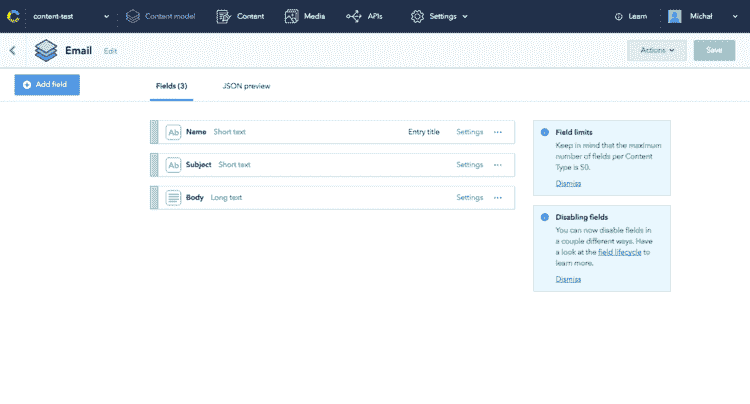
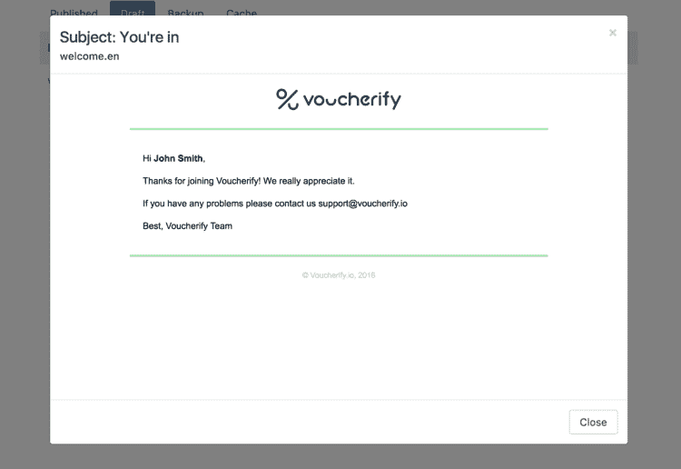
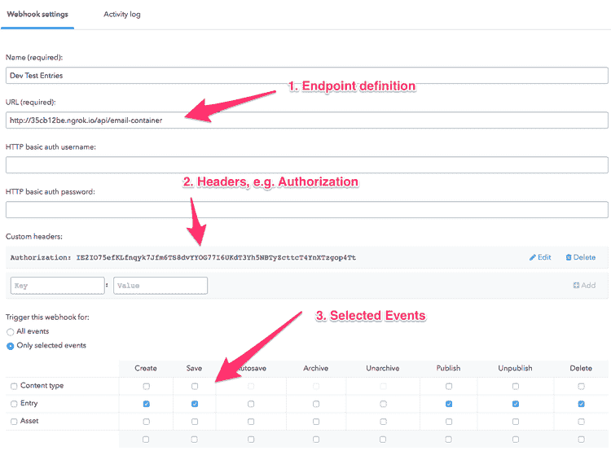

# 对电子邮件内容进行无编码迭代

> 原文:[https://dev . to/msedzielewski/coding-free-iteration-on-email-content-a37](https://dev.to/msedzielewski/coding-free-iterating-on-email-content-a37)

在本指南中，我们演示了一个用于自动创建电子邮件活动内容的工具。事实证明，这对于需要维护越来越多的日常运营电子邮件模板的开发人员和内容团队来说非常有用。该设置基于 Contentful 和我们已经发布的小型开源 Node.js 应用程序。

## 问题

日常运营邮件是一个很容易开始但很难掌握的话题。这一切都始于一个或两个纯文本模板，然后你想加强他们与公司的标志，也许一些大按钮，而不是链接。模板很快就变成了一个简单的 HTML 文件。舞台上的剪辑还是相当容易的；想要更新消息吗？只要给你的开发者发一份新的拷贝，他们就会修改这个模板——平滑。

生意做得很好。你扩大了公司规模，扩展了客户服务流程。事实很快证明，电子邮件通知的数量在增长。你想出了新的用户获取策略，并为你的忠实客户提供了一些优惠交易。再次，电子邮件活动收集变得越来越大。也许是新的国家发布会？现在，您的电子邮件活动增加了一倍。

所以，旧的内容必须不断更新。来自市场营销、产品团队(A/B 测试)和法律部门的拷贝源源不断。更不用说不可避免的错别字了！尤其是当你的开发者一个德语单词都不懂的时候:)因此，你很快就以十几个人交换内容告终，全部打包成几个 Excel 文件和截图，一路上都在燃烧开发者的时间。

## 残缺之解

解决方案之一是接入 MailChimp。通过使用他们的电子邮件设计器，你可以让“内容人”自己更新电子邮件。不过这可能有点棘手。

一旦你给了他们改变内容的机会，他们也可以改变(或者我们应该说“打破”)设计。这样的错误真的很难追踪，尤其是如果你的模板是巨大的 HTML 怪物。

因此，理想情况下，您应该按如下方式构建电子邮件作业:

内容人只能修改副本
开发者要确保电子邮件被发送出去，并且看起来和设计的一样

## 少残缺的解决方法

TL；博士:

*   让我们介绍一下 Contentful 和 [Contentful-emails](https://github.com/bandraszyk/contentful-emails) 库。
*   文案在 Contentful 中创建/编辑电子邮件副本。他们以所谓的“草稿模式”完成这项工作。他们不能以任何方式修改 HTML 模板。
*   在他们实际将消息发布到产品之前，他们可以预览电子邮件的最终版本。这是通过访问 Contentful-emails web 应用程序实现的，该应用程序会在 HTML 模板上呈现 Contentful 的副本。
*   如果被接受，副本将投入生产。
*   如果您想更新任何副本，您只需将状态更改为草稿，然后您可以再次尝试，同时旧版本在生产中仍然工作正常。
*   让我们再多解释一下整个过程。

转到你的内容丰富的账户，为所有邮件创建一个合适的内容模型。它应该由 3 个字段组成:名称(短文本)、主题(短文本)和正文(长文本)。(Contentful 操作起来还算容易。说了这么多，如果你不熟悉，我建议看一下[这个指南](https://www.youtube.com/watch?v=hK4mfxbcbpw)

[T2】](https://res.cloudinary.com/practicaldev/image/fetch/s--TsHlGb4e--/c_limit%2Cf_auto%2Cfl_progressive%2Cq_auto%2Cw_880/https://thepracticaldev.s3.amazonaws.com/i/8f1tgoi0j05mwwabj5cy.png)

好了，我们有了一个模型。现在让我们创建第一个实体。让我们从一封非常简单的“欢迎”电子邮件开始。从内容视图中选择“添加电子邮件”按钮。

编辑器使您能够创建副本。你可以使用 [markdown](https://daringfireball.net/projects/markdown/syntax) 标准，因为内容丰富的电子邮件也可以解析它。请注意，您可以使用占位符(有时也称为合并标签)。可用占位符的列表完全由您决定，但是您需要首先与开发团队达成一致。

复制稿准备好了。现在让我们验证它在最终的 HTML 版本中是什么样子。运行内容丰富的电子邮件，并访问“草稿”部分。单击模板，弹出窗口将显示最终的电子邮件消息。下图显示了一个顶部带有徽标的极其简单的模板示例。

[T2】](https://res.cloudinary.com/practicaldev/image/fetch/s--ukh9t_pW--/c_limit%2Cf_auto%2Cfl_progressive%2Cq_auto%2Cw_880/https://thepracticaldev.s3.amazonaws.com/i/hwcye0zog2guir8i2bji.png)

请注意，占位符已经填充了示例值。如果一切正常，请返回到 Contentful 并“发布”模板以使其生效！您可以通过将它设置回草稿模式来随时修改它。

## 后端部分

在你做我们刚刚描述的事情之前，你必须将 Contentful-email 集成到你的系统中。第一步是配置和部署应用程序。这基本上可以归结为用您满意的 API uide 填充 [config/base.js](https://github.com/bandraszyk/contentful-emails/blob/master/config/base.js) 。

运行该应用程序后，它会执行以下操作:

*   它连接到您的内容丰富的帐户，以获得草稿和已发布的电子邮件内容。
*   它加载你的 HTML 电子邮件模板，你把它放到前端/视图/电子邮件。(由于应用程序使用模板引擎，您可以扩展当前设置来处理多个父子结构，以反映您的流程。例如，与发票相关的消息将具有不同于与点滴相关的基本 HTML)。
*   它会缓存模板，这样您就可以将 API 调用保存到 Contentful。当一个条目被发布时，可以用一个 [webhook](https://www.contentful.com/developers/docs/references/content-management-api/#/reference/webhooks/get-an-overview-of-recent-calls) 使缓存[无效](https://github.com/bandraszyk/contentful-emails/blob/master/routes/api/email-container/index.js)。
*   它提供了一个基于 JSON 的所有内容的备份，你可以用[手工重建这个](https://github.com/bandraszyk/contentful-emails/blob/master/gulp/contentful.js) gulp 任务。

*缓存失效器- webhook 设置*

最后一部分是就营销人员可以在文案中使用的占位符达成一致。在我们的例子中，除了文本变量或链接(比如[[phone-support]]或[[user-unsubscribe]])，我们还添加了注入 HTML 片段的可能性。因此，例如，当您输入 __[[invoice-download]]__ 时，解析器会将其替换为一个带有适当链接的预设计按钮。通过这种方式，产品或营销团队在给定的模板内实现了几乎无限的内容重组灵活性。

## 总结

概括地说，我们只是说，在我们客户的一个项目中，该解决方案将与电子邮件相关的冗余提交和后续部署的数量减少到几乎为零。现在他们有更多的时间来设计新的基于优惠券的电子邮件活动。

该应用程序是开源的；如果您发现有任何改进的空间，请提交拉动请求！