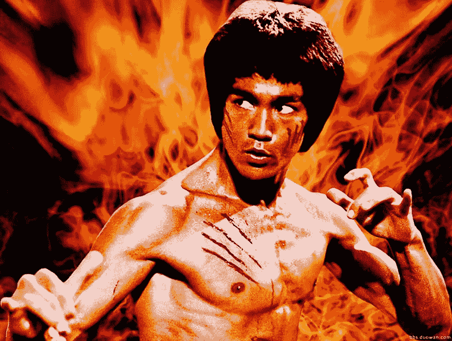

# MVP 的局限性(以及功夫的重要性)

> 原文：<https://dev.to/davedri/the-limits-of-the-mvp-and-the-importance-of-kung-fu-10n2>

 

<figcaption>[来源:帕特里克·帕金斯 via Unsplash](https://unsplash.com/photos/ETRPjvb0KM0)</figcaption>

你以前见过这种对话吗？你可能会带着某种痛苦的熟悉感点头。

> “我最近参与了一个项目，在这个项目中，MVP 这个术语经常被客户和一些团队成员所使用……而我们所交付的东西根本不是这样。这篇文章可能是真的吗？”

这篇文章是 Rik Higham 的有趣文章[“最有价值球员死了。](https://hackernoon.com/the-mvp-is-dead-long-live-the-rat-233d5d16ab02)老鼠万岁，引用上面来自脸书[悉尼创业集团](https://www.facebook.com/groups/sydneystartups/permalink/1688490524525554/)的评论。

具体来说，这篇链接文章提出了一些有趣的观点，即“MVP”这个术语被用得太多了，以至于失去了它的原意。很容易对 Higham 的沮丧感同身受，因为精益创业模式和最小可行产品的概念无处不在。伴随着无处不在而来的是越来越多的解释和越来越多的文化足迹。

值得称赞的是，海厄姆创造了另一个视角来看待产品和体验设计。他的老鼠模型是我在自己的社区中喜欢讨论的一个模型，有一些很棒的想法。

但是这里有一个秘密。

当典型的产品管理职业经历了初级阶段的规范应用，并进入更复杂和微妙的版本时，模型没有你学到的其他两个具体的东西重要。

1.  模型比理解它们周围的历史和文化信号更重要。
2.  模型不是一成不变的，而且会受到应用它们的组织的文化信号的影响。

### 给某物命名的问题

这里的挑战是语义的。如果不完全是符号学的话。但是先不要扔掉那些便利贴。

像“MVP”这样的术语是一个有实际例子的概念，但很快获得了其他文化信号。在这些信号中，它们被假设、给定的例子以及与传播知识的人的联系所拖累。

我们在开篇引言中看到了这一点。

> MVP 这个术语经常被客户和一些团队成员所使用…而我们所交付的根本不是这样。

对术语的误用导致了对近年来被认为是产品开发方法的革命性转变的全盘否定。

难怪聪明而有经验的产品经理(在这种情况下是海厄姆)正在通过自己的镜头重新解释流行的模型，同时也将他们的理论与围绕前一模型的不断上升的噪音拉开距离。

我自己在 2016 年的一个项目上就这样做过，劫持了初创公司 Weeken、谷歌的设计 Sprint 和 IDEO 的设计思维的元素。我称之为“不可改变的设计理论”，并使用这一视角来领导一个创新项目和影响一个组织内的文化变革。有经验的设计师都很狡猾。

为什么？因为这是人类对我们人类经历中几乎所有事物所做的。

在产品经理的职业生涯中，理解这一点是很自然的，在职业生涯中，重复应用一代又一代的产品模型作为一项指令性任务开始凸显这一点——好吧——这不仅仅是一步一步的方法。

这同样适用于随后的其他模型的旅程，直到最终产品涅槃。这就把我们带到了…

### 把产品管理当成功夫

 

<figcaption>“你还没更新本周单口相声路线图是什么意思？”</figcaption>

武术界最著名的文化偶像之一不是别人，正是[李小龙](https://www.brainpickings.org/2013/05/29/like-water-bruce-lee-artist-of-life/)。李小龙最初跟随叶问学习咏春拳，他最广为人知的可能是向一种完全没有风格的风格转变。他称之为[截拳道](https://en.wikipedia.org/wiki/Jeet_Kune_Do)。

你可以看到这个类比已经开始了。如果说咏春相当于 MVP 模式，那么李就是对这种风格的局限性越来越失望的产品经理。

他通过随后的风格形成了李所谓的“不战而屈人之兵”的过程是传奇的。但也许很容易忽略一些东西——事实上，李对功夫应用(及其局限性)的探索是一种训练和掌握。

### “似水我的(产品管理)朋友”

从符号学和功夫的角度来看产品管理，我们可以学到很多东西。阅读和打字都是荒谬的。

无论是哪种情况，教训都是不仅要深入了解有问题的风格或模式，还要深入了解周围的社区和生态系统是如何看待它的。这种风格的能力很大程度上取决于它的应用环境。

正如李所说，“要像水一样，我的朋友”。没有什么是静止的。甚至没有产品管理和开发风格。

感谢阅读。这篇文章最初出现在[最小可行段](https://medium.com/minimum-viable-paragraph/the-limits-of-the-mvp-and-kung-fu-7d33b6d723e5)上。