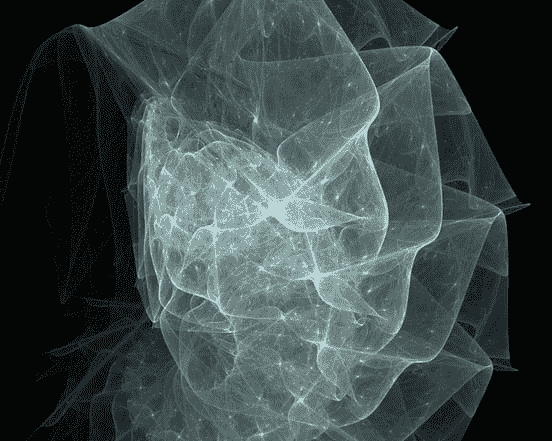

# 你最喜欢用来解释 IT 概念的类比。大家讨论一下！

> 原文:[https://dev . to/ana/your-favorite-analogies-to-explain-it-concepts-let-discuse-6ck](https://dev.to/ana/your-favorite-analogies-to-explain-it-concepts-lets-discuss-6ck)

[T2】](https://res.cloudinary.com/practicaldev/image/fetch/s--nOKvVI8D--/c_limit%2Cf_auto%2Cfl_progressive%2Cq_auto%2Cw_880/https://thepracticaldev.s3.amazonaws.com/i/u7zj5emazcrp1pew0a0z.jpg)

自从我上一篇关于向非技术受众解释 API 的最佳方式的建议的文章以来，我在公司内部做了一次关于我目前正在使用的技术(MuleSoft)即将推出的功能的演讲。

上一篇帖子收到的很棒的回复激励了我，我已经开始应用其中的一些建议了。这让我想起了这样一个事实:与你的听众联系并让他们容易理解那些看起来很难理解的概念的最简单的方法就是使用他们容易理解的类比。讨论变得更有吸引力，同时也更容易跟上。

我最近读到并使用的一个类比，与解释流式消费的工作原理有关。

使用流时有两个主要挑战:

*   它只能读一次
*   它不能平行阅读

想象一品脱啤酒，你喝的每一口都是你不能再喝的一口。同样，如果两个人用两根吸管喝同一品脱的酒，他们谁也不会喝满一品脱。

在解释复杂的 IT 概念时，你有更喜欢的类比吗？很想听听你对此的看法！:-)