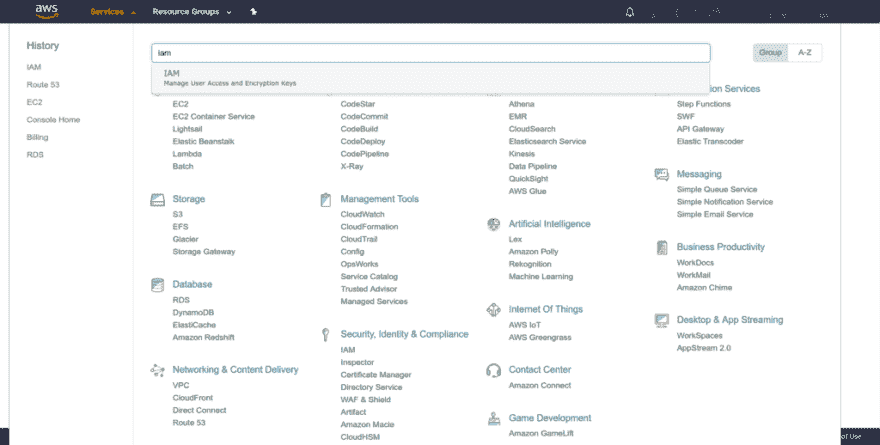
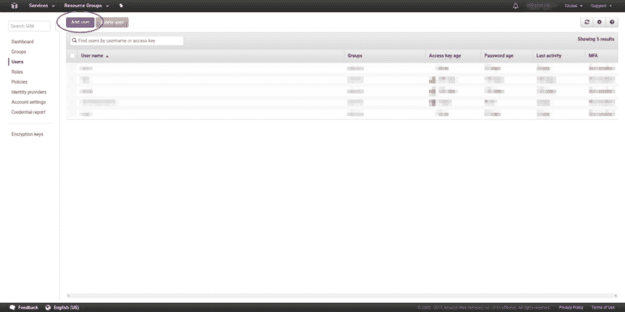
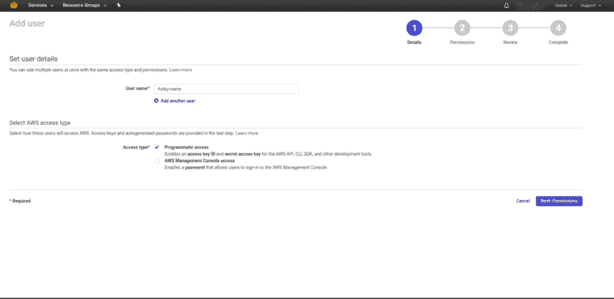
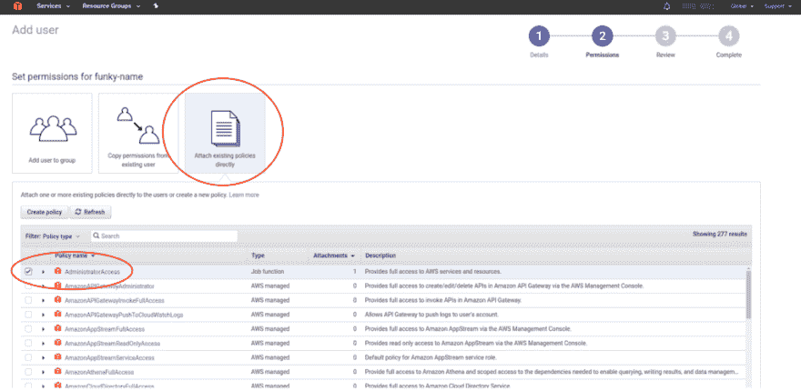
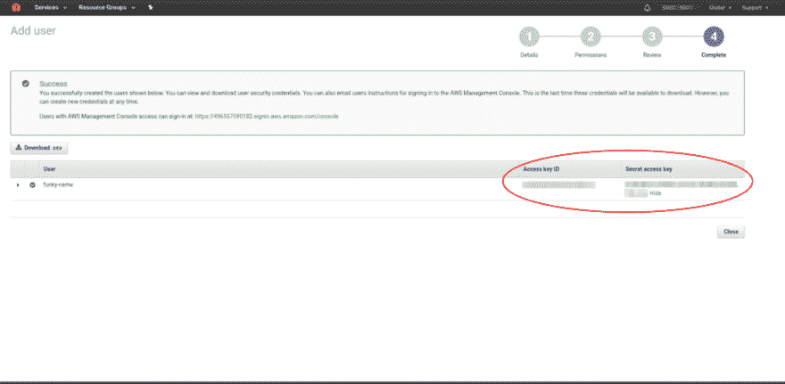
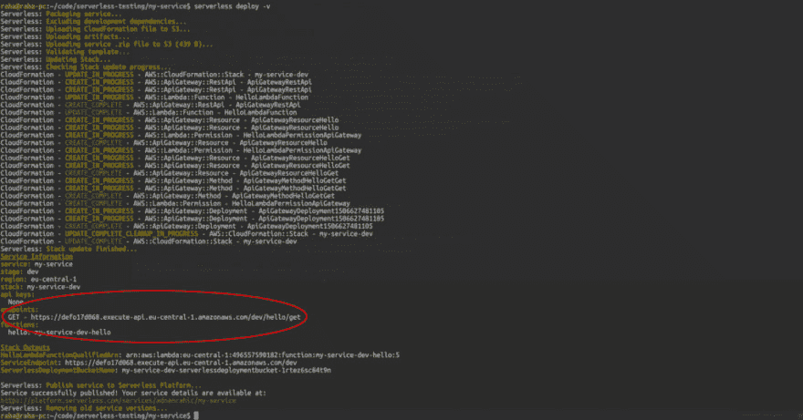
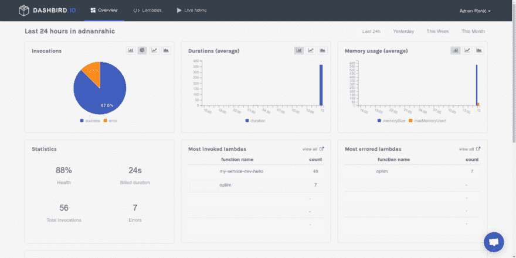
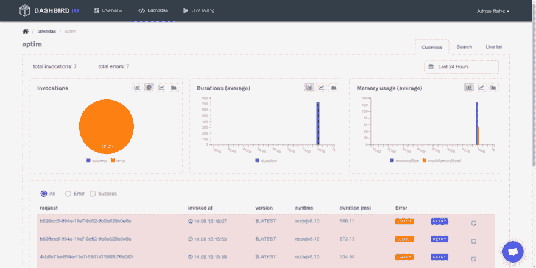

# Node.js 无服务器速成班

> 原文:[https://dev . to/adnanrahic/a-crash-course-on-server less-with nodejs-5jp](https://dev.to/adnanrahic/a-crash-course-on-serverless-with-nodejs-5jp)

不管您的开发背景如何，在过去的一年中，您不可避免地会听到“无服务器”这个术语。这个词在我耳边嗡嗡作响的时间比我敢说的还要长。很长时间以来，我一直在推迟对它进行更详细的研究。这里什么都没有。

准备好了吗？今天，我们将讨论使用无服务器的优点和缺点。我们还将定义对开始使用该技术至关重要的主要关键字和主题。最后，我们将直接进入一些代码，编写我们自己的[无服务器函数](https://serverless.com/)、[模拟本地环境](https://github.com/dherault/serverless-offline)和[监控性能](https://www.dashbird.io/)！请记住，您将需要一个 [AWS](https://aws.amazon.com/) 帐户来跟随代码示例。幸运的是，他们有令人难以置信的免费等级，所以你不需要担心在玩新东西时会破产。

### 你刚才说什么？

为什么无服务器突然变得这么酷了？不再使用服务器好吗？我喜欢服务器，为什么不用呢？服务器很牛逼。您使用命令行来告诉他们该做什么。为什么会有人想放弃呢？我真的大吃一惊。但是，嘿，退一步说，我意识到它们不是最优的。在集群中管理它们是一件痛苦的事情。它们不能很好地扩展。这些只是我想到的第一件事。

让我们彻底转换心态。只考虑使用函数。不再需要管理服务器。你只关心代码。听起来很酷。作为开发人员，我们不应该需要在命令行上做繁琐的工作。让行动组的人来处理吧。我们怎么称呼这种类型的建筑呢？只使用函数？小功能？微小的服务？

### 功能为服务(FaaS)

它叫做“功能即服务”,非常棒。这个概念基于无服务器计算。它让我们能够部署任何单独的代码或功能。代码运行并返回值，然后结束该过程。听起来很简单，对吧？嗯，确实是。如果你曾经编写过 REST API，你会有宾至如归的感觉。你通常放在一个地方的所有服务和端点现在都被分割成一堆微小的片段，即微服务。目标是从开发人员那里完全抽象出服务器，只根据函数被调用的次数来计费。这意味着此类服务易于扩展。

但是，在围墙的这一边并不都是阳光明媚的。FaaS 经历了一些初期问题。你认为错误是如何处理的？没有要监控的物理服务器是一种有点令人困惑的体验。洞察你的系统相当困难。尤其是大规模的。

### 涉入浅水区

为了理解如何编写无服务器应用程序，我们首先需要了解它背后的主题。让这一切成为可能的工具和服务。

#### AWSλ

> AWS Lambda 是一项计算服务，它让你无需配置或管理服务器就能运行代码。–AWS 文档

[Lambda](http://docs.aws.amazon.com/lambda/latest/dg/welcome.html) 是一个基于事件的系统，用于在云中运行代码。你不用担心服务器，只担心你写的代码。它自动伸缩，只对它实际运行代码的时间收费，即*计算时间*。但是，最重要的是，它可以自动扩展！多棒啊。不用再担心你创建的 [EC2 实例](https://aws.amazon.com/ec2/)是否足够大，可以服务所有用户。

#### AWS API 网关

如果没有 [API 网关](https://aws.amazon.com/api-gateway/)，Lambda 将是不完整的。所有的 lambda 函数都需要一个事件被触发来调用它们。网关提供触发这些功能的其余端点。想象你有一个普通的 Express 应用程序。您通常会为特定的路线创建一个`app.get()`方法，就像这样:

```
app.get('/', function(req, res, next) { /* execute some code */ }); 
```

<svg width="20px" height="20px" viewBox="0 0 24 24" class="highlight-action crayons-icon highlight-action--fullscreen-on"><title>Enter fullscreen mode</title></svg> <svg width="20px" height="20px" viewBox="0 0 24 24" class="highlight-action crayons-icon highlight-action--fullscreen-off"><title>Exit fullscreen mode</title></svg>

当用户点击`'/'`路径时，一个事件将触发回调函数。Gateway 是路由，Lambda 是回调函数。

#### 无服务器框架

管理这一切是一件痛苦的事情。我第一次尝试的时候，花了我一天的大部分时间才弄明白什么是什么。有充分的理由。文档太复杂，对初学者来说一点都不友好。[无服务器](https://serverless.com/)来救援！

> 无服务器是您部署和操作无服务器架构的工具包。专注于您的应用，而不是您的基础设施。–[Serverless.com](https://serverless.com/)

无服务器框架将您需要的所有工具打包到一个可管理的包中，使得创建和部署无服务器应用程序变得简单直接。它太棒了，它抽象出了所有你必须在 AWS 控制台中完成的繁琐任务，比如创建函数并将它们连接到事件。唯一的缺点是，每次您希望测试您的功能时，您都必须将代码推送到 AWS，而在本地模拟环境有点痛苦。

无服务器是更好选择的使用案例非常多。由于易于扩展和低维护，任何用户吞吐量变化很快的生产应用程序都是使用无服务器架构的有力竞争者。最后，如果您不擅长 Linux shell，并且 DevOps 不适合您，那么您完全有理由尝试无服务器。

### 全新的心态

无服务器架构是无情的。这是事实。只是设置它需要相当一部分的脑力。我不算在本地模仿它。那完全是另一种野兽。

这种敌意要求我们改变方法。我们不得不接受这样一个事实:我们没有对整个系统的概览。但是，人类适应并克服了。无服务器框架就像一个穿着闪亮盔甲的骑士。

让我们开始创建一个简单的无服务器函数。

设置无服务器很简单。你需要通过 npm 安装它，并连接你的 AWS 帐户。别担心，如果你被 AWS 控制台吓到了，那也没什么。我将分解流程，我们将一步一步地完成每件事。

#### 1。首先，你需要安装全球无服务器。

打开终端窗口并运行:

```
$ npm install -g serverless 
```

<svg width="20px" height="20px" viewBox="0 0 24 24" class="highlight-action crayons-icon highlight-action--fullscreen-on"><title>Enter fullscreen mode</title></svg> <svg width="20px" height="20px" viewBox="0 0 24 24" class="highlight-action crayons-icon highlight-action--fullscreen-off"><title>Exit fullscreen mode</title></svg>

现在，您已经在计算机上全局安装了无服务器框架。现在，您可以在终端的任何位置使用无服务器命令。

**注意:**如果您使用的是 Linux，您可能需要以 sudo 的身份运行该命令。

#### 2。在 AWS 控制台中创建 IAM 用户

打开 AWS 控制台，点击左上角的服务下拉菜单。你会看到大量的服务出现。继续在搜索框中输入 IAM，然后点击它。

[T2】](https://res.cloudinary.com/practicaldev/image/fetch/s--1PoBgc2i--/c_limit%2Cf_auto%2Cfl_progressive%2Cq_auto%2Cw_880/https://cdn-images-1.medium.com/max/1024/1%2A1BKK9Uf_iZg5aQMggHkFAw.png)

您将被重定向到您的帐户的 IAM 主页。继续添加新用户。

[T2】](https://res.cloudinary.com/practicaldev/image/fetch/s--YACc4EuX--/c_limit%2Cf_auto%2Cfl_progressive%2Cq_auto%2Cw_880/https://cdn-images-1.medium.com/max/1024/1%2A2W0uhicsEKt274A-UFQsNQ.png)

为你的新 IAM 用户选择一个时髦的名字，并给用户**编程访问**。继续下一步。

[T2】](https://res.cloudinary.com/practicaldev/image/fetch/s--b-HVsKhz--/c_limit%2Cf_auto%2Cfl_progressive%2Cq_auto%2Cw_880/https://cdn-images-1.medium.com/max/1024/1%2AHpGc2GUbMlpxngt_ovSQXA.png)

现在，您可以向用户添加一组权限。因为我们将让 Serverless 在我们的 AWS 帐户上创建和删除各种资产，所以继续检查 AdministratorAccess。

[T2】](https://res.cloudinary.com/practicaldev/image/fetch/s--kQImqAfy--/c_limit%2Cf_auto%2Cfl_progressive%2Cq_auto%2Cw_880/https://cdn-images-1.medium.com/max/1024/1%2AiVJjs6_pqyNz-s8KFrZWvg.png)

继续下一步，您将看到用户已创建。现在，也只有现在，您才能访问用户访问密钥 ID 和秘密访问密钥。请务必记下它们或下载。csv 文件。保管好它们，不要给任何人看。尽管这只是一个演示，我还是把它们像素化了，以确保你理解保护它们安全的重要性。

[T2】](https://res.cloudinary.com/practicaldev/image/fetch/s--USDha_H0--/c_limit%2Cf_auto%2Cfl_progressive%2Cq_auto%2Cw_880/https://cdn-images-1.medium.com/max/1024/1%2Aq4aHTY0FCsHIlAdZP9qPcA.png)

完成后，我们最终可以将密钥输入到无服务器配置中。

#### 3。在无服务器配置中输入 IAM 密钥

厉害！保存密钥后，您可以设置无服务器来访问您的 AWS 帐户。切换回您的终端，在一行中输入所有这些:

```
$ serverless config credentials --provider aws --key xxxxxxxxxxxxxx --secret xxxxxxxxxxxxxx 
```

<svg width="20px" height="20px" viewBox="0 0 24 24" class="highlight-action crayons-icon highlight-action--fullscreen-on"><title>Enter fullscreen mode</title></svg> <svg width="20px" height="20px" viewBox="0 0 24 24" class="highlight-action crayons-icon highlight-action--fullscreen-off"><title>Exit fullscreen mode</title></svg>

按回车键。现在，当您运行任何终端命令时，您的无服务器安装知道要连接到哪个帐户。让我们来看看它是如何工作的。

#### 4。创建您的第一个服务

创建一个新目录来存放您的无服务器应用程序服务。在那里启动一个终端。现在您已经准备好创建一个新的服务了。你问的服务是什么？把它当成一个项目。但也不尽然。在这里定义 AWS Lambda 函数、触发它们的事件以及它们需要的任何 AWS 基础设施资源，所有这些都在一个名为 **serverless.yml** 的文件中。

回到你的终端类型:

```
$ serverless create --template aws-nodejs --path my-service 
```

<svg width="20px" height="20px" viewBox="0 0 24 24" class="highlight-action crayons-icon highlight-action--fullscreen-on"><title>Enter fullscreen mode</title></svg> <svg width="20px" height="20px" viewBox="0 0 24 24" class="highlight-action crayons-icon highlight-action--fullscreen-off"><title>Exit fullscreen mode</title></svg>

create 命令将创建一个新的**服务**。修卡！但有趣的部分来了。我们需要为函数选择一个运行时。这被称为**模板**。传入 aws-node 会将运行时设置为 Node.js，这正是我们想要的。**路径**将为服务创建一个文件夹。在本例中，将其命名为 my-service。

#### 5。使用代码编辑器浏览服务目录

用您喜欢的代码编辑器打开“我的服务”文件夹。里面应该有三个文件。 **serverless.yml** 包含该服务的所有配置设置。您可以在这里指定常规配置设置和每个功能的设置。你的 **serverless.yml** 看起来像这样，只是带有一堆评论。

```
# serverless.yml 
service: my-service

provider:   
  name: aws   
  runtime: nodejs6.10

functions:
  hello:
    handler: handler.hello 
```

<svg width="20px" height="20px" viewBox="0 0 24 24" class="highlight-action crayons-icon highlight-action--fullscreen-on"><title>Enter fullscreen mode</title></svg> <svg width="20px" height="20px" viewBox="0 0 24 24" class="highlight-action crayons-icon highlight-action--fullscreen-off"><title>Exit fullscreen mode</title></svg>

functions 属性列出了服务中的所有函数。您可以看到 hello 是当前在 **handler.js** 文件中唯一的函数。handler 属性指向包含要在函数中运行的代码的文件和模块。默认情况下，这个处理程序文件被命名为 **handler.js** 。确实非常方便。

打开 **handler.js** 你会看到名为 hello 的处理模块和函数。该函数有三个参数。event 参数表示传递给函数的事件数据。上下文告诉我们函数的上下文、运行时间、状态和其他重要信息。最后一个参数是一个回调函数，它将发送回数据。在这个例子中，响应作为回调函数的第二个参数被发送回来。第一个总是代表一个错误。如果没有错误，则传递 null。

```
// handler.js
module.exports.hello = (event, context, callback) => {
  const response = { statusCode: 200, body: 'Go Serverless!' };
  callback(null, response);
}; 
```

<svg width="20px" height="20px" viewBox="0 0 24 24" class="highlight-action crayons-icon highlight-action--fullscreen-on"><title>Enter fullscreen mode</title></svg> <svg width="20px" height="20px" viewBox="0 0 24 24" class="highlight-action crayons-icon highlight-action--fullscreen-off"><title>Exit fullscreen mode</title></svg>

这一切都很好，但我们仍然无法触发功能。没有与之相关的事件，因此无法触发该函数。让我们解决这个问题。跳回 **serverless.yml** 并取消注释您看到事件的行:。

```
# serverless.yml 
service: my-service

provider:   
  name: aws   
  runtime: nodejs6.10

functions:
  hello:
    handler: handler.hello
    events: # uncomment these lines
      - http:
          path: hello/get
          method: get 
```

<svg width="20px" height="20px" viewBox="0 0 24 24" class="highlight-action crayons-icon highlight-action--fullscreen-on"><title>Enter fullscreen mode</title></svg> <svg width="20px" height="20px" viewBox="0 0 24 24" class="highlight-action crayons-icon highlight-action--fullscreen-off"><title>Exit fullscreen mode</title></svg>

小心不要弄乱文件的缩进，事件应该直接在处理程序下面。太好了，完成后，我们终于可以将该功能部署到 AWS 了。

#### 6。部署到 AWS

部署过程非常简单。在服务目录中，在您的终端中运行以下命令:

```
$ serverless deploy -v 
```

<svg width="20px" height="20px" viewBox="0 0 24 24" class="highlight-action crayons-icon highlight-action--fullscreen-on"><title>Enter fullscreen mode</title></svg> <svg width="20px" height="20px" viewBox="0 0 24 24" class="highlight-action crayons-icon highlight-action--fullscreen-off"><title>Exit fullscreen mode</title></svg>

你会看到终端亮起了大量的信息。那是 v 星人在施展魔法。喜欢那些冗长的日志！

[T2】](https://res.cloudinary.com/practicaldev/image/fetch/s--gZLCrCaS--/c_limit%2Cf_auto%2Cfl_progressive%2Cq_auto%2Cw_880/https://cdn-images-1.medium.com/max/1024/1%2AMZpOqG3asqfwkmuUML7_AA.png)

但是，对我们来说最重要的是，它将记录回端点。Serverless 已经自动创建了一个 API 网关端点，并将其连接到 Lambda 函数。多牛逼啊！？点击浏览器中的端点将发送回文本 Go Serverless！

**注意:**如果你想通过命令行测试这个函数，你可以运行:

```
$ serverless invoke -f hello -l 
```

<svg width="20px" height="20px" viewBox="0 0 24 24" class="highlight-action crayons-icon highlight-action--fullscreen-on"><title>Enter fullscreen mode</title></svg> <svg width="20px" height="20px" viewBox="0 0 24 24" class="highlight-action crayons-icon highlight-action--fullscreen-off"><title>Exit fullscreen mode</title></svg>

这将返回完整的响应对象以及关于 Lambda 函数状态的信息，比如持续时间和内存使用情况。

### 解除痛苦

糟糕的是，每次我想测试这个功能的时候，我都必须把它部署到 AWS 上。如果有一种方法可以在本地模拟环境，那不是很棒吗？

带着那个尴尬的题外话，瞧，[无服务器离线](https://github.com/dherault/serverless-offline)！现在，我终于可以在将代码推送到 AWS 之前在本地测试所有代码了。这减轻了我背部的压力。

将无服务器离线添加到您的服务中非常容易。安装一个 npm 模块并在 **serverless.yml** 中添加两行代码就足够了。

向你证明这一点的最好方法就是展示给你看。

#### 1。在服务目录中初始化 npm

现在，您需要进入 my-service 目录，在那里打开一个终端窗口。一旦进入你可以运行:

```
$ npm init 
```

<svg width="20px" height="20px" viewBox="0 0 24 24" class="highlight-action crayons-icon highlight-action--fullscreen-on"><title>Enter fullscreen mode</title></svg> <svg width="20px" height="20px" viewBox="0 0 24 24" class="highlight-action crayons-icon highlight-action--fullscreen-off"><title>Exit fullscreen mode</title></svg>

#### 2。脱机安装无服务器

初始化 npm 后，除了运行安装程序之外，没有什么需要做的了。

```
$ npm install serverless-offline --save-dev 
```

<svg width="20px" height="20px" viewBox="0 0 24 24" class="highlight-action crayons-icon highlight-action--fullscreen-on"><title>Enter fullscreen mode</title></svg> <svg width="20px" height="20px" viewBox="0 0 24 24" class="highlight-action crayons-icon highlight-action--fullscreen-off"><title>Exit fullscreen mode</title></svg>

- save-dev 标志将把包保存为开发依赖项。

在继续之前，您首先需要让终端知道它有一个新命令可用。所以在 **serverless.yml** 文件中添加了两行新内容。

```
# serverless.yml 
service: my-service

provider:   
  name: aws   
  runtime: nodejs6.10

functions:
  hello:
    handler: handler.hello
    events:
      - http:
          path: hello/get
          method: get

# adding these two lines
plugins:
  - serverless-offline 
```

<svg width="20px" height="20px" viewBox="0 0 24 24" class="highlight-action crayons-icon highlight-action--fullscreen-on"><title>Enter fullscreen mode</title></svg> <svg width="20px" height="20px" viewBox="0 0 24 24" class="highlight-action crayons-icon highlight-action--fullscreen-off"><title>Exit fullscreen mode</title></svg>

#### 3。在本地运行

要确保您已经正确安装了所有程序，请运行:

```
$ serverless 
```

<svg width="20px" height="20px" viewBox="0 0 24 24" class="highlight-action crayons-icon highlight-action--fullscreen-on"><title>Enter fullscreen mode</title></svg> <svg width="20px" height="20px" viewBox="0 0 24 24" class="highlight-action crayons-icon highlight-action--fullscreen-off"><title>Exit fullscreen mode</title></svg>

在列出的各种选项中，您应该会看到一个名为 offline 的选项。如果你做到了，你就可以走了。

**注意:**如果您想查看更多关于无服务器脱机的有用信息，请在您的终端窗口中运行无服务器脱机帮助。

所有这些都完成后，继续启动 Lambda 和 API Gateway 的本地仿真。

```
$ serverless offline start 
```

<svg width="20px" height="20px" viewBox="0 0 24 24" class="highlight-action crayons-icon highlight-action--fullscreen-on"><title>Enter fullscreen mode</title></svg> <svg width="20px" height="20px" viewBox="0 0 24 24" class="highlight-action crayons-icon highlight-action--fullscreen-off"><title>Exit fullscreen mode</title></svg>

您将会看到您的所有路线都列在终端中。您的 Lambdas 现在运行在您的本地主机上。默认端口是 3000。请随意打开浏览器查看。点击端点[http://localhost:3000/hello/get](http://localhost:3000/hello/get)将会发送回与上面示例中相同的文本和已部署的函数。

这有多牛逼。现在，我们不需要不断地将代码推送到 AWS 来查看它是否工作。我们可以在本地测试它，只有当我们确定它有效时才推它。

### 看着我的背影

在传统应用中，当有东西坏了，你会知道的。你也知道它在哪断的。不得不喜欢那些堆栈痕迹！不管怎样，这类应用的监控过程非常简单。这与使用无服务器有何关系？AWS CloudWatch 上的日志很恐怖。我花了很长时间才找到简单应用程序的失败函数，想象一下大规模应用程序的恐怖。

我发现一个很好的选择是 Dashbird。它是免费的，而且似乎很有前途。他们也不要求信用卡，这就成了“为什么不试试看”的情况。

启动并运行这项服务需要 5 分钟，这主要是因为他们有很棒的[入门教程](https://dashbird.io/help/getting-started/setting-up-dashbird/)。

将 Dashbird 与无服务器连接起来最后让我看看我的应用程序中发生了什么。有人罩着你真酷。

[T2】](https://res.cloudinary.com/practicaldev/image/fetch/s--WrxCrvMq--/c_limit%2Cf_auto%2Cfl_progressive%2Cq_auto%2Cw_880/https://cdn-images-1.medium.com/max/1024/1%2AaSCwxVMlCW03ItQwva8bHA.png)

错误被突出显示，我可以看到我的系统的整体健康状况。真是如释重负。它还跟踪成本。不用担心吹预算。甚至包括实时监控。这很酷。

[T2】](https://res.cloudinary.com/practicaldev/image/fetch/s--YdNuRtHD--/c_limit%2Cf_auto%2Cfl_progressive%2Cq_auto%2Cw_880/https://cdn-images-1.medium.com/max/1024/1%2AVKt0UjXe-8Cuwrr-GgfNOQ.png)

像这样的工具使管理大规模应用变得轻而易举。

### 包装完毕

多好的旅程啊。您现在已经见证了从传统 web 开发到无服务器革命的转变。有了这些简单的工具，我们现在拥有了创建出色的、可伸缩的、可靠的应用程序所需的一切。

唯一阻碍我们前进的是我们自己的心态。认识到功能不等于服务器将是转折点。但是，我们正朝着正确的方向前进。像[无服务器](https://serverless.com/)和 [Dashbird](https://www.dashbird.io/) 这样的工具很好地缓解了痛苦的过渡。在我探索未知的无服务器架构的道路上，他们给了我很大的帮助。

我敦促您继续使用这些工具。尝试将它们包含到您现有的开发过程中。你会因为突然得到这么多支持而感到宽慰。它对神经也有奇效。

如果你想看看我们上面写的所有代码，[这里是库](https://github.com/adnanrahic/a-crash-course-on-serverless-with-nodejs)。或者如果你想看我最新的文章，请到这里来。

[我的最新故事](https://dev.to/adnanrahic)

希望你们喜欢读这篇文章，就像我喜欢写这篇文章一样。

*你觉得这个教程会对某人有帮助吗？不要犹豫分享。如果你喜欢它，击碎下面的* ***心形*** *，这样其他人会在 Dev.to.* 上看到它

[T2】](https://bit.ly/adnan-zeet)

免责声明: [Zeet](https://bit.ly/adnan-zeet) 将在下个月赞助这篇博客。前几天我试过了。这就像无服务器，但运行整个后端。你可以自动托管和扩展应用。相当整洁。

* * *