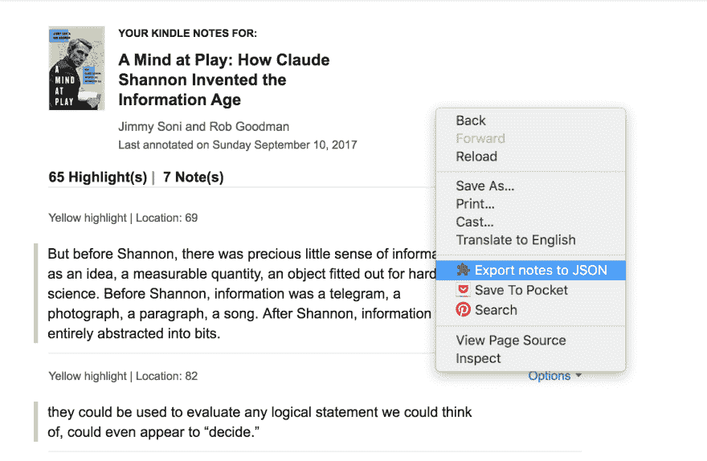

# Chrome 上下文菜单应用程序开发指南

> 原文:[https://dev . to/SG harms/guide-to-developing-chrome-context-menu-applications-47c](https://dev.to/sgharms/guide-to-developing-chrome-context-menu-applications-47c)

## 简介

我最近发布了 amaJSON Chrome 扩展,我相信我已经提出了一个改进的过程来理解如何构建类似的应用程序。

本教程将帮助你创建一个实用的“上下文菜单”事件页面扩展。

[T2】](https://res.cloudinary.com/practicaldev/image/fetch/s--rni4o-Vv--/c_limit%2Cf_auto%2Cfl_progressive%2Cq_auto%2Cw_880/http://stevengharms.cimg/2017/09/amajson_in_work.png)

通过扩展，Google 提供了另一个令人震惊的技术平台，并提供了优秀的参考文档。然而，这份文档让交付实践超出了难以确定的琐碎的概念证明，或者更糟的是，让指导“看看这些例子。”本指南填补了任何空白，并试图一步一步地前进。

对于编程初学者来说，这篇文章还有一个元课程:如何用别人的 API 编程。我将在整个技术教程中描述我的研究方法和途径。

## 背景

假定读者精通 JavaScript，并熟悉与该语言相关的核心特性/问题，特别是闭包、回调、封闭变量和函数等一级数据。本教程将为您提供“暂停”的机会，并学习这些概念。所以对于那些学习它们的人来说，它提供了实际的应用。

**读数`diff`输出；`git`熟悉度**

在本教程中，我将把代码作为`diff`发布，或者顺便引用核心`git`思想(“分支”或“提交”)。阅读`diff`的能力非常重要，所以你可以看到什么被删除和添加。关于`git`的知识，虽然不是从这篇文章中获益所必需的，但将有助于“步骤”的语境化，并且有希望揭示良好的开发者实践(或者，至少，*我的*实践！).

在本教程中创建的代码可以在 [GitHub 库](https://github.com/sgharms/canned_responses)中找到。

请在处报告[错误/问题/“对我无效”。](https://github.com/sgharms/canned_responses/issues)

## 帖子

1.  [需求和项目定义](http://stevengharms.com/blog/2017/09/27/guide-to-developing-chrome-context-menu-applications-part-1/)
2.  [解析谷歌文档](http://stevengharms.com/blog/2017/09/27/guide-to-developing-chrome-context-menu-applications-part-2/)
3.  [基本页面动作&内容脚本](http://stevengharms.com/blog/2017/09/27/guide-to-developing-chrome-context-menu-applications-part-3/)
4.  [上下文菜单 UI &传递预设响应](http://stevengharms.com/blog/2017/09/27/guide-to-developing-chrome-context-menu-applications-part-4/)
5.  [LinkedIn 中的固定回复](http://stevengharms.com/blog/2017/09/27/guide-to-developing-chrome-context-menu-applications-part-5/)