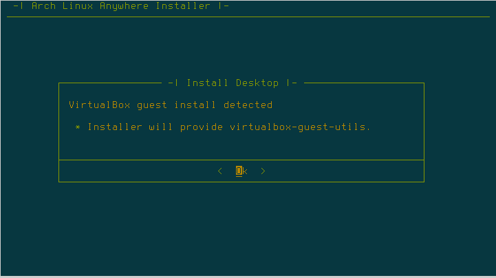
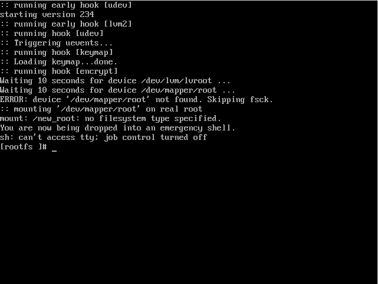
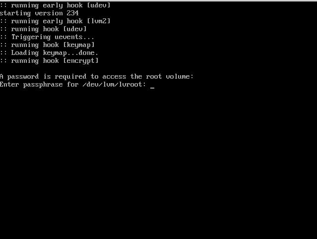
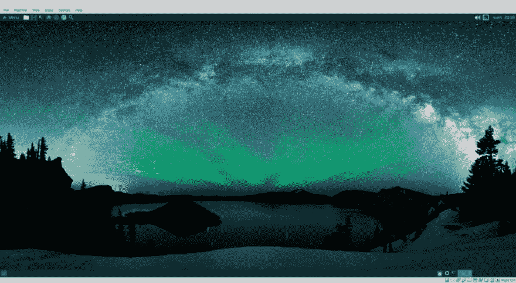
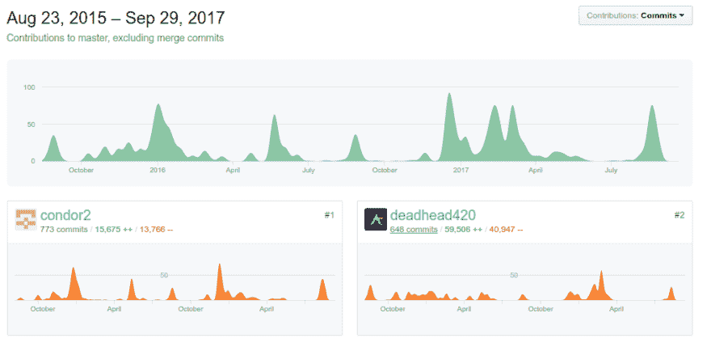

# 穿越拱门——第二卷

> 原文:[https://dev.to/svettwer/traveling-through-the-arch-第二卷-2kl](https://dev.to/svettwer/traveling-through-the-arch--vol-2-2kl)

[T2】](https://res.cloudinary.com/practicaldev/image/fetch/s--5E4QNGgC--/c_limit%2Cf_auto%2Cfl_progressive%2Cq_auto%2Cw_880/https://cdn-images-1.medium.com/max/601/1%2AtFi6naMRCPI45v8foDxuuw.png)

我们又来了！在[的上一篇文章](https://dev.to/svettwer/traveling-through-the-arch--vol-1-1jee-temp-slug-8266800)中，我总结了我对 Arch Linux 及其生态系统的了解。这次我将使用来自 https://arch-anywhere.org[的 Arch Linux 发行版 Anarchy Linux 来完成安装。](https://arch-anywhere.org)

让我们启动(虚拟)机器吧！

### 安装

在告诉系统引导实时环境并选择安装 Arch Linux 之后，系统会要求用户回答一些其他安装程序所熟知的基本问题，例如基于 shell 的对话框中的首选语言和键盘布局。回答完这个问题，就该对你的硬盘进行分区了。在第一次尝试中，我将尝试使用*自动分区加密 LVM* 选项，因为我在所有的机器上都有一个加密的 LVM，并且肯定会在 Arch Linux 上使用某种加密。选择分区大小，选择创建交换分区，键入 LVM 的加密密码。

加密密码…这些讨厌的小东西…

好吧，如果你还没猜到，我来自德国，在德国，我们有不同的键盘布局(qwertz)。因此，当我意识到安装程序绝对支持德语键盘设置，但在全新安装后引导您的系统时，提示不支持时，使用包含特殊字符的密码短语使我陷入了一些非常恼人的情况！那里我们有美国的布局，特殊的角色位于不同的地方。所以我在我的测试密码中添加了一个特殊的字符，来测试一下，关于这个问题，Arch Linux 是怎么回事。

分区已经完成。是时候选择你的内核了。没有特别的原因，我会继续使用基本内核。之后我选择了 bash，grub，networkmanager，除了 64 位以外的 32 位存储库，启用了 DHCP，禁用了 wifi utils，排除了 PPPoE DSL 连接(2017 u know？)并排除了 os-prober，因为我这里没有多重引导系统。在这篇文章中输入我的选择比通过对话框选择要花更长的时间。

现在我正在选择我的桌面环境。

我还是用默认的 [Xfce4 轻桌面](http://www.xfce.org/)，一如既往。但是等等！有一个叫做 [Arch Anywhere Xfce](https://arch-anywhere.org/content/features/) 的东西，它是来自 Anarchy Linux 开发者的某种定制 Xfce4。我要试试这个！

进入下一个屏幕…

<figure> 

<figcaption>安装过程截图——检测到 VirtualBox 安装</figcaption>

</figure>

所以安装程序足够聪明，可以检测到我正在使用 VirtualBox 安装，并因此安装 guest utils 包？厉害！

选择了最后几个要安装的组件后，安装程序会问我是否要安装我选择的所有软件包。我当然会，我们走吧…

*几分钟后……*

所有软件包都已安装。我为计算机选择了一个名称，设置了 root 密码，并创建了一个具有 root 权限的测试用户。已重新启动系统…然后…

[T2】](https://res.cloudinary.com/practicaldev/image/fetch/s--4WDWEhP5--/c_limit%2Cf_auto%2Cfl_progressive%2Cq_auto%2Cw_880/https://cdn-images-1.medium.com/max/641/1%2AUN2Qaw2dkE5Xs-hK3KHoBA.png)

奥利吗？这不是我所期望的…

好吧，那么曾经那么有前途的安装者在全新安装后留给我一个坏掉的系统。老实说，我不是一个深入的 Linux 专家，所以我会确切地知道哪里出错了，我必须做什么来解决这个问题。因此，我将尝试用完全相同的设置再次安装系统。

*几分钟后…*

[T2】](https://res.cloudinary.com/practicaldev/image/fetch/s--y3Wwbsu8--/c_limit%2Cf_auto%2Cfl_progressive%2Cq_auto%2Cw_880/https://cdn-images-1.medium.com/max/639/1%2ARmG9ii-Yd8epo6SSPblCsg.png)

好的…这次好像成功了…

那么原因是什么呢？稍后我会回到这一点。现在让我们来欣赏一下大家告诉我的拱门的壮观吧！

啊！在我忘记之前:LVM 密码提示带有英文键盘布局，而启动的操作系统会加载您在安装过程中选择的默认键盘设置。所以记住孩子们:*在你设置你的 LVM 密码之前，把你的键盘布局改成英文！*

<figure> 

<figcaption>第一次引导成功进入 Arch Linux 后的截图</figcaption>

</figure>

任务完成！稍微点击一下，就能发现所有花哨符号背后的东西。没错。感觉像一个 Xfce4 有一些不错的额外功能，如下拉外壳。我会记住的。但出于某种原因，我对我在这里找到的东西不满意。原因不是 Arch Linux，也不是定制的 xfce 4(IMHO 用它带来了令人敬畏的外观和感觉)，而是系统的安装。所以我们回过头来试着找一些第一次安装重启后坏掉的原因。

### 关于破损装置的研究

由于我无法重建技术环境，我现在唯一能做的就是猜测。但就算我不是 Linux 内核黑客，安装过程也不过是个程序。我会读程序！所以，让我们来参观一下[无政府 Linux github 库](https://github.com/deadhead420/arch-linux-anywhere)。到今天为止，大约有 2000 个提交和 41 个贡献者，发展得很好。

<figure> 

<figcaption>无政府主义的贡献</figcaption>

</figure>

现在让我们找到安装硬盘的地方。快速浏览一下 [arch-installer.sh](https://github.com/deadhead420/arch-linux-anywhere/blob/master/arch-installer.sh) 显示出 *prepare_divers* 就是我们要找的，它包含在 [configure_devices.sh](https://github.com/deadhead420/arch-linux-anywhere/blob/master/lib/configure_device.sh) 中。

在我进一步深入细节之前，我想说明我感谢每一个为世界提供自由/开放软件的人的工作！如果有人免费向每个人提供她或他的作品，我会更加感激！这就是自由软件/开源社区发展如此之快，如此强大的原因！非常感谢 Anarchy Linux 团队为您的工作以及您为项目付出的努力！我真的非常感谢！

到今天为止， *configure_devices.sh* 脚本有 850 行长，而在我选择之后调用的 *auto_encrypt* 方法有 111 行长。我在那个文件中发现的最大缩进是 10。因此，如果您以前没有见过代码，那么浏览代码并找到可能导致问题的原因并不容易。所以滚动代码 5 分钟后，我就离开了。在谷歌上搜索这个问题也没有帮助，因为我找不到安装脚本到底做了什么。

### 结论

我认为现在的主要问题是:我会推荐 arch-anywhere.org 安装程序吗？一如往常，答案是:视情况而定。

如果你是技术或者 Linux 新手，我根本不会推荐 Arch Linux，先从 Mint，Ubuntu 之类的开始。如果你知道 Linux 基本上是如何工作的，并且你正在寻找一个可以一起成长的发行版，使用 arch-anywhere.org，开始随心所欲地修改你的发行版。如果你非常了解 Linux，只是想摆脱更多面向最终用户的发行版带来的额外负担，从前沿技术开始，自己编写安装程序，避免任何预定义的安装程序。

在我看来，手动安装的好处是巨大的。

1.  您确切地知道您在系统上配置或安装了什么。因此，如果出现问题，您知道在安装过程中设置的每个命令的参数，因此故障排除会更容易，就好像您会使用根据用户选择来选择参数的工具一样。
2.  预定义的安装程序永远无法为您提供软件附带的所有选项。例如，Anarchy Linux 安装程序不能在 LVM 加密的基础上设置用户家庭加密。
3.  你的系统真的很小。你不知道安装程序是否选择了一些额外的软件包，如果你想知道安装程序到底是如何工作的，你必须花很多时间。
4.  你学到了很多！你永远也学不到像亲手做东西那么多的东西。这包括陷入陷阱，某种程度的挫折和痛苦，但最终你会成功，并对事物如何协同工作有深刻的理解。

在上一篇文章中，我说过，用自己的双手安装所有的东西并不是最先进的。根据不同的用例，这仍然是正确的。一个非技术用户永远无法开箱即用地安装 Arch Linux。但是这不是分布的用例。它希望简单(不是指用户友好)、高效和轻便，而目标受众主要是掌握技术诀窍的人。

因此，与我在上一篇文章中的陈述相反，我将亲手安装我的 Arch Linux！

所以让我们开始探索奇怪的新命令，在下一集“穿越拱门”中寻找新的软件包和新的设置选项。

本文最初发表于[medium.com/@SvenHettwer](https://medium.com/@SvenHettwer/traveling-through-the-arch-vol-2-24e771deced)