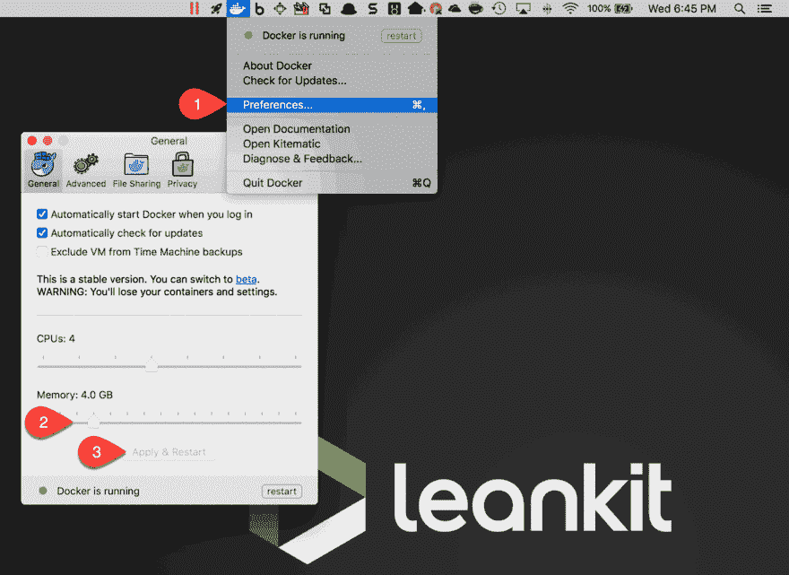
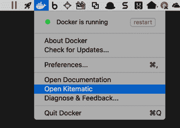
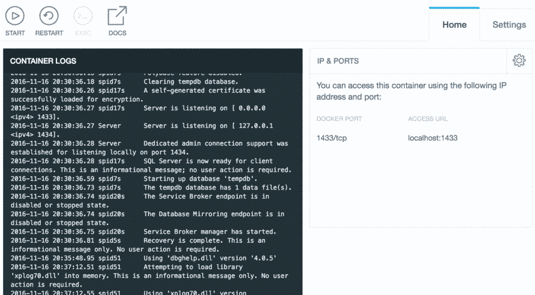
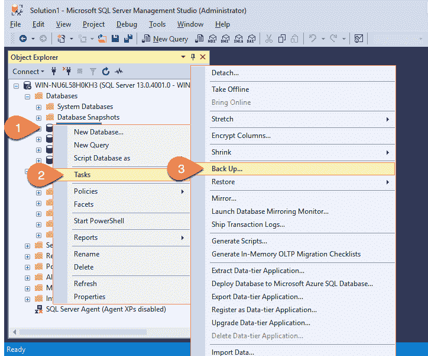
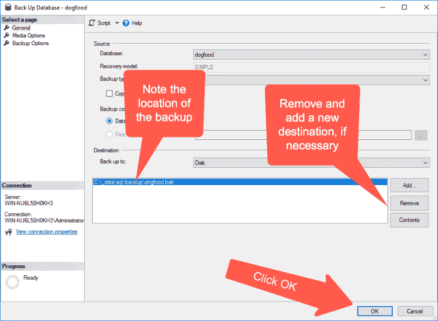
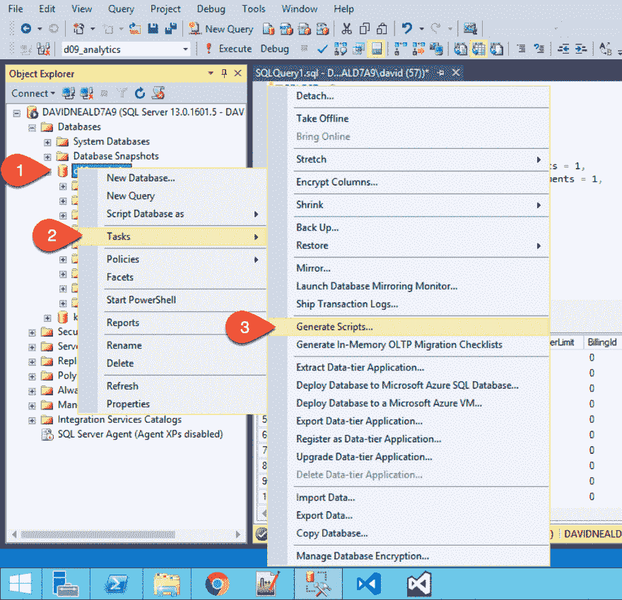
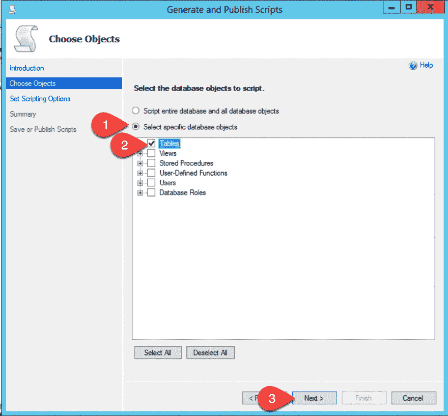
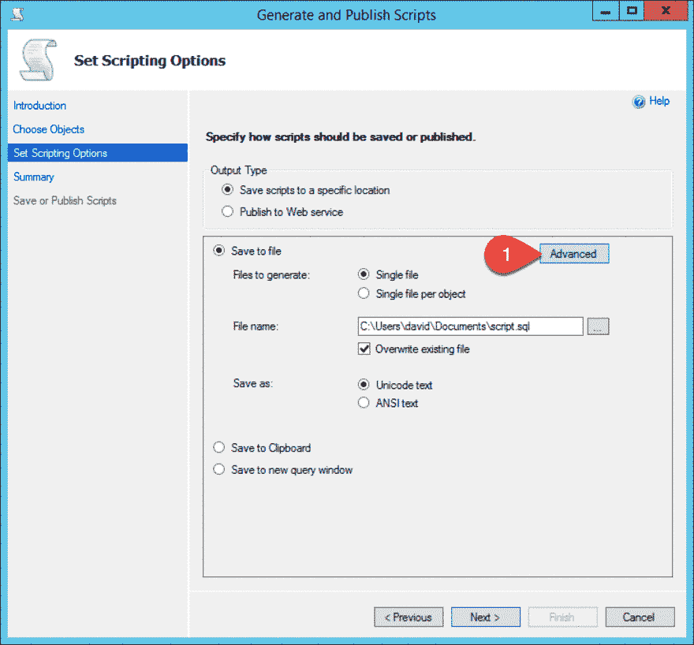
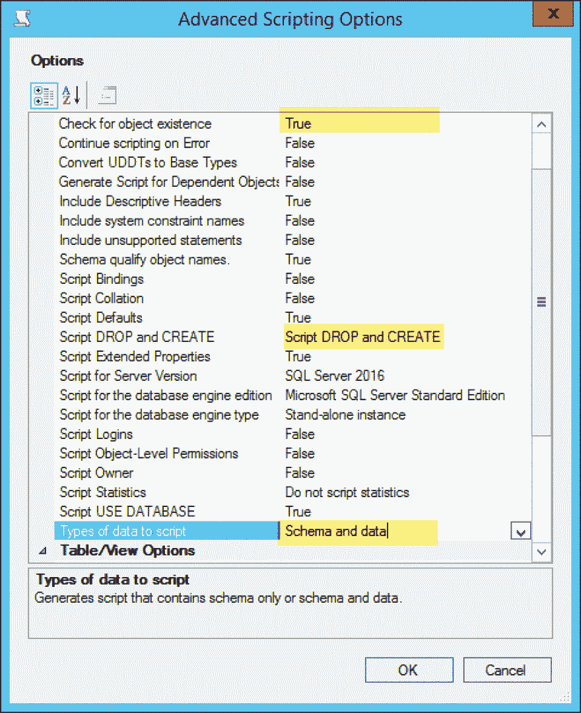

# 运行在 Mac 上的 SQL Server？！

> 原文：<https://dev.to/reverentgeek/sql-server-running-on-a-mac-29e>

[T2】](https://res.cloudinary.com/practicaldev/image/fetch/s--wITlKi2D--/c_limit%2Cf_auto%2Cfl_progressive%2Cq_auto%2Cw_880/https://thepracticaldev.s3.amazonaws.com/i/wihqvy3iga80h1tgophx.jpg)

猫狗同居，集体歇斯底里！

2016 微软连接()；活动包括许多有趣的公告。真正引起我注意的是用于 Linux 的 SQL Server。当然，我的第一个问题是:我能在我的 Mac 上运行这个吗？

是的。

答案是 [Docker](https://www.docker.com/) (我可以补充一下，这也是一个越来越普遍的答案)。以下是对我有效的步骤。

## 安装并配置 Docker

如果你还没有安装 Docker，你需要[下载并安装它](https://docs.docker.com/docker-for-mac/)。

下一步，您需要将 Docker 的可用内存增加到 4GB 或更多。

[T2】](https://res.cloudinary.com/practicaldev/image/fetch/s--lQ1I9wqb--/c_limit%2Cf_auto%2Cfl_progressive%2Cq_66%2Cw_880/https://thepracticaldev.s3.amazonaws.com/i/u72dzlg3ucl6ph16tk3z.gif)

1.  Docker ->首选项
2.  将内存增加到至少 4GB
3.  点击**应用&重启**

## 获取 Docker 图像

打开终端窗口，下载最新的 **SQL Server for Linux** Docker 镜像。

```
docker pull microsoft/mssql-server-linux:2017-latest 
```

Enter fullscreen mode Exit fullscreen mode

现在，启动 Docker 映像的一个实例。

```
docker run -d --name name_your_container -e 'ACCEPT_EULA=Y' -e 'SA_PASSWORD=P@55w0rd' -e 'MSSQL_PID=Developer' -p 1433:1433 microsoft/mssql-server-linux:2017-latest 
```

Enter fullscreen mode Exit fullscreen mode

现在，您应该已经在 Mac 上运行了 SQL Server，可以开始运行了！

### 关于 Docker 参数的几点说明

*   `-d`:这将在守护模式下启动容器，因此它在后台运行
*   给你的 Docker 容器起一个友好的名字，这对于从终端停止和启动容器很有用。
*   `-e 'ACCEPT_EULA=Y`:这将名为`ACCEPT_EULA`的容器中的环境变量设置为值`Y`。这是运行 SQL Server for Linux 所必需的。
*   `-e 'SA_PASSWORD=P@55w0rd'`:为`sa`数据库密码设置一个环境变量。将此设置为您自己的强密码。也需要。
*   `-e 'MSSQL_PID=Developer'`:设置一个环境变量，指示 SQL Server 作为开发者版运行。
*   `-p 1433:1433`:这将本地端口 1433 映射到容器的端口 1433。默认情况下，SQL Server 侦听 TCP 端口 1433 上的连接。
*   这个最后的参数告诉 Docker 使用哪个图像

### 提示:获得 Kitematic

Kitematic 是一个很好的管理 Docker 容器的桌面应用程序。第一次点击**打开 Kitematic** ，会提示你下载安装。然后，您可以使用 Kitematic 查看容器的输出，管理它们的设置，等等。

[T2】](https://res.cloudinary.com/practicaldev/image/fetch/s--fR8m4THl--/c_limit%2Cf_auto%2Cfl_progressive%2Cq_66%2Cw_880/https://thepracticaldev.s3.amazonaws.com/i/65bwoml0jythwvvtlsst.gif)

[T2】](https://res.cloudinary.com/practicaldev/image/fetch/s--X1mLvRF4--/c_limit%2Cf_auto%2Cfl_progressive%2Cq_66%2Cw_880/https://thepracticaldev.s3.amazonaws.com/i/6bguwteekjojqgq317ba.gif)

## 它跑了，现在怎么办？

对于 SQL Server 来说，sql-cli 是一个有用的命令行工具。要使用它，你需要 [Node.js](https://nodejs.org) 。如果您还没有 Node.js，请下载并安装它。

从终端全局安装`sql-cli`，这样就可以在任何地方使用。

```
npm install -g sql-cli 
```

Enter fullscreen mode Exit fullscreen mode

接下来，连接到 Docker 中运行的 SQL Server 实例。

```
mssql -u sa -p P@55w0rd 
```

Enter fullscreen mode Exit fullscreen mode

您现在可以从`mssql>`提示符查询和执行 SQL Server 命令。键入`.quit`并按**回车**退出。

## 将现有的 SQL 数据库放入 Docker

如果您和我一样，您有一个用于开发的 SQL 数据库，您想将其迁移到在 Mac 上运行的新 SQL 容器中。我有好消息。

### 选项 1:恢复备份

是的，您可以恢复在 Windows 上创建的 SQL 备份文件(`.bak`)！首先，您可以使用运行在 Windows PC/Server 上的 SQL Server Management Studio 创建现有数据库的备份。

#### 1。生成备份文件

1.  右键单击您的数据库
2.  单击任务->备份...
3.  记下备份文件的创建位置，必要时进行修改
4.  单击“确定”生成备份文件

[T2】](https://res.cloudinary.com/practicaldev/image/fetch/s--DxOkVXzd--/c_limit%2Cf_auto%2Cfl_progressive%2Cq_auto%2Cw_880/https://thepracticaldev.s3.amazonaws.com/i/tcjeogyt9epe7koy36oz.png)

[T2】](https://res.cloudinary.com/practicaldev/image/fetch/s--jhs16Hoo--/c_limit%2Cf_auto%2Cfl_progressive%2Cq_auto%2Cw_880/https://thepracticaldev.s3.amazonaws.com/i/9cd062lwn2t2zoapg78q.png)

接下来，在 Windows 机器上找到备份文件，并将文件复制到 Mac 上。亲爱的读者，这一步的细节我留给你。希望不会太痛苦。

#### 2。恢复备份文件

您需要从终端使用 Docker 命令将备份文件复制到容器中，并恢复数据库。

*注意:更改路径和名称，比如`dogfood`和`container-name`，以匹配您的数据库和 Docker 容器的名称。*

第 1 步:将`.bak`文件复制到 Docker 容器中。

```
docker cp ~/Downloads/sql/dogfood.bak container-name:/tmp/dogfood.bak 
```

Enter fullscreen mode Exit fullscreen mode

第二步:运行 SQL 恢复

```
docker exec container-name /opt/mssql-tools/bin/sqlcmd -U sa -P P@55w0rd -Q "RESTORE DATABASE [dogfood] FROM DISK='/tmp/dogfood.bak' WITH MOVE 'dogfood' TO '/var/opt/mssql/data/dogfood.mdf', MOVE 'dogfood_Log' TO '/var/opt/mssql/data/dogfood_Log.ldf' " 
```

Enter fullscreen mode Exit fullscreen mode

步骤 3:验证您的数据库是活动的

```
docker exec container-name /opt/mssql-tools/bin/sqlcmd -U sa -P P@55w0rd -Q "SELECT [name] FROM sys.databases" 
```

Enter fullscreen mode Exit fullscreen mode

准备好摇滚了！

### 选项 2:生成脚本

另一个选择是使用`sql-cli`运行脚本来重新创建一个在 Docker 中运行的数据库。

#### 1。生成脚本

第一步是使用 SQL Server Management Studio 从现有数据库生成脚本。

右键单击您的数据库，并选择任务->生成脚本...

[T2】](https://res.cloudinary.com/practicaldev/image/fetch/s--9s0JE1zx--/c_limit%2Cf_auto%2Cfl_progressive%2Cq_66%2Cw_880/https://thepracticaldev.s3.amazonaws.com/i/3nttcu8jnivs6k5h6fkd.gif)

我选择将表和数据脚本与视图、存储过程、用户定义的函数等分开。

[T2】](https://res.cloudinary.com/practicaldev/image/fetch/s--4S1Fyzou--/c_limit%2Cf_auto%2Cfl_progressive%2Cq_66%2Cw_880/https://thepracticaldev.s3.amazonaws.com/i/4wams8hogm4ul5tt87cv.gif)

接下来，点击**高级**

[T2】](https://res.cloudinary.com/practicaldev/image/fetch/s--zv46Pmmh--/c_limit%2Cf_auto%2Cfl_progressive%2Cq_66%2Cw_880/https://thepracticaldev.s3.amazonaws.com/i/2sfjwaa4rio7w2gpkg9q.gif)

我选择“检查对象是否存在”、“编写删除和创建脚本”，并将“要编写脚本的数据类型”设置为“模式和数据”

检查对象存在和删除/创建允许我对现有数据库重新运行相同的脚本，如果我想将它重置回原始状态的话。

[T2】](https://res.cloudinary.com/practicaldev/image/fetch/s--R_13qkAV--/c_limit%2Cf_auto%2Cfl_progressive%2Cq_66%2Cw_880/https://thepracticaldev.s3.amazonaws.com/i/ewk5wgkj0kmyggm01g93.gif)

选择保存脚本的位置。完成后，重复这些步骤，根据需要编写视图、存储过程和 UDF 的脚本。

#### 2。针对 Docker 中运行的 SQL Server 运行脚本

*   将上面生成的脚本复制到您的 Mac 上，这样您就可以轻松地从终端访问它们。
*   打开终端，并切换到放置脚本的文件夹。
*   现在，使用`sql-cli`连接到 Docker 中运行的 SQL Server，并确保您在`master`上

```
mssql> use master 
```

Enter fullscreen mode Exit fullscreen mode

*   创建新的数据库

```
mssql> CREATE DATABASE devdb 
```

Enter fullscreen mode Exit fullscreen mode

> 注意:更改`devdb`以匹配您编写脚本的数据库的名称。生成的脚本期望存在同名的数据库。

*   转到我们刚刚创建的数据库(更改`devdb`以匹配您的数据库名称)

```
mssql> use devdb 
```

Enter fullscreen mode Exit fullscreen mode

*   运行生成的脚本来创建所有的表并用数据填充它们。

```
mssql> .run script.sql 
```

Enter fullscreen mode Exit fullscreen mode

*   如有必要，对包含其他数据库对象的脚本重复上述操作。

## 成功！

现在，您已经有了一个运行在 Mac 上的数据库副本，而不需要整个 Windows VM！

### 进一步阅读...

*   使用`mssql` [Visual Studio 代码扩展](https://docs.microsoft.com/en-us/sql/linux/sql-server-linux-develop-use-vscode)来连接和管理你的数据库！

*   想了解更多关于 Docker 的知识，比如为你的软件项目创建你自己的容器？我强烈推荐[吴镇男·贝利的](https://twitter.com/derickbailey)牛逼[学习码头工人指南](https://sub.watchmecode.net/guides/learn-docker/)。

*   微软的文档:[在 Linux、Mac 或 Windows 上运行 SQL Server Docker 镜像](https://docs.microsoft.com/en-us/sql/linux/sql-server-linux-setup-docker)