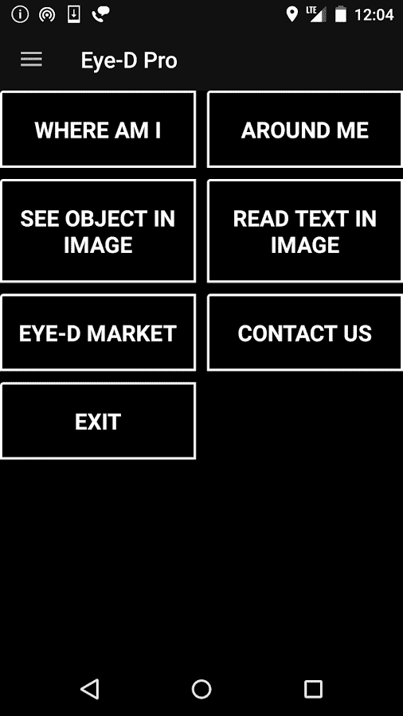
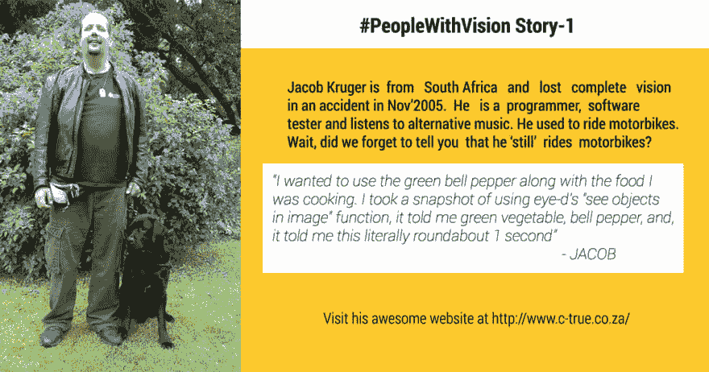
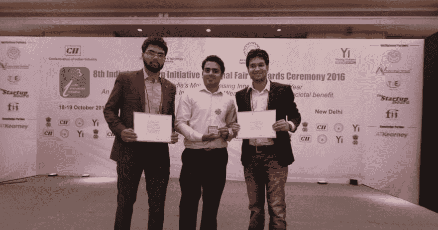
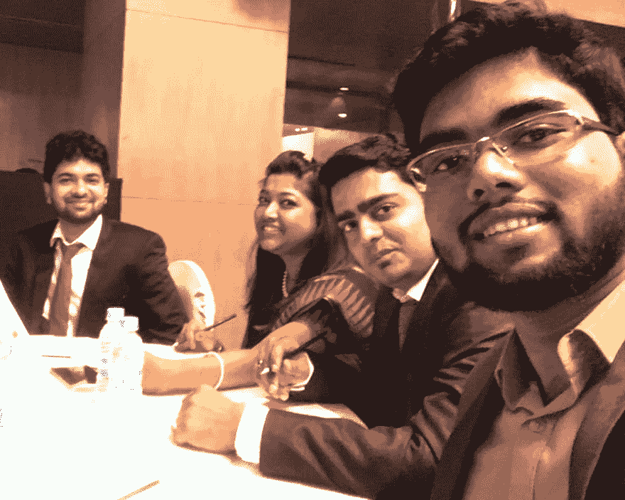
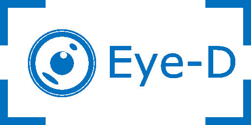

# eye-D+bug fender–为视障人士带来独立

> 原文:[https://dev.to/bugfenderapp/eye-d-bug fender-带给视障者独立-6k7](https://dev.to/bugfenderapp/eye-d--bugfender--bringing-independence-to-the-visually-impaired-6k7)

[T2】](https://res.cloudinary.com/practicaldev/image/fetch/s--dCXOda6Q--/c_limit%2Cf_auto%2Cfl_progressive%2Cq_auto%2Cw_880/https://bugfender.com/wp-content/uploads/2017/10/eye-d-city.jpg)

Eye-D 是一家公司，其使命是将过去十年出现的所有酷技术整合到一个应用程序中，以帮助视力障碍者。他们所创造的东西为 160 个国家的 12 种不同语言的 8000 多名活跃用户带来了独立和新的信心。

而且，我们非常自豪地说，他们是 [Bugfender](https://bugfender.com/) 的客户。

Eye-D 应用程序将 GPS /地图、图像识别的机器学习和 OCR 结合到一个应用程序中，其用户界面针对屏幕阅读器进行了优化。如果你不熟悉屏幕阅读器，它们是令人惊叹的工具，允许移动设备[大声读出屏幕上的内容，允许视力有限的人使用常规移动设备](https://www.youtube.com/watch?v=AlbIF7IOb_Q)。

[T2】](https://res.cloudinary.com/practicaldev/image/fetch/s--PzUBtNps--/c_limit%2Cf_auto%2Cfl_progressive%2Cq_auto%2Cw_880/https://bugfender.com/wp-content/uploads/2017/10/eye-d-app.png)

*Eye-D 主屏幕显示核心功能和针对屏幕阅读器优化的界面。*

Eye-D 应用程序帮助用户知道他们在哪里，使用移动设备摄像头识别物体，并阅读文本(甚至是整本印刷书籍)。虽然该团队计划在未来解决更多问题，但他们选择了这 3 个核心领域作为起点，因为它们是克服视力障碍者在日常生活中面临的最紧迫挑战的关键。

当我在 Eye-D 与 Shaswat Jena 交谈时，他让我想象在城市中行走的简单行为，以及我的视力如何让我在地标、街道标志和其他视觉线索的帮助下导航。我还可以通过指示牌找到商店、餐馆和其他目的地。对于视障者来说，这种简单的独立行为——在城市中寻找道路——要复杂得多。虽然许多地图应用程序提供步行方向或位置信息，但它们并没有以针对视力障碍者的日常使用进行优化的方式提供这些信息。Eye-D 是专门为用户设计的，使日常任务和许多其他任务变得更加容易。

## 全球安卓碎片化

Android 设备种类繁多，每种设备的硬件和软件都略有不同，这既是 Android 平台的优势，也是开发者的负担。这种变化通常被称为碎片化，对 Eye-D 来说是一个特殊的挑战。

由于 Eye-D 的成功，碎片化问题在一定程度上变得更加严重。在 160 多个国家的用户中，他们看到了许多专门针对这些市场的设备。当我们大多数人只看到在自己国家可用的设备时，很容易忘记许多制造商只向一个国家或地区发布一些设备。例如，三星在 2016 年发布了 26 款三星 Galaxy 品牌的设备(这并没有涵盖三星当年发布的所有 Android 设备)，但这些设备中的大部分仅在世界上的一个地区可用。

[T2】](https://res.cloudinary.com/practicaldev/image/fetch/s--Y2ytRwOT--/c_limit%2Cf_auto%2Cfl_progressive%2Cq_auto%2Cw_880/https://bugfender.com/wp-content/uploads/2017/10/eye-d-jacob.jpg)

眼力好的顾客会以一种鼓舞人心的方式喜爱产品。

所有制造商的设备数量庞大，忽略了实际获得针对不同国家的设备的问题，这意味着不可避免的是，你的 Android 应用程序将在你无法直接访问的设备上运行。如果你像 Eye-D 一样，也希望用更慢的处理器和更少的内存覆盖更实惠的手机，事情就更具挑战性了。

Eye-D 应用程序在设备上使用了如此多的传感器，这使得硬件变化更加成问题。奇怪的硬件变化不仅仅局限于小型制造商的廉价设备或更奇特的传感器。谷歌 Pixel 是一款以相机质量著称的设备，它给试图使用其相机的第三方应用程序带来了许多问题(幸运的是，这些问题现在已经得到了解决)。即使是 Nexus 5x，作为一款 Nexus 设备，它应该是 Android 的一种参考平台，[也存在相机兼容性问题](https://www.theverge.com/2015/11/9/9696774/google-nexus-5x-upside-down-camera)。

那么，如何在无法访问设备的情况下调试特定于设备的问题呢？借助 Bugfender，Eye-D 团队可以启用一种调试模式，在应用启动时捕获关于每个设备的大量信息，包括制造商、型号、CPU、内存、摄像头和其他传感器。更重要的是，他们捕捉使用传感器过程中的每一步，这样当他们调试问题时，就可以准确地指出过程中发生错误的地方。这使得 Eye-D 团队能够修复他们从未见过或使用过的设备上的大量错误。

很难夸大这对他们的过程有多重要。作为一个预算有限的小团队，他们根本无法覆盖所有可用的设备。与此同时，他们致力于提供高质量的应用程序。Bugfender 提供的远程日志记录为他们提供了交付所需质量的杠杆。

[T2】](https://res.cloudinary.com/practicaldev/image/fetch/s--8jJ2Fwn0--/c_limit%2Cf_auto%2Cfl_progressive%2Cq_auto%2Cw_880/https://bugfender.com/wp-content/uploads/2017/10/eye-d-award.jpg)

*Eye-D 团队赢得 2016 年第八届印度创新计划国家博览会最佳创新者奖*

## 主动消灭臭虫

除了帮助修复用户报告的错误，Eye-D 还结合了崩溃报告和 Bugfender 日志记录，以主动修复错误。崩溃报告总是有助于让你知道你的应用程序中是否有你在测试中没有发现的问题。但是通常崩溃报告没有足够的信息来修复错误。这就是将崩溃报告与 Bugfender 日志结合起来如此强大的原因。Eye-D 团队能够从崩溃报告到 Bugfender 日志获取修复 bug 所需的信息，而无需等待用户报告或跟进用户以获取更多信息。

该团队在应用程序发布后使用这种方法，但更重要的是，他们也在 beta 测试发布前使用这种方法。在每次发布之前，团队都会向有意愿的测试人员发布几个预览版本。任何使用过这种方法的人都知道，尽管它非常强大，即使你有愿意测试的测试人员，他们也不总是立即报告问题。崩溃报告和 Bugfender 的结合使团队能够充分利用 beta 测试期，从而在最终版本中减少崩溃。

这种方法对于全球定位系统的使用也很重要。虽然 Eye-D 团队有一些 GPS 突然丢失或应用程序自发宣布位置的报告，但该团队无法通过内部测试重现。远程日志记录使他们能够修复所报告的错误，但更重要的是，他们能够寻找其他未被报告的类似问题。由于我们上面提到的硬件变化以及充分利用设备传感器的复杂性，获取独立报告并将其扩展到整个 bug 类别的能力非常重要。

主动消除 bug 对他们应用的可靠性产生了巨大的影响。在 Bugfender 的帮助下，Eye-D 能够从大约 80%的会议免于崩溃到几乎所有的会议免于崩溃。用户也注意到了；play store 上 Eye-D 应用程序的平均评分也有相应的增长，这是专注于消除 bug 的结果。

在竞争激烈的应用程序市场中，获得用户的参与通常非常困难。许多人会干脆放弃一个应用程序或转向竞争对手，而不是报告错误。因此，发现和解决未报告问题的能力是一个巨大的竞争优势。

[T2】](https://res.cloudinary.com/practicaldev/image/fetch/s--0_uJRDxb--/c_limit%2Cf_auto%2Cfl_progressive%2Cq_auto%2Cw_880/https://bugfender.com/wp-content/uploads/2017/10/eye-d-team.jpg)

整个 Eye-D 团队——看到他们在如此小的团队中所做的一切令人振奋。

## 保护用户隐私

Eye-D 应用的性质意味着日志记录可能会泄露许多用户认为是隐私的信息([我们在](https://bugfender.com/blog/what-not-to-log-when-remotely-debugging-mobile-apps/)之前已经写过如何处理日志中的敏感数据)。由于这些担忧，Eye-D 已经采取了强有力的措施来保护他们用户的隐私。默认情况下，他们不会存储用户的数据。因此，虽然他们必须接收数据，如照片和位置搜索，以便应用程序工作，但他们不会保留这些数据。他们处理数据，将结果返回给用户，然后删除数据。

默认情况下，他们还使用 Bugfender 的内置功能来禁用设备上的日志记录。这样，他们可以减少存储的敏感信息，但当他们看到崩溃报告或用户联系他们时，他们可以远程启用该设备的日志记录。所有这些都不需要发布应用程序的特殊调试版本或要求用户手动启用日志记录。

这种方法有一个额外的优势，即减少他们应用程序的数据使用，这虽然总是很好，但在他们所在的许多新兴市场中非常重要。

## 自制工具的局限性

Bugfender 并不是该团队采用的第一种远程日志记录方法。首先，他们建立了自己的工具。我们都曾经这样做过。很容易认为你可以快速拼凑出一些东西来完成工作。而且，通常，你可以得到一些基本有效的东西。但是基本上，工作与一个拥有所有你需要的功能和完善来完全解决手头问题的工具是非常不同的。

面对他们构建的简单工具的局限性，以及在投入时间改进该工具或其应用程序之间的选择，Eye-D 团队寻求第三方解决方案。他们就是这样来尝试 Bugfender 的。他们说，更丰富的信息、有条件的日志记录和友好的界面是立竿见影的效果。

作为软件开发人员，总是很难在构建和购买之间做出选择。部分原因是创建软件似乎是“免费的”——它不像制造实物那样需要材料成本。当然，大多数公司的问题是，时间是一种宝贵的资源。你花在编写不能直接解决客户问题的软件上的每一分钟都应该被仔细审查。当然，这并不意味着您应该购买所有的第三方软件并将其连接在一起。Joel Spolsky 有一篇旧文章很好地总结了这一点:

> “选择你的核心业务能力和目标，并在内部完成。如果你是一家制药公司，编写药物研究软件，但不要编写自己的会计软件包。”

因此，虽然远程日志对于 Eye-D(和许多公司)来说至关重要，但它不是核心业务目标。拥有优秀的日志记录有助于他们交付优秀的产品，但这不是他们正在销售的产品。当然，出色的日志记录是我们的核心业务目标，因此让我们来处理日志记录可以让您专注于对您的业务最重要的事情。

在使用我们的免费层一段时间后，Eye-D 订阅了我们的一个更高层次的软件包。促使这一举动的原因是更多设备需要更长的日志保留期。他们庞大的用户群，加上有时需要提前几天甚至几周处理崩溃或错误报告，需要我们提供额外的日志存储和更长的日志保留时间。

## 最后的想法

一如既往，看到我们的客户开发出令人惊叹的应用程序，令人感到谦卑和鼓舞。对于 Eye-D 来说，这尤其重要，因为他们致力于利用技术帮助有挑战性的残疾人独立生活，并以自己的方式生活。这是我们许多人长期以来对技术的梦想，看到它实现并成为其中的一部分令人兴奋。我要感谢整个 Eye-D 团队，尤其是 Shaswat Jena 花时间帮助我了解他们的应用程序以及他们如何使用 Bugfender。

如果你想帮助他们完成使命，请[在他们的请愿书](http://support-eye-d.com/petition/)上签名，帮助把 Eye-D 技术带给所有需要它的人。

[T2】](https://res.cloudinary.com/practicaldev/image/fetch/s--0dEi7Xhv--/c_limit%2Cf_auto%2Cfl_progressive%2Cq_auto%2Cw_880/https://bugfender.com/wp-content/uploads/2017/10/eye-d-logo.png)

## 关于 Eye-D 的更多信息

Eye-D(Eye Devices 的首字母缩写)是 GingerMind Technologies Pvt. Ltd .的一个多奖项项目。在 Eye-D，我们开发产品，通过技术帮助视力障碍者过上独立的生活。我们遵循通过利用现有技术来开发经济实惠的解决方案的方法。通过我们的产品套件，我们计划为视障人士提供一个公平的竞争环境，满足他们触手可及的日常需求。我们的产品套件包括两个版本的 Eye-D 应用程序(Eye-D free 和 Eye-D Pro)和一个名为 Eye-D keypad 的硬件。我们相信技术能够真正赋予有特殊需求的人力量。因此，为了进一步扩大我们现有的基于人工智能的辅助应用程序(Eye-D App)的影响，并帮助更多的视障人士采用和使用智能手机，我们开发了一种通用的智能物理键盘，称为 Eye-D keypad。Eye-D 键盘通过弥合可访问性差距，帮助视障人士高效使用智能手机。Eye-D 键盘的通用设计使其与任何 android 手机兼容，并使其足够便携，可以在旅途中使用。虽然键盘旨在将视觉障碍者与数字世界联系起来，但该应用程序解决了他们需要帮助的三个关键领域，即旅行、识别和学习。Eye-D 应用程序现在每月用 12 种不同的语言帮助全球 160 个国家的 8000 多名视障人士。