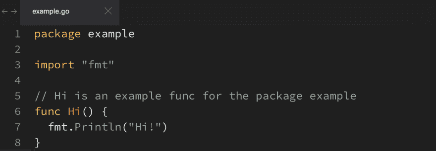
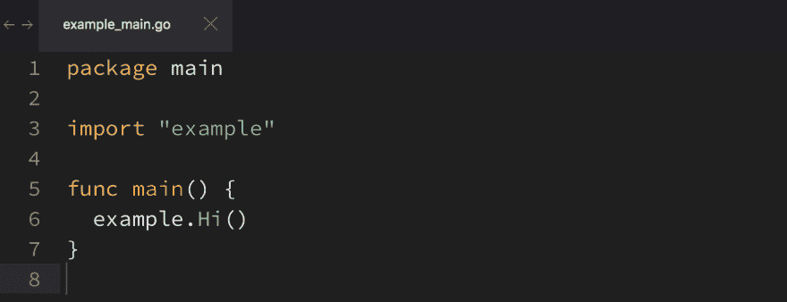
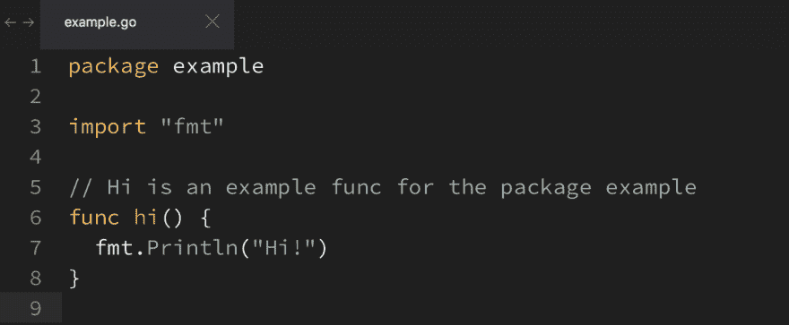

# Go 软件包如何解耦您的代码

> 原文:[https://dev . to/financx/how-go-packages-decouple-your-code-9gk](https://dev.to/inancx/how-go-packages-decouple-your-code-9gk)

封装允许我们向外部代码暴露或隐藏部分代码。我们可以使用包，通过让我们的声明以大写字母开始，向外部代码公开我们代码的一部分。

#### 例 1:

[T2】](https://res.cloudinary.com/practicaldev/image/fetch/s--AIoNr3DY--/c_limit%2Cf_auto%2Cfl_progressive%2Cq_auto%2Cw_880/https://cdn-images-1.medium.com/max/1600/1%2ADZJ1kMCJCPDp78ADjjbShQ.png)

*example.go* 程序将`Hi`暴露给不属于*示例包*的代码。在*导入*这个`example`包之后，外部代码可以使用这个作为:`example.Hi()`。

[T2】](https://res.cloudinary.com/practicaldev/image/fetch/s--iqiclFo9--/c_limit%2Cf_auto%2Cfl_progressive%2Cq_auto%2Cw_880/https://cdn-images-1.medium.com/max/1600/1%2AijbDntPbyyFDmpBUb0qtyQ.png)

*主包*可以调用*例包的* `Hi`功能。因为`Hi`被命名为 *Hi* ，而不是 *hi* ，所以它**以大写字母**开头。

#### 我们来试试，例 2:

[T2】](https://res.cloudinary.com/practicaldev/image/fetch/s--OLynpz5O--/c_limit%2Cf_auto%2Cfl_progressive%2Cq_auto%2Cw_880/https://cdn-images-1.medium.com/max/1600/1%2AAxXRaas-nGWnlstStaf4rw.png)

在这里，example.go 没有公开 *hi 函数*，它“隐藏了它”。*主包*不能再调用范例包的 hi 函数。

**Go 在你尝试运行程序时会显示错误:**

```
example_main.go:6:2: cannot refer to unexported name example.hi<br>
example_main.go:6:2: undefined: example.hi 
```

<svg width="20px" height="20px" viewBox="0 0 24 24" class="highlight-action crayons-icon highlight-action--fullscreen-on"><title>Enter fullscreen mode</title></svg> <svg width="20px" height="20px" viewBox="0 0 24 24" class="highlight-action crayons-icon highlight-action--fullscreen-off"><title>Exit fullscreen mode</title></svg>

这允许我们显示或隐藏我们的包的一些实现。我们可以显示或隐藏包的功能和状态。

#### 例 3:

现在，让我们试着隐藏包的数据，但暴露包的功能。*年龄数据*将被隐藏，但是，*年龄函数*将被暴露。

*example_2.go* 暴露*年龄函数*但隐藏*年龄*变量。 *example_main.go* 可以调用*例包的年龄函数*，但是不能直接访问例包的年龄数据。

*主包*可以调用*例包的年龄函数*，但是不能访问*例包的年龄数据*，因为*年龄数据*的名字以*小写字母*开头。

### 那么，我们为什么要隐藏对数据或功能的访问呢？

**因为它控制对我们的包**中的功能和数据的访问。通过隐藏东西，我们*降低了代码的维护成本*。当外部代码可以访问我们代码中的所有内容时，我们就不能改变我们包中的某些内容，否则会杀死外部代码。

想象一下，我们在这里公开了*年龄数据*,它正被十几个其他外部代码使用。当我们想去掉年龄数据时，我们不能，因为那会破坏依赖(*局外人代码*)代码。它会变得又硬又粘。它会扼杀我们的代码，当然，也会慢慢地扼杀我们。**我们应该减少[技术债务](https://en.wikipedia.org/wiki/Technical_debt)，而不是增加。**

或者，在其他场景中，如果我们已经暴露了*年龄数据*，外部代码甚至可以超出我们的控制来改变它，那么我们在*示例包*中的代码也会被破坏。一些外部代码可能会改变*时代*内部的数据，我们永远也不会确定它的状态。封装将变得不稳定。封装给我们的代码带来了稳定性。

在 Go 包中，没有一个源代码级别的局部变量只属于(可见)一个源代码文件。包中的任何代码共享相同的功能和数据，不管它们是否公开。

例如: *example_2.go* 中的 *age* ，也可以被 *example.go* 访问，因为它们住在同一个包里面。用 Go 编程时要小心这一点。

要了解更多关于套餐的信息，请[点击此处阅读关于 Go 套餐的主要帖子](https://blog.learngoprogramming.com/definitive-guide-to-go-packages-focus-on-the-fundamentals-to-empower-your-skills-d14aae7cd321)。

* * *

我主要是在推特上谈论围棋，你可以在推特上关注我。

### 我还在创建一个教授围棋的在线课程。要获得通知，请[订阅我的电子邮件列表](http://eepurl.com/c4DMNX)。谢谢ðÿ˜。

* * *

*最初发布在[包上提供封装](https://blog.learngoprogramming.com/packages-can-allow-or-disallow-for-reusability-2edb6bd18815)在[学围棋编程](https://blog.learngoprogramming.com)。*