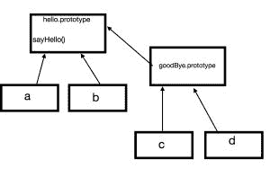

# 不，不是继承，请叫我代表团...

> 原文:[https://dev . to/damcosset/no-not-inheritance-please-call-me-delegation-87l](https://dev.to/damcosset/no-not-inheritance-please-call-me-delegation-87l)

## 简介

啊，原型...你读过多少博客文章将原型列为该语言的必备特征？高级开发人员告诉过你多少次原型继承？我花了相当长的时间来避免更深入地了解这件事。我厌倦了拖延，所以我写了这个东西。

## 简单的请字...有例子吗？

对象有一个内部属性(在规范中称为[[Prototype]])。此内部属性是对另一个对象的引用。快速示例:

```
// A simple object
const myObject = {
  a: 2
}
console.log(myObject.a) // 2

// We link newObject to myObject with Object.create
const newObject = Object.create(myObject)

console.log(newObject) // {} 
console.log(newObject.a) // 2 LOLWUT? You empty or nah? 
```

*Object.create* 创建新对象。它接受另一个对象作为参数。思考正在发生的事情的通常方式是(T2 经典方式) :我复制了这个对象。**你这个笨蛋！！**

如你所见， *newObject* 是空的。我们没有复制，我们将*新对象*链接到*我的对象*。 *myObject* 成为 *newObject* 的原型。要知道一个对象的原型里面是什么，可以用 ****proto**** 。

```
console.log(newObject.__proto__) // { a: 2 }
console.log(myObject.isPrototypeOf(newObject)) // true 
```

链是有链接的，[[原型]]是链。那么 Javascript 是如何使用原型来检索值的呢？

## 上链...一次一个链接。

```
const original = {
  a: 2
}

const secondComing = Object.create(original)

const thirdLink = Object.create(secondComing)

console.log(thirdLink) // {}
console.log(secondComing) // {}

console.log(secondComing.isPrototypeOf(thirdLink)) // true
console.log(original.isPrototypeOf(thirdLink)) // true
console.log(thirdLink.isPrototypeOf(original)) // false 

console.log(thirdLink.a) // 2 
```

你最喜欢的语言是这样工作的:它试图在*的第三链接*对象中获取属性 *a* 。找不到。它是返回未定义的还是一个错误？不，它在原型链中寻找链接。它发现*二次到来*是*三次链接*的原型。它找了*一个*，还是没找到。它移动到另一个链接，称为*原始*。发现 a = 2！！

## 如果我改变了链底的东西怎么办？

*   会对链顶产生怎样的影响？这么大的问题。

我决定直接改变*第三链接*中 *a* 的值:

```
thirdLink.a = 3

console.log(thirdLink) //{ a: 3 }
console.log(thirdLink.a) // 3
console.log(original.a) // 2 
```

这就是我们所说的影子财产。新的 *a* 值遮蔽了更高原型中存在的其他 *a* 值。

### 如果我放些冰在上面会怎么样？

顶部链接中的属性无法覆盖怎么办？

```
// Freeze the original, properties can't be changed
Object.freeze(original)
original.a = 3
// a is still equal to 2
console.log(original) // { a: 2 }

// That will NOT change the value, or shadow it.
thirdLink.a = 3
console.log(thirdLink) // {} 
console.log(thirdLink.a) // 2 
```

没有任何改变，因为原型的属性 *a* 是只读的。

但是，如果您无论如何都需要更改只读的属性值。你必须使用*object . define property*:

```
// Freeze the original, properties can't be changed
Object.freeze(original)

// Ok, this will work.
Object.defineProperty(thirdLink, 'a', { value: 5 })

console.log(thirdLink.a) // 5 
```

所以，每当你认为你在改变一个对象的值时，你必须考虑到链上的原型。它们可能具有不能以某种方式覆盖的同名属性。

## 对于函数来说意味着什么？

在面向类的语言中，你可以创建一个类的不同实例。您将类行为复制到一个对象中。每次实例化一个类的时候都要重复这个过程。

然而，在 Javascript 中，没有类，只有对象。 **class** 关键字只是一个语法问题，它不会将任何 class-y 带到表中。无论你在 ES6 中用 **class** 关键字做什么，在 ES5 中都不会有问题。

默认情况下，每个函数都有一个*原型*属性。

```
function hello(){
  return 'Hello World'
}

function goodBye(){
  return 'Goodbye'
}

console.log(hello.prototype) // hello {}
console.log(goodBye.prototype) // goodBye {} 
```

好的，如果你不像面向类的语言那样复制会发生什么？您可以使用[[Prototype]]链接创建多个对象。像这样:

```
const a = new hello()
const b = new hello()
const c = new goodBye()
const d = new goodBye()

console.log(Object.getPrototypeOf(a) === hello.prototype) // true
console.log(Object.getPrototypeOf(b) === hello.prototype) // true
console.log(Object.getPrototypeOf(c) === goodBye.prototype) // true
console.log(Object.getPrototypeOf(d) === goodBye.prototype) // true 
```

我们所有的对象都链接到同一个 *hello.prototype* 或 *goodBye.prototype* origin。所以，我们的对象(a、b、c 和 d)并不是彼此完全分离的，而是联系到同一个原点。因此，如果我在 *hello.prototype* 中添加一个方法， *a* 和 *b* 将可以访问它，因为 Javascript 将沿着链向上找到它。但是，我没有改变任何关于 *a* 和 *b* :
的东西

```
// I'm not touching a or b
hello.prototype.sayHello = () => {
  console.log('I say hello to you!')
}

a.sayHello() // I say hello to you!
b.sayHello() // I say hello to you! 
```

通过**不是**复制对象而是链接它们，Javascript 不需要在每个对象中包含整个对象环境。它只是沿着链条往上走。

现在让我们制作*再见。原型*成为*你好。原型* :
的原型

```
 // Objects not linked yet => Errors
c.sayHello() // Error: not a function
d.dayHello() // Error: not a function

// This is a ES6 method. First argument will be the link at the bottom of the prototype chain, the second is the top link.
Object.setPrototypeOf(goodBye.prototype, hello.prototype)

// Now, c and d will look up the chain!
c.sayHello() // I say hello to you!
d.sayHello() // I say hello to you! 
```

我给你看看我做的一个恶心的东西，也许会更清楚一点:

[T2】](https://res.cloudinary.com/practicaldev/image/fetch/s--vHzq0mVW--/c_limit%2Cf_auto%2Cfl_progressive%2Cq_auto%2Cw_880/https://www.damiencosset.com/wp-content/uploads/2017/10/prototypesSchema-e1506980959792-300x207.jpg)

美丽的...注意箭头是如何从底部到顶部的！

## 原型遗传

亲爱的朋友们，这就是原型继承的概念。现在，我并不热衷于继承这个词。这意味着某种复制或父子关系，而 Javascript 不会这样做。我见过*代表团*这个词来形容这个，我更喜欢它。同样，Javascript 本身并不复制对象，而是将它们相互链接。

我看到你在等一些例子:

```
function Mammal(type){
  this.type = type
  this.talk = () => {
    console.log('Hello friend')
  }
}

Mammal.prototype.myType = function(){
  return this.type
}

function Dog(name, type){
  Mammal.call(this, type)
  this.name = name
  this.woof = () => {
    console.log('Woof!')
  }
}

// Link the Dog prototype to the Mammal prototype
Object.setPrototypeOf(Dog.prototype, Mammal.prototype)
//OR
// Dog.prototype = Object.create(Mammal.prototype)

Dog.prototype.myName = function(){
  return this.name
}

const Joe = new Dog('Joe', 'Labrador')

Joe.woof() // Woof!
console.log(Joe.myName()) //Joe
console.log(Joe.myType()) // Labrador
Joe.talk() // Hello friend 
```

```
 const SuperHero = {
  statement: function(){
    return 'I am an anonymous superhero'
  }
}

const Batman = Object.create(SuperHero)

Batman.statement() // 'I am an anonymous superhero' 
```

## 结论

古典传承是亲子关系。它从上到下。Javascript 有*原型委托*。虽然它*类似于*古典的传承，但它是完全不同的。对象是链接在一起的，不是复制的。引用更多的是自下而上。

告诉我你对这件事的看法，希望我已经说得够清楚了。

哦，不要麻烦给我关于这个模式的反馈，我已经知道它很棒了。