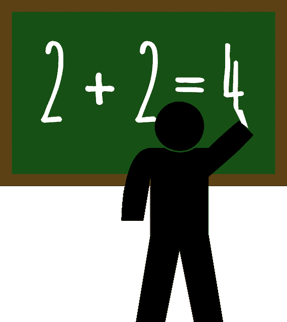
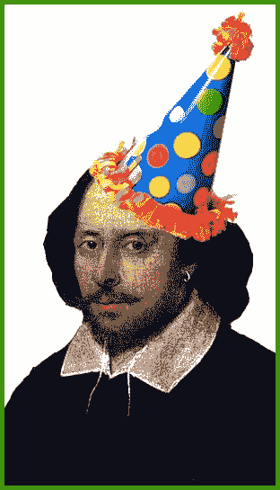

# Javascript 冒险第二部分

> 原文：<https://dev.to/triplejdev/adventures-in-javascript-pt2-e38>

[T2】](https://res.cloudinary.com/practicaldev/image/fetch/s--XPy5_nGW--/c_limit%2Cf_auto%2Cfl_progressive%2Cq_auto%2Cw_880/https://cdn-images-1.medium.com/max/888/1%2A2kLbv7LDPIw0dq7cRnR4Kg.png)

嗯，由于上周的文章非常成功(顺便感谢所有的赞和转发)，我想我应该从它停止的地方继续！

所以，上一次，我们谈到了地图，过滤和减少，他们如何工作，他们在幕后看起来像什么。

这一次，我们将讨论**组合**那些功能，或者**将**链接在一起。

同样，我们将看看我们手工制作的函数是如何实现的，以获得一种感觉，然后用“真正的 JS 函数”来实现。

又短又甜。很好。让我们继续吧。

我们有一个数组:

```
let nums = [1,2,3,4,5,6,7,8,9]; 
```

Enter fullscreen mode Exit fullscreen mode

使用我们最后的函数，我们将映射它，给每个值加 1，过滤掉超过 5 的数字，然后把剩下的减少到这些值的总数。预计总共有 40 个。我想……(快速数学，你知道)。

<figure>[](https://res.cloudinary.com/practicaldev/image/fetch/s--aaMKcBqI--/c_limit%2Cf_auto%2Cfl_progressive%2Cq_auto%2Cw_880/https://cdn-images-1.medium.com/max/571/1%2AAgQYwKPN_IkoMcNUuJVjmQ.png) 

<figcaption>男人的不辣</figcaption>

</figure>

来了:

```
let ourMapResults = map(nums, addOne);
// [2, 3, 4, 5, 6, 7, 8, 9, 10]

let ourFilterResults = filter(ourMapResults, moreThanFive);
// [6, 7, 8, 9, 10]

let ourReduceResults = reduce(0, ourFilterResults);
// 40 
```

Enter fullscreen mode Exit fullscreen mode

万岁，真的，万岁。

<figure>[](https://res.cloudinary.com/practicaldev/image/fetch/s--EWvr3DEU--/c_limit%2Cf_auto%2Cfl_progressive%2Cq_auto%2Cw_880/https://cdn-images-1.medium.com/max/312/1%2AehHnVThWqH1kGs5upYtGvQ.jpeg) 

<figcaption>所以，所以快乐</figcaption>

</figure>

正如所料，这很好。这相当简单。

“那么，有什么牛肉？你可能会问自己(你会问，对吗？).

首先，您创建所有这些新变量只是为了能够将它们传递给链中的下一个函数。它们不会被再次使用，它们不会作为变量实现它们的生活目标。或者什么的。你不会希望你的变量是这样的，对吧？

此外，链中的每一项都只做一件事。很容易跟踪正在发生的事情。

还有，这是一个很简单的例子。这些链条可以持续很长时间，并且变得非常复杂。你将到处都有额外的变量，你的代码库将(可能)更大，更难维护，更不清晰。

可能有更多更好的理由，但是看，这是一个星期天的早上。别再找我的茬了！

不管怎样——现在，让我们来做比“真实”的方式:

```
let reduceResults = nums.map(addOne)
  .filter(n => n > 5)
  .reduce((sum, num) => sum + num, 0)
// 40 
```

Enter fullscreen mode Exit fullscreen mode

<figure>[](https://res.cloudinary.com/practicaldev/image/fetch/s--UYfbKYZc--/c_limit%2Cf_auto%2Cfl_progressive%2Cq_auto%2Cw_880/https://cdn-images-1.medium.com/max/640/1%2Atk06nEalW_g3TbQlNODQJA.png) 

<figcaption>大获成功</figcaption>

</figure>

这里需要注意的是:

```
let reduceResults = nums.map(addOne)
  .filter(n => n > 5)
  .reduce((sum, num) => sum + num, 0) 
```

Enter fullscreen mode Exit fullscreen mode

是正在使用的值。首先，这看起来很奇怪:

```
let reduceResults = nums.map(addOne) 
```

Enter fullscreen mode Exit fullscreen mode

addOne 没有传递任何东西给它。真的，这只是:

```
let reduceResults = nums.map(eachNumber => addOne(eachNumber)) 
```

Enter fullscreen mode Exit fullscreen mode

map 遍历数组并将每个值传递给给定的函数(记住，这只是一个 for 循环)。

之后的每一个函数都取链中前一个函数的结果并带入:

```
// n = nums.map(addOne)

.filter(n => n > 5)

/*
* It is worth noting here that the name of n can be anything. It is
* generally shortened as much as possible, but this is where it is
* made, you can call it what you want!
*/

.filter(numberOfMagicBeans => numberOfMagicBeans > 5) 
```

Enter fullscreen mode Exit fullscreen mode

顺便说一下，你们中的一些人可能熟悉 PHP 和它的点连接(我在这里想到了你，Bert):

```
“this .  is , “a . “string” 
```

Enter fullscreen mode Exit fullscreen mode

考虑以类似的方式工作的链接函数可能会有所帮助:

```
"nums.map(addOne)" . "filter(n => n > 5)" . "reduce((sum, num) => sum + num, 0)" 
```

Enter fullscreen mode Exit fullscreen mode

你所做的只是一次又一次地访问存储在 JS [数组原型](https://developer.mozilla.org/en-US/docs/Web/JavaScript/Reference/Global_Objects/Array)对象上的方法。记住:

```
nums.map(addOne) 
// nums is an array (array.prototype.map)

thatNewArray.filter(n => n > 5) 
// (array.prototype.filter)

newerArray.reduce((sum, num) => sum + num, 0) 
// (array.prototype.reduce) 
```

Enter fullscreen mode Exit fullscreen mode

此外，不要让 ES6 箭头功能迷惑你。

它们使得这样的链更容易阅读，但是如果你有任何 OO-ish 代码，要注意它们绑定到这个的[方式。](https://developer.mozilla.org/en-US/docs/Web/JavaScript/Reference/Functions/Arrow_functions)

真的，我们要说的是

```
nums.filter(function (number) { 
    return number > 5;
} 
```

Enter fullscreen mode Exit fullscreen mode

由于所有的等号和尖括号(特别是如果我们检查> =而不是>)，过滤器可能看起来有点棘手！

所以，我们走吧。很好，很复杂的函数。

和以前一样，您可以在自己的终端中尝试这种方法——复制和粘贴，它应该以相同的方式工作。

如果你有任何问题，给我写信。

也许还会有更多(如果我能想到一个话题的话……)。

[T2】](https://res.cloudinary.com/practicaldev/image/fetch/s--j00AY5co--/c_limit%2Cf_auto%2Cfl_progressive%2Cq_auto%2Cw_880/https://cdn-images-1.medium.com/max/420/1%2AM4q-Tm9RCI1oXuXprPyHCQ.png)