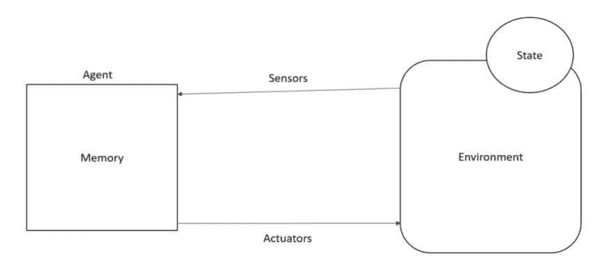

# 人工智能环境快速介绍。

> 原文:[https://dev . to/will velida/a-quick-introduction-to-artificial-intelligence-environments-23o](https://dev.to/willvelida/a-quick-introduction-to-artificial-intelligence-environments-23o)

人工智能程序也可以称为**“智能代理”**，它们与不同类型的环境进行交互。智能体与环境的交互主要有两种方式:**感知**和**动作**。

在人工智能中，感知是将环境中的事物转化为内部表示的过程，而行动由智能体执行时，会改变环境。如果我们使用人工智能在金融中的例子，我们可以说，交易代理通过利率消息的形式感知市场的环境因素，如股票市场或商品市场。从人工智能的角度来看，新闻就是我们所说的“T0”传感器“T1”。传感器是代理用来从他们的环境中获取事物来执行他们的感知。交易代理可以使用该信息根据他们从传感器感知的信息进行交易，以影响市场使其对他们有利。交易就是我们所说的“**致动器**，因为交易是代理为了影响市场而采取的行动。

在人工智能中，这个周期被称为感知动作周期(*在*下面表示):

[T2】](https://res.cloudinary.com/practicaldev/image/fetch/s--EZ2NNPRC--/c_limit%2Cf_auto%2Cfl_progressive%2Cq_auto%2Cw_880/https://thepracticaldev.s3.amazonaws.com/i/kw509mr729xwyoeucyss.PNG)

当然，我们所考虑的环境将完全取决于主体的边界。虽然知道环境的终点和智能体的起点有时很复杂，但我们可以对环境进行分类，以预测人工智能任务的难度。

**完全可观察到的**

每当您的代理需要做出最佳决策时，都可以确定环境的完整状态。例如，一个跳棋游戏可以被归类为完全可观察的，因为代理可以观察游戏的完整状态(对手有多少棋子，我们有多少棋子等等。)

**部分可观察到的**

与完全可观察的环境相比，主体可以记忆过去的决策，以便在其环境中做出最佳选择。这方面的一个例子可以是扑克游戏。代理可能不知道对手有什么牌，并且必须根据对手打出的牌来做出最佳决策。

**确定性**

确定性环境是指你的代理人的行为唯一地决定了结果。举个例子，如果我们下棋时有一个棋子，我们把这个棋子从 A2 移动到 A3，这总是可行的。这一举措的结果没有不确定性。

**随机**

与确定性环境不同，这里涉及到一定程度的随机性。以我们的扑克游戏为例，当发牌时，抽取哪张牌存在一定的随机性。

**离散**

在离散的环境中，我们有有限的行动选择——以及有限的我们能感知的事物。再次使用我们的 checkers 示例，在 checkers 环境中，棋盘位置是有限的，我们可以做的事情也是有限的。

**连续**

在连续的环境中，我们的代理可以感知许多动作。将此应用于医疗环境，患者的体温和血压是连续变量，可以被医疗代理感知，用于捕捉患者的生命体征，然后向医疗保健专业人员建议诊断措施。

**良性**

在良性环境中，环境本身没有与你的目标相矛盾的目标。例如，当下雨时，它可能会破坏你玩板球的计划(伟大的游戏，我保证)，但它不下雨只是因为雷神不想让你玩板球。它是通过与你的目标无关的因素来实现的。

**对抗性**

另一方面，敌对的环境确实会出来抓你。这在游戏中很常见，比如视频游戏中，老板和敌人会出来破坏你获得高分的计划，或者在象棋中，人工智能会出来将死你。

这只是对人工智能或代理可能运行的环境类型的一个快速和基本的概述。如果您想更深入地了解某个特定的环境，我建议您四处看看，但是希望本文已经为您提供了一个良好的起点。也许当我更好地理解这些概念时，我会更详细地解释它们。