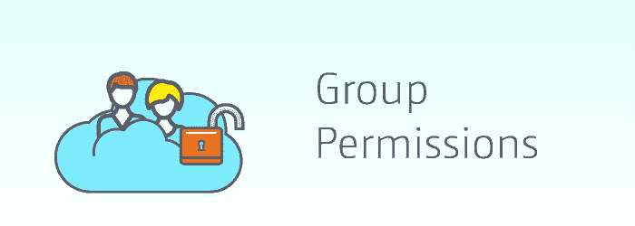
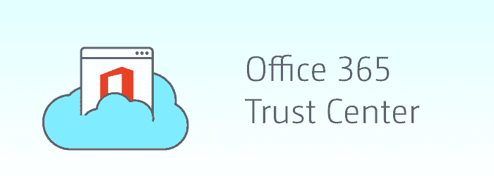

# 让您的 SharePoint 像银行一样安全

> 原文：<https://dev.to/nishthasinghuk/keep-your-sharepoint-as-secure-as-your-banks-58d>

不管我们对进化和适应有多么贪得无厌；恐惧仍然是一个巨大的障碍，尤其是在将数据转移到云中的时候。几家公司仍在考虑如何将其庞大的内部 SharePoint 环境迁移到 SharePoint online。即使在成功迁移内容后，项目仍有可能以灾难告终，尤其是如果公司未能对敏感数据应用适当的安全性、合规性和治理控制。最近的一项研究发现，90%的决策者认为云服务的增加将导致更大的违规发生概率。

云已经存在了很多年，但许多 IT 专业人士仍然对他们的云提供商(即较小的基于云的工具)的合规性标准持怀疑态度。对于那些对云安全一无所知的人来说，必须知道它主要取决于两件事

~提供商
~您如何管理贵公司对环境的访问和使用？

*让我们以 Office 365 和 SharePoint Online 为例*

在微软，该公司在云安全方面有着良好的记录。此外，他们的信任中心让您随时了解公司如何管理云的所有最新动态和信息。不知何故，责任也落在了你的身上，因为不同的公司可以访问自己的合规中心，在那里可以管理和更改安全设置。

**与 SharePoint Online 相关的主要安全问题是什么？**

SharePoint Online 是 Office 365 的一部分，作为 SharePoint 技术的“云版本”运行。使用任何基于云的解决方案的最大优势之一是，它减少了您在内部托管和维护服务器的需求。这意味着您的 IT 员工将减少维护时间，增加运营时间。

现在，当在云上存储数据时，您可能会失去对如何管理和维护这些服务器的一些控制。这可能会让 IT 经理有点麻烦。这并不意味着 SharePoint online 是一个有风险的平台。可以肯定地说，微软的数据中心比你大楼地下室的服务器有更好的防火墙和更强的一般保护。

除此之外，将数据存储在云中意味着任何有密码的人都可以更容易地访问您的环境并获取您的数据，也就是说，他们不必与您的服务器在同一栋大楼中。

那么，面对令人头疼的挑战和回报丰厚的结果，企业家如何生存和发展呢？

## 管理 SharePoint Online 安全的 3 个技巧

### 提示#1 与外部/第三方用户共享您的 SharePoint Online 内容

[T2】](https://res.cloudinary.com/practicaldev/image/fetch/s--wI5O3UKY--/c_limit%2Cf_auto%2Cfl_progressive%2Cq_auto%2Cw_880/https://media.share-gate.com/app/uploads/2014/09/sponlinesecuritybp-img1-1.png)

在 SharePoint 2013 出现之前，向环境中添加外部用户将是一个非常复杂的过程。需要在个人基础上添加它们，以便添加到活动目录中，或者就此咨询[基础良好的 SharePoint 开发公司](https://www.tatvasoft.co.uk/technology/sharepoint-development.php)。

有了 Office 365，事情开始变得更好。现在，SharePoint 内容可以通过以下三种方式之一与外部用户共享

~可以使用 Microsoft Office 365 ID 或 Microsoft 帐户共享网站
~可以使用 Microsoft Office 365 ID 或 Microsoft 帐户共享单个文档
~可以向文档发送直接的访客链接，以便对特定文档授予匿名访问权限

早些时候，office 365 网站内的外部用户数量曾有限制，但微软最近宣布取消了对外部用户数量的限制。太棒了，不是吗！

### 提示 2 在 SharePoint Online 中管理组权限

[T2】](https://res.cloudinary.com/practicaldev/image/fetch/s--Es8XfekJ--/c_limit%2Cf_auto%2Cfl_progressive%2Cq_auto%2Cw_880/https://media.share-gate.com/app/uploads/2014/09/sponlinesecuritybp-img2-1.png)

很长一段时间以来，SharePoint 内部的安全设置要么应用于单个用户，要么应用于 SharePoint 组。其中一个主要区别是管理组的权限要容易得多。例如，当许多站点必须与人力资源部门共享时，这可以通过向每个用户授予权限或者通过与一个组共享数据来实现。

现在，当一名人力资源员工离职时，他们需要撤销个人权限。而管理一个组的权限，只需将用户从该组中删除即可。

在 SharePoint Online 中，同样的逻辑也适用-所以只要确保你坚持这样做，并且在员工离开公司时有一个适当的流程。

### 提示#3 办公室 365 信任中心

[T2】](https://res.cloudinary.com/practicaldev/image/fetch/s--5TXiSB0t--/c_limit%2Cf_auto%2Cfl_progressive%2Cq_auto%2Cw_880/https://media.share-gate.com/app/uploads/2014/09/sponlinesecuritybp-img3-1.png)

该公司非常清楚这样一个事实，即信任是在云中存储数据的最大问题之一。存储在“内部”系统中的数据可以由内部 IT 人员进行保护，这样可以提高可信度，即使这种解决方案仍然存在一定程度的风险。这实际上是一个令人担忧的前景。

为了提供帮助，微软创建了一个名为“Office 365 信任中心”的独立网站，涵盖了与安全相关的所有内容。这包括:

~ **物理安全**:人们可以在数据中心进出吗？建筑物的物理安全是如何保证的？
~ **逻辑安全**:服务器是如何配置的，应用了什么网络安全，实施了什么审计？
~ **数据安全**:实际数据是如何保护的？万一有人获得了数据库的访问权限，他们能够读取你的数据吗？

**结束注释**

对于使用 Office 365 等基于云的解决方案的公司来说，安全性是一个主要问题。它被认为是最安全的，几乎肯定比大多数公司的标准防火墙更安全。当然，使用 SharePoint Online 确实会给你带来各种风险，但是它提供的工具意味着系统管理员和用户应该能够有效地控制数据。