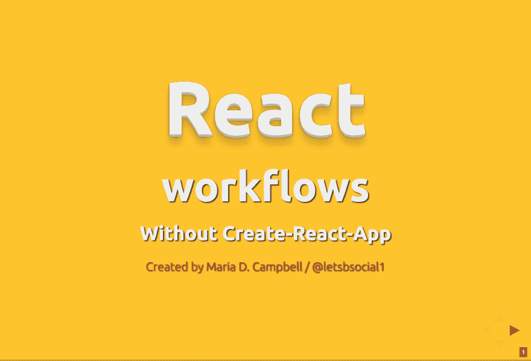

# 今晚我做了第一次演讲

> 原文:[https://dev . to/letsbsocial 1/I-give-my-first-presentation-night-bgk](https://dev.to/letsbsocial1/i-gave-my-first-presentation-tonight-bgk)

[T2】](https://res.cloudinary.com/practicaldev/image/fetch/s--ROEdkw4X--/c_limit%2Cf_auto%2Cfl_progressive%2Cq_auto%2Cw_880/https://thepracticaldev.s3.amazonaws.com/i/xew3cy6r7bwbo5c72ju9.jpg)

[React 工作流，不创建 React 应用](https://interglobalmedia.github.io/react-workflow-presentation/)

今晚我做了我的第一个技术演示(有史以来)，它是关于在不使用`create-react-app`的情况下创建你自己的 ***反应工作流*** 。一开始我很紧张，但一两分钟后，我放松下来，骑着它。17 分钟后，我被告知只剩 5 分钟了，我还有 11 分钟。我算了好几次，把时间缩短到了 28 分钟。呀！好吧，我很冷静，跳过了一部分，转到配置 **POSTCSS** 的部分，然后是为 **React** 配置 **Jest** 。幸运的是，我以这样一种方式写了这个演示文稿，即使我可能跳过了一部分，人们仍然可以在线参考整个内容，而不会错过任何内容。

我知道，对于大多数开发人员来说，谈论在没有`create-react-app`的帮助下从零开始创建自己的 ***自己的*** **React 工作流**，并且剖析每个步骤可能根本不是 ***【性感】*** 。然而，我强烈地想要展示它。我从自己的经验中知道，开发一个好的自动化工作流是困难的，需要很长时间来掌握和完善。这也是开发人员不想花太多时间去了解其本质的领域。我们寻找可以复制的快速样板或完整的工作流程，但并不真正理解为什么和如何工作。工作流程深潜是指抽出时间学习 ***性感*****JS****JSX****反应**，或者最新的 **GraphQL** 或者**阿波罗**。但是从长远来看，这些工作流程为我们节省了大量时间。理解这些自动化工作的方式和原因也允许我们扩展我们的开发工具包和视野。

我觉得与他人分享一些我长期积累的与**反应**相关的`webpack fundamentals`很重要，这样他们就能睁开眼睛看到他们可以利用的可能性。我也非常感谢 [ReactNYC](https://twitter.com/NYCReact) 团队给我今晚演讲的机会！

[React 工作流，不创建 React 应用](https://interglobalmedia.github.io/react-workflow-presentation/)