# ES6 第 1 部分的新增功能

> 原文:[https://dev.to/taiwo_xyz/whats-new-in-es6-part-1-9im](https://dev.to/taiwo_xyz/whats-new-in-es6-part-1-9im)

好了，我们已经听说 ES6 有一段时间了，你可能想知道这是什么..别害怕。它仍然是你所知道的 JavaScript，只是增加了一些新特性，让你编写更少的代码。很棒吧？不用浪费太多时间，我们就能看到那些新特性是什么。新功能将分三部分来讨论。这将是第一部分。

字母和常量声明

这些允许我们声明变量而不是传统的“var 关键字”。“let”实际上取代了“var ”,而“const”是一种新的声明类型。“字母”允许我们有块级作用域，这意味着如果我们在全局作用域中声明一个“字母”变量，而我们在循环或 if 语句中使用同一个变量，它将完全不同，并在它自己的作用域中，这对于一些开发人员来说是一种痛苦。“const 只是常量值的声明，即在任何时候都不会改变的值。
让我们来看看“var”和“Let”有什么不同。

[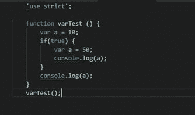T2】](https://res.cloudinary.com/practicaldev/image/fetch/s--PPbr1t5l--/c_limit%2Cf_auto%2Cfl_progressive%2Cq_auto%2Cw_880/https://cdn-images-1.medium.com/max/800/1%2A9Fj7Ml8R-m0a-lGbJ40kfA.png)

输出:

[T2】](https://res.cloudinary.com/practicaldev/image/fetch/s--zZKV09At--/c_limit%2Cf_auto%2Cfl_progressive%2Cq_auto%2Cw_880/https://cdn-images-1.medium.com/max/800/1%2AX6mW3XhQZRHWZI7cX9M6cw.png)

为什么会这样呢？

在第一次初始化时，“a 是 10。当满足 if 条件时，对于第一个 console.log，它获取局部变量的值，从而输出 50，这是正确的，但是对于第二个 console.log，即使在条件的局部范围中创建了新的变量 a，它也会在全局范围内更改该变量的值，从而将其从 10 更改为 50，这可能不是我们期望的输出。让我们看看 Let 将如何处理这个问题。

[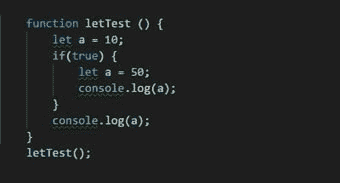T2】](https://res.cloudinary.com/practicaldev/image/fetch/s--MX97QdVM--/c_limit%2Cf_auto%2Cfl_progressive%2Cq_auto%2Cw_880/https://cdn-images-1.medium.com/max/800/1%2A23vtg7ltH6_Dfoveci_Csg.png)

输出:

[T2】](https://res.cloudinary.com/practicaldev/image/fetch/s--z-mvQpwZ--/c_limit%2Cf_auto%2Cfl_progressive%2Cq_auto%2Cw_880/https://cdn-images-1.medium.com/max/800/1%2AQBUlyMVba5-rSg8M5PPSyA.png)

为什么会这样呢？

在第一次初始化时，“a 是 10。当满足 if 条件时，对于第一个 console.log，它采用本地范围变量的值，从而输出正确的 50。因为我们使用了“let ”,它不允许块作用域覆盖全局作用域，所以在这种情况下，一旦条件语句完成，局部作用域就完成了，一旦我们尝试执行第二个 console.log，它就会获取全局作用域中变量的值，这正是我们想要的。让我们看看循环中的“Let”和“var”。

[T2】](https://res.cloudinary.com/practicaldev/image/fetch/s--fKAsfoF_--/c_limit%2Cf_auto%2Cfl_progressive%2Cq_auto%2Cw_880/https://cdn-images-1.medium.com/max/800/1%2AeuIXHq7OTT-oV3au93SQLQ.png)

输出:

[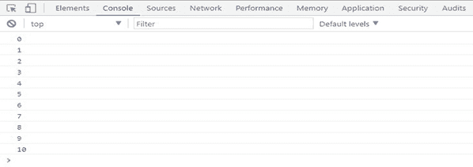T2】](https://res.cloudinary.com/practicaldev/image/fetch/s--1fgXU7wK--/c_limit%2Cf_auto%2Cfl_progressive%2Cq_auto%2Cw_880/https://cdn-images-1.medium.com/max/800/1%2AGB6j7zUahw8OKFpW1nGx9w.png)

看看上面的代码片段，如果我们注释掉第二个 console.log，我们的输出在 9 处停止，但是对于第二个 console.log，输出变为 10。这是因为 I 变量影响了作用域外的定义，从而允许第二个 console.log 再次进入循环，这不是我们想要的。看看“let”做了什么。

[T2】](https://res.cloudinary.com/practicaldev/image/fetch/s--SB3uG0s6--/c_limit%2Cf_auto%2Cfl_progressive%2Cq_auto%2Cw_880/https://cdn-images-1.medium.com/max/800/1%2AUUFjfJoJIzmA4Hz9tgejJQ.png)

输出:

[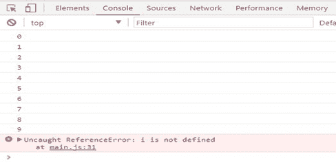T2】](https://res.cloudinary.com/practicaldev/image/fetch/s--Qz1Kgko2--/c_limit%2Cf_auto%2Cfl_progressive%2Cq_auto%2Cw_880/https://cdn-images-1.medium.com/max/800/1%2ApTvbU1nHnPQHUyq9w4Wj0g.png)

如果考虑上面的输出，您会注意到第一个 console.log 的本地范围保持不变，当第二个 console.log 试图访问在循环(块声明)中定义的同一个变量时，会收到一条错误消息，指出变量“我没有被定义，这正是应该发生的。

常量声明。

“const”声明用于简单地将常量值赋给变量。分配后，包含的值不能更改。让我们来看看这是如何工作的。

[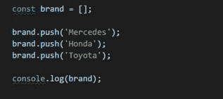T2】](https://res.cloudinary.com/practicaldev/image/fetch/s--ZB3ACziw--/c_limit%2Cf_auto%2Cfl_progressive%2Cq_auto%2Cw_880/https://cdn-images-1.medium.com/max/800/1%2AaoqEv4zk9Ww2odpgVo2PZg.png)

输出:

[T2】](https://res.cloudinary.com/practicaldev/image/fetch/s--r_dj258v--/c_limit%2Cf_auto%2Cfl_progressive%2Cq_auto%2Cw_880/https://cdn-images-1.medium.com/max/800/1%2AOr-SZ_527kErd4tSR7vh5w.png)

我们已经声明我们的品牌是一个常量变量，并且我们已经使用了 push 方法来为我们的数组赋值。现在让我们试着改变一个数组的品牌声明。

[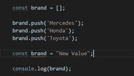T2】](https://res.cloudinary.com/practicaldev/image/fetch/s--UQiGg4Oj--/c_limit%2Cf_auto%2Cfl_progressive%2Cq_auto%2Cw_880/https://cdn-images-1.medium.com/max/800/1%2AHA_HNsHusMjPYq9PWnJUFw.png)

输出:

[T2】](https://res.cloudinary.com/practicaldev/image/fetch/s--Q5xOOVDz--/c_limit%2Cf_auto%2Cfl_progressive%2Cq_auto%2Cw_880/https://cdn-images-1.medium.com/max/800/1%2AFLaIGZmutoj4bnqxteI6lA.png)

我们可以看到，每当我们试图改变“常量变量”的声明类型时，都会得到一个错误。这就是使用“let 和”常量声明的基本用处。是作品。

类和继承。

类现在可以用普通的旧 JavaScript 实现，所以我们不需要 typescript 或任何类似的东西。它非常类似于 PHP 或 Java 类或任何使用类的 OOP 语言。让我们跳进去做一些关于类和继承的事情。

[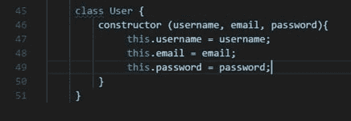T2】](https://res.cloudinary.com/practicaldev/image/fetch/s--tnOoJtTh--/c_limit%2Cf_auto%2Cfl_progressive%2Cq_auto%2Cw_880/https://cdn-images-1.medium.com/max/800/1%2AfhMJr_2ugO0nAnT2Dyea7A.png)

上面的代码片段是一个类和一个构造函数的基本创建。构造函数是类被实例化或对象被创建时运行的方法。他们可以接受参数。在这种情况下，参数是用户名、电子邮件和密码。

在第 47 到 49 行，我们所做的是接受传递的值(参数)并将它们分配给类的属性。

下一步是在我们的类中创建一个方法。方法基本上是属于一个类的函数。

[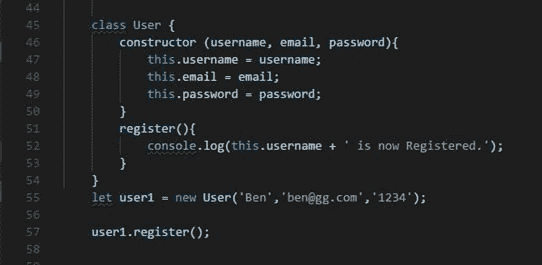T2】](https://res.cloudinary.com/practicaldev/image/fetch/s--oBMXLmXM--/c_limit%2Cf_auto%2Cfl_progressive%2Cq_auto%2Cw_880/https://cdn-images-1.medium.com/max/800/1%2A5B6gYf40gHch_kOyKrI53Q.png)

输出:

[T2】](https://res.cloudinary.com/practicaldev/image/fetch/s--sb_TBFjI--/c_limit%2Cf_auto%2Cfl_progressive%2Cq_auto%2Cw_880/https://cdn-images-1.medium.com/max/800/1%2Ay0Ijz0rmcPjoVqBmXwP9sw.png)

我们的注册方法是在第 51 行创建的。我们在控制台中所做的只是获取属性值，并将其与另一个字符串连接起来，然后在调用函数时打印出该值。第 55 行创建了一个 User 类的对象，传递了一些默认参数。

在第 57 行，我们调用函数，我们可以看到预期的输出。在 register 方法中，您可以传入该类的其他属性值来查看自己的输出。

我们也可以使用静态方法。要做到这一点，我们所要做的就是使用关键字“静态”。

[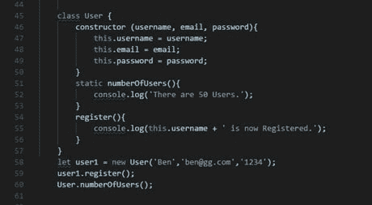T2】](https://res.cloudinary.com/practicaldev/image/fetch/s--vszuFCbe--/c_limit%2Cf_auto%2Cfl_progressive%2Cq_auto%2Cw_880/https://cdn-images-1.medium.com/max/800/1%2ANS3-nan04sd9tToSC9A2Nw.png)

有些方法可以静态使用，有些则不能。比如说。在上面的例子中，register 方法不能用作静态方法，因为你需要实例化一个对象来执行或调用它，但是在 numberOfUsers 方法的情况下，无论如何都是一样的。

它所要做的就是回应出用户的数量。对于静态方法，它们不需要被实例化。因此，要调用它们，您所要做的就是上面的第 60 行。

输出:

[T2】](https://res.cloudinary.com/practicaldev/image/fetch/s--nVyLv8PT--/c_limit%2Cf_auto%2Cfl_progressive%2Cq_auto%2Cw_880/https://cdn-images-1.medium.com/max/800/1%2Ash4Q_CyDW-mGY9kd3tFq_Q.png)

我们也可以在 JavaScript 中利用继承。利用上面的同一个例子，让我们创建一个成员类，它继承 User 类的属性，然后拥有自己的额外参数。

[T2】](https://res.cloudinary.com/practicaldev/image/fetch/s--fImwzDjv--/c_limit%2Cf_auto%2Cfl_progressive%2Cq_auto%2Cw_880/https://cdn-images-1.medium.com/max/800/1%2As4_VWMY3Eu06RypcW6KgxA.png)

在上面的代码片段中，我们创建了一个成员调用并扩展了用户类，这意味着我们获取了用户类的特性并将它们添加到成员类中，即使成员类有自己的额外参数(bouquetType)。

在第 64 行，我们可以使用 super 方法，而不是像在 User 类中那样使用“this”关键字来添加属性。这样做的目的是获取超类(User)的属性，并将它们分配给新的成员类。第 65 行帮助向成员类添加一个新属性。

我们现在想尝试从新成员类中获取项目。

[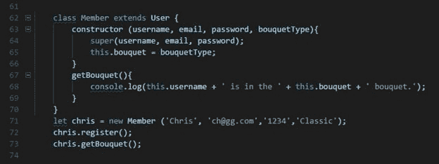T2】](https://res.cloudinary.com/practicaldev/image/fetch/s--vXYkKvAM--/c_limit%2Cf_auto%2Cfl_progressive%2Cq_auto%2Cw_880/https://cdn-images-1.medium.com/max/800/1%2AAlueC_jfoCmt4ZKPuxbMJQ.png)

第 67 行是我们用来从类中获取项目的方法。这类似于我们前面解释的 register 方法。

在第 71 行，我们从 Member 类创建了一个 chris 对象。在第 72 行，我们调用了一个不在类成员中的方法(register)。这仍然可以很好地工作，因为我们继承了 User 类的所有属性，所以我们仍然可以访问 User 类中定义的方法。

最后一行是我们定义的 getBouquet 方法的方法调用。

输出:

[T2】](https://res.cloudinary.com/practicaldev/image/fetch/s--c--hmFdj--/c_limit%2Cf_auto%2Cfl_progressive%2Cq_auto%2Cw_880/https://cdn-images-1.medium.com/max/800/1%2A9jihzJgifig1nUhbzI68Vw.png)

这就是 ES6 中类和继承的基本用法。

模板文字/字符串

模板文字比较容易掌握，特别是如果您不喜欢将字符串与数字、变量等连接起来，它会非常有用。

我们将在这里做一点 HTML 来处理模板文字。看看下面的 HTML 代码片段。这很简单。

[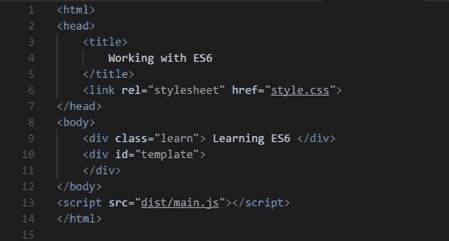T2】](https://res.cloudinary.com/practicaldev/image/fetch/s--LCs2w6uq--/c_limit%2Cf_auto%2Cfl_progressive%2Cq_auto%2Cw_880/https://cdn-images-1.medium.com/max/800/1%2ANHv9sHA0mEDYzmLFBpbhTw.png)

看一下第 10 行。我们有一个 id 为 template 的空 div。这就是我们要从 JavaScript 端填充内容的地方。现在让我们写出我们的 JavaScript。

[T2】](https://res.cloudinary.com/practicaldev/image/fetch/s--Txv8IZ8x--/c_limit%2Cf_auto%2Cfl_progressive%2Cq_auto%2Cw_880/https://cdn-images-1.medium.com/max/800/1%2AntWVwOSHrlAvXF1Hi8_qZA.png)

仔细看看上面的代码，您会注意到我们有两组引号组成了一个字符串，存储在模板变量中。h2 标签中的文本可以是变量，也可以是 p 标签中包含的文本。在普通 JavaScript 或 ES5 中，为了能够将它们合并成一个变量，我们必须使用加号(+)将它们连接在一起。如果我们有一个很长的项目要加入，那么它可能会开始看起来真的 buzzy 和所有可能不好看。然而，使用 ES6 中的模板文字，这使得事情变得非常容易和简单。查看下面的代码片段，并与上面的代码片段进行比较，两者都给出了相同的输出。

[T2】](https://res.cloudinary.com/practicaldev/image/fetch/s--dxbQKNsd--/c_limit%2Cf_auto%2Cfl_progressive%2Cq_auto%2Cw_880/https://cdn-images-1.medium.com/max/800/1%2A0Y0g-jp5Af5p1qdscrR58Q.png)

请注意代码的简单性以及阅读代码的容易程度。我们去掉了字符串每一行的单引号和加号(+)，并用反勾号替换了整个字符串值。反勾号是键盘上按钮 1 左侧的按钮。让我们做另一个例子，我们想绑定数据。假设我们想在一个变量中存储一些内容，然后将存储在变量中的值添加到字符串中。在我们普通的 JavaScript 中，我们是这样做的。

[T2】](https://res.cloudinary.com/practicaldev/image/fetch/s--0bnxWPdW--/c_limit%2Cf_auto%2Cfl_progressive%2Cq_auto%2Cw_880/https://cdn-images-1.medium.com/max/800/1%2ATCPJqp5n-Ok2rDXo51Bddg.png)

上面的片段只是一个基本的例子，所以你可能不会真正感受到使用模板文字的好处，但是当你开始有很长的字符串要连接时，工作就出来了。注意在第 9 行，我们不得不使用 3 个加号，几个单引号等等。当字符串变得很长时，你可能会省略一个或几个。用模板文字编写上面的代码要容易得多，不太可能那么容易出错。让我们看一下用模板文字编写的相同代码。

[T2】](https://res.cloudinary.com/practicaldev/image/fetch/s--Xq2PAXfK--/c_limit%2Cf_auto%2Cfl_progressive%2Cq_auto%2Cw_880/https://cdn-images-1.medium.com/max/800/1%2AH-2a5eL6cAJFbsWJB9LfKA.png)

如果您仔细看看上面的代码片段，您会发现它比前面的代码片段更不容易出错。整个字符串用 pt 括在一个单引号内，要传入的变量放在花括号内，用美元符号(${ })将它们括起来。使用这样的东西非常简单和直接。

我们也可以利用模板文本中的函数。让我们来看看如何做到这一点。

[T2】](https://res.cloudinary.com/practicaldev/image/fetch/s--pneYgVQj--/c_limit%2Cf_auto%2Cfl_progressive%2Cq_auto%2Cw_880/https://cdn-images-1.medium.com/max/800/1%2AAUN09BJ1Cy5AmBlFoAmB3g.png)

我打赌你已经知道我们的产量应该是多少。以防万一，给你。

输出:

[T2】](https://res.cloudinary.com/practicaldev/image/fetch/s--IWi0nsdv--/c_limit%2Cf_auto%2Cfl_progressive%2Cq_auto%2Cw_880/https://cdn-images-1.medium.com/max/800/1%2ACkB_fphnjX024rqAg3au9g.png)

这就是模板字面量。请继续关注 ES6 的更多新功能。
感谢阅读。