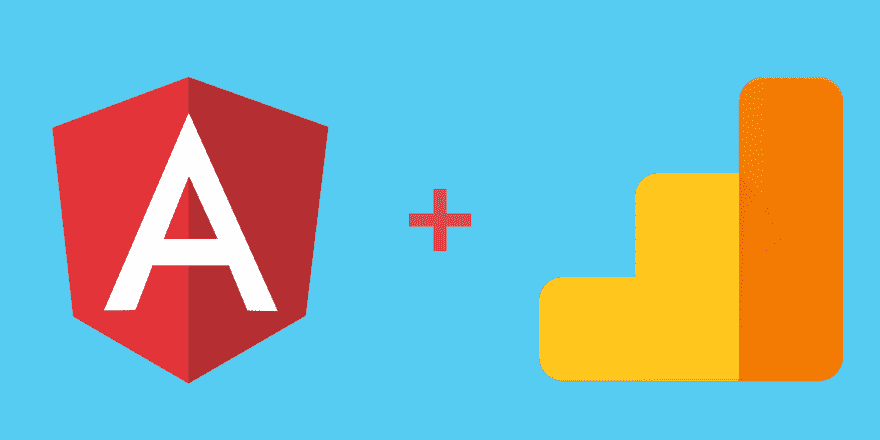
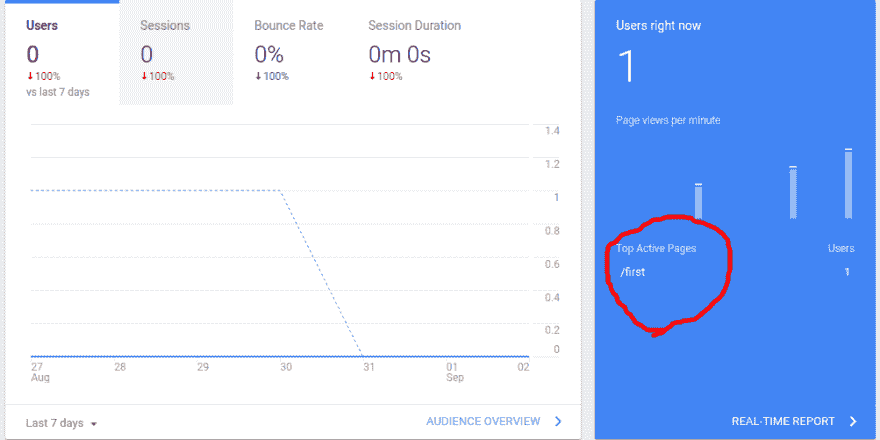

# 使用谷歌角度分析

> 原文:[https://dev . to/jordanirabor/using-Google-analytics-with-angular-930](https://dev.to/jordanirabor/using-google-analytics-with-angular-930)

[T2】](https://res.cloudinary.com/practicaldev/image/fetch/s--T0hFDrcU--/c_limit%2Cf_auto%2Cfl_progressive%2Cq_auto%2Cw_880/https://d2mxuefqeaa7sj.cloudfront.net/s_8B805E743D0128ACF618A871FEBA5C99CBD620659DA693C8FED388C4F0EC3EC1_1507892590270_Featured%2BImage%2B1.png)

众所周知，谷歌分析非常高效，并且易于集成到网络应用程序中。一旦安装完毕，它将发送访问者在网站上的导航历史的详细信息。

为传统 web 应用程序安装 Google Analytics 就像复制和粘贴新房产注册时提供的 JavaScript 跟踪代码片段一样简单。唯一需要的设置是将片段添加到要跟踪的`HTML`文件的`<head>`标签中，每个访问者的整个导航历史将会实时更新。

对于水疗中心来说，情况并非如此，设置谷歌分析需要更多的努力。

不要沉浸在粘贴代码片段的舒适中，因为单页面应用程序的时代正迫使开发人员和非开发人员都采用新的方法在其应用程序上实现 web 分析服务。

## 为什么 spa 差别这么大？

JavaScript 跟踪代码片段与传统的 web 应用程序配合得很好，因为每当加载新页面时，代码片段都是新运行的；因此，谷歌分析信息是为该页面更新的。对于没有发出实际整页请求的 SPA，`analytics.js`代码将只运行一次，用户导航信息将不会被正确跟踪。

在本文中，我们将编写应用程序来通知 Google Analytics 每个新页面的成功加载，并发送正确的页面信息。

Angular 是一个非常棒的 JavaScript 框架，用于开发单页面应用程序；它有一个健壮的路由框架，称为 UI-Router，负责根据应用程序的状态更新视图，本文将主要讨论如何有意识地编写 Angular 应用程序来支持 Google Analytics 服务。

源代码可以在 GitHub 的[这里](https://github.com/Jordanirabor/Using-Google-Analytics-with-Angular)找到。

下面是一个分步指南:

## 设置谷歌分析

我们首先建立一个谷歌分析账户，并在这里注册一个属性。

如果您在本地机器上安装了 Angular 和其他模块，请确保 UI-Router 模块也可用，因为我们将在初始化应用程序的主模块时将其作为模块依赖项注入。

如果您更愿意使用 Angular 和其他来自另一台计算机的模块，您可以在这个 [URL](https://ajax.googleapis.com/ajax/libs/angularjs/1.6.4/angular.min.js) 上获得 Angular，在这个 [URL](https://cdnjs.cloudflare.com/ajax/libs/angular-ui-router/1.0.3/angular-ui-router.js) 上获得 UI-Router 模块(出于本文的考虑，我将引用来自 CDN 的 Angular 及其模块)。

## 设置`head`标签

复制并粘贴 JavaScript 跟踪代码片段，其惟一的跟踪 ID 就在结束的`</head>`标签上方。

现在注释掉如下两行代码:

```
ga('create', 'UA-XXXXX-X', 'auto');

ga('send', 'pageview'); 
```

其中`UA-XXXXX-X`是您唯一的追踪 ID。

我们现在注释掉这些行，因为我们正在构建一个 SPA，而不是一个传统的应用程序，我们稍后会将它们包装在我们的 Angular 脚本的`run`块中，以确保当我们的应用程序开始运行时，它们只会基于应用程序状态的某些变化而被触发。

按照上面的说明，我们应该有一个类似于下面的`</head>`标签:

```
<html>
<head>
<script src="https://ajax.googleapis.com/ajax/libs/angularjs/1.6.4/angular.min.js"></script>
<script src="https://cdnjs.cloudflare.com/ajax/libs/angular-ui-router/1.0.3/angular-ui-router.js"></script>
<script>
  (function(i,s,o,g,r,a,m){i['GoogleAnalyticsObject']=r;i[r]=i[r]||function(){
  (i[r].q=i[r].q||[]).push(arguments)},i[r].l=1*new Date();a=s.createElement(o),
  m=s.getElementsByTagName(o)[0];a.async=1;a.src=g;m.parentNode.insertBefore(a,m)
  })(window,document,'script','https://www.google-analytics.com/analytics.js','ga');
</script>
</head>
</html> 
```

## 将正文设置为视图容器

首先，让我们了解 SPA 的视图部分是如何工作的；因为整个应用程序的行为就像是一个单独的页面，所以 Angular 将其他请求页面的内容加载到视图部分。我们可以把这个视图部分看作是主应用程序中的一个容器。为了帮助 Angular 识别我们的标记中的视图部分，我们将 UI-Router 模块的`ui-view`指令分配给一个 div 标签，就像这样:

```
<body ng-app="myApp">
<div ui-view>
<a ui-sref="first">This is the first page.</a>
<a ui-sref="second">This is the second page.</a>
<a ui-sref="third">This is the third page.</a>
<h1>{{ title }}</h1>
</div>
</body> 
```

上面的`body`部分看起来很简单，但它定义了定义角度应用程序和视图部分的基本结构。

## 配置应用

我们首先初始化主角度模块，并注入`UI-Router`作为模块依赖。

```
var app = angular.module("myApp", ['ui.router']); 
```

接下来，我们编写应用程序的配置块，并注入该应用程序所需的所有提供程序，结果如下:

```
app.config(['$urlRouterProvider', '$stateProvider', function($urlRouterProvider, $stateProvider){
      $urlRouterProvider.otherwise('/');
      $stateProvider
      .state('index', {
            url: '/',
            templateUrl: 'index.html',
            controller: function($scope){
            $scope.title = 'I am the root page, ergo, submit thyself to me.'
    }
  }) 
```

同样，这只是一个简单的演示，但它定义了实际应用程序应该如何设置。

最后，我们编写 Angular 应用程序的`run`块，以确保每当新页面加载到视图部分时，我们的应用程序都会向 Google Analytics 发送数据。我们通过在应用生命周期的运行阶段注入一些服务并使用它们的方法来做到这一点。

我们注入了`$location`服务，它将使用它的`path()`方法帮助我们确定浏览器的当前位置。

还记得我们上面注释掉的两行代码吗？我们很快就会需要它们，因为我们已经到达了我们之前谈到的跑道。

接下来，我们注入全局`$window`服务，这将为我们做的是:-触发我们在程序的`</head>`中注释掉的 ga(Google 分析对象)方法。

接下来，我们注入`$transitions`服务，它将帮助我们确定用户何时已经或正在转换到一个新状态。

最后，我们将所有这些服务及其方法结合起来，共同指示 Angular 在成功转换到新状态时向 Google Analytics 发送数据(包含浏览器当前位置的信息)。

下面是`run`块的代码:

```
app.run(['$location', '$window','$transitions', function($location, $window, $transitions){
        $window.ga('create', 'UA-XXXXX-X', 'auto');
        $transitions.onSuccess({}, function(){
              $window.ga('send', 'pageview', $location.path());
        });
}]) 
```

太棒了，现在每当我们的应用程序转换到一个新的状态，我们就会在 Google Analytics 仪表板上得到一个更新。在我的 web 浏览器上，我访问了我的应用程序，并导航到一个 URL 为`/first`的视图。

这是我的谷歌分析仪表板上的即时更新:

[T2】](https://res.cloudinary.com/practicaldev/image/fetch/s--B7hHcnSN--/c_limit%2Cf_auto%2Cfl_progressive%2Cq_auto%2Cw_880/https://cdn.scotch.io/40410/PVN2tZVwRyuJOuiuJinf_track.png)

## 结论

就这样，我们的应用程序现在被 Google Analytics 正确跟踪，我们可以实时更新我们 web 应用程序访问者的导航历史。它只需要一点点的修改，但在确保我们保持控制和了解我们的用户方面有很大的帮助！