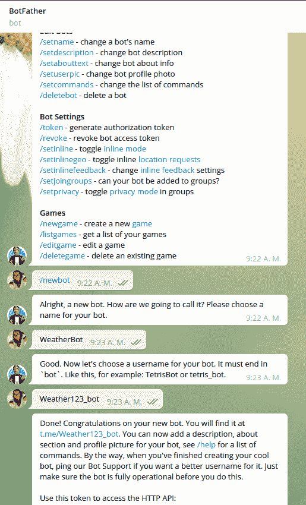
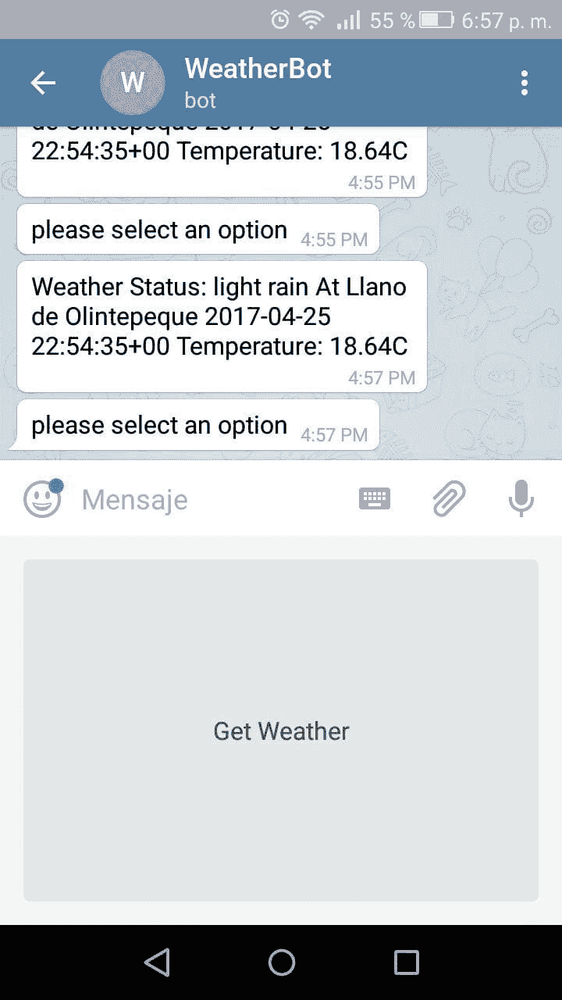

# 在 10 分钟内开发出一个基本的 Chatbot

> [https://dev . to/valeribriz/developing-un-chatbot-basic-en-10 分钟-4g7p](https://dev.to/valerybriz/desarrollando-un-chatbot-basico-en-10-minutos-4g7p)

[T2】](https://res.cloudinary.com/practicaldev/image/fetch/s---eUr1wqL--/c_limit%2Cf_auto%2Cfl_progressive%2Cq_auto%2Cw_880/https://cdn-images-1.medium.com/max/1024/1%2AmGTvd048DOdqa_qy2om0AA.jpeg)

### 你对小猫感兴趣吗？你不知道从哪里开始？

有时最好的开始方法是尝试它，这是一个简单实用的东西，在相同的开发过程中，它会教你，同时让你知道你以后可能会得到什么。

### 所以我们来了！

对于本教程，我们将使用电报作为我们的 chatbot 和 Python 的平台作为开发语言，这样我们就可以快速而轻松地实现我们的目标。

好的。我们首先需要一个令牌来使用我们的 bot，所以我们就去电报查询，向它发送/newbot 命令

[T2】](https://res.cloudinary.com/practicaldev/image/fetch/s--_OG_8ob6--/c_limit%2Cf_auto%2Cfl_progressive%2Cq_auto%2Cw_880/https://cdn-images-1.medium.com/max/515/1%2ALbH3SDzX5tPWN0fYrfGefQ.png)

然后，您将询问 Bot 的名称和 ID(请注意 Bot 的 ID/Username 不能重复，因此您必须选择一个唯一的 ID，通常在结尾带有 bot 一词)，在最后一个问题中，您将使用令牌和 Url 回答我们，以便与 bot 进行对话。

令牌看起来是这样的:**123456:ABC-def 1234 ghkl-zyx 57 w1 U2 u1 u 123 ew 11**，从现在起，我们就简单地用**来指它。**

 **现在复制令牌并粘贴到安全的地方，我们即将使用它。

如果您还没有安装 Python，您可以到 [https://www.python.org/](https://www.python.org/) 下载并安装。

中间有大量对 Python 和 telegraph-bots 有用的 API，如果您想了解更多信息，可以转到:

[https://github.com/python-telegram-bot/python-telegram-bot](https://github.com/python-telegram-bot/python-telegram-bot)

此时，我们将使用此 API，它相当全面且易于使用:

[https://github.com/datamachine/twx.botapi](https://github.com/datamachine/twx.botapi)

我们先通过 pip 安装它。

```
pip install twx.botapi 
```

Enter fullscreen mode Exit fullscreen mode

现在，我们需要一个 API，通过使用 Open Weather Map 来告诉我们所需位置的气候:

[https://github.com/csparpa/pyowm](https://github.com/csparpa/pyowm)T2】

```
pip install pyowm 
```

Enter fullscreen mode Exit fullscreen mode

要使用它，需要一个 key API，您可以在以下位置找到它:

[http://openweathermap.org/appid](http://openweathermap.org/appid)

从现在起，我们将把重点 api 称为

【此 API 为我们提供了云量、风量、温度等数据，以及一些关于我们发送到它的地点的气候的其他细节。

### 完美！我们准备好了！

```
# -\*- coding: utf-8 -\*-
#python2.7 import sys
from time import sleep
from twx.botapi import TelegramBot, ReplyKeyboardMarkup #Telegram Bot API import traceback
from pyowm import OWM #API del Clima 
"""
Inicializamos nuestro Bot y el API del Clima
"""
TOKEN = <token>
OWMKEY = <OWMKEY>

bot = TelegramBot(TOKEN) 
bot.update_bot_info().wait() #Esperamos por un mensaje entrante print bot.username 
last_update_id = 0 
def process_message(bot, u): #Este es el procedimiento que se ejecuta al llegar un mensaje 
    #Vamos a utilizar un Teclado customizado 
    keyboard = [['Get Weather']] #Al teclado le agregaremos un Boton de Obtener el clima 
    reply_markup = ReplyKeyboardMarkup.create(keyboard) #Aqui creamos el teclado 
    if u.message.sender and u.message.text and u.message.chat: #Si el mensaje tiene un chatID y un contenido de texto entonces lo identificamos como texto
        chat_id = u.message.chat.id 
        user = u.message.sender.username
        message = u.message.text 
        print chat_id 
        print message 
        if message == 'Get Weather': #Si el usuario esta enviando el comando correcto para obtener el clima entonces preguntamos su ubicación 
            bot.send_message(chat_id, 'please send me your location') 
        else: 
            bot.send_message(chat_id, 'please select an option', reply_markup=reply_markup).wait() #Si no contiene el comando entonces mostramos las opciones de nuevo 
    elif u.message.location: #Si el mensaje contiene una ubicación entonces generamos el clima en ese sitio 
        print u.message.location 
        chat_id = u.message.chat.id 
        owm = OWM(OWMKEY) #inicializamos el API del clima
        obs = owm.weather_at_coords(u.message.location.latitude, u.message.location.longitude) #creamos un observation 
        w = obs.get_weather() #creamos un objeto Weather como w 
        print(w) # <Weather - reference time=2013-12-18 09:20, status=Clouds> 
        l = obs.get_location() # creamos una ubicacion respecto al objeto weather 
        status = str(w.get_detailed_status()) 
        placename = str(l.get_name()) 
        wtime = str(w.get_reference_time(timeformat='iso')) 
        temperature = str(w.get_temperature('celsius').get('temp'))
        bot.send_message(chat_id, 'Weather Status: ' +status +' At '+placename+' ' +wtime+' Temperature: '+ temperature+ 'C') #Enviamos la respuesta con el clima
        bot.send_message(chat_id, 'please select an option', reply_markup=reply_markup).wait() #enviamos de nuevo el teclado para que lo muestre en pantalla
    else: 
        print u bot.send_message(chat_id, 'please select an option', reply_markup=reply_markup).wait() 

while True: #Este loop sirve para esperar por los mensajes entrantes
    updates = bot.get_updates(offset = last_update_id).wait() #esperamos y obtenemos el mensaje
    try: 
        for update in updates: #obtenemos los datos del mensaje
            if int(update.update_id) > int(last_update_id): #si el mensaje que estamos recibiendo es nuevo entonces, procesarlo
                last_update_id = update.update_id 
                process_message(bot, update) #lo enviamos a la función que lo procesa 
                continue 
        continue 
    except Exception: 
        ex = None 
        print traceback.format_exc() 
        continue 
```

Enter fullscreen mode Exit fullscreen mode

现在我们可以保存并运行它

如果一切都是正确的，那么你会得到这样的东西:

[T2】](https://res.cloudinary.com/practicaldev/image/fetch/s--xYUeegFn--/c_limit%2Cf_auto%2Cfl_progressive%2Cq_auto%2Cw_880/https://cdn-images-1.medium.com/max/720/1%2ACh7mPI9T-6lJRekyPBp5Qw.jpeg)

太好了！现在你应该多读一点，加入一些图片和互动到 BOT，**但是到目前为止，我们有了我们新的、勉强运作的 bot，它是有用的！**

如果您想了解更多有关此 api para bots 的信息，请访问以下位置的文档页面:

[https://pythonhosted.org/twx/twx/botapi/botapi.html](https://pythonhosted.org/twx/twx/botapi/botapi.html)

你也可以在这里找到一些气候 API 的例子:

[https://github . com/cs parpa/pyo WM/blob/master/pyo WM/docs/usage-examples . MD](https://github.com/csparpa/pyowm/blob/master/pyowm/docs/usage-examples.md)

希望对你有用！

* * ***