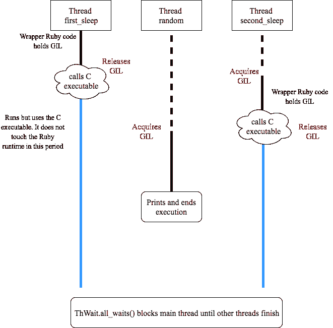
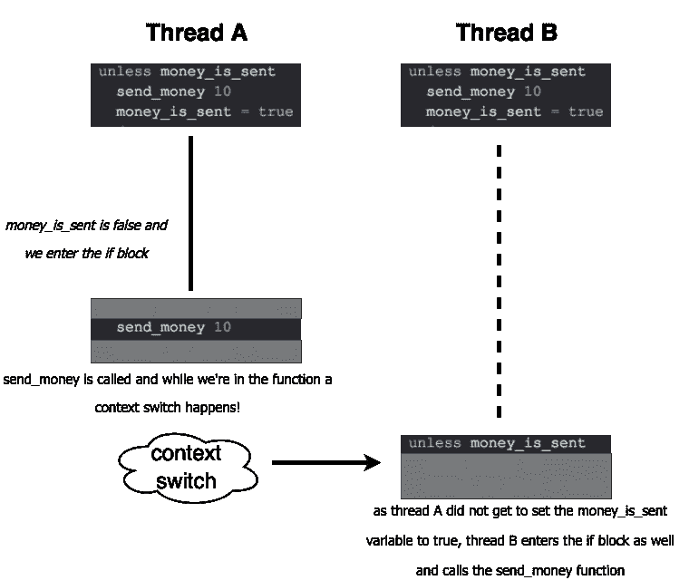
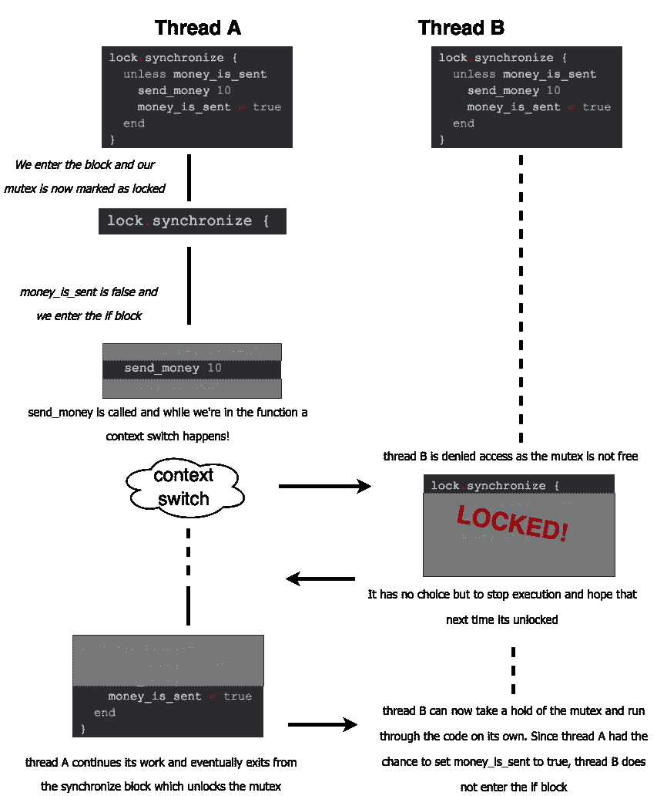
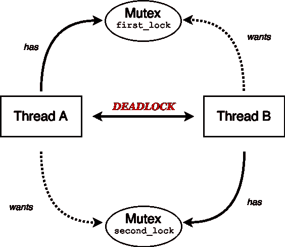

# 使用多线程 Ruby 第一部分

> 原文:[https://dev . to/ene ther/working-with-threaded-ruby-part-I-cj3](https://dev.to/enether/working-with-multithreaded-ruby-part-i-cj3)

# 简介

多线程 Ruby 是我们社区的一个小主题，这并不奇怪。大多数 Ruby 应用程序都是基于 Rails 或 Sinatra 构建的 web 服务器，这些都是单线程框架，开发人员甚至很少需要了解线程，[因为框架通常会支持你](http://edgeguides.rubyonrails.org/active_job_basics.html)。

即使您不使用它，在 Ruby 这样的解释型语言中，多线程的一些基本知识(及其基本概念)肯定会在您的职业生涯中派上用场。

我假设你知道 **GIL** (全局解释锁)。如果你不知道它是什么，你可以阅读我的文章[鲁比的 GIL 一言以蔽之](https://dev.to/enether/rubys-gil-in-a-nutshell)

# GIL！=世界末日

尽管它限制了并行性，Ruby 的 GIL 并没有完全阻止它。我们知道，它的存在是为了守护解释者的内部状态。因此，**它只适用于 Ruby 操作**。在我们日常的代码中，有很多操作不是 Ruby 解释器的工作。

I/O 操作就是一个很好的例子。在等待外部服务加载某些东西时，没有必要持有 GIL，因为这个外部服务不会损害我们的内部状态。Ruby 的 PostgreSQL 库是用 C 语言编写的，它对数据库查询的方法调用释放了 GIL。下面的例子说明:

```
require 'thwait'
require 'pg'

start = Time.now

first_sleep = Thread.new do
  puts 'Starting sleep 1'
  conn = PG::Connection.open(dbname: 'test')
  conn.exec('SELECT pg_sleep(1);')
  puts 'Finished sleep 1'
end

second_sleep = Thread.new do
  puts 'Starting sleep 2'
  conn = PG::Connection.open(dbname: 'test2')
  conn.exec('SELECT pg_sleep(1);')
  puts 'Finished sleep 2'
end

random = Thread.new do
  puts 'In a random thread'
end

ThWait.all_waits(first_sleep, second_sleep, random)

puts "Time it took: #{Time.now - start}" 
```

<svg width="20px" height="20px" viewBox="0 0 24 24" class="highlight-action crayons-icon highlight-action--fullscreen-on"><title>Enter fullscreen mode</title></svg> <svg width="20px" height="20px" viewBox="0 0 24 24" class="highlight-action crayons-icon highlight-action--fullscreen-off"><title>Exit fullscreen mode</title></svg>

这里我们旋转两个线程，创建一个到不同数据库的连接，并运行一个休眠查询。如果没有并行性，这至少需要 2 秒钟。

```
> enether$ ruby async_pg.rb
> Starting sleep 2
> Starting sleep 1
> In a random thread
> Finished sleep 2
> Finished sleep 1
> Time it took: 1.074824 
```

<svg width="20px" height="20px" viewBox="0 0 24 24" class="highlight-action crayons-icon highlight-action--fullscreen-on"><title>Enter fullscreen mode</title></svg> <svg width="20px" height="20px" viewBox="0 0 24 24" class="highlight-action crayons-icon highlight-action--fullscreen-off"><title>Exit fullscreen mode</title></svg>

*但是跑 1 秒！*
这证明了 PostgreSQL 查询不持有 GIL，而是让另一个线程来控制。它不仅不锁定解释器，而且它实际上与另一个查询并行运行该查询，这是我们可以实现 1 秒执行时间来运行两个休眠查询的唯一方法！

[T2】](https://res.cloudinary.com/practicaldev/image/fetch/s--_H3zZmAd--/c_limit%2Cf_auto%2Cfl_progressive%2Cq_auto%2Cw_880/https://i.imgur.com/vgIMgo9.png)

# 提醒:GIL 不保护你

当两个或多个线程访问共享数据并试图更改它时，就会出现问题。这被称为**竞争条件**。
因为 Ruby 的线程调度算法可以随时在线程之间交换，所以你不知道线程试图访问共享数据的顺序。因此，数据变化的结果取决于算法，而*看似*在你的控制之外。
因此，两个线程以这样的顺序修改数据可能会得到意想不到的结果。

这里有一个所谓的“检查并执行”竞争条件的例子，您检查一个变量的值，然后根据它执行操作。

```
require 'thwait'

def send_money(amount)
  puts "Sending $#{amount}"
  sleep 1  # Simulate network call sending of money PS: This is I/O, so you know Ruby releases GIL here
end

threads = []
money_is_sent = false

2.times do
  th = Thread.new do
    unless money_is_sent
      send_money 10
      money_is_sent = true
    end
  end
  threads << th
end

ThWait.all_waits(*threads) 
```

<svg width="20px" height="20px" viewBox="0 0 24 24" class="highlight-action crayons-icon highlight-action--fullscreen-on"><title>Enter fullscreen mode</title></svg> <svg width="20px" height="20px" viewBox="0 0 24 24" class="highlight-action crayons-icon highlight-action--fullscreen-off"><title>Exit fullscreen mode</title></svg>

很明显，我们只想汇款一次，但是运行代码显示情况并非如此

```
> enether$ ruby balling.rb
> Sending $10
> Sending $10 
```

<svg width="20px" height="20px" viewBox="0 0 24 24" class="highlight-action crayons-icon highlight-action--fullscreen-on"><title>Enter fullscreen mode</title></svg> <svg width="20px" height="20px" viewBox="0 0 24 24" class="highlight-action crayons-icon highlight-action--fullscreen-off"><title>Exit fullscreen mode</title></svg>

这里发生的是
[](https://res.cloudinary.com/practicaldev/image/fetch/s--pF3dBaEJ--/c_limit%2Cf_auto%2Cfl_progressive%2Cq_auto%2Cw_880/http://i.imgur.com/icZANVe.png)

如您所见，看似简单的代码最终会产生巨大的问题(让我们损失金钱！)同时执行时。让您的代码线程安全取决于您自己。

# 如何保护自己

那么，我们如何避免这样的竞争条件呢？很简单，你可以采用和 Ruby Core 团队相同的方法，引入你自己的锁(有点像 GIL)，这将是一个代码块上的本地锁。这被称为互斥，它帮助你同步访问代码块，就像看门人一样。

```
require 'thwait'

def send_money(amount)
  puts "Sending $#{amount}"
  sleep 1  # Simulate network call sending of money
end

lock = Mutex.new
threads = []
money_is_sent = false

2.times do
  th = Thread.new do
    lock.synchronize {
      unless money_is_sent
        send_money 10
        money_is_sent = true
      end  
    }
  end
  threads << th
end

ThWait.all_waits(*threads) 
```

<svg width="20px" height="20px" viewBox="0 0 24 24" class="highlight-action crayons-icon highlight-action--fullscreen-on"><title>Enter fullscreen mode</title></svg> <svg width="20px" height="20px" viewBox="0 0 24 24" class="highlight-action crayons-icon highlight-action--fullscreen-off"><title>Exit fullscreen mode</title></svg>

我们定义一个`Mutex`并调用`synchronize`方法。当我们进入 synchronize 方法中的块时，我们的互斥体被锁定。如果另一个线程试图通过`lock.synchronize`访问代码，它将看到锁被锁定，并暂停直到它被解锁。

```
> enether$ ruby balling_on_a_budget.rb
> Sending $10 
```

<svg width="20px" height="20px" viewBox="0 0 24 24" class="highlight-action crayons-icon highlight-action--fullscreen-on"><title>Enter fullscreen mode</title></svg> <svg width="20px" height="20px" viewBox="0 0 24 24" class="highlight-action crayons-icon highlight-action--fullscreen-off"><title>Exit fullscreen mode</title></svg>

[T2】](https://res.cloudinary.com/practicaldev/image/fetch/s--0GUeluDr--/c_limit%2Cf_auto%2Cfl_progressive%2Cq_auto%2Cw_880/https://i.imgur.com/2vNor1C.png)

请务必注意，`lock.synchronize`只是防止一个线程被其他想要执行封装在同一个`lock`变量中的代码的线程中断！
创建两种不同的锁显然是行不通的。

```
2.times do
  Thread.new do
    Mutex.new.synchronize {
      unless money_is_sent
        send_money 10
        money_is_sent = true
      end
    }
  end
end 
```

<svg width="20px" height="20px" viewBox="0 0 24 24" class="highlight-action crayons-icon highlight-action--fullscreen-on"><title>Enter fullscreen mode</title></svg> <svg width="20px" height="20px" viewBox="0 0 24 24" class="highlight-action crayons-icon highlight-action--fullscreen-off"><title>Exit fullscreen mode</title></svg>

```
> enether$ ruby lock_city.rb
> Sending $10
> Sending $10 
```

<svg width="20px" height="20px" viewBox="0 0 24 24" class="highlight-action crayons-icon highlight-action--fullscreen-on"><title>Enter fullscreen mode</title></svg> <svg width="20px" height="20px" viewBox="0 0 24 24" class="highlight-action crayons-icon highlight-action--fullscreen-off"><title>Exit fullscreen mode</title></svg>

*是啊，不可能*

# 互斥体并不完美

现在我们知道了这些锁，我们需要注意如何使用它们。它们提供保护，但如果使用不当，也有可能适得其反。有可能陷入所谓的**僵局**(听起来很可怕，不是吗？).死锁是这样一种情况，持有互斥体 **A** 的线程等待互斥体 **B** 被释放，但是持有互斥体 **B** 的线程正在等待互斥体 **A** 。

```
require 'thread'
require 'thwait'

first_lock = Mutex.new
second_lock = Mutex.new

a = Thread.new {
  first_lock.synchronize {
    sleep 1  # essentially forces a context switch
    second_lock.synchronize {
      puts 'Locked #1 then #2'
    }
  }
}

b = Thread.new {
  second_lock.synchronize {
    sleep 1  # essentially forces a context switch
    first_lock.synchronize {
      puts 'Locked #2 then #1'
    }
  }
}

ThWait.all_waits(a, b) 
```

<svg width="20px" height="20px" viewBox="0 0 24 24" class="highlight-action crayons-icon highlight-action--fullscreen-on"><title>Enter fullscreen mode</title></svg> <svg width="20px" height="20px" viewBox="0 0 24 24" class="highlight-action crayons-icon highlight-action--fullscreen-off"><title>Exit fullscreen mode</title></svg>

```
> enether$ ruby dead_lock.rb
> /Users/enether/.rvm/rubies/ruby-2.4.1/lib/ruby/2.4.0/thwait.rb:112:in `pop': No live threads left. Deadlock? (fatal) 
```

<svg width="20px" height="20px" viewBox="0 0 24 24" class="highlight-action crayons-icon highlight-action--fullscreen-on"><title>Enter fullscreen mode</title></svg> <svg width="20px" height="20px" viewBox="0 0 24 24" class="highlight-action crayons-icon highlight-action--fullscreen-off"><title>Exit fullscreen mode</title></svg>

[](https://res.cloudinary.com/practicaldev/image/fetch/s--m7UXPLUb--/c_limit%2Cf_auto%2Cfl_progressive%2Cq_auto%2Cw_880/http://i.imgur.com/V2mHPXx.png) 
他们都拿着对方线程想要的东西，等待着对方线程拥有的东西。
当然，这是一个非常具体的例子，你可能以这种方式使用两个互斥体的情况并不多，但是了解这个缺陷是很重要的。

# 总结

我们看到，不管 GIL 如何，您仍然可以异步执行任务(I/O 和本地库),并确认它不会将您从线程不安全代码中解救出来。你已经了解了最常见的陷阱——先检查后行动的竞争条件，我们介绍了一种通过我们自己的小 GIL 式锁(互斥锁)来处理这个问题的方法，我们发现即使这样也会适得其反。

我希望我已经成功地展示了多线程编程是多么的复杂，以及它是如何引入了您不会考虑同步编程的问题。