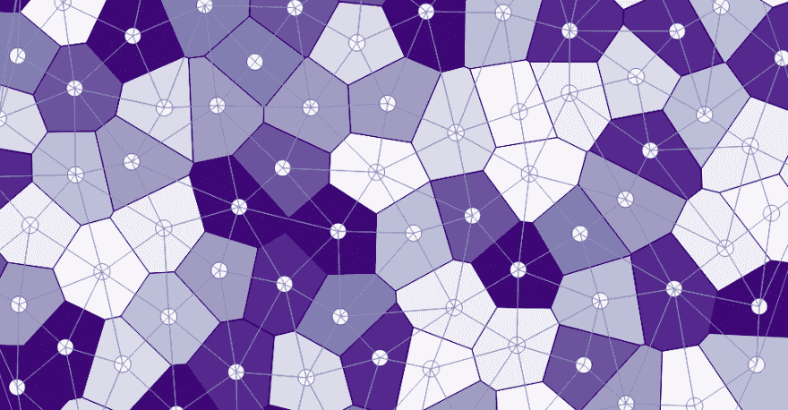
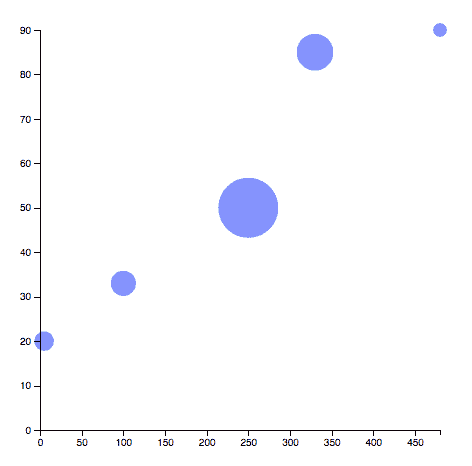

# D3.js 入门

> 原文:[https://dev.to/rxhl/getting-started-with-d3js-390](https://dev.to/rxhl/getting-started-with-d3js-390)

用强大的 D3.js 进行数据可视化的介绍

[T2】](https://res.cloudinary.com/practicaldev/image/fetch/s--hLDH8FJW--/c_limit%2Cf_auto%2Cfl_progressive%2Cq_auto%2Cw_880/https://www.pubnub.com/wp-content/uploads/2014/01/D3.js-Logo.png)

在本教程中，我们将经历以下内容。

1.  D3 是什么？
2.  你为什么会使用 D3？
3.  D3 中的形状、助手和比例
4.  在 D3 中创建散点图

### **1。D3 是什么？**

数据驱动文档(或 D3)是一个强大的 javascript 库，用于使用常见的 web 标准(如 HTML、Canvas 和 SVG)构建数据可视化。D3 允许您将数据绑定到 DOM，然后将数据驱动的转换应用到文档，如 CSS 属性和 SVG。

D3.js 由迈克·博斯托克、瓦迪姆·奥吉夫茨基和杰夫·赫尔于 2011 年初创建。这是一个巨大的 javascript 库，由 Mike Bostock 在 [GitHub](https://github.com/d3/d3) 上积极管理。

* * *

### **2。你为什么会使用 D3？**

**I .做出数据驱动的决策**

可视化帮助企业过滤噪音，并看到数据中的趋势。D3.js 不仅仅是一个图表库，它提供了多种可视化工具，包括静态和交互式的，以你想要的方式查看数据。

**二。动态和数据绑定**

D3 允许您将数据绑定到 [DOM](https://css-tricks.com/dom/) ，因此可视化会随着数据一起改变。

**三世。操纵 SVG**

D3 可视化是基于 SVGs 的，SVGs 是一种基于 XML 的文本格式，用来描述图像应该如何显示。
SVG 中的直线、圆和矩形如下图所示。

```
<svg>
<line x1="40" y1="20" x2="40" y2="160" style="stroke-width: 1; stroke: black;"/>
<circle cx="100" cy="80" r="20" fill="green" />
<rect x="140" y="25" width="30" height="200" fill="red" />
</svg> 
```

SVG 是基于矢量的，因此可以在不损失质量或像素的情况下进行缩放。关于其他 SVG 元素的更多信息可以在[这里](https://developer.mozilla.org/en-US/docs/Web/SVG/Element)找到。

**四。很多例子**

D3 有成千上万的例子可以从中获得灵感，从简单的条形图到复杂的 Voronoi 图。

[](https://res.cloudinary.com/practicaldev/image/fetch/s--mCZIqaHV--/c_limit%2Cf_auto%2Cfl_progressive%2Cq_auto%2Cw_880/http://christophermanning.oimg/2012/02/92b5e52a859e1c317a130f5bf9ed46502d09cc64.png) 
*来源:[http://christophermanning.org/gists/1734663/](http://christophermanning.org/gists/1734663/)*

更多示例可在 D3 [图库](https://github.com/d3/d3/wiki/Gallery)中查看。

**诉开源！**

D3 是一个开源库，它的源代码可以在 [GitHub](https://github.com/d3/d3) 上找到。这是 GitHub 上**最受关注的**和**最受争议的**回购之一，由数百名开发者贡献。它还支持其他 javascript 库的包装器，如 React 和 Leaflet，由其他开发人员构建。

[T2】](https://i.giphy.com/media/y5gweIjtEZ8d2/giphy.gif)

* * *

### **3。D3** 中的形状、辅助对象和比例

**一、形状**

正如我们在上面看到的，创建单独的形状是非常乏味的。想象一下，用数百个点绘制一个散点图，并将它们与轴对齐！D3 负责基本的图表工作，这样您就可以专注于实际的可视化。在我们进入散点图之前，让我们重新创建 D3 的形状。

首先，我们定义一个包含我们的形状的 SVG 元素。SVG 元素可以附加到 DOM 中的任何元素上。接下来，我们添加圆形，矩形和直线。

```
<!DOCTYPE html>
<html>
    <head>
        <title>Shapes in D3</title>
        <script src="https://d3js.org/d3.v4.min.js"></script>
    </head>
    <body>
    <div id="canvas"></div>
    <script>
    var canvas = d3.select("#canvas") // D3 uses a jQuery like selector
            .append("svg")
            .attr("height", 500)
            .attr("width", 500);
    var circle = canvas.append("circle") // Appending shape elements to the SVG element
            .attr("cx", 250)
            .attr("cy", 250)
            .attr("r", 100)
            .attr("fill", "red");
    var rectangle = canvas.append("rect")
            .attr("height", 500).attr("width", 100)
            .attr("fill", "blue")
            .attr("stroke", "blue")
            .attr("stroke-width", 2);
    var line = canvas.append("line")
            .attr("x1", 500).attr("y1", 0)
            .attr("x2", 500).attr("y2", 500)
            .attr("stroke-width", 2)
            .attr("stroke", "black");
    </script>
    </body>
</html> 
```

如果您尝试放大或缩小上面呈现的 SVG，请注意图像的质量没有受到影响。

**二。助手**

D3 附带了一堆助手函数，这样你就不必加载 [Lodash](https://lodash.com/) 或[下划线](http://underscorejs.org/)。

```
const data = [1, 2, 3, 4, 5];
const moreData = [[5, 20], [480, 90], [250, 50], [100, 33], [330, 95]];

d3.min(data); // 1

d3.max(moreData, function(d) { return d[0]; }); // 480

d3.max(moreData, function(d) { return d[1]; }); // 95

d3.extent(data); // [1, 5] 
```

**三世。刻度**

比例是任何可视化的重要组成部分，D3 有多种比例(线性、对数、序数等)。D3 比例将数据空间(域)映射到像素空间(范围),大量用于绘制轴。

回到我们的 Shapes 和 Helpers 示例，如果我们想要在`canvas`元素上可视化`moreData`的散点图，我们可以如下声明我们的比例。

```
var xScale = d3.scaleLinear()
    .domain([0, d3.max(moreData, function(d) { return d[0]; })])
    .range([0, 500])

var yScale = d3.scaleLinear()
    .domain([0, d3.max(moreData, function(d) { return d[1]; })])
    .range([500, 0]) // SVG is y-down 
```

让我们来测试一下我们的天平。

```
console.log(xScale(0)); // 0
console.log(xScale(480)); // 500

console.log(yScale(0)); // 0
console.log(yScale(95)); // 500

// The intermediate values are mapped linearly between 0 and 500. 
```

要创建一个轴，我们只需将我们的尺度传递给合适的轴函数。

```
var xAxis = d3.axisBottom(xScale); 
```

更多关于 D3 秤的信息可以在[这里](https://github.com/d3/d3-scale)找到。

* * *

### **4。在 D3 中创建散点图**

我们现在准备创建我们的第一个(或第 100 个)散点图。首先，让我们创建一个包含 SVG 图的`div`元素。

```
<div id="plot"></div> 
```

现在，让我们创建我们的 SVG 元素。

```
var w = 500, h = 500, pad = 50; // defining width and height of the SVG element; and a little padding for the plot

var svg = d3.select("#plot") // Select the plot element from the DOM
    .append("svg") // Append an SVG element to it
    .attr("height", h)
    .attr("width", w); 
```

一些要绘制的数据。

```
// [x-coordinate, y-coordinate, radius]
const dataset = [[5, 20, 30], [480, 90, 20], [250, 50, 100], [100, 33, 40], [330, 85, 60]]; 
```

创建比例和轴。

```
// Scales
var xScale = d3.scaleLinear() // For the X axis
    .domain([0, d3.max(dataset, function(d) { return d[0]; })])
    .range([pad, w - pad]);

var yScale = d3.scaleLinear() // For the Y axis
    .domain([0, d3.max(dataset, function(d) { return d[1]; })])
    .range([h - pad, pad]);

var rScale = d3.scaleLinear() // Custom scale for the radii
    .domain([0, d3.max(dataset, function(d) { return d[2]; })])
    .range([1, 30]); // Custom range, change it to see the effects!

// Axes
var xAxis = d3.axisBottom(xScale); // handy axes for any orientation
var yAxis = d3.axisLeft(yScale); 
```

绘制数据。

```
var circ = svg.selectAll("circle") // Returns ALL matching elements
    .data(dataset) // Bind data to DOM
    .enter() // Add one circle per such data point
    .append("circle")
    .attr("cx", function(d) { return xScale(d[0]); })
    .attr("cy", function(d) { return yScale(d[1]); })
    .attr("r", function(d) { return rScale(d[2]); })
    .attr("fill", "blue").attr("opacity", 0.5); 
```

上面的块包含了 D3 的症结。我们来分解一下。

我们知道散点图本质上是一组圆。它们的位置和半径将取决于我们上面定义的`dataset`。所以我们希望每个数据点有**个圆。D3 通过以下三个步骤实现了这个目标。**

`svg.selectAll("circle")`:返回所有匹配的元素，即使它们还没有被创建。

`.data(dataset)`:将上面的每个圆绑定到一个数据点(DOM -数据绑定)。

`.enter()`:每个数据点添加一个圆。

太好了，现在让我们添加我们的轴来完成这一切。

```
//X axis
svg.append("g") // Creates a group
    .attr("class", "axis") // adding a CSS class for styling
    .attr("transform", "translate(0," + (h - pad) + ")") 
    .call(xAxis);

//Y axis 
svg.append("g")
    .attr("class", "axis")
    .attr("transform", "translate(" + pad +", 0)")
    .call(yAxis); 
```

上面的变换是为了将轴平移到原点。这是完整的代码，

```
<!DOCTYPE html>
<html>
    <head>
        <title>Scatter Plot</title>
    <script src="https://d3js.org/d3.v4.min.js"></script>
        <style>
        .axis {
                fill: none;
                stroke: black;
                shape-rendering: crispEdges;
        }
        </style>
    </head>
    <body>
        <div id="plot"></div>

        <script>

        var dataset = [[5, 20, 30], [480, 90, 20], [250, 50, 100], [100, 33, 40], [330, 85, 60]];

        var w = 500, h = 500, pad = 50;

        var svg = d3.select("#plot")
            .append("svg")
        .attr("height", h)
        .attr("width", w);

        var xScale = d3.scaleLinear()
        .domain([0, d3.max(dataset, function(d) { return d[0]; })])
        .range([pad, w - pad]);

        var yScale = d3.scaleLinear()
            .domain([0, d3.max(dataset, function(d) { return d[1]; })])
            .range([h - pad, pad]);

        var rScale = d3.scaleLinear()
            .domain([0, d3.max(dataset, function(d) { return d[2]; })])
            .range([1, 30]);

        var xAxis = d3.axisBottom(xScale);
        var yAxis = d3.axisLeft(yScale);

        var circ = svg.selectAll("circle")
            .data(dataset)
            .enter()
            .append("circle")
                .attr("cx", function(d) { return xScale(d[0]); })
                .attr("cy", function(d) { return yScale(d[1]); })
                .attr("r", function(d) { return rScale(d[2]); })
                .attr("fill", "blue").attr("opacity", 0.5);

        svg.append("g")
            .attr("class", "axis")
            .attr("transform", "translate(0," + (h - pad) + ")")
            .call(xAxis);

        svg.append("g")
            .attr("class", "axis")
            .attr("transform", "translate(" + pad +", 0)")
            .call(yAxis);
        </script>
    </body>
</html> 
```

和最终产品。

[T2】](https://res.cloudinary.com/practicaldev/image/fetch/s--68IAIhxO--/c_limit%2Cf_auto%2Cfl_progressive%2Cq_auto%2Cw_880/https://thepracticaldev.s3.amazonaws.com/i/7zjeuumzfnxp9nh7bdpb.png)

随着你给`dataset`加更多的点，剧情会自动反映出来。

* * *

### **再者**

希望您喜欢 D3 的简短介绍。这里有一些有用的资源，

*   [https://github.com/d3/d3/wiki/gallery](https://github.com/d3/d3/wiki/gallery)
*   [https://bl.ocks.org/mbostock](https://bl.ocks.org/mbostock)
*   [https://square.github.io/intro-to-d3/](https://square.github.io/intro-to-d3/)

还有一个令人惊奇的[权力的游戏可视化](https://mimno.github.io/showcase/project2/got/)来结束。