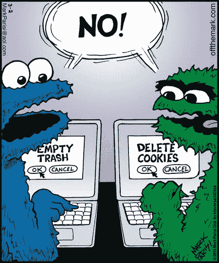

# 将 GCLID 存储在 Cookie 中并发送到 Hubspot

> 原文:[https://dev . to/zackphilipps/store-gclid-in-cookie-and-send-to-hubspot-8c 7](https://dev.to/zackphilipps/store-gclid-in-cookie-and-send-to-hubspot-8c7)

[T2】](https://res.cloudinary.com/practicaldev/image/fetch/s--Y1lcoz4f--/c_limit%2Cf_auto%2Cfl_progressive%2Cq_auto%2Cw_880/http://zackphilipps.com/conteimg/2017/09/digital-marketing-graph-1.jpg)

因此，你有一个 AdWords 活动运行，这意味着你有一个链接到你的网站的广告。当有人点击您的广告时，您网站上的页面 URL 会附加一个 GCLID 参数:

```
http://yourwebsite.com/your-landing-page/?gclid=blah 
```

<svg width="20px" height="20px" viewBox="0 0 24 24" class="highlight-action crayons-icon highlight-action--fullscreen-on"><title>Enter fullscreen mode</title></svg> <svg width="20px" height="20px" viewBox="0 0 24 24" class="highlight-action crayons-icon highlight-action--fullscreen-off"><title>Exit fullscreen mode</title></svg>

如果用户在该页面上转换**,这就非常好了。**您可以通过多种方法，将这种转化直接归因于您的特定广告。然后，如果用户在离线购买时使用的电子邮件地址与他们在表单中使用的电子邮件地址相同，那么您也可以将购买归因于您的广告。

但是如果用户导航到网站的其他地方呢？除非您有一些 JavaScript 将 GCLID 附加到每个链接上，否则一旦用户单击某个链接，它就会被剥离。

* * *

## 输入 Cookie:离线转换追踪的最好朋友

更好的方法是[将 GCLID 存储在 cookie 中](https://support.google.com/adwords/answer/7012522?hl=en)。这样，即使用户完全关闭了网站，并在以后通过输入域名重新访问它...cookie 将仍然存在。

[T2】](https://res.cloudinary.com/practicaldev/image/fetch/s--MYn-otwf--/c_limit%2Cf_auto%2Cfl_progressive%2Cq_auto%2Cw_880/http://zackphilipps.com/conteimg/2017/09/cookie-monster.jpg)

由于我在工作中多次被要求这样做，我冒昧地创建了一个效用函数——带有一些依赖关系。因为它是用普通的 JavaScript 编写的，所以可以直接添加到谷歌标签管理器中。

这个解决方案可以应用于任何跟踪参数，您可以在站点的任何地方将这些参数与表单提交一起传递。例如，另一个用例是将 UTM 参数与发送到 Salesforce 的表单提交一起传递，因为 Salesforce CRM 没有像 Hubspot 和 Google Analytics 那样的全球跟踪代码。

您还可以传递您想要的任何参数，以便在任何平台上获得更细粒度的见解和报告。

### 依赖关系

#### 获取 Cookie

```
function getCookie(name) {  
  var value = '; ' + document.cookie;
  var parts = value.split('; ' + name + '=');
  if (parts.length == 2)
    return parts.pop().split(';').shift();
} 
```

<svg width="20px" height="20px" viewBox="0 0 24 24" class="highlight-action crayons-icon highlight-action--fullscreen-on"><title>Enter fullscreen mode</title></svg> <svg width="20px" height="20px" viewBox="0 0 24 24" class="highlight-action crayons-icon highlight-action--fullscreen-off"><title>Exit fullscreen mode</title></svg>

根据名称检索 cookie 值。**用法:** `getCookie('gclid');`

#### 设置 Cookie

```
function setCookie(name, value, days) {  
  var date = new Date();
  date.setTime(date.getTime() + (days * 24 * 60 * 60 * 1000));
  var expires = '; expires=' + date.toGMTString();
  document.cookie = name + '=' + value + expires + ';path=/';
} 
```

<svg width="20px" height="20px" viewBox="0 0 24 24" class="highlight-action crayons-icon highlight-action--fullscreen-on"><title>Enter fullscreen mode</title></svg> <svg width="20px" height="20px" viewBox="0 0 24 24" class="highlight-action crayons-icon highlight-action--fullscreen-off"><title>Exit fullscreen mode</title></svg>

创建或保存 cookie。命名它，设置值，并设置它将存在的天数。**用法:** `setCookie('gclid', 'blah', 365);`

#### 获取参数

```
function getParam(p) {  
  var match = RegExp('[?&]' + p + '=([^&]*)').exec(window.location.search);
  return match && decodeURIComponent(match[1].replace(/\+/g, ' '));
} 
```

<svg width="20px" height="20px" viewBox="0 0 24 24" class="highlight-action crayons-icon highlight-action--fullscreen-on"><title>Enter fullscreen mode</title></svg> <svg width="20px" height="20px" viewBox="0 0 24 24" class="highlight-action crayons-icon highlight-action--fullscreen-off"><title>Exit fullscreen mode</title></svg>

通过名称获取 URL 参数的值。**用法:** `getParam('gclid');`

### 现在都在一起了

这是你复制粘贴的部分。然而，**继续阅读这篇文章的其余部分，**因为这个代码块本身不会做任何事情。它只是定义函数；使用它们来满足你的需求是你的责任。