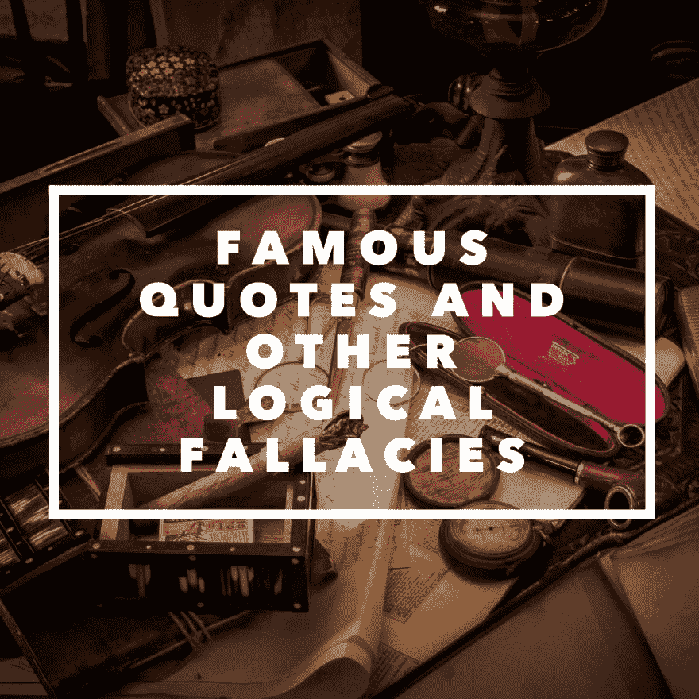

# 名言和其他逻辑谬误

> 原文:[https://dev . to/lpas qualis/famous-quotes-and-other-logical-fallacies](https://dev.to/lpasqualis/famous-quotes-and-other-logical-fallacies)

这个帖子最初发表在 [CoderHood](https://coderhood.com) 上，作为[名言，以及其他逻辑谬误](https://www.coderhood.com/famous-quotes-and-other-logical-fallacies/)。CoderHood 是一个致力于软件工程人类层面的博客。

[T2】](https://www.coderhood.com/famous-quotes-and-other-logical-fallacies/)

## 逻辑谬误及其丑恶嘴脸

在你的科技生涯和生活中，逻辑谬误会在对话中露出它们丑陋的一面。不要放手！它会扭曲现实，给本应合乎逻辑的论点带来矛盾。人们经常重复短语和引语作为不容置疑的真理，因为一些名人在过去说过它们。这样的短语听起来很聪明，而且被附加在我们不敢质疑的著名名字上。人们重复这些短语是因为我们已经习惯了它们，我们[假设](https://www.coderhood.com/2017/05/17/assumption-evil-mother-mistakes/)它们是真的。

## 一个含有逻辑谬误的“名言”的例子

我最近读到的一篇文章让我想起阿瑟·柯南·道尔爵士的一句话，这句话有一个逻辑谬误:

> "一旦你排除了不可能，剩下的，不管多么不可思议，一定是事实."

当你听到有人引用这个怪物，不要放过它！这是一个逻辑谬误，而且是完全错误的。仅仅因为亚瑟·柯南·道尔是一位“先生”并且写了关于一位聪明侦探的书，并不意味着他总是对的。

这个短语就像说了下面的话:

> "一旦你剔除了所有恶心的食物，剩下的一定是美味的."

显然，事实并非如此！如果你面前有 10 种食物，剔除掉你认为“恶心”的食物，剩下的一些食物会是好的，一些只是可食用的，一些是美味的。

此外，类似于“真实”和“不可能”，什么是“恶心”、“只能吃”、“好吃”和“美味”也受到解释，使事情更加混乱。

一旦你排除了不可能，剩下的就是“不是不可能”，意思就是“可能”如果某事是可能的，并不意味着它是真的，也不太可能。这仅仅意味着它有非零的可能性是真的，而不是必然的。

## 逻辑上正确的陈述，有时听起来不像类似的谬误那样聪明

阿瑟·柯南·道尔爵士应该把这个原则表述如下:

> “一旦你排除了所有不真实的东西，剩下的东西，不管多么不可能，一定是真实的。”

看出区别了吗？让我们暂时撇开“真理”常常是主观的，因而需要解释的事实，假设我们对真理有一个不容置疑的或者至少是自洽的概念。“不是真相”和“真相”是逻辑上的对立，所以这句话开始变得更有逻辑意义。然而，以这种方式书写，它没有同样的冲击力，坦率地说，似乎是显而易见的。

许多类似的逻辑谬误经常被引用，它们大多源于这样一个事实，即人们未能陈述否定的陈述。不管我们会教孩子什么，“总是”的反义词不是“从不”“总是”的反义词是“不总是”，与“从不”不同

## 结论

质疑一切，即使你以前听过，某个名人说过，而且“听起来”很聪明。

* * *

### 如果你喜欢这篇文章，请保持联系！

*   在 CoderHood 上找到我所有的帖子。
*   在 LinkedIn 上加入我的职业网络。
*   在推特上关注我。
*   加入我的脸书主页。
*   最后，请在 dev.to 上关注我！