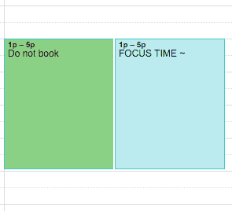

# 寻找焦点的技巧

> 原文:[https://dev.to/mctaylorpants/tips-for-finding-focus](https://dev.to/mctaylorpants/tips-for-finding-focus)

[*最初发表在媒体上。*T3】](https://medium.com/@mctaylorpants/tips-for-finding-focus-129ed165bf79)

专注于一项任务正迅速成为一门失传的艺术。总是同时处理多项任务、处理通知和电子邮件的诱惑会让你感到“忙碌”,即使你可能没有完成很多事情。

编程是不适合多任务处理的任务之一——至少对我来说是这样。很难在会议和谈话之间的 4-5 分钟内有效地解决问题。

接下来的内容并不新鲜，只是我在过去几年中遇到的一些技术，它们真正帮助我找到了作为开发人员工作时非常重要的关注点。我希望这些建议也能帮助你找到生活的重心！

### 安排你的专注时间

[T2】](https://res.cloudinary.com/practicaldev/image/fetch/s--tPu54y66--/c_limit%2Cf_auto%2Cfl_progressive%2Cq_auto%2Cw_880/https://cdn-images-1.medium.com/max/1600/1%2AfdVseIvg-e1Yf-Rj1WwFZw.png)

在 Unbounce，我们已经指定每周二和周四下午为集中时间。由于这是一个部门范围内的日历事件，所以我们的想法是尽可能在这个时间之外预定会议。它并不总是完全按照计划工作，但它是一个在公司范围内保护时间的伟大策略。我们中的一些人更进一步，创建了一个“不要在我们的公共日历上预订活动”。这是对那些和我一起安排会议的人的又一个提醒，我更愿意把那段时间留给自己。

### 做ðÿ番茄……

如果你还没听说过[番茄工作法](https://en.wikipedia.org/wiki/Pomodoro_Technique)，我在这里告诉你，就是这种蛇油会改变你的生活！...或者不是。这可能不是对每个人都有效，但我发现这是一天中寻找焦点的完美框架。

典型的番茄工作法是这样的:

*   专注于一个预定的任务 25 分钟，没有杂念；
*   休息一会儿(3-5 分钟);
*   重复一遍。吃了四个番茄后，休息更长时间(15-30 分钟)。

你不必虔诚地遵循这一点。我倾向于坚持 25 分钟的专注时间，但是我不会被我休息的时间限制。当我有很多会议的时候，我也不会尝试做番茄工作法，因为它很快就会变成一种沮丧的练习。最好是根据你的选择安排一个上午或下午。

番茄工作法的关键在于将注意力从中断中分离出来。在那 25 分钟的专注时间里，你不会查看电子邮件。你不检查松弛。戴上耳机，打开一些音乐。礼貌地告诉那些向你提出问题的人，你很快就会和他们在一起。

在每次番茄大战之前，在头脑中有一个计划，你想在接下来的 25 分钟内完成什么。你不需要写下来或者做任何事情——只要知道你想完成什么，这样你就可以把你的时间和精力完全投入到这个任务中。

当然，有一些应用程序可以帮你计时。我喜欢《T0》和《T1》。很好很简单。

### 请勿打扰。24/7.

很明显，当你想找到焦点时，你应该在电脑上启用“请勿打扰”模式。当我开始练习番茄时，我就开始这样做了。然而，我很快意识到，我不需要不停地切换我的通知——我可以一直关闭它们。

当你练习番茄工作法的时候，你可以创造一些特定的时间来聊天，回复邮件等等。既然你已经养成了这样的习惯，为什么还要打开通知呢？一旦你养成了查看你需要查看的订阅源的习惯，你就不再需要弹出窗口通知你发生了什么——除非你的应用程序宕机了！

*(针对 macOS 用户的热提示:您可以按住 Option 键点按通知菜单栏图标来自动切换免打扰模式。)*

### 不要总是有空

[T2】](https://res.cloudinary.com/practicaldev/image/fetch/s--8FfyRQ9P--/c_limit%2Cf_auto%2Cfl_progressive%2Cq_auto%2Cw_880/https://cdn-images-1.medium.com/max/1600/1%2AhOq6ecjr1Hl-VTLkyOu7fw.png)

将 Slack 或另一款聊天应用引入工作场所，通常还伴随着一种隐含的期望，即你会立即回复人们的信息，或者至少比回复电子邮件更快。如果你试图分配你的时间，这可能是个问题。

我已经开始利用我的懈怠状态来设定我不会总是立即回应的期望。这是一件小事，但我认为这是一种尊重的方式，围绕你一天中的可用性设置一些界限。另外，在我看来，25 分钟的回复时间是相当合理的，当然，除非是紧急情况。

### 守纪律

如果你开始对你的焦点规则进行例外处理，这些都不会起作用。举例来说，当你的测试正在运行的时候，一开始很容易瞥一眼 Slack，但是一旦你开始建立一个节奏，我想你会注意到你的生产力的不同。现在，当我点击“启动我的番茄闹钟，戴上耳机”时，我感到非常满足——注意力来了！

你如何在一天中找到焦点？我很想听听其他的想法！