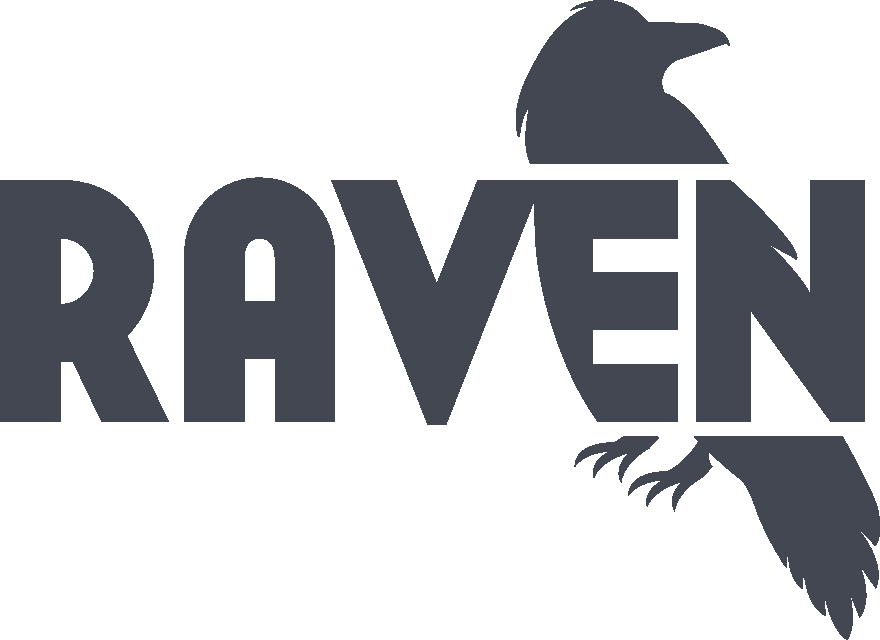

# SEO 初级入门指南-如何优化网站搜索

> 原文:[https://dev . to/scottmathson/SEO-basic-beginner-s-guide-how-to-optimize-a-website-for-search-e5f](https://dev.to/scottmathson/seo-basic-beginner-s-guide-how-to-optimize-a-website-for-search-e5f)

我在这篇文章中的意图是列出一些基本的 SEO(搜索引擎优化)最佳实践，回答常见问题，定义某些约定，并提供对 SEO 的基本理解。

**目录**:

*   SEO 和最佳实践介绍
    *   **关键词**
    *   **语义网址**:
    *   **页面标题**:
    *   **元描述**:
*   页面上-资产/图像+命名约定
    *   **文件名**:
    *   **Alt 标签**
*   SEO 工具和资源

## SEO 和最佳实践的介绍

如果你是发布内容和创建网站的新手，SEO 可能是一个陌生的术语。在你围绕学习 SEO 的搜索中，我相信你已经发现了为搜索引擎优化你的网站，并打算提高特定关键词的排名，这确实是一个巨大的话题。

这就是为什么我在这里奠定了一些搜索引擎优化的基础。

谷歌不断进步的算法考虑了很多不同的排名因素。搜索引擎的算法和索引机器人将根据内容本身、内容与特定主题的相关性以及其他许多因素对你网站的页面或帖子进行解密和排名。

最重要的是，专注于编写有价值的内容，值得推广/分享，并且可以被你网站的用户消费。

### **关键词**

通常内容搜索引擎优化的第一步是定义你希望你的整个网站的关键词，以及个人网页和博客内容的排名。

有很多工具可以进行关键词研究-缩小实际搜索的确切术语或短语，以及它们的搜索量，以及该术语的竞争程度。

在基本层面上，并且为了本文中一致的例子，让我们为初学者选择术语/短语“*SEO*”。

### **语义网址**:

重要的是将关键词合并到 URL 中，以增加相关性，保持语义，并获得更高的排名。

你的 URL 的结构真的很重要。语义 URL 用连字符(-)书写。

这里有一个博客帖子的例子，它有一个语义正确的 URL 字符串，以及我们针对初学者的“*SEO*”关键字短语:

[https://scottmathson.com/blog/seo-for-beginners/](https://scottmathson.com/blog/seo-for-beginners/)

Google SERP(搜索引擎结果页面)示例:

[T2】](https://res.cloudinary.com/practicaldev/image/fetch/s--57P1mVhG--/c_limit%2Cf_auto%2Cfl_progressive%2Cq_auto%2Cw_880/https://scottmathson.com/assets/img/blog/seo-beginner-guide-semantic-url-structure.jpg)

某些网站内容管理系统或工具可能会在 URL 中添加类别、日期或标签。

### **页面标题**:

*   保持标题少于 60 个字符
*   以你想要排名的关键词/短语开始
*   再次强调，不要使用关键词

回复: *60 char。限制*:SERPs(搜索引擎结果页面)中的页面标题实际上是基于像素宽度的，以 600 像素显示，有时会显示长达 70 个字符的标题。

所选关键字短语的页面标题示例，以及向页面或帖子标题添加更多上下文，如下所示:

" *SEO 初学者-搜索引擎优化策略*"

Google SERP 示例:

[T2】](https://res.cloudinary.com/practicaldev/image/fetch/s--ZYatZvvO--/c_limit%2Cf_auto%2Cfl_progressive%2Cq_auto%2Cw_880/https://scottmathson.com/assets/img/blog/seo-beginner-guide-google-serp.jpg)

就像我们命名 URL 一样，在页面或帖子的标题标签中添加明确的关键字来表示相关性并增加搜索引擎的印象是很重要的。

### **元描述**:

*   保持元描述少于 160 个字符
*   包括关键字/短语，但书写自然，适合人类
*   再次强调，不要使用关键词

元描述为你的潜在读者提供信息，如果你让他们点进你的网站，这就是增值的流量和点击率。他们应该被纳入和优化在每一个页面和职位。

优化后的元描述不超过 160 个，它们是该页面或帖子所独有的(不会在许多页面或帖子中重复)，并提供了对术语、短语和关键词进行排名的机会，同时抓住了潜在读者的注意力。

**为**编写元描述:

每一个。

单身。

页面。

初学者的 SEO:制定一个策略来优化你的搜索网站。了解如何优化页面标题、元描述、alt 标签、文件名等。

Google SERP 示例:

[T2】](https://res.cloudinary.com/practicaldev/image/fetch/s--9CptzAR6--/c_limit%2Cf_auto%2Cfl_progressive%2Cq_auto%2Cw_880/https://scottmathson.com/assets/img/blog/seo-beginner-guide-meta-description-serp.jpg)

* * *

这些核心部分组成了 SERPs，页面标题等项目也用在浏览器标签中，当在社交网站上共享时，等等。

随着搜索引擎算法的进步和结果变得更加丰富，我们在基于文本的结果和/或扩展的、更长的描述以及更多的功能旁边看到了图像。

希望这个起点说明了拥有这些优化的基础元素对于优化网站的可用性、可访问性和 SEO 是多么重要。

还有呢！

优化其他页面上的元素是很重要的，我将在下面介绍。

* * *

## 页面上-资产/图像+命名约定

### **文件名**:

*   带连字符的语义 URL 结构
*   简洁，包括描述性关键字/短语
*   还是那句话，不要用关键词

SEO 中经常忽略的是图像——它们的文件名和 alt 标签。给图片贴上“它们是什么”的标签，以便告诉索引机器人，以及任何在网站上工作的人这些图片是什么。

图像的命名应该与它们所显示的页面内容相关，并包含与内容上下文相关的关键词或短语。

始终避免标注“它们如何”(尺寸、使用的编辑程序等。)也要避免“当他们是”(日期)。

**坏**:*SEO 4529 dhh _ Photoshop . jpg*或者“*SEOForBeginnersInfographic:1920 x 1080 px . jpg*

**好**:【seo-for-beginners-infographic.jpg】T2

个人和团队在这方面保持一致是很重要的。

确保任何上传到你的网站或 CDN 的图片文件都有合理的名称，对搜索引擎和用户都有意义。

### **Alt 标签**

图像中的 alt 标签(alt 文本)和 title 标签等元数据有助于 SEO 和可访问性。在将替代文本添加到图像中时，搜索引擎能够具有关于该图像相对于其余内容是什么的更多上下文，并且它提供将被包括在图像搜索结果中的文本。

最重要的是，为人类写 alt 标签/文本，你不应该使用连字符。写一个自然的短语，因为这是当图像路径中断时和/或为屏幕阅读器显示的内容。

少数情况下会显示 Alt 文本:

*   第一种情况:形象破碎。如果试图显示图像的页面由于某种原因无法显示，它将显示替代文本。这也与电子邮件营销和模板开发相关。
*   第二种情况:为了可访问性。对于使用屏幕阅读器的访问者，alt 文本为那些看不到图像的人提供了上下文。
*   第三种情况:图片搜索结果。

***奖励提示**:使用*标题*属性添加更多的 SEO 值，当鼠标悬停在图片上时，它会显示该属性。``

* * *

**重述**:

*   **网址**:'/类别-页面/页面-或-与关键字相关的帖子/'
*   **标题**:‘页面或文章标题(含关键词/短语)-公司’
*   **元描述**:160 字以下，自然书写，给人看。
*   **图像文件名称**:image-of-keyword.jpg 跟随带连字符的 URL 结构
*   **图像 Alt 标签**:准确的图像描述

* * *

## SEO 工具和资源

如果你是 a)网站建设和维护的新手和/或 b)你正在使用 WordPress，我强烈建议你去看看 Yoast SEO 插件。总的来说，这里有一些关注 SEO 和网站建设的必备工具。

1.  [Raven Tools 网站审计员](http://www.shareasale.com/r.cfm?b=556153&u=1618104&m=25914&urllink=&afftrack=)
2.  谷歌网站管理员工具(搜索控制台)
3.  谷歌分析
4.  PageSpeed Insights(或灯塔审计员)
5.  [SERP 预览+写作工具【CTR . Tools】](https://ctr.tools/)工具免费站点审计 [ 审计我的站点 ](http://www.shareasale.com/r.cfm?b=556153&u=1618104&m=25914&urllink=&afftrack=) * * *

为什么我还没有写关于 SEO 的文章？

虽然 SEO 是我非常热爱的事情，我每天都在练习，并在过去的 10 多年里一直在做，但我通常只是在做:致力于优化，我没有足够的时间来写关于搜索引擎优化、网站开发、设计、内容营销等等的文章。

此外，我一直不确定我想把我的个人网站放在哪里。作品集网站？数字期刊/微博？我很遗憾没有花更多的时间为你们这些读者写高质量的内容，并希望改变这种情况。

谢谢你们，那些正在阅读的人，我期待着在未来提供更多的内容。