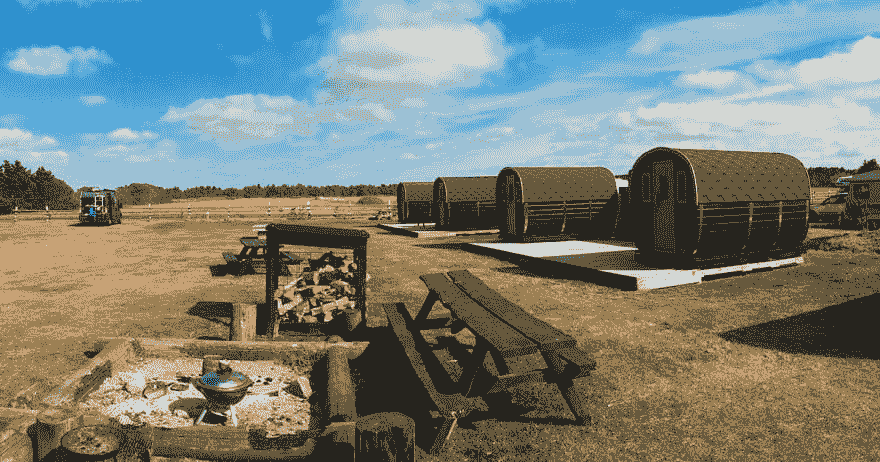

# 住在露营车里 3 年，经营着一家 20 人的远程企业

> 原文：<https://dev.to/bugfenderapp/3-years-of-living-in-a-camper-van-and-running-a-20-people-remote-business>

[T2】](https://res.cloudinary.com/practicaldev/image/fetch/s--j25WE1yq--/c_limit%2Cf_auto%2Cfl_progressive%2Cq_auto%2Cw_880/https://mobilejazz.com/blog/wp-content/uploads/2017/09/vanlife-social.jpg)

在 O4H VANLIFE 系列的第一集中，Stefan 讲述了他的故事，他从高中辍学，住在毛伊岛的海滩上，在斯坦福大学制造第一辆自动驾驶汽车，然后创办了一家 20 人的技术公司，他在自己的露营车里完全远程地经营这家公司。

## 问斯特凡你的问题

如果你有问题想让 Stefan 在未来的剧集中回答，请在我们的 [O4H 脸书社区](https://www.facebook.com/groups/optimizingforhappiness)提交，或者在 [Twitter](http://twitter.com/stefanklumpp) 上发送。

## 即将播出的剧集

*   露营:露营地 vs 野外露营 vs 城市露营
*   住在货车里的成本和费用
*   货车及其设备的所有细节
*   在野外上网
*   货车上的食物和烹饪
*   建立常规并保持专注
*   面包车生活与社会互动
*   热爱生活:和你的伴侣或者孩子住在一辆货车里
*   如何经营远程业务
*   极简主义:你真正需要多少东西？

## 显示注释

### 货车穿行

*   菲亚特 Ducato / Weinsberg (130 马力柴油发动机)
*   MacBook Pro 13 英寸
*   iPhone 7
*   Netgear LTE 路由器+外置天线
*   2 个煤气炉
*   90 升冰箱和冰柜
*   浴室:卫生间+淋浴组合
*   3 个水箱
*   淡水
*   废水
*   洗手间
*   190 米长的床
*   自行车架也可用作晾衣绳

### 我的货车故事

*   我在黑森林(德国)的一个小镇长大
*   在学校表现不太好——最终辍学
*   开始当汽车修理工学徒
*   第一次享受学习——找到目标或意义
*   决定继续学习:电气工程
*   对大学时的理论不太感兴趣——在一家奥迪汽车供应商的微控制器部门兼职
*   对自动驾驶汽车产生了兴趣(早在 2005 年)，并通过一些巧合加入了加利福尼亚州的大众汽车和斯坦福大学的联合团队，在 2007 年开发了首批自动驾驶汽车之一。
*   我们在 DARPA 城市挑战赛中获得了第二名
*   该项目随后转移到谷歌，成为无人驾驶汽车项目，今天被称为[way mo](https://waymo.com/)—[维基百科](https://en.wikipedia.org/wiki/Waymo)
*   我可以决定继续这个项目，但也在与谷歌和脸书面试
*   但在圣诞节假期，我去了墨西哥，并自发地(在一个朋友的鼓励下)决定学习风筝冲浪。
*   这项运动让我如此兴奋，以至于我决定离开加利福尼亚，搬到毛伊岛(夏威夷)
*   毛伊岛确实是一次很棒的经历，但我所做的一切都是靠我的积蓄生活。住在便宜的旅馆里，睡在沙滩上和一辆我和两个朋友一起买的破旧货车里
*   但是我也错过了精神上的挑战，我也意识到我是多么喜欢或者想念欧洲
*   寻找机会完成我的大学学位(我在德国开始，但从未完成)，并遇到了爱丁堡的大学，它接受我在德国的学分，也赞赏我在加州所做的工作(尽管严格意义上说这不是学习，也没有学分)，但他们给了我在那里读最后一年的机会，如果我通过了，我将获得学位。
*   做到了。写完之后，我想我会回到德国，在某个地方找一份工程师的工作。暂时如此。然后我明白了。
*   但在那之前，我想现在是夏天，我还有一些存款，为什么不做一次 3 个月的欧洲自驾游。
*   从苏格兰乘渡船南下到荷兰，进入法国、德国、瑞士，越过阿尔卑斯山到意大利，法国再沿地中海到西班牙，然后是葡萄牙，沿着大西洋海岸一路返回。
*   大概走了一半，但是在巴塞罗那卡住了
*   我真的很喜欢这个地方，想留在那里，但 2009 年正处于危机之中，我不会说任何西班牙语，几乎不可能找到任何工作
*   然而，人们越来越多地谈论“移动”和“应用”之类的东西。
*   所以我研究了一下，并在 2009 年开始开发手机应用。
*   我从繁荣中受益，并与我的商业伙伴 Jordi Gimenez 一起在一家名为 [Mobile Jazz](https://mobilejazz.com/) 和 [Bugfender](https://bugfender.com/) 的 20 人公司中发展壮大，这是一家为远程团队和开发人员开发工具的衍生公司。
*   但是我怎么会住在露营车里呢？
*   在巴塞罗那呆了 4 年后，我想做些别的事情
*   我对中东感到非常兴奋——全新的文化、语言和人民
*   搬到了迪拜，但是两个月后我意识到这不是我的世界
*   又开始旅行了，阿曼，泰国，尼泊尔，巴厘岛和非洲的各个地方
*   意识到我不再是 25 岁了，可以像在毛伊岛那样生活和旅行
*   当我拜访我在德国的父母时，我被他们新的退休生活方式和经常开着房车旅行所吸引。
*   去了一个野营的交易会，看了各种各样的模型，只是为了得到一个想法
*   我再次兴奋不已，并得到了一个非常好的展示车的报价，我当天就签了购买合同
*   现在已经三年了，我在欧洲度过了 8-9 个月的时间，走遍了整个欧洲大陆
*   另外 4 个月(冬天)去迪拜，从那里通常探索非洲和亚洲的地方。

## 跟随我一起冒险

如果你想了解更多我的 vanlife 故事和商业冒险，你可以在 Instagram 和 T2 Twitter 上关注我。你也可以订阅我们的 [O4H YouTube 频道](https://www.youtube.com/c/optimizingforhappiness)，加入我们的 [O4H 脸书社区](https://www.facebook.com/groups/optimizingforhappiness)，或者注册我们的电子邮件时事通讯，每月更新最新动态。